NAAMES DOC Remineralization Bioassays - Bottles
================
Nicholas Baetge
2/29/2020

# Intro

This document shows how **individual bottle** data from NAAMES DOC
remineralization bioassays were processed, QC’d, and analyzed.

``` r
library(tidyverse) 
library(rmarkdown)
library(knitr)
library(readxl)
library(data.table) 
library(scales)
library(zoo)
library(oce)
#rmarkdown tables
library(stargazer)
library(pander)
library(growthcurver)
#stat tests
library(lmtest)
library(lmodel2)
library(rstatix)
library(ggpubr)
```

# Bacterial Abundance

Here, growth curves are fitted to the logistic equation using the
GrowthCurver package. The timing of the onset of the stationary growth
phase is determined from the model
fit.

## Import and Tidy Data

``` r
ba.df <- read_csv("~/naames_bioav_ms/Input/N2-4_BactA_Remin_Master.csv") %>% 
  mutate(Season = Cruise,
         Season = gsub("AT34", "Late Spring", Season),
         Season = gsub("AT38", "Early Autumn", Season),
         Season = gsub("AT39", "Early Spring", Season),
         Treatment = ifelse(Bottle == "Niskin", "Niskin", Treatment),
         Treatment = ifelse(Bottle == "GF75", "GF75", Treatment),
         Treatment = gsub("TW15", "TW20", Treatment),
         Treatment = ifelse(is.na(Treatment), Bottle, Treatment),
         Treatment = ifelse(Treatment %in% c("100mls", "250mls", "500mls", "1L"), "Volume", Treatment),
         Treatment = gsub("Surface", "Parallel", Treatment),
         Treatment_Btl = ifelse(Bottle == "Niskin", "Niskin", Treatment_Btl),
         Treatment_Btl = ifelse(Bottle == "GF75" & is.na(Treatment_Btl), "GF75", Treatment_Btl),
         Treatment_Btl = gsub("TW15", "TW20", Treatment_Btl),
         Treatment_Btl = gsub("TW12-A", "TW12-C", Treatment_Btl),
         Treatment_Btl = gsub("TW12-B", "TW12-D", Treatment_Btl),
         Treatment_Btl = gsub("TW13-A", "TW12-E", Treatment_Btl),
         Treatment_Btl = gsub("TW13-B", "TW12-F", Treatment_Btl),
         Treatment_Btl = ifelse(is.na(Treatment_Btl), Bottle, Treatment_Btl),
         Bottle = gsub("SA", "A", Bottle),
         Bottle = gsub("SB", "B", Bottle),
         Bottle = gsub("DA", "C", Bottle),
         Bottle = gsub("DB", "D", Bottle),
         Bottle = ifelse(Bottle == "GF75", Treatment_Btl, Bottle),
         Bottle = gsub("Control-", "", Bottle),
         Bottle = gsub("TW12-", "", Bottle),
         Bottle = gsub("TW13-", "", Bottle),
         Bottle = gsub("MixDS-", "", Bottle),
         Bottle = gsub("MixSD-", "", Bottle),
         Bottle = gsub("SynExd-", "", Bottle),
         Bottle = gsub("TWExd-", "", Bottle),
         Bottle = gsub("SynLys-", "", Bottle),
         Bottle = gsub("TW5-", "", Bottle),
         Bottle = gsub("TW10-", "", Bottle),
         Bottle = gsub("TW20-", "", Bottle),
         Bottle = gsub("12", "", Bottle),
         Bottle = gsub("13", "", Bottle),
         Bottle = ifelse(Cruise == "AT34" & Station == 2 & Depth == 10 & Treatment == "TW12" & Bottle == "A", gsub("A", "C", Bottle), Bottle),
         Bottle = ifelse(Cruise == "AT34" & Station == 2 & Depth == 10 & Treatment == "TW12" & Bottle == "B", gsub("B", "D", Bottle), Bottle),
          Bottle = ifelse(Cruise == "AT34" & Station == 2 & Depth == 10 & Treatment == "TW13" & Bottle == "A", gsub("A", "E", Bottle), Bottle),
         Bottle = ifelse(Cruise == "AT34" & Station == 2 & Depth == 10 & Treatment == "TW13" & Bottle == "B", gsub("B", "F", Bottle), Bottle),
          Bottle = ifelse(Cruise == "AT34" & Station == 2 & Depth == 200 & Treatment == "Control" & Bottle == "C", gsub("C", "G", Bottle), Bottle),
         Bottle = ifelse(Cruise == "AT34" & Station == 2 & Depth == 200 & Treatment == "Control" & Bottle == "D", gsub("D", "H", Bottle), Bottle),
         Bottle = ifelse(Cruise == "AT34" & Station == 2 & Depth == 200 & Treatment == "TW12" & Bottle == "C", gsub("C", "I", Bottle),Bottle),
         Bottle = ifelse(Cruise == "AT34" & Station == 2 & Depth == 200 & Treatment == "TW12" & Bottle == "D", gsub("D", "J", Bottle), Bottle),
          Bottle = ifelse(Cruise == "AT34" & Station == 2 & Depth == 200 & Treatment == "TW13" & Bottle == "C", gsub("C", "K", Bottle), Bottle),
         Bottle = ifelse(Cruise == "AT34" & Station == 2 & Depth == 200 & Treatment == "TW13" & Bottle == "D", gsub("D", "L", Bottle), Bottle),
          Bottle = ifelse(Cruise == "AT34" & Station == 2 & Depth == 200 & Treatment == "GF75" & Bottle == "A", gsub("A", "G", Bottle), Bottle),
         Bottle = ifelse(Cruise == "AT34" & Station == 2 & Depth == 200 & Treatment == "GF75" & Bottle == "B", gsub("B", "H", Bottle), Bottle),
         Bottle = ifelse(Cruise == "AT34" & Station == 2 & Depth == 200 & Treatment == "GF75" & Bottle == "C", gsub("C", "I", Bottle), Bottle),
         Bottle = ifelse(Cruise == "AT34" & Station == 2 & Depth == 200 & Treatment == "GF75" & Bottle == "D", gsub("D", "J", Bottle), Bottle),
          Bottle = ifelse(Cruise == "AT34" & Station == 2 & Depth == 200 & Treatment == "GF75" & Bottle == "E", gsub("E", "K", Bottle), Bottle),
         Bottle = ifelse(Cruise == "AT34" & Station == 2 & Depth == 200 & Treatment == "GF75" & Bottle == "F", gsub("F", "L", Bottle), Bottle),
          Bottle = ifelse(Cruise == "AT34" & Station == 1 & Depth == 200 & Treatment == "GF75" & Bottle == "A", gsub("A", "C", Bottle), Bottle),
         Bottle = ifelse(Cruise == "AT34" & Station == 1 & Depth == 200 & Treatment == "GF75" & Bottle == "B", gsub("B", "D", Bottle), Bottle),
           Bottle = ifelse(Cruise == "AT34" & Station == 4 & Depth == 200 & Treatment == "GF75" & Bottle == "A", gsub("A", "C", Bottle), Bottle),
         Bottle = ifelse(Cruise == "AT34" & Station == 4 & Depth == 200 & Treatment == "GF75" & Bottle == "B", gsub("B", "D", Bottle), Bottle),
         Bottle = ifelse(Cruise == "AT34" & Station == 5 & Depth == 200 & Treatment == "GF75" & Bottle == "A", gsub("A", "C", Bottle), Bottle),
         Bottle = ifelse(Cruise == "AT34" & Station == 5 & Depth == 200 & Treatment == "GF75" & Bottle == "B", gsub("B", "D", Bottle), Bottle),
         Depth = gsub(5, 10, Depth),
         Depth = as.numeric(Depth)) %>% 
  rename(cells = cellsperL,
         sd_cells = sd_cellsperL,
         p_cells = p_cellsperL,
         sd_p_cells = p_sdcellsperL) %>% 
  drop_na(cells) %>% 
  select(-Treatment_Btl) %>% 
  select(Season, everything()) %>% 
  arrange(Cruise, Station, Depth, Treatment, Bottle, Hours)

ba.df$Season <- factor(ba.df$Season, levels = levels)
```

## Inspect Growth Curves

To be able to calculate derived variables, such as carbon per cell and
BGE, we’ll need to inspect the growth curves and define the stationary
phase for each experiment.

We are using the growthcurver package to fit growth curve data to the
standard form of the logistic equation and then return a data table with
population-level information. Specifically, the model outputs we are
really only interested in are:

  - t\_mid, the time at which 1/2 carrying capacity is reached. We will
    double this estimate to attain the time at which carrying capacity
    is reached (stationary)
  - sigma, a measure of the goodnesss of fit of the parameters of the
    logistic equation for the data; it is the residual sum of squares
    from the nonlinear regression model. Smaller sigma values indicate a
    better fit of the logistic curve to the data than larger values.
  - df, degrees of freedom

<!-- end list -->

``` r
gc_input <- ba.df %>% 
  filter(!Treatment %in% c("Niskin","GF75", "Volume", "Parallel", "TFF-Ret")) %>% 
  group_by(Cruise, Station, Depth, Treatment, Bottle) %>% 
  #calculate the running delta of nat log cells for each exp
  mutate(lncells = round(log(cells), 2),
         delta_lncells = lncells - lncells[which.min(Hours)],
         delta_lncells = ifelse(delta_lncells < 0, 0, delta_lncells)) 

gc_input_keys <- gc_input %>% 
  group_keys() %>% 
  mutate(key = paste(Cruise, ", S", Station, ", Z =", Depth, ",", Treatment, ",", Bottle))
gc_input_header <- gc_input_keys$key

gc_input_list <- gc_input %>% 
  group_split()
names(gc_input_list) <- gc_input_header
```

``` r
gcplot.func <- function(x){
  gc_fit <- SummarizeGrowth(x$Hours, x$delta_lncells) 
}
gcplot.list <- lapply(gc_input_list, gcplot.func)
```

For the sake of keeping the length of this document as short as
possible, the growth curve model plots are not included here. However,
they are included below in the section “Re-evaluate Growth Curves”.

## Re-evaluate Growth Curves

To improve the model fits and thus, the timing estimates of the
stationary transition for each experiment, we need to evaluate each
growth curve, manually filtering out death/secondary growth phases and
poorly replicated samples that skew the model results.

``` r
eval_gc_input <- gc_input %>% 
  mutate(key = paste(Cruise, Station, Depth, Treatment, Bottle, Timepoint, sep = ".")) %>% 
  select(Season:Treatment, key, everything()) %>% 
  filter(!Hours >= 300) %>% 
  filter(!key %in% c("AT34.1.10.Control.A.1","AT34.1.10.Control.B.1", "AT34.1.200.Control.C.3", "AT34.1.200.Control.D.3","AT34.2.10.Control.A.4", "AT34.2.10.Control.A.9", "AT34.2.10.Control.A.10", "AT34.2.10.Control.A.11","AT34.2.10.Control.A.4", "AT34.2.10.Control.B.7", "AT34.2.10.Control.B.9", "AT34.2.10.Control.A.11", "AT34.2.10.TW12.C.5",
  "AT34.2.10.TW13.E.2", "AT34.2.10.TW13.F.3", "AT34.2.200.Control.G.2", "AT34.2.200.Control.G.5", "AT34.2.200.Control.G.6", "AT34.2.200.Control.G.7", "AT34.2.200.Control.H.5", "AT34.2.200.Control.H.6", "AT34.2.200.Control.H.7", "AT34.2.200.TW12.I.2", "AT34.2.200.TW12.J.2", "AT34.2.200.TW13.K.2", "AT34.3.10.Control.A.8", "AT34.3.10.Control.A.9", "AT34.3.10.Control.A.10", "AT34.3.10.Control.B.8", "AT34.3.10.Control.B.9", "AT34.3.10.Control.B.10", "AT34.3.200.Control.C.4", "AT34.3.200.Control.C.6", "AT34.3.200.Control.C.9", "AT34.3.200.Control.D.7", "AT34.4.200.Control.C.5", "AT34.4.200.Control.C.6", "AT34.4.200.Control.C.7", "AT34.4.200.Control.D.5", "AT34.4.200.Control.D.6", "AT34.4.200.Control.D.7", "AT34.5.10.Control.A.5", "AT34.5.10.Control.B.5", "AT34.U.10.Control.A.5", "AT34.U.10.Control.B.8", "AT34.U.10.Control.B.1", "AT38.1.10.Control.A.1", "AT38.1.10.Control.B.7", "AT38.1.10.MixSD.G.6", "AT38.1.10.SynExd.I.8", "AT38.1.10.SynExd.I.9", "AT38.1.10.SynExd.I.10", "AT38.1.10.SynExd.J.8", "AT38.1.10.SynExd.J.9", "AT38.1.10.SynExd.J.10", "AT38.1.10.SynLys.M.9", "AT38.1.10.SynLys.M.10", "AT38.1.10.SynLys.N.9", "AT38.1.10.SynLys.N.10", "AT38.1.200.Control.F.5", "AT38.1.200.Control.F.6", "AT38.1.200.Control.E.5", "AT38.1.200.Control.E.6", "AT38.1.200.MixDS.C.5", "AT38.1.200.MixDS.C.8", "AT38.1.200.MixDS.D.5", "AT38.1.200.MixDS.D.6", "AT38.4.10.Control.A.7", "AT38.4.10.Control.B.7", "AT38.4.10.Control.B.8", "AT38.5.10.Control.A.9", "AT38.5.10.Control.A.10", "AT38.5.10.Control.A.11", "AT38.5.10.Control.B.7"))

eval_gc_input_keys <- eval_gc_input %>% 
  group_keys() %>% 
  mutate(key = paste(Cruise, ", S", Station, ", Z =", Depth, ",", Treatment, ",", Bottle)) 
eval_gc_input_header <- eval_gc_input_keys$key

eval_gc_input_list <- eval_gc_input %>% 
  group_split()
names(eval_gc_input_list) <- eval_gc_input_header

eval_gcplot.list <- lapply(eval_gc_input_list, gcplot.func)
```

We’ve omitted 88 of the 768 (~11%) of the observations to improve the
model fit. 47% of those omitted observations were taken after 300 hours,
which for many experiments constituted the death phase. For the sake of
space, we won’t include the growthcurver plots in this document, but
they can be found in the .rmd

## Wrangle GrowthCurver Data

We’ll add the model output data to the original dataframe, but first
we’ll tidy the model output and look at the distribution of the model
fits.

We’ll determine thresholds for sigma (smaller sigma values indicate a
better fit) and df for omission of model fit data.

``` r
gcdata.func <- function(y){
  gc.fit <- SummarizeGrowth(y$Hours, y$delta_lncells)
  gcdata.df <- as.data.frame(unlist(gc.fit$vals), stringsAsFactors = FALSE)
}

gcdata <- eval_gc_input_list %>% 
  lapply(., gcdata.func) %>% 
  #save the list as a data frame %>% 
  data.frame(.) %>% 
  t(.) %>% 
  as_data_frame(.) %>% 
  mutate_at(., vars(k:auc_e), as.numeric) %>% 
  mutate_at(vars(sigma, t_mid), round, 2) %>% 
  #calculate time to stationary for each curve
  mutate(stationary = round(t_mid*2)) %>% 
  mutate(key = eval_gc_input_header) %>% 
  ungroup() 
```

    ## Warning: `as_data_frame()` is deprecated, use `as_tibble()` (but mind the new semantics).
    ## This warning is displayed once per session.


Based on these two histograms, we’ll omit model fit data where sigma \>
0.21 and df \< 4. In these experiments, we cannot reliably distinguish
the onset of stationary.

``` r
gcmerge.df <- eval_gc_input %>% 
  mutate(key = paste(Cruise, ", S", Station, ", Z =", Depth, ",", Treatment, ",", Bottle)) %>% 
  full_join(., gcdata %>% filter(!sigma > 0.21 | !df < 4)) %>% 
  ungroup() 
```

## Add Stationary Timepoint

We’ll add a row to each experiment that includes the stationary
timepoint.

``` r
gcmerge.list <- gcmerge.df %>% 
  #Split the dataframe into lists
  split(.,  .$key)

#add row to each list element
newrow.func <- function(morty){
  morty[nrow(morty) + 1,] <- NA
  rick <- morty %>% 
    fill(Season:Bottle, Treatment, key, stationary)
  rick
}

#apply function to list
gcstat.list <- lapply(gcmerge.list, newrow.func)

gcstat.df <- plyr::ldply(gcstat.list, data.frame) %>% 
  select(Season:Hours, stationary, cells:auc_e) %>%
  mutate(Hours = ifelse(is.na(Hours), stationary, Hours))
```

# Organic Carbon

## Import and Tidy Data

We will need to tidy the data in the same way the bacterial abundance
dataframe was tidied before merging the datasets. We’ll then omit data
low quality data i.e. poor replication or possible contamination. We
observed contamination in many of the NAAMES 2 experiments after
incubations were transferred to
WHOI.

``` r
oc.df <- read_csv("~/naames_bioav_ms/Input/N2-4_DOC_Remin_Master.csv") %>%
  mutate(Season = Cruise,
         Season = gsub("AT34", "Late Spring", Season),
         Season = gsub("AT38", "Early Autumn", Season),
         Season = gsub("AT39", "Early Spring", Season),
         Treatment = ifelse(Bottle == "Niskin", "Niskin", Treatment),
         Treatment = ifelse(Bottle == "GF75", "GF75", Treatment),
         Treatment = gsub("TW15", "TW20", Treatment),
         Treatment = ifelse(is.na(Treatment), Bottle, Treatment),
         Treatment = ifelse(Treatment %in% c("Surface", "Deep"), "Parallel", Treatment),
         Treatment = ifelse(Treatment %in% c("100mls", "250mls", "500mls", "1L"), "Volume", Treatment),
         Treatment_Btl = ifelse(Bottle == "Niskin", "Niskin", Treatment_Btl),
         Treatment_Btl = ifelse(Bottle == "GF75" & is.na(Treatment_Btl), "GF75", Treatment_Btl),
         Treatment_Btl = gsub("TW15", "TW20", Treatment_Btl),
         Treatment_Btl = gsub("TW12-A", "TW12-C", Treatment_Btl),
         Treatment_Btl = gsub("TW12-B", "TW12-D", Treatment_Btl),
         Treatment_Btl = gsub("TW13-A", "TW12-E", Treatment_Btl),
         Treatment_Btl = gsub("TW13-B", "TW12-F", Treatment_Btl),
         Treatment_Btl = ifelse(is.na(Treatment_Btl), Bottle, Treatment_Btl),
         Bottle = gsub("SA", "A", Bottle),
         Bottle = gsub("SB", "B", Bottle),
         Bottle = gsub("DA", "C", Bottle),
         Bottle = gsub("DB", "D", Bottle),
         Bottle = ifelse(Bottle == "GF75", Treatment_Btl, Bottle),
         Bottle = gsub("Control-", "", Bottle),
         Bottle = gsub("TW12-", "", Bottle),
         Bottle = gsub("TW13-", "", Bottle),
         Bottle = gsub("MixDS-", "", Bottle),
         Bottle = gsub("MixSD-", "", Bottle),
         Bottle = gsub("SynExd-", "", Bottle),
         Bottle = gsub("TWExd-", "", Bottle),
         Bottle = gsub("SynLys-", "", Bottle),
         Bottle = gsub("TW5-", "", Bottle),
         Bottle = gsub("TW10-", "", Bottle),
         Bottle = gsub("TW20-", "", Bottle),
         Bottle = gsub("12", "", Bottle),
         Bottle = gsub("13", "", Bottle),
         Bottle = ifelse(Cruise == "AT34" & Station == 2 & Depth == 10 & Treatment == "TW12" & Bottle == "A", gsub("A", "C", Bottle), Bottle),
         Bottle = ifelse(Cruise == "AT34" & Station == 2 & Depth == 10 & Treatment == "TW12" & Bottle == "B", gsub("B", "D", Bottle), Bottle),
         Bottle = ifelse(Cruise == "AT34" & Station == 2 & Depth == 10 & Treatment == "TW13" & Bottle == "A", gsub("A", "E", Bottle), Bottle),
         Bottle = ifelse(Cruise == "AT34" & Station == 2 & Depth == 10 & Treatment == "TW13" & Bottle == "B", gsub("B", "F", Bottle), Bottle),
         Bottle = ifelse(Cruise == "AT34" & Station == 2 & Depth == 200 & Treatment == "Control" & Bottle == "C", gsub("C", "G", Bottle), Bottle),
         Bottle = ifelse(Cruise == "AT34" & Station == 2 & Depth == 200 & Treatment == "Control" & Bottle == "D", gsub("D", "H", Bottle), Bottle),
         Bottle = ifelse(Cruise == "AT34" & Station == 2 & Depth == 200 & Treatment == "TW12" & Bottle == "C", gsub("C", "I", Bottle),Bottle),
         Bottle = ifelse(Cruise == "AT34" & Station == 2 & Depth == 200 & Treatment == "TW12" & Bottle == "D", gsub("D", "J", Bottle), Bottle),
         Bottle = ifelse(Cruise == "AT34" & Station == 2 & Depth == 200 & Treatment == "TW13" & Bottle == "C", gsub("C", "K", Bottle), Bottle),
         Bottle = ifelse(Cruise == "AT34" & Station == 2 & Depth == 200 & Treatment == "TW13" & Bottle == "D", gsub("D", "L", Bottle), Bottle),
         Depth = gsub(5, 10, Depth),
         Depth = as.numeric(Depth),
         key = paste(Cruise, Station, Depth, Treatment, Bottle, Timepoint, sep = "."),
         PTOC_ave = ifelse(Treatment == "Parallel", TOC_ave, PTOC_ave),
         PTOC_sd = ifelse(Treatment == "Parallel", TOC_sd, PTOC_sd)) %>% 
  rename(doc = DOC_ave,
         sd_doc = DOC_sd,
         toc = TOC_ave, 
         sd_toc = TOC_sd, 
         ptoc = PTOC_ave, 
         sd_ptoc = PTOC_sd, 
         pdoc = PDOC_ave, 
         sd_pdoc = PDOC_sd) %>%
  filter(!Treatment %in% c("Niskin", "GF75", "TFF-Ret", "Volume")) %>% 
  select(-Treatment_Btl) %>% 
  select(Season, everything()) %>% 
  arrange(Cruise, Station, Depth, Treatment, Bottle, Hours)  %>% 
  filter(!is.na(Hours))
```

Because a different suite of organic carbon samples were taken on each
cruise, we’ll separate the cruise datasets, drop NA values, quality
filter them, and then recombine the datasets. To quality filter, we’ll
calculate rolling ∆DOC values i.e. the diffence between the one
observation and the one before it. We’ll omit the data where ∆DOC
indicates contamination due to transport etc. after the 21 d shipboard
occupation (increase greater than our detection limit, 1.5 µmol C
L<sup>-1</sup>).

``` r
n2_oc <- oc.df %>% 
  filter(Cruise == "AT34") %>% 
  drop_na(doc) %>%
  group_by(Station, Depth, Treatment, Bottle) %>%
  mutate(doc_from_last = lag(doc) - doc) %>% 
  filter(!doc_from_last <= -1.5 | is.na(doc_from_last) | !Hours > 504)  %>% 
  mutate(doc_from_last = lag(doc) - doc) %>% 
  filter(!doc_from_last <= -1.5 | is.na(doc_from_last) | !Hours > 504) %>% 
  mutate(doc_from_last = lag(doc) - doc) %>% 
  filter(!doc_from_last <= -1.5 | is.na(doc_from_last) | !Hours > 504) %>% 
  mutate(doc_from_last = lag(doc) - doc,
         doc_from_t0 = first(doc) - doc) %>% 
  filter(!Station == 4 | !Hours == 192) %>% 
  ungroup()

n3_4_oc <- oc.df %>% 
  filter(!Cruise == "AT34") %>% 
  drop_na(ptoc) %>% 
  group_by(Cruise, Station, Depth, Treatment, Bottle) %>% 
  mutate(ptoc_from_last = lag(ptoc) - ptoc) %>% 
  filter(!ptoc_from_last <= -1.5 | is.na(ptoc_from_last) | !Hours > 504) %>% 
  mutate(ptoc_from_last = lag(ptoc) - ptoc,
         ptoc_from_t0 = first(ptoc) - ptoc,
         doc_from_t0 = first(doc) - doc,
         toc_from_t0 = first(toc) - toc, 
         pdoc_from_t0 = first(pdoc) - pdoc) %>%
  ungroup()

oc_p <- bind_rows(n2_oc, n3_4_oc) %>% 
  mutate(Days = round(Hours/24, 2),
         facet_depth = paste(Depth, "m"), 
         facet_treatment = Treatment, 
         facet_treatment = gsub("MixSD", "Surface Comm., Deep DOM", facet_treatment),
         facet_treatment = gsub("MixDS", "Deep Comm., Surface DOM", facet_treatment),
          facet_treatment = gsub("SynExd", "Synechococcus Exudate", facet_treatment),
         facet_treatment = gsub("SynLys", "Synechococcus Lysate", facet_treatment),
          facet_treatment = gsub("TWExd", "T. Weissflogii Exudate", facet_treatment),
         facet_treatment = gsub("TW5", "+5 µmol C/L Exudate", facet_treatment),
          facet_treatment = gsub("TW10", "+10 µmol C/L Exudate", facet_treatment),
          facet_treatment = gsub("TW20", "+20 µmol C/L Exudate", facet_treatment),
           facet_treatment = gsub("TW12", "T. Weissflogii 12C Exudate", facet_treatment),
          facet_treatment = gsub("TW13", "T. Weissflogii 13C Exudate", facet_treatment),
         facet_bottle = Bottle,
         facet_bottle = gsub("W", "Whole Seawater", facet_bottle),
          facet_bottle = gsub("1.2", "1.2 µm Filtrate", facet_bottle), 
          facet_bottle = gsub("NV", "1.2 µm Filtrate: TFF Filtrate (3:7)", facet_bottle)) 

oc_p$Treatment <- factor(oc_p$Treatment, levels = levels)
oc_p$facet_treatment <- factor(oc_p$facet_treatment, levels = levels)
oc_p$facet_bottle <- factor(oc_p$facet_bottle, levels = levels)
```

## Plot Curves

### NAAMES 2

#### No Addition: Long-term


#### No Addition: Short-term


#### Additions


There looks to be some poor replication between the experiments
conducted at station 4 and U:

  - S4 bottle A measurements look suspect. additionally, the increase
    between day 6 and 7 for both bottles are suspect
  - SU bottle B measurements at 24 h is suspect relative to the downward
    trend in both bottles

These points will affect BGE calculations and my need to be omitted. The
BGE from S4 Bottle A may be unreliable.

BGEs cannot be calculated for the 200 m control experiments given that
not DOC drawdown was
observed.

### NAAMES 3

#### No Additions


#### Mixing


#### Additions


### NAAMES 4

#### No Additions


The replication between experiments at Station 4 is
poor.

#### Additions


#### Variable Set-Up


# Bacterial Carbon

POC from DOC remineralization bioassays was estimated by filtering cells
onto double-stacked GF75 filters (0.3 µm pore size) and then running
each filter on an elemental analyzer at Bigelow (Maine). This document
shows how bacterial carbon estimates were calculated from those
measurements.

Upon importing the dataset, we’ll add two categorical variables that
indicate what type of filtrate was used as the “blank” water. On NAAMES
2, 0.2 µm-filtered water was used and on NAAMES 4, TFF-filtered water
was used. Unfortunately, blanks were not taken on NAAMES
3.

``` r
bigelow <- read_csv("~/naames_bioav_ms/Input/N2-4_BactC_Processing.csv") %>% 
  select(-c(Treatment_Btl:Days)) %>% 
  rename(Filter = Rep) %>% 
  mutate(BlnkFiltrate = ifelse(Cruise == "AT34", "0.2 µm", "TFF"),
         BlnkFiltrate = ifelse(Cruise == "AT38", NA, BlnkFiltrate),
         facetlabel = paste(Depth, " m"),
         Season = Cruise,
         Season = gsub("AT34", "Late Spring", Season),
         Season = gsub("AT38", "Early Autumn", Season),
         Season = gsub("AT39", "Early Spring", Season),
         Treatment = ifelse(is.na(Treatment), "Niskin", Treatment),
         Treatment = ifelse(Bottle %in% c("SA13", "SB13", "DA13", "DB13"), "TW13", Treatment),
         Bottle = gsub("SA", "A", Bottle),
         Bottle = gsub("SB", "B", Bottle),
         Bottle = gsub("DA", "C", Bottle),
         Bottle = gsub("DB", "D", Bottle), 
         Timepoint = ifelse(Treatment == "Niskin", 0, Timepoint)
         ) %>% 
  mutate_at(vars(BactN_µg, BactC_µg), round, 1)

bigelow$Season <- factor(bigelow$Season, levels = levels)
```

Here, we plot all of the bacterial POC data from all of the experiments
across all of the cruises, including blanks. We’ve cut off the max value
to 25 µg C, but note there are samples with much greater
values.

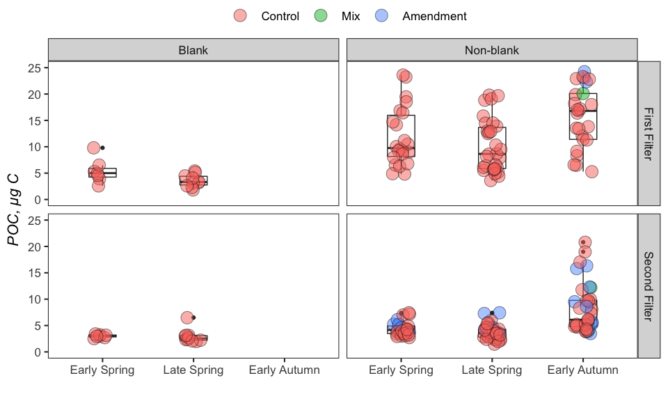
There is a large spread in the data points for the second filter of the
non-blank samples on the early autumn cruise, with higher values
suggesting more material (colloidal? bacteria? detritus?) slipped
through the first filter onto the second filter. It is unfortunate we
don’t have blanks for this cruise to help diagnose this. It may be
inappropriate to apply a universal blank correction determined from the
spring cruises to this cruise.

### Determine Blank Values

``` r
blank.data <- bigelow %>% 
  filter(Bottle == "Blank") %>% 
  #filter out outliers
  # filter(!Season == "Late Spring" | !Station == 1 | !Depth == 10) %>% 
  # filter(!Season == "Early Spring" |  !Depth == 200) %>% 
  mutate(BactC_µM = round(BactC_µg/12,2),
         BactN_µM = round(BactN_µg/14,2),
         BactC_N = ifelse(BactN_µM > 0, round(BactC_µM/BactN_µM,1), NA)) %>% 
  filter(!Cruise == "AT34" | !Filter == 2 | !Depth == 10 | !Station == 1,
         !Cruise == "AT39" | !Filter == 1  | !Depth == 200 | !Station == 2)
```

The 0.2 µm filter 2 value of 6.46 and the TFF filter 1 value of 9.8
appears to be outliers relative to all the other filters (across cruises
and filtrate types), indicating possible contamination or the
compromised integrity of the first filter. These samples (filter 1 & 2)
are going to be removed from the analysis.

#### Filter Summary Statistics

##### t-tests

``` r
t.test.data <- bigelow %>% 
  filter(!Bottle %in% c("100mls", "250mls", "500mls")) %>%
  # filter(!Season == "Late Spring" | !Station == 1 | !Depth == 10 | !Bottle == "Blank") %>% 
  # filter(!Season == "Early Spring" |  !Depth == 200 | !Bottle == "Blank") %>% 
  mutate(Treatment = ifelse(Bottle == "Blank", "Blank", Treatment),
         Treatment = ifelse(Treatment == "Blank" & BlnkFiltrate == "TFF", "TFF", Treatment),
         Treatment = ifelse(Treatment == "Blank" & BlnkFiltrate == "0.2 µm", "0.2 µm", Treatment),
         Treatment = gsub("Niskin", "1.2 µm", Treatment),
         Type = ifelse(Bottle == "Blank", "Blank", "Non-blank")) %>% 
  select(Season, Treatment, Type, facetlabel, Filter, BactC_µg)  %>% 
  rename(Filtrate = Treatment,
         Depth = facetlabel)
```

###### 0.2 µm filtrate, filter 1 v filter 2

    ## 
    ##  Welch Two Sample t-test
    ## 
    ## data:  BactC_µg by Filter
    ## t = 1.1028, df = 17.827, p-value = 0.2848
    ## alternative hypothesis: true difference in means is not equal to 0
    ## 95 percent confidence interval:
    ##  -0.5619966  1.8019966
    ## sample estimates:
    ## mean in group 1 mean in group 2 
    ##            3.56            2.94

**Not significantly different**

###### TFF filtrate, filter 1 v filter 2

    ## 
    ##  Welch Two Sample t-test
    ## 
    ## data:  BactC_µg by Filter
    ## t = 2.7311, df = 6.2211, p-value = 0.03291
    ## alternative hypothesis: true difference in means is not equal to 0
    ## 95 percent confidence interval:
    ##  0.266534 4.504895
    ## sample estimates:
    ## mean in group 1 mean in group 2 
    ##        5.385714        3.000000

**Not signficantly different**

###### 0.2 µm and TFF filtrate, filter 2

    ## 
    ##  Welch Two Sample t-test
    ## 
    ## data:  BactC_µg by Filtrate
    ## t = -0.1386, df = 10.39, p-value = 0.8924
    ## alternative hypothesis: true difference in means is not equal to 0
    ## 95 percent confidence interval:
    ##  -1.019692  0.899692
    ## sample estimates:
    ## mean in group 0.2 µm    mean in group TFF 
    ##                 2.94                 3.00

**Not significantly different**

###### All blanks, filter 1 v filter 2

    ## 
    ##  Welch Two Sample t-test
    ## 
    ## data:  BactC_µg by Filter
    ## t = 2.5785, df = 24.297, p-value = 0.0164
    ## alternative hypothesis: true difference in means is not equal to 0
    ## 95 percent confidence interval:
    ##  0.2695235 2.4245942
    ## sample estimates:
    ## mean in group 1 mean in group 2 
    ##        4.311765        2.964706

**Significantly different**

###### Blank and Non-blank (initial condition), filter 2

    ## 
    ##  Welch Two Sample t-test
    ## 
    ## data:  BactC_µg by Type
    ## t = -2.2595, df = 25.323, p-value = 0.0327
    ## alternative hypothesis: true difference in means is not equal to 0
    ## 95 percent confidence interval:
    ##  -6.4116635 -0.2989247
    ## sample estimates:
    ##     mean in group Blank mean in group Non-blank 
    ##                2.964706                6.320000

**Significantly different**

###### Blank and Non-blank, filter 2, without N3

    ## 
    ##  Welch Two Sample t-test
    ## 
    ## data:  BactC_µg by Type
    ## t = -1.8834, df = 31.003, p-value = 0.06906
    ## alternative hypothesis: true difference in means is not equal to 0
    ## 95 percent confidence interval:
    ##  -1.60097600  0.06372109
    ## sample estimates:
    ##     mean in group Blank mean in group Non-blank 
    ##                2.964706                3.733333

**Not signficantly different**

Based on these results, it seems like filter 2 of the blanks could be a
good blank.

For the filters that had 0.2 µm filtrate run through them:

\-Any particles remaining in the 0.2 µm filtrate are equally caught on
the top and bottom GF75 filters -Handling of the filters is the same
-DOC adsorption is the same on both filters

We would expect to see the same for the TFF filters, but the top and
bottom filters are significantly different. As a result these filters
drive a significant difference between filter 1 and filter 2 when all
blanks are included.

However, given that filter 2 of the blanks and non-NAAMES 3\* 1.2 µm
filtrate are not signficantly different, it seems like filter 2 could
represent a good blank correction.

\*The lower filter cell retention and the higher filter 2 POC values for
NAAMES3 would suggest slippage, making omission of this data reasonable
if blank correction factors are based on blank and non-blank samples.

##### Summary Stats

``` r
blank.stats <- blank.data %>% 
  group_by(Season, Depth, Filter) %>% 
  select(Season, Depth, Filter, BactC_µg, BactN_µg, BactC_µM:BactC_N) %>% 
  summarize(ave_c_µg = mean(BactC_µg, na.rm = T),
            sd_c_µg = sd(BactC_µg, na.rm = T),
            max_c_µg = max(BactC_µg, na.rm = T),
            min_c_µg = min(BactC_µg, na.rm = T),
            ave_n_µg = mean(BactN_µg, na.rm = T),
            sd_n_µg = sd(BactN_µg, na.rm = T),
            max_n_µg = max(BactN_µg, na.rm = T),
            min_n_µg = min(BactN_µg, na.rm = T),
            
            ave_c_µM = mean(BactC_µM, na.rm = T),
            sd_c_µM = sd(BactC_µM, na.rm = T),
            max_c_µM = max(BactC_µM, na.rm = T),
            min_c_µM = min(BactC_µM, na.rm = T),
            ave_n_µM = mean(BactN_µM, na.rm = T),
            sd_n_µM = sd(BactN_µM, na.rm = T),
            max_n_µM = max(BactN_µM, na.rm = T),
            min_n_µM = min(BactN_µM, na.rm = T),
            
            ave_c_n_µM = mean(BactC_N, na.rm = T),
            sd_c_n_µM = sd(BactC_N, na.rm = T),
            max_c_n_µM = max(BactC_N, na.rm = T),
            min_c_n_µM = min(BactC_N, na.rm = T),
            
            n()) %>% 
  mutate_at(vars(ave_c_µg:min_c_n_µM), round, 2) %>% 
  arrange(Filter, Depth,Season)
```

| Season       | Depth | Filter | ave\_c\_µg | sd\_c\_µg | max\_c\_µg | min\_c\_µg | ave\_n\_µg | sd\_n\_µg | max\_n\_µg | min\_n\_µg | ave\_c\_µM | sd\_c\_µM | max\_c\_µM | min\_c\_µM | ave\_n\_µM | sd\_n\_µM | max\_n\_µM | min\_n\_µM | ave\_c\_n\_µM | sd\_c\_n\_µM | max\_c\_n\_µM | min\_c\_n\_µM | n() |
| :----------- | ----: | -----: | ---------: | --------: | ---------: | ---------: | ---------: | --------: | ---------: | ---------: | ---------: | --------: | ---------: | ---------: | ---------: | --------: | ---------: | ---------: | ------------: | -----------: | ------------: | ------------: | --: |
| Early Spring |    10 |      1 |       4.65 |      1.32 |        6.5 |        2.6 |       0.27 |      0.32 |        0.9 |        0.1 |       0.39 |      0.11 |       0.54 |       0.22 |       0.02 |      0.02 |       0.06 |       0.01 |         28.00 |        13.75 |            44 |           9.0 |   6 |
| Late Spring  |    10 |      1 |       4.20 |      1.03 |        5.4 |        3.2 |       0.28 |      0.40 |        1.0 |        0.1 |       0.35 |      0.08 |       0.45 |       0.27 |       0.02 |      0.03 |       0.07 |       0.01 |         27.80 |        14.24 |            45 |           6.0 |   5 |
| Late Spring  |   200 |      1 |       2.92 |      1.06 |        4.5 |        1.8 |       0.24 |      0.26 |        0.7 |        0.1 |       0.24 |      0.09 |       0.38 |       0.15 |       0.02 |      0.02 |       0.05 |       0.01 |         21.36 |        12.94 |            38 |           3.8 |   5 |
| Early Spring |    10 |      2 |       2.97 |      0.33 |        3.4 |        2.5 |       0.20 |      0.20 |        0.6 |        0.1 |       0.25 |      0.03 |       0.28 |       0.21 |       0.02 |      0.01 |       0.04 |       0.01 |         21.53 |         7.99 |            28 |           6.2 |   6 |
| Late Spring  |    10 |      2 |       2.48 |      0.43 |        3.1 |        2.1 |       0.30 |      0.40 |        0.9 |        0.1 |       0.21 |      0.04 |       0.26 |       0.18 |       0.02 |      0.02 |       0.06 |       0.01 |         15.32 |         7.40 |            20 |           4.3 |   4 |
| Early Spring |   200 |      2 |       3.20 |        NA |        3.2 |        3.2 |       0.10 |        NA |        0.1 |        0.1 |       0.27 |        NA |       0.27 |       0.27 |       0.01 |        NA |       0.01 |       0.01 |         27.00 |           NA |            27 |          27.0 |   1 |
| Late Spring  |   200 |      2 |       2.60 |      0.48 |        3.1 |        2.0 |       0.22 |      0.27 |        0.7 |        0.1 |       0.22 |      0.04 |       0.26 |       0.17 |       0.02 |      0.02 |       0.05 |       0.01 |         18.08 |         8.64 |            26 |           4.4 |   5 |

GF75 Blank Filters

#### Non-Blank Filter Statistics

``` r
nonblank.data <- bigelow %>% 
  filter(!Bottle == "Blank") %>% 
  mutate(BactC_µM = round(BactC_µg/12,2),
         BactN_µM = round(BactN_µg/14,2),
         BactC_N = ifelse(BactN_µM > 0, round(BactC_µM/BactN_µM,1), NA))

nonblank.stats <- nonblank.data %>% 
  mutate(Type = ifelse(Treatment %in% c("Control", "Niskin"), "Control", "Non-Control"),
         Time = ifelse(Timepoint == 0, "Initial", "Stationary")) %>% 
  group_by(Season, Depth, Type, Time, Filter) %>% 
  select(Season, Depth, Type, Time, Filter, BactC_µg, BactN_µg, BactC_µM:BactC_N) %>% 
  summarize(ave_c_µg = mean(BactC_µg, na.rm = T),
            sd_c_µg = sd(BactC_µg, na.rm = T),
            max_c_µg = max(BactC_µg, na.rm = T),
            min_c_µg = min(BactC_µg, na.rm = T),
            ave_n_µg = mean(BactN_µg, na.rm = T),
            sd_n_µg = sd(BactN_µg, na.rm = T),
            max_n_µg = max(BactN_µg, na.rm = T),
            min_n_µg = min(BactN_µg, na.rm = T),
            
            ave_c_µM = mean(BactC_µM, na.rm = T),
            sd_c_µM = sd(BactC_µM, na.rm = T),
            max_c_µM = max(BactC_µM, na.rm = T),
            min_c_µM = min(BactC_µM, na.rm = T),
            ave_n_µM = mean(BactN_µM, na.rm = T),
            sd_n_µM = sd(BactN_µM, na.rm = T),
            max_n_µM = max(BactN_µM, na.rm = T),
            min_n_µM = min(BactN_µM, na.rm = T),
            
            ave_c_n_µM = mean(BactC_N, na.rm = T),
            sd_c_n_µM = sd(BactC_N, na.rm = T),
            max_c_n_µM = max(BactC_N, na.rm = T),
            min_c_n_µM = min(BactC_N, na.rm = T),
            n()) %>% 
  mutate_at(vars(ave_c_µg:min_c_n_µM), round, 2) %>% 
  arrange(Filter, Depth, Time, Type, Season) 
```

| Season       | Depth | Type        | Time       | Filter | ave\_c\_µg | sd\_c\_µg | max\_c\_µg | min\_c\_µg | ave\_n\_µg | sd\_n\_µg | max\_n\_µg | min\_n\_µg | ave\_c\_µM | sd\_c\_µM | max\_c\_µM | min\_c\_µM | ave\_n\_µM | sd\_n\_µM | max\_n\_µM | min\_n\_µM | ave\_c\_n\_µM | sd\_c\_n\_µM | max\_c\_n\_µM | min\_c\_n\_µM | n() |
| :----------- | ----: | :---------- | :--------- | -----: | ---------: | --------: | ---------: | ---------: | ---------: | --------: | ---------: | ---------: | ---------: | --------: | ---------: | ---------: | ---------: | --------: | ---------: | ---------: | ------------: | -----------: | ------------: | ------------: | --: |
| Early Spring |    10 | Control     | Initial    |      1 |       6.76 |      1.81 |       10.0 |        4.8 |       0.79 |      0.48 |        1.4 |        0.2 |       0.56 |      0.15 |       0.83 |       0.40 |       0.06 |      0.04 |       0.10 |       0.01 |         15.91 |        13.00 |          40.0 |           6.7 |   7 |
| Late Spring  |    10 | Control     | Initial    |      1 |      15.38 |      4.40 |       19.7 |        8.7 |       2.50 |      0.83 |        3.9 |        1.8 |       1.28 |      0.37 |       1.64 |       0.72 |       0.18 |      0.06 |       0.28 |       0.13 |          7.24 |         1.60 |           8.8 |           5.5 |   5 |
| Early Autumn |    10 | Control     | Initial    |      1 |      15.41 |      8.10 |       29.0 |        5.3 |       1.79 |      1.07 |        3.2 |        0.4 |       1.28 |      0.68 |       2.42 |       0.44 |       0.13 |      0.08 |       0.23 |       0.03 |         12.94 |         9.87 |          37.3 |           5.0 |  10 |
| Early Spring |    10 | Control     | Stationary |      1 |      14.61 |      5.24 |       23.6 |        8.6 |       2.64 |      1.49 |        5.5 |        1.0 |       1.22 |      0.44 |       1.97 |       0.72 |       0.19 |      0.11 |       0.39 |       0.07 |          7.43 |         1.93 |          11.0 |           3.5 |  14 |
| Late Spring  |    10 | Control     | Stationary |      1 |      17.35 |      8.64 |       35.8 |        9.5 |       3.05 |      1.47 |        5.8 |        0.8 |       1.45 |      0.72 |       2.98 |       0.79 |       0.22 |      0.10 |       0.41 |       0.06 |          9.56 |        12.74 |          49.7 |           3.7 |  12 |
| Early Autumn |    10 | Control     | Stationary |      1 |      17.05 |      6.22 |       26.2 |        6.5 |       2.08 |      0.92 |        3.1 |        0.4 |       1.42 |      0.52 |       2.18 |       0.54 |       0.15 |      0.06 |       0.22 |       0.03 |         11.49 |         7.24 |          31.7 |           6.5 |  12 |
| Early Spring |    10 | Non-Control | Stationary |      1 |      76.03 |     35.88 |      122.3 |       36.3 |      18.07 |      8.50 |       28.6 |        8.5 |       6.34 |      2.99 |      10.19 |       3.02 |       1.29 |      0.61 |       2.04 |       0.61 |          4.92 |         0.10 |           5.0 |           4.8 |   6 |
| Late Spring  |    10 | Non-Control | Stationary |      1 |      67.60 |     22.88 |       93.0 |       45.3 |      17.68 |      6.28 |       23.3 |       11.7 |       5.63 |      1.91 |       7.75 |       3.77 |       1.26 |      0.45 |       1.66 |       0.84 |          4.50 |         0.28 |           4.7 |           4.1 |   4 |
| Early Autumn |    10 | Non-Control | Stationary |      1 |      43.48 |     22.26 |       89.2 |       22.3 |       9.31 |      5.45 |       19.2 |        4.5 |       3.62 |      1.85 |       7.43 |       1.86 |       0.66 |      0.39 |       1.37 |       0.32 |          5.72 |         1.40 |           9.1 |           4.1 |   9 |
| Early Spring |   200 | Control     | Initial    |      1 |       9.50 |        NA |        9.5 |        9.5 |       0.30 |        NA |        0.3 |        0.3 |       0.79 |        NA |       0.79 |       0.79 |       0.02 |        NA |       0.02 |       0.02 |         39.50 |           NA |          39.5 |          39.5 |   1 |
| Late Spring  |   200 | Control     | Initial    |      1 |       4.98 |      1.10 |        6.5 |        3.6 |       0.42 |      0.45 |        1.2 |        0.1 |       0.42 |      0.09 |       0.54 |       0.30 |       0.03 |      0.03 |       0.09 |       0.01 |         24.06 |        18.13 |          46.0 |           6.0 |   5 |
| Early Autumn |   200 | Control     | Initial    |      1 |      12.10 |        NA |       12.1 |       12.1 |       1.10 |        NA |        1.1 |        1.1 |       1.01 |        NA |       1.01 |       1.01 |       0.08 |        NA |       0.08 |       0.08 |         12.60 |           NA |          12.6 |          12.6 |   1 |
| Late Spring  |   200 | Control     | Stationary |      1 |       6.57 |      1.21 |        8.6 |        5.2 |       0.90 |      0.54 |        1.6 |        0.1 |       0.55 |      0.10 |       0.72 |       0.43 |       0.06 |      0.04 |       0.11 |       0.01 |         17.99 |        22.24 |          72.0 |           4.8 |  10 |
| Early Autumn |   200 | Control     | Stationary |      1 |      18.35 |      2.19 |       19.9 |       16.8 |       3.65 |      0.21 |        3.8 |        3.5 |       1.53 |      0.18 |       1.66 |       1.40 |       0.26 |      0.01 |       0.27 |       0.25 |          5.85 |         0.35 |           6.1 |           5.6 |   2 |
| Late Spring  |   200 | Non-Control | Stationary |      1 |      47.30 |     22.60 |       68.0 |       27.4 |      11.30 |      6.70 |       17.3 |        5.5 |       3.94 |      1.89 |       5.67 |       2.28 |       0.81 |      0.48 |       1.24 |       0.39 |          5.22 |         0.79 |           6.0 |           4.4 |   4 |
| Early Autumn |   200 | Non-Control | Stationary |      1 |      36.63 |     21.32 |       60.7 |       20.1 |       7.37 |      6.52 |       14.9 |        3.5 |       3.06 |      1.78 |       5.06 |       1.68 |       0.52 |      0.46 |       1.06 |       0.25 |          6.93 |         2.26 |           9.3 |           4.8 |   3 |
| Early Spring |    10 | Control     | Initial    |      2 |       3.47 |      0.55 |        4.2 |        2.7 |       0.27 |      0.19 |        0.6 |        0.1 |       0.29 |      0.05 |       0.35 |       0.22 |       0.02 |      0.01 |       0.04 |       0.01 |         18.71 |        10.13 |          35.0 |           8.2 |   7 |
| Late Spring  |    10 | Control     | Initial    |      2 |       4.60 |      1.44 |        6.0 |        2.3 |       0.50 |      0.38 |        0.9 |        0.1 |       0.38 |      0.12 |       0.50 |       0.19 |       0.03 |      0.03 |       0.06 |       0.01 |         21.84 |        19.42 |          47.0 |           3.2 |   5 |
| Early Autumn |    10 | Control     | Initial    |      2 |      11.06 |     10.14 |       37.0 |        4.0 |       0.70 |      0.44 |        1.3 |        0.1 |       0.92 |      0.84 |       3.08 |       0.33 |       0.05 |      0.03 |       0.09 |       0.01 |         27.18 |        25.72 |          83.0 |           4.0 |  10 |
| Early Spring |    10 | Control     | Stationary |      2 |       4.37 |      1.37 |        7.4 |        2.9 |       0.28 |      0.17 |        0.5 |        0.1 |       0.36 |      0.11 |       0.62 |       0.24 |       0.02 |      0.01 |       0.04 |       0.01 |         21.74 |         9.33 |          37.0 |           9.0 |  14 |
| Late Spring  |    10 | Control     | Stationary |      2 |       3.84 |      0.76 |        5.4 |        2.7 |       1.43 |      1.61 |        6.2 |        0.0 |       0.32 |      0.06 |       0.45 |       0.22 |       0.10 |      0.11 |       0.44 |       0.00 |          4.02 |         2.29 |           8.5 |           0.6 |  12 |
| Early Autumn |    10 | Control     | Stationary |      2 |       8.60 |      5.41 |       20.8 |        3.8 |       0.74 |      0.72 |        2.6 |        0.1 |       0.72 |      0.45 |       1.73 |       0.32 |       0.05 |      0.05 |       0.19 |       0.01 |         29.71 |        27.29 |          78.0 |           3.6 |  12 |
| Early Spring |    10 | Non-Control | Stationary |      2 |       4.93 |      0.83 |        6.1 |        3.6 |       0.90 |      1.67 |        4.3 |        0.1 |       0.41 |      0.07 |       0.51 |       0.30 |       0.06 |      0.12 |       0.31 |       0.01 |         25.93 |        16.59 |          43.0 |           1.4 |   6 |
| Late Spring  |    10 | Non-Control | Stationary |      2 |       5.70 |      1.96 |        7.4 |        3.5 |       0.85 |      0.54 |        1.5 |        0.2 |       0.48 |      0.17 |       0.62 |       0.29 |       0.06 |      0.04 |       0.11 |       0.01 |         15.43 |        15.57 |          38.0 |           2.6 |   4 |
| Early Autumn |    10 | Non-Control | Stationary |      2 |       9.06 |      4.81 |       16.3 |        3.9 |       0.81 |      0.90 |        2.4 |        0.1 |       0.76 |      0.40 |       1.36 |       0.32 |       0.06 |      0.06 |       0.17 |       0.01 |         36.41 |        44.64 |         132.0 |           6.1 |   9 |
| Early Spring |   200 | Control     | Initial    |      2 |       7.00 |        NA |        7.0 |        7.0 |       0.10 |        NA |        0.1 |        0.1 |       0.58 |        NA |       0.58 |       0.58 |       0.01 |        NA |       0.01 |       0.01 |         58.00 |           NA |          58.0 |          58.0 |   1 |
| Late Spring  |   200 | Control     | Initial    |      2 |       2.58 |      0.52 |        3.4 |        2.0 |       0.22 |      0.27 |        0.7 |        0.1 |       0.21 |      0.04 |       0.28 |       0.17 |       0.02 |      0.02 |       0.05 |       0.01 |         18.68 |         9.15 |          28.0 |           3.4 |   5 |
| Early Autumn |   200 | Control     | Initial    |      2 |       4.20 |        NA |        4.2 |        4.2 |       0.10 |        NA |        0.1 |        0.1 |       0.35 |        NA |       0.35 |       0.35 |       0.01 |        NA |       0.01 |       0.01 |         35.00 |           NA |          35.0 |          35.0 |   1 |
| Late Spring  |   200 | Control     | Stationary |      2 |       2.85 |      0.65 |        3.7 |        1.5 |       0.44 |      0.32 |        0.9 |        0.1 |       0.24 |      0.06 |       0.31 |       0.12 |       0.03 |      0.02 |       0.06 |       0.01 |         11.85 |         8.66 |          27.0 |           3.8 |  10 |
| Early Autumn |   200 | Control     | Stationary |      2 |       6.55 |      2.47 |        8.3 |        4.8 |       0.40 |      0.28 |        0.6 |        0.2 |       0.54 |      0.21 |       0.69 |       0.40 |       0.02 |      0.02 |       0.04 |       0.01 |         39.50 |        41.72 |          69.0 |          10.0 |   2 |
| Late Spring  |   200 | Non-Control | Stationary |      2 |       4.12 |      0.35 |        4.3 |        3.6 |       0.57 |      0.62 |        1.4 |        0.1 |       0.34 |      0.03 |       0.36 |       0.30 |       0.04 |      0.04 |       0.10 |       0.01 |         19.20 |        16.19 |          36.0 |           3.6 |   4 |
| Early Autumn |   200 | Non-Control | Stationary |      2 |       6.93 |      4.63 |       12.2 |        3.5 |       0.53 |      0.75 |        1.4 |        0.1 |       0.58 |      0.39 |       1.02 |       0.29 |       0.04 |      0.05 |       0.10 |       0.01 |         27.07 |        15.99 |          42.0 |          10.2 |   3 |

GF75 Non-blank Filters

``` r
all_filter_stats <- blank.stats %>%
  mutate(Sample = "Blank",
         Type = "Blank",
         Time = "Initial") %>%
  bind_rows(., nonblank.stats %>% mutate(Sample = "Non-blank")) %>%
  select(Sample, Type, everything()) 
  
#write_csv(all_filter_stats, "~/Desktop/NAAMES_GF75_Stats.csv")
```


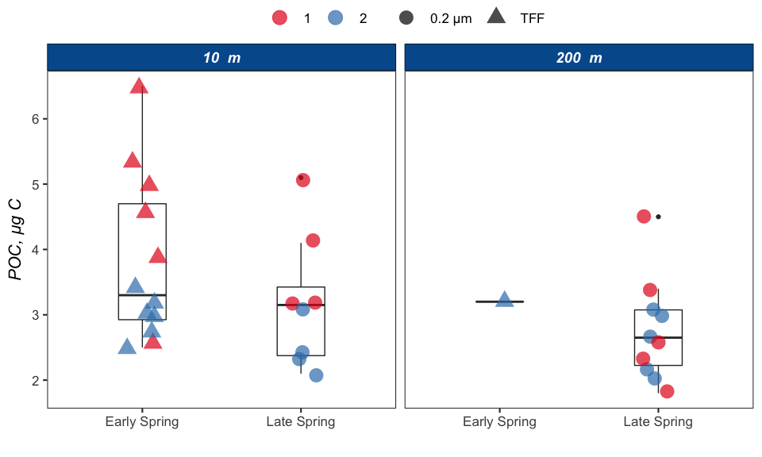

This plot shows greater variability in the POC values from the first
blank filter (red points). Whether using surface or deep water, 0.2 µm
filtrate or TFF filtrate, the small range in the POC values of the
second filter indicates that the second filter could provide a
reasonable estimate of DOC adsorption onto GF75s (at least for the
spring cruises) and represent a decent blank correction.

### Blank Corrections and Bacterial Carbon Estimates

We’ll report non-blank corrected POC estimates as well as
blank-corrected POC estimates. Because we will be calculating delta
bacterial carbon to then estimate BGE, a blank correction may not be
necessary. However, if we were to blank correct, we’ll use universal
correction factors based on the data/plots above. The detection limit
for Bigelow’s Costech ECS 4010 elemental analysis is 0.1 µg C.

We’ll make 3 universal correction factors:

  - poc.cf1 = the mean of filter 2 for all blanks
  - poc.cf2 = the mean of filter 2 of only TFF blanks
  - poc.cf3 = the mean of filter 1 and 2 of only TFF blanks

Each of these will be subtracted from each sample filter to estimate
bacterial carbon in µg. Values below the detection limits for N (\<0.1)
are converted to 0. The addition of the corrected value from filter 1
and from filter 2 of each sample will provide the bacterial carbon
estimate for that sample.

Bacterial carbon estimates will then be converted to µmol
C<sup>-1</sup>. The same will be done for PON.

``` r
corrfactor <- blank.data %>%
  group_by(Filter) %>%
  mutate(poc.cf1 = ifelse(Filter == 2, round(mean(BactC_µg),1), NA),
         pon.cf1 = ifelse(Filter == 2, round(mean(BactN_µg),1), NA)) %>% 
  ungroup() %>% 
  group_by(BlnkFiltrate, Filter) %>%
  mutate(poc.cf2 = ifelse(BlnkFiltrate == "TFF" & Filter == 2, round(mean(BactC_µg),1), NA),
         pon.cf2 = ifelse(BlnkFiltrate == "TFF" & Filter == 2, round(mean(BactN_µg),1), NA)) %>% 
  ungroup() %>% 
  group_by(BlnkFiltrate) %>% 
  mutate(poc.cf3 = ifelse(BlnkFiltrate == "TFF", round(mean(BactC_µg),1), NA),
         pon.cf3 = ifelse(BlnkFiltrate == "TFF", round(mean(BactN_µg),1), NA)) %>% 
  ungroup() %>% 
  fill(poc.cf1:pon.cf3, .direction = "updown") %>% 
  select(poc.cf1:pon.cf3) %>% 
  distinct()

corrfactor
```

    ## # A tibble: 1 x 6
    ##   poc.cf1 pon.cf1 poc.cf2 pon.cf2 poc.cf3 pon.cf3
    ##     <dbl>   <dbl>   <dbl>   <dbl>   <dbl>   <dbl>
    ## 1     2.7     0.2       3     0.2     3.8     0.2

The carbon correction factors for the mean of the blanks are:

  - poc.c1.ug = POC (µg) - poc.cf1
  - poc.c2.ug = POC (µg) - poc.cf2
  - poc.c3.ug = POC (µg) - poc.cf3

and convert the calculated vales to µmol C L<sup>-1</sup>:

  - poc.c1.um
  - poc.c2.um
  - poc.c3.um

Since the nitrogen carbon conversion factors are all the same, we’ll
only calculate 1 corrected value

  - pon.c.ug = PON (µg) - pon.cf1, 2, or 3

and convert the calculated values to µmol N L <sup>-1</sup>:

  - pon.c.um

We’ll also calculate C:N ratios:

  - cn = poc.um/pon.um
  - cn.c1 = poc.c1.um/pon.um
  - cn.c2 = poc.c2.um/pon.um
  - cn.c3 = poc.c3.um/pon.m

<!-- end list -->

``` r
bactcarbon <- bigelow %>%
  filter(!Bottle == "Blank") %>%
  mutate(Treatment = ifelse(Bottle %in% c("1L", "100mls", "250mls", "500mls"), "Volume", Treatment)) %>% 
  rename(pon.ug = BactN_µg,
         poc.ug = BactC_µg) %>% 
  cbind(., corrfactor) %>% 
  mutate(poc.c1.ug = poc.ug - poc.cf1,
         poc.c2.ug = poc.ug - poc.cf2,
         poc.c3.ug = poc.ug - poc.cf3,
         pon.c.ug = pon.ug - pon.cf1,
         poc.c1.ug = ifelse(poc.c1.ug < 0, 0, poc.c1.ug),
           poc.c2.ug = ifelse(poc.c1.ug < 0, 0, poc.c2.ug),
         poc.c3.ug = ifelse(poc.c3.ug < 0, 0, poc.c3.ug),
         pon.c.ug = ifelse(pon.c.ug < 0, 0, pon.c.ug)) %>%
  group_by(Cruise, Station, Depth, Bottle, Timepoint) %>%
  mutate(poc.ug = round((sum(poc.ug)),1),
         pon.ug = round((sum(pon.ug)),1),
         poc.c1.ug = round((sum(poc.c1.ug)),1),
         poc.c2.ug = round((sum(poc.c2.ug)),1),
         poc.c3.ug = round((sum(poc.c3.ug)),1),
         pon.c.ug = round((sum(pon.c.ug)),1)) %>% 
  ungroup() %>% 
  mutate(poc.um = round(poc.ug/12, 1),
         poc.c1.um = round(poc.c1.ug/12, 1),
         poc.c2.um = round(poc.c2.ug/12, 1),
         poc.c3.um = round(poc.c3.ug/12, 1),
         pon.um = round(pon.ug/14, 1),
         pon.c.um = round(pon.c.ug/14, 1),
         cn = round(poc.um/pon.um),
         cn.c1 = round(poc.c1.um/pon.um),
         cn.c2 = round(poc.c2.um/pon.um),
         cn.c3 = round(poc.c3.um/pon.um)) %>% 
  select(Season, Cruise, Station, Depth, facetlabel, Treatment, Bottle, Timepoint, poc.ug, pon.ug, poc.cf1, poc.cf2, poc.cf3, pon.cf1, pon.cf2, pon.cf3, poc.c1.ug, poc.c2.ug,poc.c3.ug, pon.c.ug, poc.um:cn.c3 ) %>% 
  distinct() %>% 
  arrange(Season, Cruise, Station, Depth, Treatment, Bottle, Timepoint) 
```

### Sampling Volume Effect on Bacterial Carbon

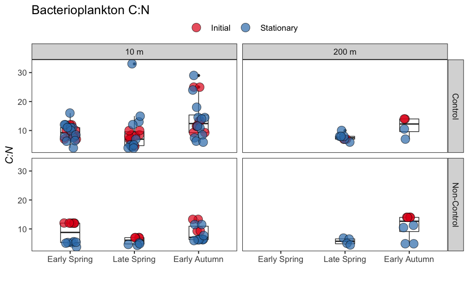

This test needs to be done again \#flattenthecurve

### Calculate Carbon Per Cell

Here we calculate fg C or fg N cell<sup>-1</sup> by:

  - Estimating the cell abundance captured on the 0.3 µm GF75 filters
    (whole water - filtrate, cells L<sup>-1</sup>)
  - Dividing the GF75 POC or PON value (µmol C or N L<sup>-1</sup>) by
    the cell abundance on the GF75 filter, then applying the subsequent
    conversions

The GF75 POC data are tidied before calculations are made (e.g renaming
bottle identifiers so they are congruent with datasets to be merged
with, duplicating values for initial timepoints where one POC value was
taken for replicate bottles). For ease, initial POC and cell abundance
data are handled separately from data collected at stationary
timepoints.

#### Calculate Filter Cell Abundance and Retention

``` r
#initial cell abundance
i.gf75 <- ba.df %>% 
  select(Season:cells) %>% 
  filter(Timepoint == 0, Bottle %in% c("GF75", "Niskin")) %>% 
  group_by(Cruise, Station, Depth) %>% 
  mutate(filtrate.cells = ifelse(Bottle == "GF75", cells, NA)) %>% 
  fill(filtrate.cells, .direction = "downup") %>% 
  filter(Bottle == "Niskin") %>% 
  mutate(i.gf75.cells = cells - filtrate.cells,
         i.gf75.ret = round((cells - filtrate.cells)/cells, 2)) %>% 
  ungroup() %>% 
  select(Season:Depth, i.gf75.cells, i.gf75.ret)

#stationary cell abundance
s.gf75 <- ba.df %>% 
  select(Season:cells) %>% 
  filter(!Timepoint == 0) %>% 
  arrange(Cruise, Station, Depth, Bottle, Timepoint) %>% 
  group_by(Cruise, Station,  Depth, Bottle) %>%
  mutate(gf75.timepoint = ifelse(Treatment == "GF75", Timepoint, NA)) %>% 
  fill(gf75.timepoint, .direction = "updown") %>% 
  filter(Timepoint == gf75.timepoint) %>% 
  mutate(filtrate.cells = ifelse(Treatment == "GF75", cells, NA)) %>% 
  fill(filtrate.cells, .direction = "updown") %>%  
  filter(!Treatment == "GF75") %>% 
  mutate(s.gf75.cells = cells - filtrate.cells,
         s.gf75.ret = round((cells - filtrate.cells)/cells, 2)) %>% 
  ungroup() %>% 
  select(Season:Bottle, Treatment, Timepoint, s.gf75.cells, s.gf75.ret) 
```

### Combine Cell Abundance and POC Data, Calculate CCF

We’ll calculate 6 CCFs (fg C cell<sup>-1</sup>) from the POC data:

  - i.ccf.c1 = poc.c1.um/cells on filter \* 12 \* 10<sup>9</sup>
    (initial)
  - s.ccf.c1 = poc.c1.um/cells on filter \* 12 \* 10<sup>9</sup>
    (stationary)
  - i.ccf.c2 = poc.c2.um/cells on filter \* 12 \* 10<sup>9</sup>
    (initial)
  - s.ccf.c2 = poc.c2.um/cells on filter \* 12 \* 10<sup>9</sup>
    (stationary)
  - i.ccf.c3 = poc.c3.um/cells on filter \* 12 \* 10<sup>9</sup>
    (initial)
  - s.ccf.c3 = poc.c3.um/cells on filter \* 12 \* 10<sup>9</sup>
    (stationary)

We’ll also add 3 other CCFs from the literature:

  - ccf.white = 6.5 (SAR11), White et al 2019
      - also close to 6.3 of Carlson et al 1996 and 7 of Zubkov 2000
  - ccf.fukuda = 12.3 (average oceanic Pacific), Fukuda et al 1998
      - also close to 10 generally used by many papers Wear et al 2020,
        Christian and Karl 1994, Caron et al 1995, James et al 2017
  - ccf.lee = 20 (Long Island Sound), Lee and Fuhrman 1987
      - generally used as reported by Gunderson et al 2002

<!-- end list -->

``` r
#initial timepoints
i.fg_cell <-  bactcarbon %>% 
  filter(!Treatment == "Volume", Timepoint == 0) %>% 
  select_at(vars(poc.ug:cn.c3), .funs = funs(paste0("i.", .))) %>% 
  bind_cols(bactcarbon %>% filter(!Treatment == "Volume", Timepoint == 0) %>% select(Season:facetlabel), .) %>% 
  mutate(Station = gsub("2RD", "S2RD", Station),
         Station = gsub("2RF", "S2RF", Station)) %>% 
  left_join(., i.gf75) %>% 
  mutate(i.ccf.c1 = round(i.poc.c1.um/i.gf75.cells * 12 * 10^9),
         i.ccf.c2 = round(i.poc.c2.um/i.gf75.cells * 12 * 10^9),
         i.ccf.c3 = round(i.poc.c3.um/i.gf75.cells * 12 * 10^9)) 
```

    ## Warning: funs() is soft deprecated as of dplyr 0.8.0
    ## Please use a list of either functions or lambdas: 
    ## 
    ##   # Simple named list: 
    ##   list(mean = mean, median = median)
    ## 
    ##   # Auto named with `tibble::lst()`: 
    ##   tibble::lst(mean, median)
    ## 
    ##   # Using lambdas
    ##   list(~ mean(., trim = .2), ~ median(., na.rm = TRUE))
    ## This warning is displayed once per session.

``` r
#stationary timepoints
s.fg_cell <- bactcarbon %>% 
  filter(!Treatment == "Volume", !Timepoint == 0) %>% 
  select_at(vars(poc.ug:cn.c3), .funs = funs(paste0("s.", .))) %>% 
  bind_cols(bactcarbon %>% filter(!Treatment == "Volume", !Timepoint == 0) %>% select(Season:facetlabel, Treatment, Bottle, Timepoint), .) %>% 
  mutate(Station = gsub("2RD", "S2RD", Station),
         Station = gsub("2RF", "S2RF", Station),
         Treatment = gsub("TW15", "TW20", Treatment),
         Bottle = ifelse(Cruise == "AT34" & Station == 2 & Depth == 10 & Treatment == "TW12" & Bottle == "A12", gsub("A12", "C", Bottle), Bottle),
         Bottle = ifelse(Cruise == "AT34" & Station == 2 & Depth == 10 & Treatment == "TW12" & Bottle == "B12", gsub("B12", "D", Bottle), Bottle),
         Bottle = ifelse(Cruise == "AT34" & Station == 2 & Depth == 10 & Treatment == "TW13" & Bottle == "A13", gsub("A13", "E", Bottle), Bottle),
         Bottle = ifelse(Cruise == "AT34" & Station == 2 & Depth == 10 & Treatment == "TW13" & Bottle == "B13", gsub("B13", "F", Bottle), Bottle),
         Bottle = ifelse(Cruise == "AT34" & Station == 2 & Depth == 200 & Treatment == "Control" & Bottle == "C", gsub("C", "G", Bottle), Bottle),
         Bottle = ifelse(Cruise == "AT34" & Station == 2 & Depth == 200 & Treatment == "Control" & Bottle == "D", gsub("D", "H", Bottle), Bottle),
         Bottle = ifelse(Cruise == "AT34" & Station == 2 & Depth == 200 & Treatment == "TW12" & Bottle == "C12", gsub("C12", "I", Bottle), Bottle),
         Bottle = ifelse(Cruise == "AT34" & Station == 2 & Depth == 200 & Treatment == "TW12" & Bottle == "D12", gsub("D12", "J", Bottle), Bottle),
         Bottle = ifelse(Cruise == "AT34" & Station == 2 & Depth == 200 & Treatment == "TW13" & Bottle == "C13", gsub("C13", "K", Bottle), Bottle),
         Bottle = ifelse(Cruise == "AT34" & Station == 2 & Depth == 200 & Treatment == "TW13" & Bottle == "D13", gsub("D13", "L", Bottle), Bottle)) %>% 
  add_row(Season = "Early Autumn", Cruise = "AT38", Station = 1, Depth = 10, Treatment = "SynExd", Bottle = "I") %>% 
    add_row(Season = "Early Autumn", Cruise = "AT38", Station = 1, Depth = 10, Treatment = "SynLys", Bottle = "N") %>% 
  add_row(Season = "Early Autumn", Cruise = "AT38", Station = 1, Depth = 10, Treatment = "TWExd", Bottle = "K") %>% 
  add_row(Season = "Early Autumn", Cruise = "AT38", Station = 1, Depth = 200, Treatment = "SynLys", Bottle = "P") %>% 
  arrange(Cruise, Station, Depth, Treatment, Bottle) %>% 
  group_by(Cruise, Station, Depth, Treatment) %>% 
  fill(s.poc.ug:s.cn.c3, .direction = "updown") %>% 
  mutate(Bottle = gsub("JI", "J", Bottle),
         Bottle = gsub("MN", "M", Bottle),
         Bottle = gsub("LK", "L", Bottle),
         Bottle = gsub("OP", "O", Bottle)) %>% 
  left_join(., s.gf75) %>% 
  mutate(s.ccf.c1 = round(s.poc.c1.um/s.gf75.cells * 12 * 10^9),
         s.ccf.c2 = round(s.poc.c2.um/s.gf75.cells * 12 * 10^9),
         s.ccf.c3 = round(s.poc.c3.um/s.gf75.cells * 12 * 10^9)) %>% 
  ungroup() %>% 
  rename(s.timepoint = Timepoint)

fg_cell <- left_join(s.fg_cell, i.fg_cell)  %>% 
   group_by(Cruise, Station, Depth, Treatment) %>% 
  fill(c(s.timepoint,i.poc.ug:i.ccf.c3), .direction = "updown") %>% 
  mutate(ccf.white = 6.5,
         ccf.fukuda = 12.3,
         ccf.lee = 20) %>% 
  ungroup()

fg_cell$Season <- factor(fg_cell$Season, levels = levels)
```

#### Retention of GF75 Filters


##### 10m, Initial

    ##  Initial_Summary 
    ##  Min.   :0.4800  
    ##  1st Qu.:0.6500  
    ##  Median :0.7400  
    ##  Mean   :0.7153  
    ##  3rd Qu.:0.8000  
    ##  Max.   :0.8800

##### 200m, Initial

    ##  Initial_Summary 
    ##  Min.   :0.1000  
    ##  1st Qu.:0.2750  
    ##  Median :0.5600  
    ##  Mean   :0.5143  
    ##  3rd Qu.:0.7850  
    ##  Max.   :0.8200

##### 10m, Stationary, Control

    ##   Stat_Summary   
    ##  Min.   :0.6100  
    ##  1st Qu.:0.7525  
    ##  Median :0.8200  
    ##  Mean   :0.8091  
    ##  3rd Qu.:0.8675  
    ##  Max.   :0.9700

##### 10m, Stationary, Non-Control

    ##   Stat_Summary 
    ##  Min.   :0.73  
    ##  1st Qu.:0.87  
    ##  Median :0.90  
    ##  Mean   :0.88  
    ##  3rd Qu.:0.93  
    ##  Max.   :0.96

##### 200m, Stationary, Control

    ##   Stat_Summary   
    ##  Min.   :0.4800  
    ##  1st Qu.:0.6575  
    ##  Median :0.7850  
    ##  Mean   :0.7600  
    ##  3rd Qu.:0.8700  
    ##  Max.   :0.9400

##### 200m, Stationary, Non-control

    ##   Stat_Summary  
    ##  Min.   :0.930  
    ##  1st Qu.:0.940  
    ##  Median :0.960  
    ##  Mean   :0.954  
    ##  3rd Qu.:0.960  
    ##  Max.   :0.980

This figure shows that while GF75 filter retention is fairly consistent
across the samples taken during the stationary phase of cell growth,
they are pretty variable for the samples taken at the initial condition.
Those samples with filter retentions below the average for a group could
reflect faulty procedure (i.e. ripped filters) and may be associated
with questionable measurements. We’ll flag these data. The averages are
as follows:

  - Initial condition, 10 m = 72%
  - Initial condition, 200 m = 51%
  - Stationary condition, 10 m control = 81%
  - Stationary condition, 10 m non-control = 88%
  - Stationary condition, 200 m control = 76%
  - Stationary condition, 200 m non-control = 95%

<!-- end list -->

``` r
fg_cell.qc <- fg_cell %>% 
  mutate(type = ifelse(Treatment == "Control", "Control", "Non-control"),
         i.gf75.flag = ifelse(Depth == 10 & i.gf75.ret < 0.72, "< Ave. Ret.", NA),
         i.gf75.flag = ifelse(Depth == 200 & i.gf75.ret < 0.51, "< Ave. Ret.", i.gf75.flag ),
         i.gf75.flag = ifelse(is.na(i.gf75.ret), "ND", i.gf75.flag),
         i.gf75.flag = ifelse(is.na(i.gf75.flag), "No Flag", i.gf75.flag),
         s.gf75.flag = ifelse(Depth == 10 & type == "Control" & s.gf75.ret < 0.81, "< Ave. Ret.", NA),
         s.gf75.flag = ifelse(Depth == 10 & type == "Non-control" & s.gf75.ret < 0.88, "< Ave. Ret.",  s.gf75.flag ),
         s.gf75.flag = ifelse(Depth == 200 & type == "Control" & s.gf75.ret < 0.76, "< Ave. Ret.",  s.gf75.flag ),
         s.gf75.flag = ifelse(Depth == 200 & type == "Non-control" & s.gf75.ret < 0.95, "< Ave. Ret.",  s.gf75.flag ),
         s.gf75.flag = ifelse(is.na(s.gf75.ret), "ND", s.gf75.flag),
         s.gf75.flag = ifelse(is.na(s.gf75.flag), "No Flag", s.gf75.flag),
         gf75.flag = ifelse(i.gf75.flag == "No Flag" & s.gf75.flag == "No Flag", "No Flag", NA),
         gf75.flag = ifelse(i.gf75.flag == "< Ave. Ret." & s.gf75.flag == "No Flag", "Init. < Ave. Ret.", gf75.flag),
         gf75.flag = ifelse(s.gf75.flag == "< Ave. Ret." & i.gf75.flag == "No Flag", "Stat. < Ave. Ret.", gf75.flag),
         gf75.flag = ifelse(i.gf75.flag == "< Ave. Ret." & s.gf75.flag == "ND", "Init. < Ave. Ret./Stat. ND", gf75.flag),
         gf75.flag = ifelse(i.gf75.flag == "< Ave. Ret." & s.gf75.flag == "< Ave. Ret.", "< Ave. Ret.", gf75.flag),
         gf75.flag = ifelse(i.gf75.flag == "No Flag" & s.gf75.flag == "ND", "Stat. ND", gf75.flag),
         gf75.flag = ifelse(s.gf75.flag == "No Flag" & i.gf75.flag == "ND", "Init. ND", gf75.flag),
         gf75.flag = ifelse(s.gf75.flag == "ND" & i.gf75.flag == "ND", "ND", gf75.flag)) %>% 
  select(Season:Bottle, type, i.gf75.ret, s.gf75.ret, i.gf75.flag, s.gf75.flag, gf75.flag, contains("i."), contains("s."), contains("ccf"))
```

#### CCFs and C:N ratios

##### CCF Early Spring Control, 10 m

``` 
i.ccf.c1       i.ccf.c2        i.ccf.c3       s.ccf.c1        s.ccf.c2    
```

Min. : 5.0 Min. : 2.00 Min. : 2.0 Min. : 8.00 Min. : 7.00  
1st Qu.: 7.0 1st Qu.: 7.00 1st Qu.: 3.0 1st Qu.:17.75 1st Qu.:17.75  
Median :11.0 Median :10.00 Median : 7.5 Median :22.50 Median :20.00  
Mean :19.5 Mean :15.67 Mean :11.0 Mean :22.25 Mean :21.25  
3rd Qu.:13.0 3rd Qu.:13.00 3rd Qu.:11.0 3rd Qu.:28.00 3rd Qu.:27.50  
Max. :70.0 Max. :52.00 Max. :35.0 Max. :36.00 Max. :34.00  
NA’s :2 NA’s :2 NA’s :2 NA’s :2 NA’s :2  
s.ccf.c3  
Min. : 6.00  
1st Qu.:13.25  
Median :18.00  
Mean :18.25  
3rd Qu.:25.00  
Max. :33.00  
NA’s :2

##### CCF Late Spring Control, 10 m

``` 
i.ccf.c1     i.ccf.c2       i.ccf.c3       s.ccf.c1       s.ccf.c2    
```

Min. : 5 Min. : 4.0 Min. : 4.0 Min. : 6.0 Min. : 5.00  
1st Qu.:11 1st Qu.:11.0 1st Qu.:10.0 1st Qu.: 7.0 1st Qu.: 6.25  
Median :11 Median :11.0 Median :10.0 Median :10.5 Median : 9.50  
Mean :13 Mean :12.4 Mean :11.4 Mean :17.2 Mean :16.00  
3rd Qu.:18 3rd Qu.:16.0 3rd Qu.:15.0 3rd Qu.:29.0 3rd Qu.:28.25  
Max. :20 Max. :20.0 Max. :18.0 Max. :34.0 Max. :33.00  
NA’s :2 NA’s :2 NA’s :2 NA’s :2 NA’s :2  
s.ccf.c3  
Min. : 5.0  
1st Qu.: 6.0  
Median : 8.5  
Mean :14.6  
3rd Qu.:25.0  
Max. :31.0  
NA’s
:2

##### CCF Early Autumn Control, 10 m

``` 
i.ccf.c1        i.ccf.c2        i.ccf.c3       s.ccf.c1        s.ccf.c2    
```

Min. :23.00 Min. :23.00 Min. :15.0 Min. :14.00 Min. :13.00  
1st Qu.:37.00 1st Qu.:37.00 1st Qu.:36.0 1st Qu.:21.25 1st Qu.:21.25  
Median :51.00 Median :49.00 Median :47.0 Median :26.00 Median :25.00  
Mean :49.83 Mean :48.67 Mean :44.5 Mean :30.67 Mean :30.00  
3rd Qu.:60.00 3rd Qu.:57.00 3rd Qu.:55.0 3rd Qu.:42.50 3rd Qu.:42.00  
Max. :77.00 Max. :77.00 Max. :67.0 Max. :48.00 Max. :47.00  
s.ccf.c3  
Min. :12.00  
1st Qu.:18.50  
Median :21.00  
Mean :27.33  
3rd Qu.:38.25  
Max.
:44.00


C:N ratios of POC-corrected samples appear to be a little more realistic
than uncorrected values (closer to 6.8 of Fukuda et al). Generally,
these C:Ns are pretty good. The points on the line intersecting the max
of the y-axis represent “Inf” values, where PON values are 0.

##### Early Spring Control, 10 m

``` 
  i.cn       i.cn.c1       i.cn.c2       i.cn.c3       i.ccf.c1   
```

Min. : 7 Min. :2.0 Min. :2.0 Min. :1.0 Min. : 7.0  
1st Qu.: 8 1st Qu.:3.0 1st Qu.:3.0 1st Qu.:2.0 1st Qu.: 9.0  
Median : 8 Median :4.0 Median :3.0 Median :2.0 Median :13.0  
Mean : 9 Mean :4.2 Mean :3.8 Mean :2.8 Mean :22.4  
3rd Qu.:10 3rd Qu.:5.0 3rd Qu.:5.0 3rd Qu.:4.0 3rd Qu.:13.0  
Max. :12 Max. :7.0 Max. :6.0 Max. :5.0 Max. :70.0  
i.ccf.c2 i.ccf.c3  
Min. : 7.0 Min. : 3.0  
1st Qu.: 9.0 1st Qu.: 6.0  
Median :11.0 Median : 9.0  
Mean :18.4 Mean :12.8  
3rd Qu.:13.0 3rd Qu.:11.0  
Max. :52.0 Max. :35.0

##### Late Spring Control, 10 m

``` 
  i.cn         i.cn.c1       i.cn.c2       i.cn.c3     i.ccf.c1 
```

Min. : 4.0 Min. :2.0 Min. :2.0 Min. :2 Min. : 5  
1st Qu.: 7.0 1st Qu.:5.0 1st Qu.:5.0 1st Qu.:5 1st Qu.:11  
Median : 8.0 Median :6.0 Median :6.0 Median :5 Median :11  
Mean : 7.4 Mean :5.4 Mean :5.4 Mean :5 Mean :13  
3rd Qu.: 8.0 3rd Qu.:6.0 3rd Qu.:6.0 3rd Qu.:6 3rd Qu.:18  
Max. :10.0 Max. :8.0 Max. :8.0 Max. :7 Max. :20  
i.ccf.c2 i.ccf.c3  
Min. : 4.0 Min. : 4.0  
1st Qu.:11.0 1st Qu.:10.0  
Median :11.0 Median :10.0  
Mean :12.4 Mean :11.4  
3rd Qu.:16.0 3rd Qu.:15.0  
Max. :20.0 Max.
:18.0

##### Early Autumn Control, 10 m

``` 
  i.cn         i.cn.c1         i.cn.c2        i.cn.c3         i.ccf.c1    
```

Min. : 9.0 Min. : 8.00 Min. : 7.0 Min. : 7.00 Min. :37.00  
1st Qu.:10.5 1st Qu.: 8.75 1st Qu.: 8.5 1st Qu.: 7.75 1st Qu.:41.50  
Median :12.0 Median :10.50 Median :10.5 Median : 9.50 Median :51.00  
Mean :14.5 Mean :12.75 Mean :12.5 Mean :12.00 Mean :49.75  
3rd Qu.:16.0 3rd Qu.:14.50 3rd Qu.:14.5 3rd Qu.:13.75 3rd Qu.:59.25  
Max. :25.0 Max. :22.00 Max. :22.0 Max. :22.00 Max. :60.00  
i.ccf.c2 i.ccf.c3  
Min. :37.00 Min. :36.00  
1st Qu.:40.75 1st Qu.:39.75  
Median :49.00 Median :47.00  
Mean :48.00 Mean :46.25  
3rd Qu.:56.25 3rd Qu.:53.50  
Max. :57.00 Max. :55.00

Overall (including AT38), the median corrected bacterial C:N ratios for
the in situ community (initial condition) estimated here are are
comparable to those reported for oceanic bacteria by Fukuda et al.
(1998): \[6.8 \pm 1.2\]

Especially if the outlier in the early spring is removed, the spring
cell carbon contents within the range of those reported by Fukuda et al.
(1998): \[12.4 \pm 6.3\] fg C cell<sup>-1</sup>

Deviations from Fukuda et al. may be in part due to differences in
sampling locations (NA v Pacific and Southern Ocean) and time of
collection (range of seasons for NAAMES, winter in both Pacific and
Southern Ocean). They could also be due to differences in growth
conditions (i.e nutrient limitation) and differences in bacterial
communities (Vrede et al 2002). The estimates become more in agreement
with Fukuda et al when N3 data are
excluded.

#### Cell Carbon v GF75 Retention


#### Cell Carbon v GF75 Filter Cell Abundance


#### Cell Carbon v POC

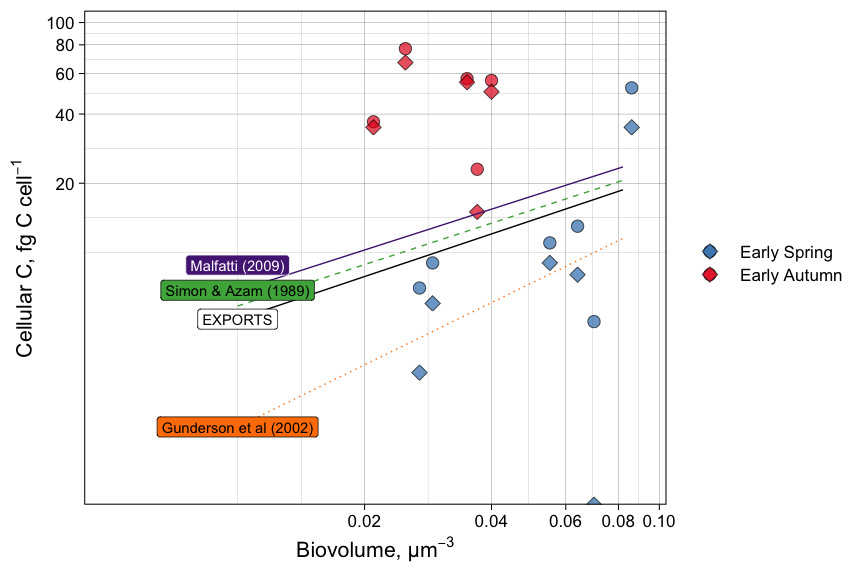

#### POC v Cell Abundance

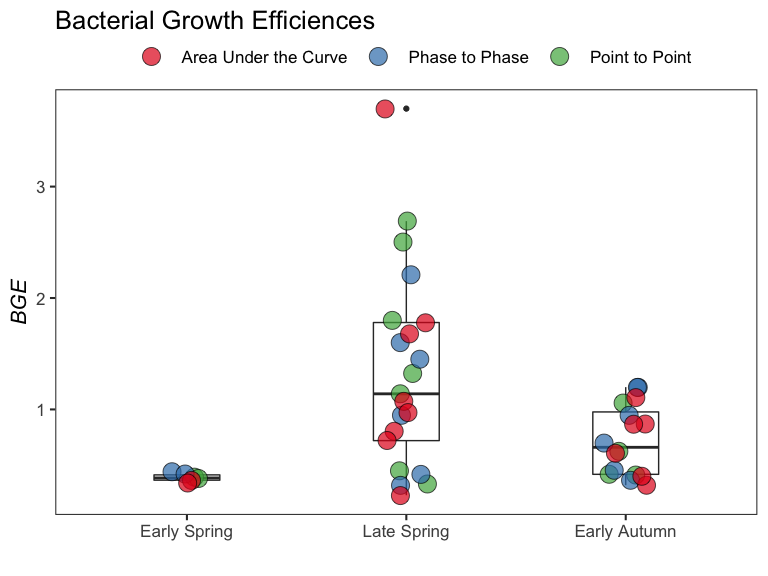
\#\#\#\# POC v GF75
retention

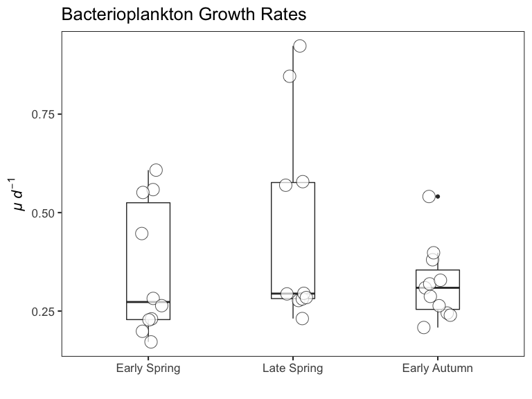

#### Cell Carbon v C:N

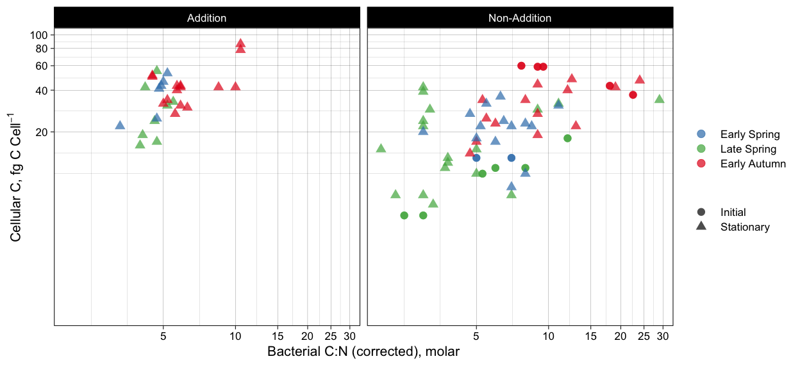

## Biovolume

Cell biovolume was determined from 10 images captured with a digital
camera (Retiga Exi-QImaging, Surrey, BC, Canada). Images were processed
using ImageJ software according to established image analyses protocols
(Baldwin and Bankston 1988; Sieracki et al. 1989, Ducklow et al., 1995).
In addition to calculating cell carbon using GF75 POC-derived CCFs,
we’ll also caclulate cell carbon based on the biovolume measurements
we have. Biovolume-based cell carbon could be be calculated as:
**Bacterial Abundance \* Cell Biovolume \* CCF of 148 fg C
µm<sup>-3</sup>** However, this CCF, which comes from Gunderson et al,
is likely only really applicable to the Sargasso Sea. We will need to
determine the best way to estimate biovolume-based cell carbon for this
dataset.

``` r
biovol <- read_csv("~/naames_bioav_ms/Input/Biovolume_Summary.csv") %>% 
  select(Cruise:Timepoint, Biovol_Mean_All) %>% 
  rename(biovol = Biovol_Mean_All) %>% 
  mutate_at(vars(biovol), round, 3) %>% 
  mutate(phase = ifelse(Timepoint == 0, "initial", "later"),
         Station = gsub("2RD", "S2RD", Station),
         Station = gsub("2RF", "S2RF", Station)) %>% 
  group_by(Cruise, phase) %>% 
  mutate(mean_biovol = round(mean(biovol, na.rm = T),3),
         sd_biovol = round(sd(biovol, na.rm = T),3)) %>% 
  add_tally() %>% 
  rename(n_biovol = n) %>% 
  ungroup() 

biovol_table <- biovol %>% select(-c(Station:biovol)) %>% distinct()
```

| Cruise | phase   | mean\_biovol | sd\_biovol | n\_biovol |
| :----- | :------ | -----------: | ---------: | --------: |
| AT38   | initial |        0.032 |      0.008 |         5 |
| AT38   | later   |        0.040 |      0.027 |        14 |
| AT39   | initial |        0.055 |      0.023 |         6 |
| AT39   | later   |        0.054 |      0.021 |        12 |

Mean Biovolume AT38, AT39; ‘later’ represents any timepoint after 0

It would be good to see if there is a log-linear relationship between
the cell carbon calculated from the GF75 POC data (fg C L<sup>-1</sup>)
and the estimated biovolumes (µm<sup>3</sup>). Unfortunately we don’t
yet have concurrent measurements of GF75 POC data and biovolume at
“stationary” so that will have to wait. We do have concurrent
measurements at initial though, so we can plot those.

``` r
biovol_merge <- biovol %>% 
  filter(Timepoint == 0) %>% 
  select(Cruise:Bottle, biovol) %>% 
  rename(i.biovol = biovol) %>% 
  left_join(fg_cell.qc, .)
```

#### Biovolume v. Cell Carbon (this study and literature)


For the samples in which we have concurrent biovolume and cellular C
measurements, we see that their relationship to one another is pretty
widespread relative to published literature relationshops. Circles are
samples corrected using filter 2 of either all POC blanks or only TFF
blanks. Diamonds are samples corrected using the sum of the filters for
TFF blanks.

# Merge Data

``` r
ba.merge <- gcstat.df %>% 
  mutate(key = paste(Cruise, Station, Depth, Treatment, Bottle, Timepoint, sep = "."),
         Depth = as.numeric(Depth)) %>% 
  filter(!Treatment %in% c("GF75", "Niskin", "TFF-Ret", "Volume", "Parallel"))

oc.merge <- oc_p %>% 
  select(-Days) %>% 
  filter(!Treatment == "Parallel")


merge <- full_join(ba.merge, oc.merge) %>% 
  left_join(., fg_cell.qc %>% select(-c(contains(".ug"), contains("gf75.cells")))) %>% 
  arrange(Cruise, Station, Depth, Treatment, Bottle, Hours) %>%
  mutate(Days = round(Hours/24, 2)) %>% 
  group_by(Cruise, Station, Depth, Treatment, Bottle) %>%
  select(Season:Depth, facet_depth,  Treatment, facet_treatment, Bottle, facet_bottle, Timepoint, Hours, stationary, s.timepoint, Days, cells:sd_p_cells, doc, sd_doc, ptoc, sd_ptoc, doc_from_t0, ptoc_from_t0, gf75.flag, i.poc.cf1:i.ccf.c3, s.poc.cf1:s.ccf.c3, ccf.white:ccf.lee) %>% 
  fill(stationary, facet_treatment, facet_depth, facet_bottle, .direction = "downup") %>% 
  ungroup() %>% 
  drop_na(Hours) 
```

# Bottle v. Vial Incubation Comparisons

## PTOC v. PDOC

### Absolute

``` r
ptoc_pdoc.data <- oc_p %>% 
  filter(Cruise == "AT39", !Treatment == "Parallel") 
ptoc_pdoc.reg <- lmodel2(pdoc ~ ptoc, data = ptoc_pdoc.data , nperm = 99)
```

    ## 
    ## Model II regression
    ## 
    ## Call: lmodel2(formula = pdoc ~ ptoc, data = ptoc_pdoc.data, nperm = 99)
    ## 
    ## n = 71   r = 0.9732196   r-square = 0.9471563 
    ## Parametric P-values:   2-tailed = 8.622836e-46    1-tailed = 4.311418e-46 
    ## Angle between the two OLS regression lines = 1.554332 degrees
    ## 
    ## Permutation tests of OLS, MA, RMA slopes: 1-tailed, tail corresponding to sign
    ## A permutation test of r is equivalent to a permutation test of the OLS slope
    ## P-perm for SMA = NA because the SMA slope cannot be tested
    ## 
    ## Regression results
    ##   Method Intercept     Slope Angle (degrees) P-perm (1-tailed)
    ## 1    OLS  3.337716 0.9424277        43.30229              0.01
    ## 2     MA  1.863641 0.9675048        44.05379              0.01
    ## 3    SMA  1.813323 0.9683609        44.07912                NA
    ## 
    ## Confidence intervals
    ##   Method 2.5%-Intercept 97.5%-Intercept 2.5%-Slope 97.5%-Slope
    ## 1    OLS      0.1837596        6.491672  0.8889664   0.9958891
    ## 2     MA     -1.4548804        5.004919  0.9140651   1.0239599
    ## 3    SMA     -1.4159087        4.869193  0.9163741   1.0232969
    ## 
    ## Eigenvalues: 48.72439 0.6605831 
    ## 
    ## H statistic used for computing C.I. of MA: 0.0008036195


### Delta

``` r
delta_ptoc_pdoc.reg <- lmodel2(pdoc_from_t0 ~ ptoc_from_t0, data = ptoc_pdoc.data , nperm = 99)
```

    ## 
    ## Model II regression
    ## 
    ## Call: lmodel2(formula = pdoc_from_t0 ~ ptoc_from_t0, data =
    ## ptoc_pdoc.data, nperm = 99)
    ## 
    ## n = 71   r = 0.9711193   r-square = 0.9430727 
    ## Parametric P-values:   2-tailed = 1.126827e-44    1-tailed = 5.634135e-45 
    ## Angle between the two OLS regression lines = 1.678043 degrees
    ## 
    ## Permutation tests of OLS, MA, RMA slopes: 1-tailed, tail corresponding to sign
    ## A permutation test of r is equivalent to a permutation test of the OLS slope
    ## P-perm for SMA = NA because the SMA slope cannot be tested
    ## 
    ## Regression results
    ##   Method   Intercept     Slope Angle (degrees) P-perm (1-tailed)
    ## 1    OLS  0.09589786 0.9411488        43.26345              0.01
    ## 2     MA -0.02473289 0.9682354        44.07541              0.01
    ## 3    SMA -0.02875343 0.9691382        44.10209                NA
    ## 
    ## Confidence intervals
    ##   Method 2.5%-Intercept 97.5%-Intercept 2.5%-Slope 97.5%-Slope
    ## 1    OLS     -0.3359442       0.5277399  0.8856156    0.996682
    ## 2     MA     -0.2867641       0.2227450  0.9126664    1.027072
    ## 3    SMA     -0.2831516       0.2114846  0.9151948    1.026261
    ## 
    ## Eigenvalues: 78.77687 1.153065 
    ## 
    ## H statistic used for computing C.I. of MA: 0.0008695124


## Bottle TOC v. Vial TOC

Because the same samples are measured for TOC and PTOC for T0, these
data are omitted from the regression analysis.

### Absolute

``` r
toc_ptoc.data <- oc_p %>% 
  filter(!Cruise == "AT34", !Timepoint == 0, !Treatment == "Parallel") 
toc_ptoc.reg <- lmodel2(ptoc ~ toc, data = toc_ptoc.data, nperm = 99)
```

    ## 
    ## Model II regression
    ## 
    ## Call: lmodel2(formula = ptoc ~ toc, data = toc_ptoc.data, nperm = 99)
    ## 
    ## n = 72   r = 0.9607479   r-square = 0.9230365 
    ## Parametric P-values:   2-tailed = 1.034424e-40    1-tailed = 5.172118e-41 
    ## Angle between the two OLS regression lines = 2.287741 degrees
    ## 
    ## Permutation tests of OLS, MA, RMA slopes: 1-tailed, tail corresponding to sign
    ## A permutation test of r is equivalent to a permutation test of the OLS slope
    ## P-perm for SMA = NA because the SMA slope cannot be tested
    ## 
    ## Regression results
    ##   Method Intercept     Slope Angle (degrees) P-perm (1-tailed)
    ## 1    OLS  4.590834 0.8938486        41.79189              0.01
    ## 2     MA  2.378699 0.9276331        42.85002              0.01
    ## 3    SMA  2.199658 0.9303675        42.93411                NA
    ## 
    ## Confidence intervals
    ##   Method 2.5%-Intercept 97.5%-Intercept 2.5%-Slope 97.5%-Slope
    ## 1    OLS      0.5468351        8.634833  0.8323213   0.9553760
    ## 2     MA     -1.9423592        6.432959  0.8657150   0.9936259
    ## 3    SMA     -1.9620843        6.095265  0.8708724   0.9939271
    ## 
    ## Eigenvalues: 60.6155 1.206903 
    ## 
    ## H statistic used for computing C.I. of MA: 0.001177878


### Delta

``` r
delta_toc_ptoc.reg <- lmodel2(ptoc_from_t0 ~ toc_from_t0, data = toc_ptoc.data, nperm = 99)
```

    ## 
    ## Model II regression
    ## 
    ## Call: lmodel2(formula = ptoc_from_t0 ~ toc_from_t0, data =
    ## toc_ptoc.data, nperm = 99)
    ## 
    ## n = 72   r = 0.9158719   r-square = 0.8388214 
    ## Parametric P-values:   2-tailed = 1.864721e-29    1-tailed = 9.323607e-30 
    ## Angle between the two OLS regression lines = 4.975145 degrees
    ## 
    ## Permutation tests of OLS, MA, RMA slopes: 1-tailed, tail corresponding to sign
    ## A permutation test of r is equivalent to a permutation test of the OLS slope
    ## P-perm for SMA = NA because the SMA slope cannot be tested
    ## 
    ## Regression results
    ##   Method Intercept     Slope Angle (degrees) P-perm (1-tailed)
    ## 1    OLS  2.529435 0.7907834        38.33636              0.01
    ## 2     MA  2.490784 0.8519461        40.42921              0.01
    ## 3    SMA  2.483532 0.8634214        40.80803                NA
    ## 
    ## Confidence intervals
    ##   Method 2.5%-Intercept 97.5%-Intercept 2.5%-Slope 97.5%-Slope
    ## 1    OLS       2.201944        2.856927  0.7081515   0.8734153
    ## 2     MA       2.431858        2.544742  0.7665617   0.9451910
    ## 3    SMA       2.428820        2.533258  0.7847345   0.9499984
    ## 
    ## Eigenvalues: 25.98195 1.114466 
    ## 
    ## H statistic used for computing C.I. of MA: 0.002660834


## Bottle v. Vial Cell Abundance

``` r
btl_vial_cell.data <- merge %>% 
 drop_na(p_cells)
btl_vial_cell.reg <- lmodel2(p_cells ~ cells, data = btl_vial_cell.data, nperm = 99)
```

    ## 
    ## Model II regression
    ## 
    ## Call: lmodel2(formula = p_cells ~ cells, data = btl_vial_cell.data,
    ## nperm = 99)
    ## 
    ## n = 17   r = 0.979752   r-square = 0.959914 
    ## Parametric P-values:   2-tailed = 6.869573e-12    1-tailed = 3.434786e-12 
    ## Angle between the two OLS regression lines = 1.169037 degrees
    ## 
    ## Permutation tests of OLS, MA, RMA slopes: 1-tailed, tail corresponding to sign
    ## A permutation test of r is equivalent to a permutation test of the OLS slope
    ## P-perm for SMA = NA because the SMA slope cannot be tested
    ## 
    ## Regression results
    ##   Method Intercept    Slope Angle (degrees) P-perm (1-tailed)
    ## 1    OLS -62025907 1.051394        46.43514              0.01
    ## 2     MA -89040705 1.074686        47.06169              0.01
    ## 3    SMA -87227207 1.073123        47.02008                NA
    ## 
    ## Confidence intervals
    ##   Method 2.5%-Intercept 97.5%-Intercept 2.5%-Slope 97.5%-Slope
    ## 1    OLS     -226182286       102130471  0.9331511    1.169637
    ## 2     MA     -238461187        43365926  0.9605251    1.203517
    ## 3    SMA     -231900733        42380931  0.9613744    1.197860
    ## 
    ## Eigenvalues: 1.3175e+18 1.340652e+16 
    ## 
    ## H statistic used for computing C.I. of MA: 0.003145633

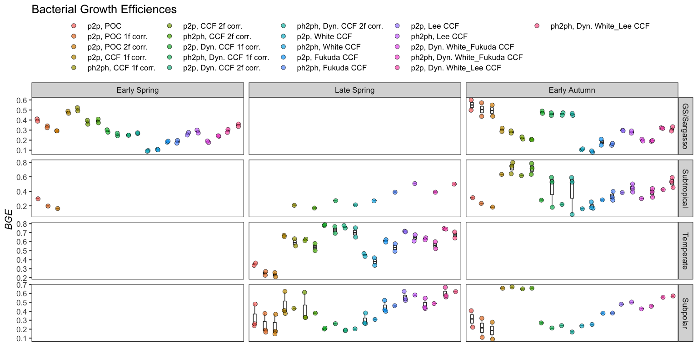

# Tidy and Wrangle Merged Data

## Condense DOC Data

Because DOC and TOC samples are essentially the same in this dataset, we
will treat them as such. We’ll use the DOC samples from AT34 and the
parallel TOC samples from AT38 and AT39.

``` r
tidy_merge <- merge %>% 
  mutate(ptoc = ifelse(Cruise == "AT34", doc, ptoc),
         sd_ptoc = ifelse(Cruise == "AT34", sd_doc, sd_ptoc),
         ptoc_from_t0 = ifelse(Cruise == "AT34", doc_from_t0, ptoc_from_t0)) %>% 
  select(-c(p_cells, sd_p_cells, doc, sd_doc, doc_from_t0)) %>% 
  rename(doc = ptoc,
         sd_doc = sd_ptoc,
         doc_from_t0 = ptoc_from_t0) %>% 
  group_by(Cruise, Station, Depth, Treatment, Bottle) %>% 
  mutate(s.timepoint = ifelse(s.timepoint == Timepoint, Hours, NA)) %>% 
  fill(s.timepoint, .direction = "downup") %>% 
  rename(s.gf75 = s.timepoint) %>% 
  select(-Timepoint) %>% 
  # merge duplicate stationary timepoints
  group_by(Cruise, Station, Depth, Treatment, Bottle, Hours) %>%
  fill(cells:doc_from_t0, i.poc.cf1:ccf.lee, .direction = "downup") %>% 
  distinct() %>% 
  ungroup() %>% 
  group_by(Cruise, Station, Depth, Treatment, Bottle) 


tidy_merge_keys <- tidy_merge %>% 
  group_keys() %>%
  mutate(key = paste(Cruise, ", S", Station, ", Z =", Depth, ",", Treatment, ",", Bottle))
tidy_merge_header <- tidy_merge_keys$key

tidy_merge_list <- tidy_merge %>%
  group_split()
names(tidy_merge_list) <- tidy_merge_header
```

``` r
two_newrow.func <- function(morty){
   morty[nrow(morty) + 1,] <- NA
   morty$Days[is.na(morty$Days)] <- 7
  rick <- morty %>% 
    fill(., Season:facet_bottle, stationary:s.gf75, .direction = c("updown")) 
  
   rick[nrow(rick) + 1,] <- NA
  rick$Days[is.na(rick$Days)] <- 30
  summer <- rick %>% 
    fill(., Season:facet_bottle, stationary:s.gf75, .direction = c("updown")) 
}

add_tidy_merge <- lapply(tidy_merge_list, two_newrow.func) %>% 
  plyr::ldply(., as.data.frame) %>% 
  select(-.id) %>% 
  arrange(Cruise, Station, Depth, Treatment, Bottle, Days) %>% 
  group_by(Cruise, Station, Depth, Treatment, Bottle, Days) %>%
  fill(Hours, gf75.flag, cells:doc_from_t0, i.poc.cf1:ccf.lee, .direction = "downup") %>% 
  distinct() %>% 
  ungroup() %>% 
  mutate(Hours = ifelse(Days == 30, 720, Hours ),
         Hours = ifelse(Days == 7, 168, Hours )) %>% 
  group_by(Cruise, Station, Depth, Treatment, Bottle)  

add_tidy_merge_keys <- add_tidy_merge %>% 
  group_keys() %>%
  mutate(key = paste(Cruise, ", S", Station, ", Z =", Depth, ",", Treatment, ",", Bottle))
add_tidy_merge_header <- add_tidy_merge_keys$key

add_tidy_merge_list <- add_tidy_merge %>%
  group_split()
names(add_tidy_merge_list) <- add_tidy_merge_header
```

## Interpolate Stationary Timepoint

``` r
interp.func <- function(x) {
  y <- zoo(x, order.by = x$Hours)
  interp_cells <- round(as.numeric(na.approx(y$cells, na.rm = F)))
  interp_doc <- round(as.numeric(na.approx(y$doc, na.rm = F)), 1)
  z <- cbind(y, interp_cells,  interp_doc)
  as_tibble(z)
}

interp_st <- lapply(add_tidy_merge_list, interp.func) %>% 
  plyr::ldply(., as.data.frame) %>% 
  select(-.id) %>% 
  mutate_at(vars(Depth, Hours:doc_from_t0, i.poc.cf1:interp_doc), as.numeric) %>% 
  select(Season:doc_from_t0, interp_cells, interp_doc, everything())
```

# Calculate Derived Variables

We need to readjust our initial bacterial carbon numbers before
calculating other parameters. Since the initial condition was 1.2-µm
filtrate, the carbon content of that filtrate would be higher than the
30:70 incubation mix at the beginning of the experiment. As a result
we’ll correct the initial carbon number to account for this:
POC<sub>initial</sub> = 0.3(POC~1.2 µm filtrate~)

We’ll calculate and define:

  - Division rates (**r**) between each timepoint (Monod 1949). We
    assume all cells are viable.
  - Duration of lag, log, stationary phases based on calculated division
    rates and timing of stationary determined via GrowthCurver
      - lag phase ends when r \> 0.01 (Yates and Smotzer 2007)
      - we’ve already filtered out the death phases so stationary runs
        from GrowthCurver determined timepoint until cell counts cease
      - we do not determine growth phases where there is no observable
        growth
  - Carrying Capacity (**k**), mean of cell abundance during stationary
  - Exponential growth rate day<sup>-1</sup>
  - Dynamic CCFs: we use a weighted function to determine the CCF from
    the initial condition to the beginning of stationary, end members
    which we have measured (this really only affects BGEs calculated
    using AUC:
      - CCF<sub>t</sub> = CCF<sub>initial</sub> +
        w(CCF<sub>stationary</sub> - CCF<sub>initial</sub>), where w =
        cells<sub>t</sub> / cells<sub>st</sub>
      - for this to work, we normalize the cell counts to those at
        stationary
  - Cell carbon in µmol C L<sup>-1</sup>, using the dynamic CCFS
  - Bacterial growth efficiencies (BGE) using multiple approaches, only
    where ∆DOC is resolvable:
      - point-to-point (**BGE\_p**), ∆BC and ∆DOC from T0 to stationary
      - phase-to-phase (**BGE\_ph**), ∆BC and ∆DOC using means of lag
        phase and stationary phase values

<!-- end list -->

``` r
interp_st %>% 
  select(Cruise, Station, Depth, Treatment, Bottle, stationary, s.gf75) %>% 
  unique() %>% 
  filter(s.gf75 < stationary) 
```

    ##   Cruise Station Depth Treatment Bottle stationary s.gf75
    ## 1   AT34       3   200   Control      C        289    288
    ## 2   AT34       3   200   Control      D        555    288
    ## 3   AT38       1    10    SynExd      J        171    120
    ## 4   AT38       1   200   Control      E        390    240
    ## 5   AT38       1   200   Control      F        379    240
    ## 6   AT38       3    10   Control      A        121    120
    ## 7   AT38       6    10   Control      B        196    192
    ## 8   AT39       4    10   Control      A        273    216
    ## 9   AT39       4    10   Control      B        262    216

There are a few cases where the onset of stationary predicted by the
GrowthCurver model occurs later than the time of sampling (n = 9 of 78).

``` r
calcs <- interp_st %>%
  mutate_at(vars( i.poc.cf1:i.pon.c.um), funs(.*0.3)) %>% 
  group_by(Cruise, Station, Depth, Treatment, Bottle) %>% 
  #division rates 
  mutate(r = round((log(interp_cells) - lag(log(interp_cells)))/(Hours - lag(Hours)), 2),
         r = ifelse(Hours == 0, 0, r)) %>% 
  #cell growth phase
  mutate(cell_div = ifelse(Hours >= stationary & !is.na(interp_cells), "stationary", NA),
         cell_div = ifelse(Hours > stationary & is.na(cell_div), "out of bounds", cell_div),
         cell_div = ifelse(Hours < stationary & r > 0.01, "exponential", cell_div)) %>% 
  fill(cell_div, .direction = "down") %>% 
  mutate(cell_div = ifelse(Hours < stationary & r == 0 & is.na(cell_div), "lag", cell_div)) %>% 
  fill(cell_div, .direction = "down") %>% 
  mutate(growth = ifelse(cell_div == "stationary" | cell_div == "exponential", cell_div, NA)) %>%
  fill(growth, .direction = "downup") %>% 
  mutate(growth = ifelse(growth == "stationary" | growth == "exponential", T, F),
         growth = ifelse(is.na(growth), F, growth),
         cell_div = ifelse(growth == F, "no growth", cell_div)) %>% 
  fill(growth, .direction = "downup") %>% 
  fill(interp_cells, .direction = "down") %>% 
  mutate(interp_cells = ifelse(Days > 24, NA, interp_cells)) %>% 
  # carrying capacity
  mutate(k = ifelse(cell_div == "stationary", interp_cells, NA),
         k = ifelse(!is.na(k), mean(k, na.rm = T), NA)) %>% 
  #exponential growth rate
  mutate(end_lag_t = ifelse(cell_div == "lag", Hours, NA),
         end_lag_t = ifelse(!is.na(end_lag_t), max(end_lag_t, na.rm = T), NA),
         end_lag_cells = ifelse(Hours == end_lag_t, interp_cells, NA),
         beg_stat_cells = ifelse(Hours == stationary, interp_cells, NA)) %>% 
  fill(k:beg_stat_cells, .direction = "downup") %>% 
  mutate(mew = ifelse(!is.na(end_lag_cells), ((log(beg_stat_cells) - log(end_lag_cells))/(stationary - end_lag_t)) * 24, NA )) %>% 
  #weighted CCFs, raw POC BC, and BC based on CCFs
  mutate(i.cells = ifelse(Hours == 0, cells, NA)) %>% 
  fill(i.cells, .direction = "updown") %>% 
  mutate(delta_cells = interp_cells - i.cells,
         s.delta_cells = ifelse(Hours == stationary & stationary != 0 & growth == T, delta_cells, NA)) %>% 
  fill(s.delta_cells, .direction = "updown") %>% 
  mutate(norm_cells = ifelse(!is.na(s.delta_cells), round(delta_cells/s.delta_cells,2), NA)) %>% 
  rename(weight = norm_cells) %>% 
  mutate(dyn.ccf.c1 = round(i.ccf.c1 + (weight * (s.ccf.c1 - i.ccf.c1)),1),
         dyn.ccf.c2 = round(i.ccf.c2 + (weight * (s.ccf.c2 - i.ccf.c2)),1),
         dyn.ccf.c3 = round(i.ccf.c3 + (weight * (s.ccf.c3 - i.ccf.c3)),1),
         dyn.ccf.white_fukuda = round(ccf.white + (weight * (ccf.fukuda - ccf.white)),1),
         dyn.ccf.white_lee = round(ccf.white + (weight * (ccf.lee - ccf.white)),1),
         i.bc.ccf.c1 =  ifelse(cell_div %in% c("lag", "exponential", "stationary"), round((interp_cells * i.ccf.c1) / (12*10^9), 1), NA), 
         i.bc.ccf.c2 =  ifelse(cell_div %in% c("lag", "exponential", "stationary"), round((interp_cells * i.ccf.c2) / (12*10^9), 1), NA), 
         i.bc.ccf.c3 =  ifelse(cell_div %in% c("lag", "exponential", "stationary"), round((interp_cells * i.ccf.c3) / (12*10^9), 1), NA), 
         s.bc.ccf.c1 =  ifelse(cell_div %in% c("lag", "exponential", "stationary"), round((interp_cells * s.ccf.c1) / (12*10^9), 1), NA), 
         s.bc.ccf.c2 =  ifelse(cell_div %in% c("lag", "exponential", "stationary"), round((interp_cells * s.ccf.c2) / (12*10^9), 1), NA), 
         s.bc.ccf.c3 =  ifelse(cell_div %in% c("lag", "exponential", "stationary"), round((interp_cells * s.ccf.c3) / (12*10^9), 1), NA), 
         bc.dyn.ccf.c1 =  ifelse(cell_div %in% c("lag", "exponential", "stationary"), round((interp_cells * dyn.ccf.c1) / (12*10^9), 1), NA),
         bc.dyn.ccf.c2 =  ifelse(cell_div %in% c("lag", "exponential", "stationary"), round((interp_cells * dyn.ccf.c2) / (12*10^9), 1), NA), 
         bc.dyn.ccf.c3 =  ifelse(cell_div %in% c("lag", "exponential", "stationary"), round((interp_cells * dyn.ccf.c3) / (12*10^9), 1), NA), 
         bc.ccf.white =  ifelse(cell_div %in% c("lag", "exponential", "stationary"), round((interp_cells * ccf.white) / (12*10^9), 1), NA), 
         bc.ccf.fukuda =  ifelse(cell_div %in% c("lag", "exponential", "stationary"), round((interp_cells * ccf.fukuda) / (12*10^9), 1), NA), 
         bc.ccf.lee =  ifelse(cell_div %in% c("lag", "exponential", "stationary"), round((interp_cells * ccf.lee) / (12*10^9), 1), NA), 
         bc.dyn.ccf.white_fukuda =  ifelse(cell_div %in% c("lag", "exponential", "stationary"), round((interp_cells * dyn.ccf.white_fukuda) / (12*10^9), 1), NA), 
         bc.dyn.ccf.white_lee =  ifelse(cell_div %in% c("lag", "exponential", "stationary"), round((interp_cells * dyn.ccf.white_lee) / (12*10^9), 1), NA)) %>% 
  ungroup() %>% 
  group_by(Cruise, Station, Depth, Treatment, Bottle, cell_div) %>% 
  mutate(ph.i.bc.ccf.c1 = ifelse(!cell_div %in% c("no growth", "out of bounds"), round(mean(i.bc.ccf.c1, na.rm = T), 1), NA),
         ph.i.bc.ccf.c2 = ifelse(!cell_div %in% c("no growth", "out of bounds"), round(mean(i.bc.ccf.c2, na.rm = T), 1), NA),
         ph.i.bc.ccf.c3 = ifelse(!cell_div %in% c("no growth", "out of bounds"), round(mean(i.bc.ccf.c3, na.rm = T), 1), NA),
         ph.s.bc.ccf.c1 = ifelse(!cell_div %in% c("no growth", "out of bounds"), round(mean(s.bc.ccf.c1, na.rm = T), 1), NA),
         ph.s.bc.ccf.c2 = ifelse(!cell_div %in% c("no growth", "out of bounds"), round(mean(s.bc.ccf.c2, na.rm = T), 1), NA),
         ph.s.bc.ccf.c3 = ifelse(!cell_div %in% c("no growth", "out of bounds"), round(mean(s.bc.ccf.c3, na.rm = T), 1), NA),
         ph.bc.dyn.ccf.c1 = ifelse(!cell_div %in% c("no growth", "out of bounds"), round(mean(bc.dyn.ccf.c1, na.rm = T), 1), NA),
         ph.bc.dyn.ccf.c2 = ifelse(!cell_div %in% c("no growth", "out of bounds"), round(mean(bc.dyn.ccf.c2, na.rm = T), 1), NA),
         ph.bc.dyn.ccf.c3 = ifelse(!cell_div %in% c("no growth", "out of bounds"), round(mean(bc.dyn.ccf.c3, na.rm = T), 1), NA),
         ph.bc.ccf.white = ifelse(!cell_div %in% c("no growth", "out of bounds"), round(mean(bc.ccf.white, na.rm = T), 1), NA),
         ph.bc.ccf.fukuda = ifelse(!cell_div %in% c("no growth", "out of bounds"), round(mean( bc.ccf.fukuda, na.rm = T), 1), NA),
         ph.bc.ccf.lee = ifelse(!cell_div %in% c("no growth", "out of bounds"), round(mean(bc.ccf.lee, na.rm = T), 1), NA),
         ph.bc.dyn.ccf.white_fukuda =  ifelse(!cell_div %in% c("no growth", "out of bounds"), round(mean(bc.dyn.ccf.white_fukuda, na.rm = T), 1), NA),
         ph.bc.dyn.ccf.white_lee = ifelse(!cell_div %in% c("no growth", "out of bounds"), round(mean(bc.dyn.ccf.white_lee, na.rm = T), 1), NA),
         ph.doc = ifelse(!cell_div %in% c("no growth", "out of bounds"), round(mean(interp_doc, na.rm = T), 1), NA)
         ) %>% 
  ungroup() %>% 
  group_by(Cruise, Station, Depth, Treatment, Bottle) %>% 
  fill(ph.i.bc.ccf.c1:ph.doc, .direction = "down") %>%
  mutate(del.bc.poc = s.poc.um - i.poc.um,
         del.bc.poc.c1 = s.poc.c1.um - i.poc.c1.um,
         del.bc.poc.c2 = s.poc.c2.um - i.poc.c2.um,
         del.bc.poc.c3 = s.poc.c3.um - i.poc.c3.um,
         del.bc.p.ccf.c1 = ifelse(Hours == stationary, s.bc.ccf.c1, NA) - first(i.bc.ccf.c1),
         del.bc.p.ccf.c2 = ifelse(Hours == stationary, s.bc.ccf.c2, NA) - first(i.bc.ccf.c2),
         del.bc.p.ccf.c3 = ifelse(Hours == stationary, s.bc.ccf.c3, NA) - first(i.bc.ccf.c3),
         del.bc.p.dyn.ccf.c1 = ifelse(Hours == stationary, bc.dyn.ccf.c1, NA) - first(bc.dyn.ccf.c1),
         del.bc.p.dyn.ccf.c2 = ifelse(Hours == stationary, bc.dyn.ccf.c2, NA) - first(bc.dyn.ccf.c2),
         del.bc.p.dyn.ccf.c3 = ifelse(Hours == stationary, bc.dyn.ccf.c3, NA) - first(bc.dyn.ccf.c3),
         del.bc.p.ccf.white = ifelse(Hours == stationary, bc.ccf.white, NA) - first(bc.ccf.white),
         del.bc.p.ccf.fukuda = ifelse(Hours == stationary, bc.ccf.fukuda, NA) - first(bc.ccf.fukuda),
         del.bc.p.ccf.lee = ifelse(Hours == stationary, bc.ccf.lee, NA) - first(bc.ccf.lee),
         del.bc.p.dyn.ccf.white_fukuda = ifelse(Hours == stationary, bc.dyn.ccf.white_fukuda, NA) - first(bc.dyn.ccf.white_fukuda),
         del.bc.p.dyn.ccf.white_lee = ifelse(Hours == stationary, bc.dyn.ccf.white_lee, NA) - first(bc.dyn.ccf.white_lee),
         
         
         del.bc.ph.ccf.c1 = ifelse(Hours == stationary, ph.s.bc.ccf.c1, NA) - first(ph.i.bc.ccf.c1),
         del.bc.ph.ccf.c2 = ifelse(Hours == stationary, ph.s.bc.ccf.c2, NA) - first(ph.i.bc.ccf.c2),
         del.bc.ph.ccf.c3 = ifelse(Hours == stationary, ph.s.bc.ccf.c3, NA) - first(ph.i.bc.ccf.c3),
         del.bc.ph.dyn.ccf.c1 = ifelse(Hours == stationary, ph.bc.dyn.ccf.c1, NA) - first(ph.bc.dyn.ccf.c1),
         del.bc.ph.dyn.ccf.c2 = ifelse(Hours == stationary, ph.bc.dyn.ccf.c2, NA) - first(ph.bc.dyn.ccf.c2),
         del.bc.ph.dyn.ccf.c3 = ifelse(Hours == stationary, ph.bc.dyn.ccf.c3, NA) - first(ph.bc.dyn.ccf.c3),
         del.bc.ph.ccf.white = ifelse(Hours == stationary, ph.bc.ccf.white, NA) - first(ph.bc.ccf.white),
         del.bc.ph.ccf.fukuda = ifelse(Hours == stationary, ph.bc.ccf.fukuda, NA) - first(ph.bc.ccf.fukuda),
         del.bc.ph.ccf.lee = ifelse(Hours == stationary, ph.bc.ccf.lee, NA) - first(ph.bc.ccf.lee),
         del.bc.ph.dyn.ccf.white_fukuda = ifelse(Hours == stationary, ph.bc.dyn.ccf.white_fukuda, NA) - first(ph.bc.dyn.ccf.white_fukuda),
         del.bc.ph.dyn.ccf.white_lee = ifelse(Hours == stationary, ph.bc.dyn.ccf.white_lee, NA) - first(ph.bc.dyn.ccf.white_lee),
         del.ph.doc = first(ph.doc) - last(ph.doc),
         del.doc = first(doc) - ifelse(Hours == stationary, interp_doc, NA),
         ) %>% 
  fill(del.bc.p.ccf.c1:del.doc, .direction = "downup") %>% 
  mutate(del.ph.doc.flag = ifelse(del.ph.doc >= 1.5, "Acceptable", "NR"),
         del.doc.flag = ifelse(del.doc >= 1.5, "Acceptable", "NR"),
         bge.bc.poc = ifelse(del.doc.flag != "NR", del.bc.poc/(del.doc + del.bc.poc), NA),
         bge.bc.poc.c1 = ifelse(del.doc.flag != "NR", del.bc.poc.c1/(del.doc + del.bc.poc.c1), NA),
         bge.bc.poc.c2 = ifelse(del.doc.flag != "NR", del.bc.poc.c2/(del.doc + del.bc.poc.c2), NA),
         bge.bc.poc.c3 = ifelse(del.doc.flag != "NR", del.bc.poc.c3/(del.doc + del.bc.poc.c3), NA),
         bge.p.bc.ccf.c1 = ifelse(del.doc.flag != "NR", del.bc.p.ccf.c1/(del.doc + del.bc.p.ccf.c1), NA),
         bge.p.bc.ccf.c2 = ifelse(del.doc.flag != "NR", del.bc.p.ccf.c2/(del.doc + del.bc.p.ccf.c2), NA),
         bge.p.bc.ccf.c3 = ifelse(del.doc.flag != "NR", del.bc.p.ccf.c3/(del.doc + del.bc.p.ccf.c3), NA),
         bge.p.bc.dyn.ccf.c1 = ifelse(del.doc.flag != "NR", del.bc.p.dyn.ccf.c1/(del.doc + del.bc.p.dyn.ccf.c1), NA),
         bge.p.bc.dyn.ccf.c2 = ifelse(del.doc.flag != "NR", del.bc.p.dyn.ccf.c2/(del.doc + del.bc.p.dyn.ccf.c2), NA),
         bge.p.bc.dyn.ccf.c3 = ifelse(del.doc.flag != "NR", del.bc.p.dyn.ccf.c3/(del.doc + del.bc.p.dyn.ccf.c3), NA),
         bge.p.bc.ccf.white = ifelse(del.doc.flag != "NR", del.bc.p.ccf.white/(del.doc + del.bc.p.ccf.white), NA),
         bge.p.bc.ccf.fukuda = ifelse(del.doc.flag != "NR", del.bc.p.ccf.fukuda/(del.doc +  del.bc.p.ccf.fukuda), NA),
         bge.p.bc.ccf.lee = ifelse(del.doc.flag != "NR", del.bc.p.ccf.lee/(del.doc + del.bc.p.ccf.lee), NA),
         bge.p.bc.dyn.ccf.white_fukuda = ifelse(del.doc.flag != "NR", del.bc.p.dyn.ccf.white_fukuda/(del.doc + del.bc.p.dyn.ccf.white_fukuda), NA),
         bge.p.bc.dyn.ccf.white_lee = ifelse(del.doc.flag != "NR", del.bc.p.dyn.ccf.white_lee/(del.doc + del.bc.p.dyn.ccf.white_lee), NA),
         
         bge.ph.bc.ccf.c1 = ifelse(del.ph.doc.flag != "NR", del.bc.ph.ccf.c1/(del.ph.doc + del.bc.ph.ccf.c1), NA),
         bge.ph.bc.ccf.c2 = ifelse(del.ph.doc.flag != "NR", del.bc.ph.ccf.c2/(del.ph.doc + del.bc.ph.ccf.c2), NA),
         bge.ph.bc.ccf.c3 = ifelse(del.ph.doc.flag != "NR", del.bc.ph.ccf.c3/(del.ph.doc + del.bc.ph.ccf.c3), NA),
         bge.ph.bc.dyn.ccf.c1 = ifelse(del.ph.doc.flag != "NR", del.bc.ph.dyn.ccf.c1/(del.ph.doc + del.bc.ph.dyn.ccf.c1), NA),
         bge.ph.bc.dyn.ccf.c2 = ifelse(del.ph.doc.flag != "NR", del.bc.ph.dyn.ccf.c2/(del.ph.doc + del.bc.ph.dyn.ccf.c2), NA),
         bge.ph.bc.dyn.ccf.c3 = ifelse(del.ph.doc.flag != "NR", del.bc.ph.dyn.ccf.c3/(del.ph.doc + del.bc.ph.dyn.ccf.c3), NA),
         bge.ph.bc.ccf.white = ifelse(del.ph.doc.flag != "NR", del.bc.ph.ccf.white/(del.ph.doc + del.bc.ph.ccf.white), NA),
         bge.ph.bc.ccf.fukuda = ifelse(del.ph.doc.flag != "NR", del.bc.ph.ccf.fukuda/(del.ph.doc + del.bc.ph.ccf.fukuda), NA),
         bge.ph.bc.ccf.lee = ifelse(del.ph.doc.flag != "NR", del.bc.ph.ccf.lee/(del.ph.doc + del.bc.ph.ccf.lee), NA),
         bge.ph.bc.dyn.ccf.white_fukuda = ifelse(del.ph.doc.flag != "NR", del.bc.ph.dyn.ccf.white_fukuda/(del.ph.doc + del.bc.ph.dyn.ccf.white_fukuda), NA),
         bge.ph.bc.dyn.ccf.white_lee = ifelse(del.ph.doc.flag != "NR", del.bc.ph.dyn.ccf.white_lee/(del.ph.doc + del.bc.ph.dyn.ccf.white_lee), NA)
         ) %>% 
  ungroup() %>% 
  mutate_at(vars(bge.bc.poc:bge.ph.bc.dyn.ccf.white_lee), round, 2) %>% 
  left_join(., readRDS("~/naames_export_ms/Output/processed_export_n2_n3_n4.rds") %>% 
              mutate(Cruise = gsub("AT39-6", "AT39", Cruise)) %>%
              mutate_at(vars(Station), as.character) %>% 
              select(Cruise:Subregion) %>% 
              distinct()
  )
 
# bge <- calcs %>%
#   group_by(Cruise, Station, Depth, Treatment, Bottle) %>%
#   filter(full_curve == T) %>% 
#   drop_na(interp_doc_from_t0, ccf_bc_from_t0) %>% 
#   mutate(auc_bc = round(integrateTrapezoid(Hours, ccf_bc_from_t0, type = "A"), 1),
#          auc_doc = round(integrateTrapezoid(Hours, interp_doc_from_t0, type = "A"), 1),
#          bge_ac = round(auc_bc/auc_doc, 2),
#          bge_ac = ifelse(ddoc_resolve_p == F, NA, bge_ac)) %>% 
#   select(Cruise, Station, Depth, Treatment, Bottle, auc_bc:bge_ac) %>%  
#   distinct() %>% 
#   drop_na() %>% 
#   left_join(calcs, .) %>% 
#   ungroup() 
```

``` r
bge_summary <- calcs %>% 
  select(Season:Station, ave_lat:Subregion, Depth:facet_bottle, stationary:s.gf75, gf75.flag, del.doc, del.doc.flag, del.ph.doc, del.ph.doc.flag, del.bc.poc:del.bc.ph.dyn.ccf.white_lee, bge.bc.poc:bge.ph.bc.dyn.ccf.white_lee, i.cn:i.cn.c3, s.cn:s.cn.c3) %>% 
  distinct() %>% 
  mutate(type = ifelse(Treatment == "Control", "Control", "Non-Control"),
         degree_bin = ifelse(Station %in% c("S2RD", "S2RF"), 39, degree_bin),
         Subregion = ifelse(Station %in% c("S2RD", "S2RF"), "GS/Sargasso", Subregion)) %>% 
  select(Season:Treatment, type, everything()) %>% 
  arrange(Cruise, Station, Depth, Treatment, Bottle) %>% 
  #remove outliers
  filter(!Cruise == "AT38" | !Station == 1 | !Depth == 10 | !Treatment == "Control",
         !Cruise == "AT39" | !Station == 1 | !Depth == 10 | !Treatment == "Control") %>% 
   filter(!Station == "U", Depth == 10)
```

``` r
bge_summary %>% 
  select(Season:Bottle, contains("bge")) %>% 
  group_by(Season, type) %>% 
  gather(appr, bge, contains("bge")) %>% 
  drop_na(bge) %>% 
  group_by(Cruise, type, appr) %>% 
  mutate(ave_bge = mean(bge),
         sd_bge = sd(bge),
         min_bge = min(bge),
         max_bge = max(bge),
         med_bge = median(bge)) %>% 
  add_tally() %>% 
  ungroup() %>% 
  select(Season, type,  appr, ave_bge:med_bge, n) %>% 
  distinct() %>% 
  arrange(type, Season) %>% 
  mutate_at(vars(ave_bge:med_bge), round, 2) %>% 
  filter(!appr %in% c("bge.p.bc.dyn.ccf.c1", "bge.p.bc.dyn.ccf.c2", "bge.p.bc.dyn.ccf.c3", "bge.ph.bc.dyn.ccf.c1", "bge.ph.bc.dyn.ccf.c2", "bge.ph.bc.dyn.ccf.c3")) 
```

    ## # A tibble: 112 x 9
    ##    Season     type    appr          ave_bge sd_bge min_bge max_bge med_bge     n
    ##    <chr>      <chr>   <chr>           <dbl>  <dbl>   <dbl>   <dbl>   <dbl> <int>
    ##  1 Early Aut… Control bge.bc.poc       0.31   0.1     0.22    0.41    0.31     3
    ##  2 Early Aut… Control bge.bc.poc.c1    0.22   0.09    0.13    0.31    0.23     3
    ##  3 Early Aut… Control bge.bc.poc.c2    0.22   0.11    0.11    0.32    0.23     3
    ##  4 Early Aut… Control bge.bc.poc.c3    0.18   0.1     0.08    0.27    0.18     3
    ##  5 Early Aut… Control bge.p.bc.ccf…    0.22   0.08    0.12    0.28    0.27     6
    ##  6 Early Aut… Control bge.p.bc.ccf…    0.21   0.1     0.09    0.28    0.27     6
    ##  7 Early Aut… Control bge.p.bc.ccf…    0.18   0.07    0.09    0.24    0.22     6
    ##  8 Early Aut… Control bge.p.bc.ccf…    0.21   0.04    0.16    0.24    0.22     6
    ##  9 Early Aut… Control bge.p.bc.ccf…    0.34   0.05    0.28    0.38    0.36     6
    ## 10 Early Aut… Control bge.p.bc.ccf…    0.44   0.05    0.38    0.48    0.47     6
    ## # … with 102 more rows

## ∆POC

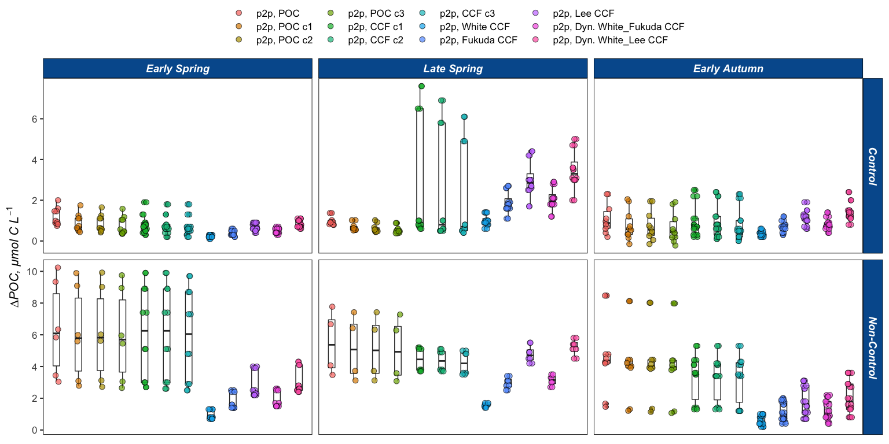

## ∆TOC

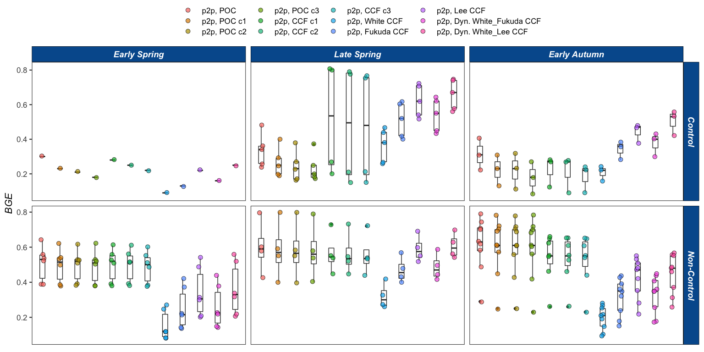

## BGEs

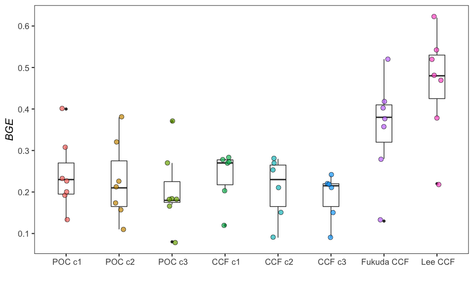

## Overall BGEs

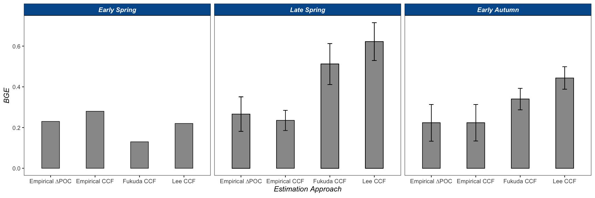

``` r
bge_summary %>%
  select(Season:Bottle, i.cn:i.cn.c3, s.cn:s.cn.c3, gf75.flag, del.doc.flag, del.ph.doc.flag, contains("bge")) %>% 
  distinct() %>% 
  gather(key, bge, contains("bge")) %>% 
  drop_na(bge) %>% 
   mutate(appr = key,
         appr = ifelse(appr == "bge.bc.poc", "p2p, POC", appr),
         appr = ifelse(appr == "bge.bc.poc.c1", "p2p, POC c1", appr),
         appr = ifelse(appr == "bge.bc.poc.c2", "p2p, POC c2", appr),
         appr = ifelse(appr == "bge.bc.poc.c3", "p2p, POC c3", appr),
         appr = ifelse(appr == "bge.p.bc.ccf.c1", "p2p, CCF c1", appr),
         appr = ifelse(appr == "bge.p.bc.ccf.c2", "p2p, CCF c2", appr),
         appr = ifelse(appr == "bge.p.bc.ccf.c3", "p2p, CCF c3", appr),
         appr = ifelse(appr == "bge.p.bc.dyn.ccf.c1", "p2p, Dyn. CCF c1", appr),
         appr = ifelse(appr == "bge.p.bc.dyn.ccf.c2", "p2p, Dyn. CCF c2", appr),
         appr = ifelse(appr == "bge.p.bc.dyn.ccf.c3", "p2p, Dyn. CCF c3", appr),
         appr = ifelse(appr == "bge.p.bc.ccf.white", "p2p, White CCF", appr),
         appr = ifelse(appr == "bge.p.bc.ccf.fukuda", "p2p, Fukuda CCF", appr),
         appr = ifelse(appr == "bge.p.bc.ccf.lee", "p2p, Lee CCF", appr),
         appr = ifelse(appr == "bge.p.bc.dyn.ccf.white_fukuda", "p2p, Dyn. White_Fukuda CCF", appr),
         appr = ifelse(appr == "bge.p.bc.dyn.ccf.white_lee", "p2p, Dyn. White_Lee CCF", appr),
         appr = ifelse(appr == "bge.ph.bc.ccf.c1", "ph2ph, CCF c1", appr),
         appr = ifelse(appr == "bge.ph.bc.ccf.c2", "ph2ph, CCF c2", appr),
         appr = ifelse(appr == "bge.ph.bc.ccf.c3", "ph2ph, CCF c3", appr),
         appr = ifelse(appr == "bge.ph.bc.dyn.ccf.c1", "ph2ph, Dyn. CCF c1", appr),
         appr = ifelse(appr == "bge.ph.bc.dyn.ccf.c2", "ph2ph, Dyn. CCF c2", appr),
         appr = ifelse(appr == "bge.ph.bc.dyn.ccf.c3", "ph2ph, Dyn. CCF c3", appr),
         appr = ifelse(appr == "bge.ph.bc.ccf.white", "ph2ph, White CCF", appr),
         appr = ifelse(appr == "bge.ph.bc.ccf.fukuda", "ph2ph, Fukuda CCF", appr),
         appr = ifelse(appr == "bge.ph.bc.ccf.lee", "ph2ph, Lee CCF", appr),
         appr = ifelse(appr == "bge.ph.bc.dyn.ccf.white_fukuda", "ph2ph, Dyn. White_Fukuda CCF", appr),
         appr = ifelse(appr == "bge.ph.bc.dyn.ccf.white_lee", "ph2ph, Dyn. White_Lee CCF", appr),
         p = appr) %>% 
  separate(., p, into = c("points", "ccf"), sep = ", " ) %>% 
  group_by(Cruise, type, appr) %>% 
  ungroup() %>% 
   #remove outliers
  filter(!Cruise == "AT38" | !Station == "1" | !Depth == 10 | !Treatment == "Control",
         !Cruise == "AT39" | !Station == "1" | !Depth == 10 | !Treatment == "Control") %>% 
  filter(type == "Control", !Station == "U", Depth == 10, points == "p2p", !key %in% c("bge.bc.poc", "bge.p.bc.dyn.ccf.c1", "bge.p.bc.dyn.ccf.c2", "bge.p.bc.dyn.ccf.c3", "bge.ph.bc.dyn.ccf.c1", "bge.ph.bc.dyn.ccf.c2", "bge.ph.bc.dyn.ccf.c3", "bge.p.bc.ccf.white",  "bge.p.bc.dyn.ccf.white_fukuda", "bge.p.bc.dyn.ccf.white_lee" )) %>%
  filter(!appr %in% c("p2p, POC c2", "p2p, POC c3", "p2p, CCF c2", "p2p, CCF c3")) %>% 
  filter(!Cruise == "AT34" | !Station == "3" | !ccf %in% c("CCF c1", "CCF c2", "CCF c3") ) %>% 
  mutate(group = "GF75 POC", 
         group = ifelse(ccf %in% c("CCF c1", "CCF c2", "CCF c3"), "NAAMES CCF", group),
         group = ifelse(ccf %in% c("Fukuda CCF", "Lee CCF"), ccf, group) ) %>% 
  select(Season:Bottle, ccf, group, bge) %>% 
  distinct() %>%
  group_by(Cruise, group) %>% 
  mutate(group_bge = mean(bge, na.rm = T),
         sd_group_bge = sd(bge, na.rm = T),
         min_group_bge = min(bge),
         max_group_bge = max(bge),
         med_group_bge = median(bge)) %>% 
  ungroup() %>% 
  group_by(Cruise, ccf) %>% 
  add_tally() %>% 
  mutate(n = paste("n = ", n),
         group2 = ifelse(group %in% c("GF75 POC", "NAAMES CCF"), "NAAMES", group)) %>%
  ungroup() %>% 
  group_by(group2) %>% 
  mutate(group2_global_bge = mean(bge, na.rm = T)) %>% 
  ungroup() %>% 
  group_by(Cruise, group2) %>% 
  mutate(group2_bge = mean(bge, na.rm = T),
         sd_group2_bge = sd(bge, na.rm = T),
         min_group2_bge = min(bge),
         max_group2_bge = max(bge),
         med_group2_bge = median(bge)) %>% 
  ungroup() %>% 
  select(Season, group, group2, group_bge:med_group_bge, n, group2_bge:med_group2_bge, group2_global_bge) %>% 
  distinct() %>% 
  mutate_at(vars(group_bge:med_group_bge, group2_bge:med_group2_bge, group2_global_bge), round, 2) %>%
  arrange(group, factor(Season, levels = levels))
```

    ## # A tibble: 12 x 15
    ##    Season group group2 group_bge sd_group_bge min_group_bge max_group_bge
    ##    <chr>  <chr> <chr>      <dbl>        <dbl>         <dbl>         <dbl>
    ##  1 Early… Fuku… Fukud…      0.13        NA             0.13          0.13
    ##  2 Late … Fuku… Fukud…      0.51         0.1           0.4           0.62
    ##  3 Early… Fuku… Fukud…      0.34         0.05          0.28          0.38
    ##  4 Early… GF75… NAAMES      0.23        NA             0.23          0.23
    ##  5 Late … GF75… NAAMES      0.27         0.09          0.19          0.4 
    ##  6 Early… GF75… NAAMES      0.22         0.09          0.13          0.31
    ##  7 Early… Lee … Lee C…      0.22        NA             0.22          0.22
    ##  8 Late … Lee … Lee C…      0.62         0.09          0.52          0.72
    ##  9 Early… Lee … Lee C…      0.44         0.06          0.38          0.48
    ## 10 Early… NAAM… NAAMES      0.28        NA             0.28          0.28
    ## 11 Late … NAAM… NAAMES      0.24         0.05          0.2           0.27
    ## 12 Early… NAAM… NAAMES      0.22         0.09          0.12          0.28
    ## # … with 8 more variables: med_group_bge <dbl>, n <chr>, group2_bge <dbl>,
    ## #   sd_group2_bge <dbl>, min_group2_bge <dbl>, max_group2_bge <dbl>,
    ## #   med_group2_bge <dbl>, group2_global_bge <dbl>

## Other Parameters

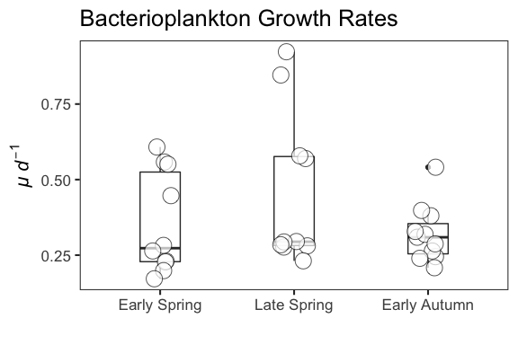

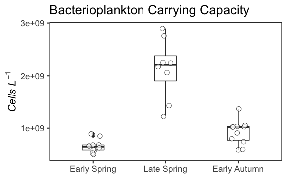

## BCD and NPP

We’ll estimate BCD for each station of all the cruises using bacterial
production and the global average BGE of 22%. Parameters are integrated
to euphotic zone determined by Fox et al 2020. Not that we’ll be
averaging casts taken throughout the day/night.

``` r
#import and wrangle NPP data
#we'll convert NPP from mg C/ m2 / d to umol C/ m2 / d 
npp <- read_xlsx("Input/NPP for Nick.xlsx", sheet = 2) %>% 
  filter(!station %in% c("NA","N4S2RF")) %>% 
  separate(station, into = c("Cruise", "Station"), sep = "S") %>% 
  select(-Cruise) %>% 
  mutate(Cruise = ifelse(Bloom_phase == "Accumulation phase", "AT39", NA),
         Cruise = ifelse(Bloom_phase == "Climax transition", "AT34", Cruise),
         Cruise = ifelse(Bloom_phase == "Equilibrium phase", "AT38", Cruise),
         Cruise = ifelse(Bloom_phase == "Winter transition", "AT32", Cruise)) %>% 
  select(Cruise, Station, Ez, Ez_NPP) %>% 
  mutate(Station = ifelse(Station %in% c("4a", "4b", "4c", "4d"), 4, Station),
         Station = ifelse(Station %in% c("6a", "6b", "6c", "6d", "6e"), 6, Station),
         Station = as.numeric(Station)) %>% 
  group_by(Cruise, Station) %>% 
  mutate(ave_Ez = mean(Ez),
         sd_Ez = sd(Ez),
         Ez_NPP = Ez_NPP * (10^3/12),
         ave_NPP = mean(Ez_NPP),
         sd_NPP = sd(Ez_NPP)) %>%
  ungroup() %>% 
  select(-c(Ez, Ez_NPP)) %>% 
  distinct() %>% 
  mutate_at(vars(ave_Ez:sd_NPP), round)
```

``` r
#import bact data and join with npp data
bact <- read_rds("Input/processed_bf.2.2020.rds") %>% 
  filter(Target_Z %in% c(0, 5, 10, 25, 50, 75, 100, 150, 200, 300, 400, 500, 750, 1000, 1250, 1500 )) %>% 
  select(Cruise:Station, degree_bin, CampCN, Target_Z, BactProd_C, BactProd_C_sd, BactAbund, BactAbund_sd, contains("Influx"), interp_phytodetritus) %>%  
  group_by(Cruise, Station, CampCN, Target_Z) %>% 
  mutate(phyto = interp_Pro_Influx + interp_Syn_Influx + interp_Nano_Influx + interp_Pico_Influx) %>% 
  ungroup() %>% 
  select(-contains("Influx")) %>% 
  mutate(Cruise = gsub("AT39-6", "AT39", Cruise)) %>% 
  mutate(degree_bin = ifelse(Cruise == "AT34" & Station == 4, 48, degree_bin)) %>% 
  mutate_at(vars(BactProd_C:BactProd_C_sd), round, 2) %>% 
  filter(!is.na(BactProd_C) | Target_Z == 0) %>% 
  group_by(Cruise, Station, CampCN) %>% 
  fill(BactProd_C:BactAbund_sd, .direction = "up") %>% 
  drop_na(BactProd_C) %>% 
  rename(Depth = Target_Z,
         bp = BactProd_C, 
         sd_bp = BactProd_C_sd,
         ba = BactAbund,
         sd_ba = BactAbund_sd,
         phytodet = interp_phytodetritus) %>% 
  mutate(max_depth = max(Depth, na.rm = T)) %>% 
  ungroup() %>% 
  select(Cruise:CampCN, max_depth, Depth,  everything()) %>% 
  left_join(., npp) %>% 
  select(Cruise:max_depth, ave_Ez:sd_NPP, everything()) 

#interpolate data for Ez depth
#split the df by CampCN  
add_ez.list <- split(bact, bact$CampCN)

#create a function to add an empty row to each cast, then add the Ez to the Target Z column 
add.func <- function(morty){
  morty[nrow(morty) + 1,] <- NA
  morty$Depth[is.na(morty$Depth)] <- morty$ave_Ez
  rick <- morty %>% 
    fill(., Cruise:sd_NPP, .direction = c("updown")) %>% 
    arrange(CampCN, Depth)
 }

#apply function to list 
added_ez.list <- lapply(add_ez.list, add.func)


#save the list as a data frame 
added_ez.df <- plyr::ldply(added_ez.list, data.frame) %>% 
  drop_na(Depth) %>% 
  select(-.id)  %>% 
  group_by(Cruise, Station, CampCN, Depth) %>% 
  fill(bp:phyto, .direction = "downup") %>% 
  ungroup() %>% 
  distinct()

#split the data frame into lists based on the campaign cast number
to_interpolate.list <- split(added_ez.df, added_ez.df$CampCN)

#create a function that will linearly interpolate each VOI according to the depth intervals of the casts 
interpolate.func <- function(copper) {
to_interpolate.df <- copper %>% 
  select(Depth:ncol(.)) %>% 
  zoo(., order.by = .$Depth) 

interp_bp <- as.numeric(na.approx(to_interpolate.df$bp, na.rm = F))
interp_ba <- as.numeric(na.approx(to_interpolate.df$ba, na.rm = F))
interp_phytodet <- as.numeric(na.approx(to_interpolate.df$phytodet, na.rm = F))
interp_phyto <- as.numeric(na.approx(to_interpolate.df$phyto, na.rm = F))
Depth <- to_interpolate.df$Depth
interpolations.df <- data.frame(Depth, interp_bp, interp_ba, interp_phytodet, interp_phyto)
}

#apply function to list 
interpolations.list <- lapply(to_interpolate.list, interpolate.func)

#save the list as a data frame 
interpolations.df <- plyr::ldply(interpolations.list, data.frame) %>% 
  rename(., CampCN = .id) 

#combine the interpolated and non-interpolated data frames
interpolations.df$CampCN <- as.numeric(interpolations.df$CampCN)
interpolated.df <- right_join(bact, interpolations.df) %>% 
  fill(Cruise:max_depth, .direction = "downup") %>% 
  group_by(Cruise, Station, CampCN) %>% 
  fill(ave_Ez:sd_NPP, .direction = "updown") %>% 
  ungroup() %>% 
  mutate_at(vars(interp_bp), round, 2)

#calculate bcd
bcd <- interpolated.df %>% 
  mutate(cr_bge = ifelse(Cruise == "AT32", 0.22, NA),
         cr_bge = ifelse(Cruise == "AT34", 0.26, cr_bge),
         cr_bge = ifelse(Cruise == "AT38", 0.22, cr_bge),
         cr_bge = ifelse(Cruise == "AT39", 0.26, cr_bge),
         bge = 0.24,
         #bp in nmol C / L / d is equivalent to  µmol C / m3 / d 
         bcd.cr_bge = interp_bp/cr_bge,
         bcd = interp_bp/bge)  %>%
  mutate_at(vars(bcd, bcd.cr_bge), round) %>% 
  group_by(Cruise, Station, Depth) %>% 
  mutate(bcd.stat.cr_bge = mean(bcd.cr_bge, na.rm = T),
         bcd.stat = mean(bcd, na.rm = T),
         #convert to cells / m3
         ba.stat = mean(interp_ba, na.rm = T) * 1000,
         sd_ba.stat = sd(interp_ba, na.rm = T) * 1000,
         bp.stat = mean(interp_bp, na.rm = T),
         sd_bp.stat = sd(interp_bp, na.rm = T),
         phytodet.stat = mean(interp_phytodet, na.rm = T),
         phyto.stat = mean(interp_phyto, na.rm = T)) %>% 
  mutate_at(vars(bcd.stat.cr_bge, bcd.stat), round) %>% 
  ungroup() %>% 
  group_by(Cruise, Subregion, Depth) %>% 
  mutate(ba.cr.sr = mean(interp_ba, na.rm = T) * 1000,
         sd_ba.cr.sr = sd(interp_ba, na.rm = T) * 1000,
         bp.cr.sr = mean(interp_bp, na.rm = T),
         sd_bp.cr.sr = sd(interp_bp, na.rm = T)) %>% 
  ungroup() %>% 
  select(Cruise:degree_bin, ave_Ez:sd_NPP, bge, cr_bge, Depth, contains("stat"), contains("sr")) %>% 
  distinct() 

int_bcd_100 <- bcd %>% 
  group_by(Cruise, Station) %>% 
  filter(Depth <= 100) %>% 
  mutate(int.bcd.cr_bge.100 = integrateTrapezoid(Depth, bcd.stat.cr_bge, type = "A"),
         int.bcd.100 = integrateTrapezoid(Depth, bcd.stat, type = "A"))  %>% 
  mutate_at(vars(contains("int.bcd")), round) %>% 
  # depth normalize 
  mutate_at(vars(int.bcd.cr_bge.100:int.bcd.100), funs(./100)) %>% 
  select(Cruise:degree_bin, int.bcd.cr_bge.100, int.bcd.100) %>% 
  distinct()


int_bcd <- bcd %>% 
  group_by(Cruise, Station) %>% 
  filter(Depth <= ave_Ez) %>% 
  mutate(int.bcd.cr_bge.ez = integrateTrapezoid(Depth, bcd.stat.cr_bge, type = "A"),
         int.bcd.ez = integrateTrapezoid(Depth, bcd.stat, type = "A"),
         int.bp.ez = integrateTrapezoid(Depth, bp.stat, type = "A"),
         sd_int.bp.ez = integrateTrapezoid(Depth, sd_bp.stat, type = "A"),
         int.ba.ez = integrateTrapezoid(Depth, ba.stat, type = "A"),
         sd_int.ba.ez = integrateTrapezoid(Depth, sd_ba.stat, type = "A"),
         int.phyodet.ez = integrateTrapezoid(Depth, phytodet.stat, type = "A"),
         int.phyto.ez = integrateTrapezoid(Depth, phyto.stat, type = "A"))  %>% 
  mutate_at(vars(contains("int.bcd"), contains("bcd.ez_npp")), round) %>% 
  # depth normalize 
  mutate_at(vars(int.bcd.cr_bge.ez:int.phyto.ez), funs(./ave_Ez)) %>% 
  mutate(int.NPP = ave_NPP/ave_Ez,
         sd_int.NPP = sd_NPP/ave_Ez, 
         bcd.ez_npp.cr_bge = int.bcd.cr_bge.ez/int.NPP * 100,
         bcd.ez_npp = int.bcd.ez/int.NPP * 100) %>% 
  select(Cruise:cr_bge, int.bcd.cr_bge.ez:bcd.ez_npp, Depth, contains("stat"), contains("cr.sr")) %>% 
  distinct() %>% 
  ungroup() %>% 
  left_join(., int_bcd_100)
```

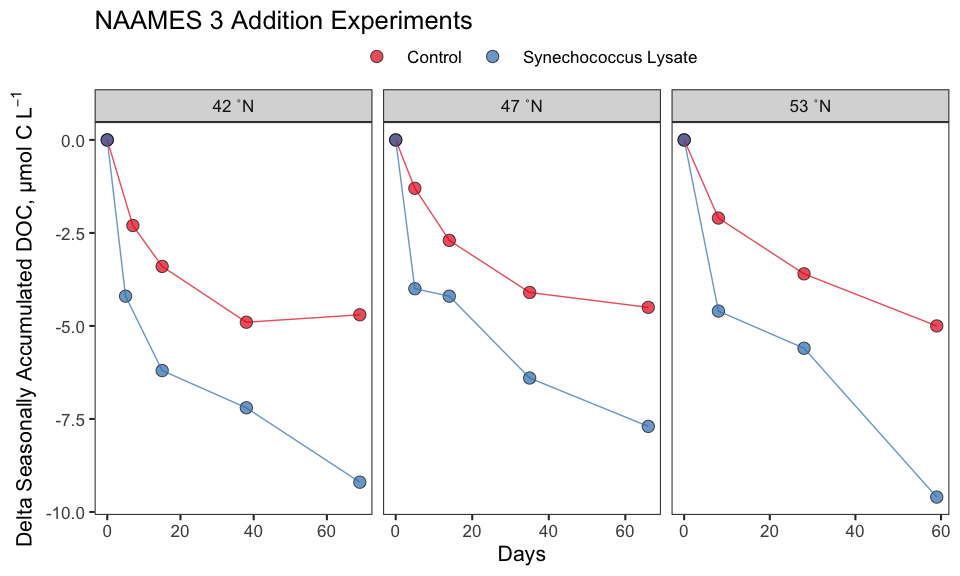

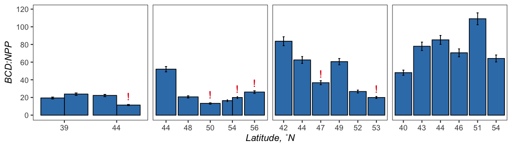

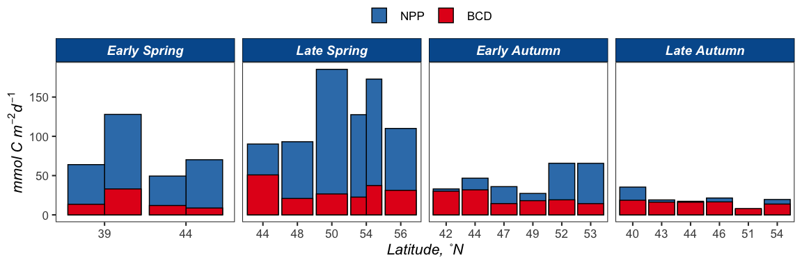

``` r
bcd_table <- int_bcd %>% 
  select(Cruise:Station, degree_bin,  int.bcd.cr_bge.ez, int.bcd.ez) %>% 
  distinct() %>% 
  mutate_at(vars(int.bcd.cr_bge.ez, int.bcd.ez), funs(./1000)) %>% 
  pivot_longer(cols = c(int.bcd.cr_bge.ez, int.bcd.ez), names_to = "var", values_to = "bcd") %>% 
  select(-var) %>% 
  distinct() %>% 
  group_by(Cruise, Season, Subregion, degree_bin, Station) %>% 
  summarise(ave_BCD = round(mean(bcd), 2),
            sd_BCD = round(sd(bcd), 2)) %>% 
  ungroup() %>% 
  left_join(., int_bcd %>% 
              select(Cruise:Station, degree_bin,  ave_Ez, sd_Ez, int.NPP, sd_int.NPP) %>% 
              distinct() %>% 
              mutate_at(vars(contains("NPP")), funs(round(./10^3, 2)))) %>% 
  left_join(., int_bcd %>% 
              select(Cruise:Station, degree_bin,   bcd.ez_npp.cr_bge, bcd.ez_npp) %>% 
              distinct() %>% 
              pivot_longer(cols = c( bcd.ez_npp.cr_bge, bcd.ez_npp), names_to = "var", values_to = "bcd_npp") %>% 
              select(-var) %>% 
              distinct() %>% 
              group_by(Cruise, Season, Subregion, degree_bin, Station) %>% 
              summarise(ave_BCD_NPP = mean(bcd_npp),
                        sd_BCD_NPP = sd(bcd_npp)) %>% 
              ungroup()
            
            ) %>% 
  left_join(., int_bcd %>% 
              select(Cruise:Station, degree_bin, int.bcd.cr_bge.100, int.bcd.100) %>% 
              distinct() %>% 
              pivot_longer(cols = c( int.bcd.cr_bge.100, int.bcd.100), names_to = "var", values_to = "bcd_100") %>% 
              select(-var) %>% 
              distinct() %>% 
              group_by(Cruise, Season, Subregion, degree_bin, Station) %>% 
              summarise(ave_BCD_100 = mean(bcd_100),
                        sd_BCD_100 = sd(bcd_100)) %>% 
              ungroup()
            
            ) %>% 
  arrange(factor(Season, levels = levels)) %>% 
  group_by(Cruise) %>% 
  mutate(Cruise_ave_Ez = mean(ave_Ez),
         Cruise_sd_Ez = sd(ave_Ez),
         Cruise_ave_NPP = mean(int.NPP),
         Cruise_sd_NPP = sd(int.NPP),
         Cruise_ave_BCD = mean(ave_BCD),
         Cruise_sd_BCD = sd(ave_BCD),
         Cruise_ave_BCD_NPP = mean(ave_BCD_NPP),
         Cruise_sd_BCD_NPP = sd(ave_BCD_NPP)
         ) %>% 
  ungroup() %>% 
  group_by(Cruise, Subregion) %>% 
  mutate(Cruise_SR_ave_NPP = mean(int.NPP),
         Cruise_SR_sd_NPP = mean(int.NPP),
         Cruise_SR_ave_BCD = mean(ave_BCD),
         Cruise_SR_sd_BCD = sd(ave_BCD),
         Cruise_SR_ave_BCD_NPP = mean(ave_BCD_NPP),
         Cruise_SR_sd_BCD_NPP = sd(ave_BCD_NPP)
         ) %>% 
  ungroup() %>% 
  mutate_at(vars(contains("BCD_NPP")), round) %>% 
  mutate_at(vars(ave_BCD_100:Cruise_sd_BCD, Cruise_SR_ave_NPP:Cruise_SR_sd_BCD ), round, 2) %>% 
  arrange(factor(Season, levels = levels), factor(Subregion, levels = levels))
```

    ## Joining, by = c("Cruise", "Season", "Subregion", "degree_bin", "Station")
    ## Joining, by = c("Cruise", "Season", "Subregion", "degree_bin", "Station")
    ## Joining, by = c("Cruise", "Season", "Subregion", "degree_bin", "Station")

| Cruise | Season       | Subregion   | degree\_bin | Station | ave\_BCD | sd\_BCD | ave\_Ez | sd\_Ez | int.NPP | sd\_int.NPP | ave\_BCD\_NPP | sd\_BCD\_NPP | ave\_BCD\_100 | sd\_BCD\_100 | Cruise\_ave\_Ez | Cruise\_sd\_Ez | Cruise\_ave\_NPP | Cruise\_sd\_NPP | Cruise\_ave\_BCD | Cruise\_sd\_BCD | Cruise\_ave\_BCD\_NPP | Cruise\_sd\_BCD\_NPP | Cruise\_SR\_ave\_NPP | Cruise\_SR\_sd\_NPP | Cruise\_SR\_ave\_BCD | Cruise\_SR\_sd\_BCD | Cruise\_SR\_ave\_BCD\_NPP | Cruise\_SR\_sd\_BCD\_NPP |
| :----- | :----------- | :---------- | ----------: | ------: | -------: | ------: | ------: | -----: | ------: | ----------: | ------------: | -----------: | ------------: | -----------: | --------------: | -------------: | ---------------: | --------------: | ---------------: | --------------: | --------------------: | -------------------: | -------------------: | ------------------: | -------------------: | ------------------: | ------------------------: | -----------------------: |
| AT39   | Early Spring | GS/Sargasso |          39 |       1 |     0.12 |    0.01 |     106 |     NA |    0.60 |          NA |            19 |            1 |        121.31 |         7.12 |          112.50 |          12.79 |             0.72 |            0.40 |             0.14 |            0.11 |                    19 |                    6 |                 0.96 |                0.96 |                 0.22 |                0.13 |                        22 |                        3 |
| AT39   | Early Spring | GS/Sargasso |          39 |       2 |     0.31 |    0.02 |      98 |     NA |    1.31 |          NA |            24 |            1 |        305.30 |        17.31 |          112.50 |          12.79 |             0.72 |            0.40 |             0.14 |            0.11 |                    19 |                    6 |                 0.96 |                0.96 |                 0.22 |                0.13 |                        22 |                        3 |
| AT39   | Early Spring | Subtropical |          44 |       3 |     0.09 |    0.01 |     120 |     NA |    0.41 |          NA |            22 |            1 |         95.48 |         5.47 |          112.50 |          12.79 |             0.72 |            0.40 |             0.14 |            0.11 |                    19 |                    6 |                 0.48 |                0.48 |                 0.08 |                0.02 |                        17 |                        8 |
| AT39   | Early Spring | Subtropical |          44 |       4 |     0.06 |    0.00 |     126 |     NA |    0.56 |          NA |            11 |            1 |         65.63 |         3.80 |          112.50 |          12.79 |             0.72 |            0.40 |             0.14 |            0.11 |                    19 |                    6 |                 0.48 |                0.48 |                 0.08 |                0.02 |                        17 |                        8 |
| AT34   | Late Spring  | Subtropical |          44 |       5 |     0.52 |    0.03 |      91 |     NA |    0.99 |          NA |            52 |            3 |        475.44 |        26.88 |           79.33 |          23.64 |             1.89 |            1.12 |             0.40 |            0.16 |                    25 |                   14 |                 0.90 |                0.90 |                 0.34 |                0.25 |                        36 |                       22 |
| AT34   | Late Spring  | Subtropical |          48 |       4 |     0.17 |    0.01 |     116 |     33 |    0.80 |        0.08 |            21 |            1 |        173.00 |         9.69 |           79.33 |          23.64 |             1.89 |            1.12 |             0.40 |            0.16 |                    25 |                   14 |                 0.90 |                0.90 |                 0.34 |                0.25 |                        36 |                       22 |
| AT34   | Late Spring  | Temperate   |          50 |       3 |     0.47 |    0.03 |      52 |      1 |    3.56 |        0.32 |            13 |            1 |        319.62 |        17.90 |           79.33 |          23.64 |             1.89 |            1.12 |             0.40 |            0.16 |                    25 |                   14 |                 3.56 |                3.56 |                 0.47 |                  NA |                        13 |                       NA |
| AT34   | Late Spring  | Subpolar    |          54 |       0 |     0.24 |    0.01 |      87 |     NA |    1.47 |          NA |            16 |            1 |        215.05 |        12.18 |           79.33 |          23.64 |             1.89 |            1.12 |             0.40 |            0.16 |                    25 |                   14 |                 1.99 |                1.99 |                 0.41 |                0.18 |                        21 |                        5 |
| AT34   | Late Spring  | Subpolar    |          54 |       2 |     0.59 |    0.03 |      58 |      5 |    2.98 |        0.45 |            20 |            1 |        398.43 |        22.50 |           79.33 |          23.64 |             1.89 |            1.12 |             0.40 |            0.16 |                    25 |                   14 |                 1.99 |                1.99 |                 0.41 |                0.18 |                        21 |                        5 |
| AT34   | Late Spring  | Subpolar    |          56 |       1 |     0.40 |    0.02 |      72 |      1 |    1.53 |        0.24 |            26 |            1 |        347.59 |        19.90 |           79.33 |          23.64 |             1.89 |            1.12 |             0.40 |            0.16 |                    25 |                   14 |                 1.99 |                1.99 |                 0.41 |                0.18 |                        21 |                        5 |
| AT38   | Early Autumn | GS/Sargasso |          42 |       1 |     0.12 |    0.01 |     236 |     11 |    0.14 |        0.03 |            84 |            5 |        249.77 |        15.34 |          179.17 |          47.05 |             0.30 |            0.20 |             0.11 |            0.03 |                    48 |                   24 |                 0.14 |                0.14 |                 0.12 |                  NA |                        84 |                       NA |
| AT38   | Early Autumn | Subtropical |          44 |       2 |     0.14 |    0.01 |     207 |     NA |    0.23 |          NA |            62 |            4 |        259.20 |        16.12 |          179.17 |          47.05 |             0.30 |            0.20 |             0.11 |            0.03 |                    48 |                   24 |                 0.19 |                0.19 |                 0.10 |                0.04 |                        53 |                       14 |
| AT38   | Early Autumn | Subtropical |          47 |       3 |     0.07 |    0.00 |     200 |     NA |    0.18 |          NA |            37 |            2 |        114.43 |         7.04 |          179.17 |          47.05 |             0.30 |            0.20 |             0.11 |            0.03 |                    48 |                   24 |                 0.19 |                0.19 |                 0.10 |                0.04 |                        53 |                       14 |
| AT38   | Early Autumn | Subtropical |          49 |       4 |     0.09 |    0.01 |     174 |     21 |    0.16 |        0.07 |            60 |            4 |        149.90 |         9.12 |          179.17 |          47.05 |             0.30 |            0.20 |             0.11 |            0.03 |                    48 |                   24 |                 0.19 |                0.19 |                 0.10 |                0.04 |                        53 |                       14 |
| AT38   | Early Autumn | Temperate   |          52 |       5 |     0.11 |    0.01 |     157 |     NA |    0.42 |          NA |            27 |            2 |        167.71 |        10.20 |          179.17 |          47.05 |             0.30 |            0.20 |             0.11 |            0.03 |                    48 |                   24 |                 0.42 |                0.42 |                 0.11 |                  NA |                        27 |                       NA |
| AT38   | Early Autumn | Subpolar    |          53 |       6 |     0.13 |    0.01 |     101 |      7 |    0.65 |        0.11 |            20 |            1 |        130.80 |         7.81 |          179.17 |          47.05 |             0.30 |            0.20 |             0.11 |            0.03 |                    48 |                   24 |                 0.65 |                0.65 |                 0.13 |                  NA |                        20 |                       NA |
| AT32   | Late Autumn  | Subtropical |          40 |       7 |     0.15 |    0.01 |     112 |     19 |    0.32 |        0.13 |            48 |            3 |        165.12 |         9.90 |          101.00 |          22.47 |             0.19 |            0.07 |             0.13 |            0.01 |                    76 |                   21 |                 0.21 |                0.21 |                 0.14 |                0.01 |                        70 |                       16 |
| AT32   | Late Autumn  | Subtropical |          43 |       6 |     0.14 |    0.01 |     104 |      1 |    0.18 |        0.01 |            78 |            5 |        146.21 |         8.86 |          101.00 |          22.47 |             0.19 |            0.07 |             0.13 |            0.01 |                    76 |                   21 |                 0.21 |                0.21 |                 0.14 |                0.01 |                        70 |                       16 |
| AT32   | Late Autumn  | Subtropical |          44 |       5 |     0.14 |    0.01 |     103 |     NA |    0.17 |          NA |            85 |            5 |        145.56 |         8.65 |          101.00 |          22.47 |             0.19 |            0.07 |             0.13 |            0.01 |                    76 |                   21 |                 0.21 |                0.21 |                 0.14 |                0.01 |                        70 |                       16 |
| AT32   | Late Autumn  | Subtropical |          46 |       4 |     0.12 |    0.01 |     126 |     NA |    0.17 |          NA |            70 |            4 |        128.39 |         8.08 |          101.00 |          22.47 |             0.19 |            0.07 |             0.13 |            0.01 |                    76 |                   21 |                 0.21 |                0.21 |                 0.14 |                0.01 |                        70 |                       16 |
| AT32   | Late Autumn  | Temperate   |          51 |       3 |     0.12 |    0.01 |      59 |     NA |    0.11 |          NA |           109 |            7 |         89.09 |         5.44 |          101.00 |          22.47 |             0.19 |            0.07 |             0.13 |            0.01 |                    76 |                   21 |                 0.11 |                0.11 |                 0.12 |                  NA |                       109 |                       NA |
| AT32   | Late Autumn  | Subpolar    |          54 |       2 |     0.12 |    0.01 |     102 |      4 |    0.19 |        0.02 |            64 |            4 |        123.40 |         7.50 |          101.00 |          22.47 |             0.19 |            0.07 |             0.13 |            0.01 |                    76 |                   21 |                 0.19 |                0.19 |                 0.12 |                  NA |                        64 |                       NA |

BCD & NPP

    ## RMA was not requested: it will not be computed.

    ## 
    ## Model II regression
    ## 
    ## Call: lmodel2(formula = ave_BCD ~ int.NPP, data = bcd_table, nperm =
    ## 99)
    ## 
    ## n = 22   r = 0.840358   r-square = 0.7062015 
    ## Parametric P-values:   2-tailed = 9.86602e-07    1-tailed = 4.93301e-07 
    ## Angle between the two OLS regression lines = 3.259324 degrees
    ## 
    ## Permutation tests of OLS, MA, RMA slopes: 1-tailed, tail corresponding to sign
    ## A permutation test of r is equivalent to a permutation test of the OLS slope
    ## P-perm for SMA = NA because the SMA slope cannot be tested
    ## 
    ## Regression results
    ##   Method  Intercept     Slope Angle (degrees) P-perm (1-tailed)
    ## 1    OLS 0.09133748 0.1407224        8.010203              0.01
    ## 2     MA 0.09044524 0.1418683        8.074574              0.01
    ## 3    SMA 0.07052227 0.1674554        9.506284                NA
    ## 
    ## Confidence intervals
    ##   Method 2.5%-Intercept 97.5%-Intercept 2.5%-Slope 97.5%-Slope
    ## 1    OLS     0.04091681      0.14175815 0.09838589   0.1830590
    ## 2     MA     0.05698411      0.12351114 0.09940192   0.1848424
    ## 3    SMA     0.03345490      0.09938446 0.13038773   0.2150608
    ## 
    ## Eigenvalues: 0.8677397 0.00687175 
    ## 
    ## H statistic used for computing C.I. of MA: 0.00175052

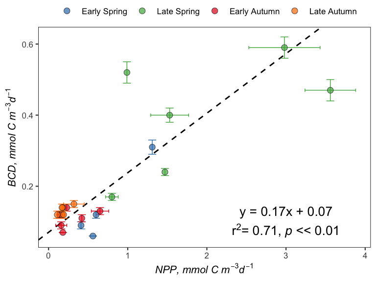

## BA and BP

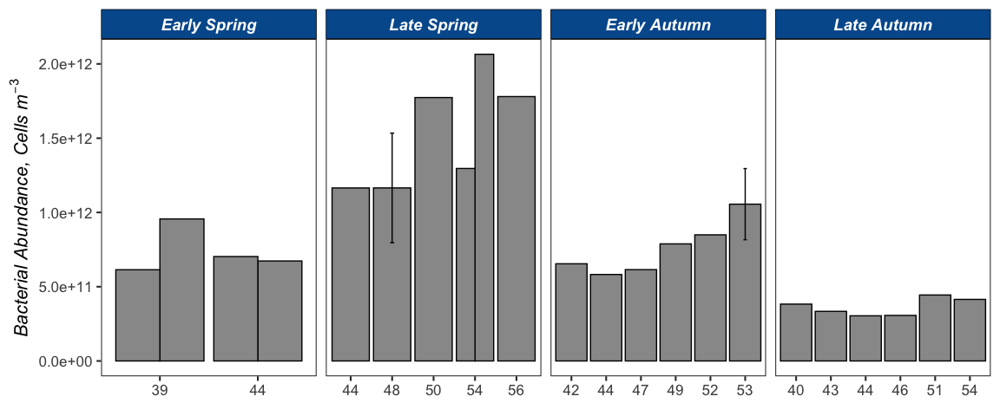

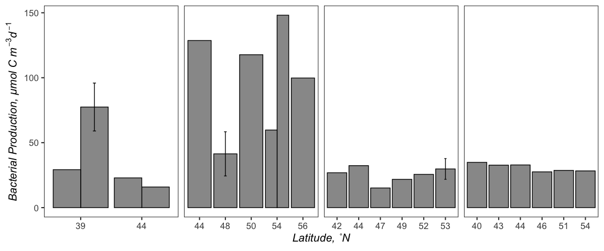


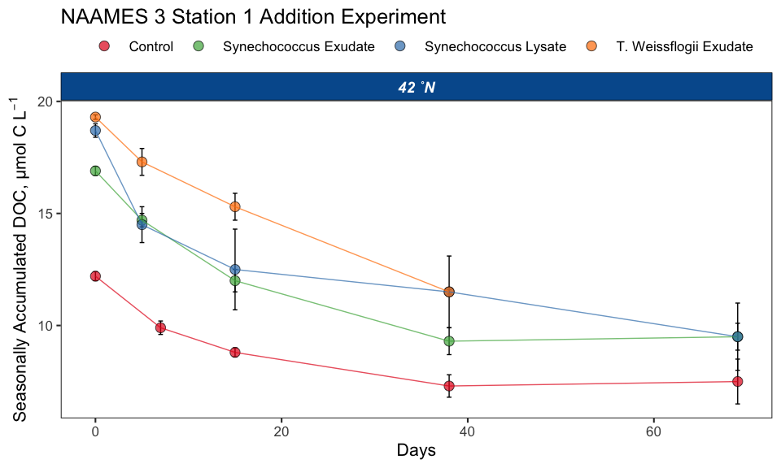

# Merge Data with Export MS Data

Here, we put our experimental data in the context of the results from
the export MS to explore remineralization of the seasonally accumulated
DOC pool:

  - We first calculate treatment averages for each experiment
  - For the surface values at each station, we then subtract the DOC
    concentration of the winter/early springtime deeply mixed condition
    (from the export MS) from the DOC concentrations in the experiments
    conducted at the respective station (**norm\_doc**).
  - We estimate the concentration of the seasonally accumulated DOC pool
    as the difference between the initial DOC concentration in each
    experiment and the DOC concentration of the mixed condition
    (**accm\_doc**)
  - We then estimate the total DOC drawdown for the experiments
    (**bioav\_doc**), the total remaining DOC after
    drawdown(**persis\_doc**), the percent DOC bioavalability and
    persistence (**per\_bioav** and **per\_persis**, respectively)
  - Lastly we calculate the rate of DOC drawdown (nmol C L<sup>-1</sup>
    d<sup>-1</sup>,
**ddoc**)

<!-- end list -->

``` r
export <- readRDS("~/naames_export_ms/Output/processed_export_for_bioavMS.5.14.20.rds") %>% 
  mutate(Cruise = gsub("AT39-6", "AT39", Cruise)) %>% 
  select(Cruise, Season, degree_bin, Subregion, Station, Target_Z, Ez, ave_N, sd_N, ave_PO4, sd_PO4, ave_Pro:sd_Nano, redis_DOC_vol, NCP_mol_100, doc_ncp_100, int_delta_DOC_100, doc_don_100, int_delta_N_100, int_N_100_vol, int_N_ez, int_PO4_100_vol, int_PO4_ez) %>% 
  distinct() %>% 
  mutate_at(vars(redis_DOC_vol, int_N_100_vol, int_PO4_100_vol), round, 1) %>% 
  mutate_at(vars(NCP_mol_100:doc_ncp_100, int_delta_DOC_100, int_delta_N_100, int_N_ez, int_PO4_ez), round, 2) %>%
  mutate_at(vars(doc_don_100), round) %>% 
  mutate_at(vars(Station), as.character) %>% 
  #error associated with the approach in calculating seasonally accumulated DON led to 17%  of total samples (5 of 29) being negative.  As a result these data were removed from further analyses.
  mutate(doc_don_100 = ifelse(doc_don_100 < 0, NA, doc_don_100), 
         total_phyto = ave_Pro + ave_Syn + ave_Pico + ave_Nano)


export_bioav <- left_join(calcs %>% filter(!Station == "U"), export %>% select(-c( Target_Z, ave_N, sd_N, ave_Pro:sd_Nano)) %>%  distinct()) %>% 
  mutate(redis_DOC_vol = ifelse(Station %in% c("S2RD", "S2RF"), 55.0, redis_DOC_vol),
         degree_bin = ifelse(is.na(degree_bin), 39, degree_bin)) %>%  
  group_by(Cruise, Station, Depth, Treatment, Hours) %>% 
  mutate(trt_ave_doc = ifelse(!is.na(interp_doc), round(mean(interp_doc, na.rm = T),1), NA),
         trt_sd_doc = ifelse(!is.na(doc), round(sd(doc, na.rm = T),1), NA)) %>% 
  ungroup() %>% 
  group_by(Cruise, Station, Depth, Treatment) %>% 
  mutate(norm_doc = ifelse(Depth != 200 | Treatment == "MixDS", trt_ave_doc - redis_DOC_vol, NA),
         norm_doc_from_t0 = ifelse(!is.na(norm_doc), first(norm_doc) - norm_doc, NA),
         accm_doc = ifelse(Depth == 10 & Treatment == "Control", first(trt_ave_doc) - redis_DOC_vol, NA),
         total.bioav_accm_doc = ifelse(Depth == 10 & Treatment == "Control" & last(Days) > 30, last(trt_ave_doc) - redis_DOC_vol, NA),
         st.bioav_accm_doc = ifelse(Depth == 10 & Treatment == "Control" & Days == 7, trt_ave_doc - redis_DOC_vol, NA),
         lt.bioav_accm_doc = total.bioav_accm_doc - st.bioav_accm_doc,
         time.total.bioav_accm_doc = ifelse(Depth == 10 & Treatment == "Control" & last(Days) > 30, last(Days), NA),
         time.lt.bioav_accm_doc = time.total.bioav_accm_doc - 7,
         total.bioav_doc = ifelse(Depth == 10 & Treatment == "Control" & last(Days) > 30, first(norm_doc) - last(norm_doc), NA),
         st.bioav_doc = ifelse(Depth == 10 & Treatment == "Control" & Days == 7, first(norm_doc) - norm_doc, NA),
         lt.bioav_doc = total.bioav_doc - st.bioav_doc,
         total.per_bioav = round((total.bioav_doc/accm_doc * 100)),
         st.per_bioav = round((st.bioav_doc/accm_doc * 100)),
         lt.per_bioav = round((lt.bioav_doc/accm_doc * 100)),
         persis_doc = accm_doc - total.bioav_doc,
         per_persis = round((persis_doc/accm_doc * 100)),
         st.ddoc = round((st.bioav_doc/7) * 1000),
         lt.ddoc = round((lt.bioav_doc/time.lt.bioav_accm_doc) * 1000),
         total.ddoc = round((total.bioav_doc/time.total.bioav_accm_doc) * 1000)) %>%   
  ungroup() %>% 
  group_by(Cruise, Station, Depth) %>% 
  fill(accm_doc:lt.ddoc, .direction = "downup") %>% 
  ungroup() %>% 
  select(Season:Station, ave_lat:Subregion, Depth:interp_doc, redis_DOC_vol:lt.ddoc, everything() ) %>% 
  left_join(., bcd %>% mutate_at(vars(Station), as.character)) %>% 
  mutate(Subregion = ifelse(Station %in% c("S2RF", "S2RD"), "GS/Sargasso", Subregion ))
```

## Nitrate

### Surface 100 m

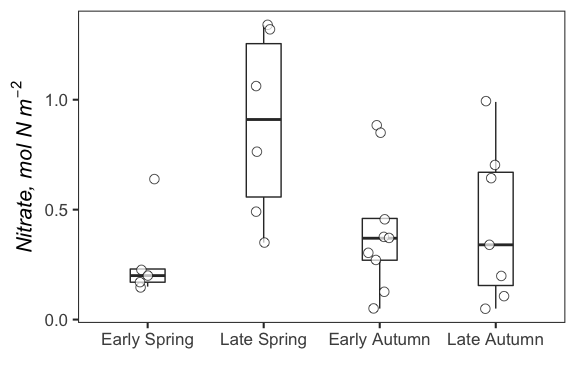

### Euphotic Zone

#### Welch’s one-Way ANOVA test

Alternative to standard one-way ANOVA in the situation where the
homogeneity of variance assumption iss violated

``` r
n_ez <-  export %>%
  select(Season, Ez, int_N_ez) %>% 
  mutate(int_N_ez = ((int_N_ez)/Ez)/10) %>% 
  distinct() %>% 
  drop_na(int_N_ez) 

n_anova <- welch_anova_test(int_N_ez ~ Season, data = n_ez) 
n_anova 
```

    ## # A tibble: 1 x 7
    ##   .y.          n statistic   DFn   DFd     p method     
    ## * <chr>    <int>     <dbl> <dbl> <dbl> <dbl> <chr>      
    ## 1 int_N_ez    29      3.96     3  11.1 0.038 Welch ANOVA

#### Post-hoc analysis

Games-Howell test used to compare all possible combinations of group
differences when the assumption of homogeneity of variances is violated

``` r
n_gh <- games_howell_test(int_N_ez ~ Season, data = n_ez)
n_gh
```

    ## # A tibble: 6 x 8
    ##   .y.      group1      group2     estimate conf.low conf.high p.adj p.adj.signif
    ## * <chr>    <chr>       <chr>         <dbl>    <dbl>     <dbl> <dbl> <chr>       
    ## 1 int_N_ez Early Autu… Early Spr…   -0.353  -0.721     0.0147 0.06  ns          
    ## 2 int_N_ez Early Autu… Late Autu…   -0.224  -0.653     0.204  0.416 ns          
    ## 3 int_N_ez Early Autu… Late Spri…    0.191  -0.428     0.810  0.734 ns          
    ## 4 int_N_ez Early Spri… Late Autu…    0.129  -0.342     0.600  0.835 ns          
    ## 5 int_N_ez Early Spri… Late Spri…    0.545  -0.0881    1.18   0.093 ns          
    ## 6 int_N_ez Late Autumn Late Spri…    0.416  -0.235     1.07   0.261 ns

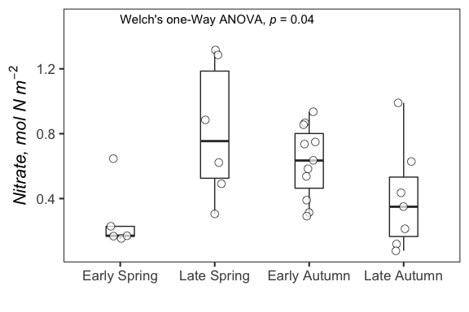

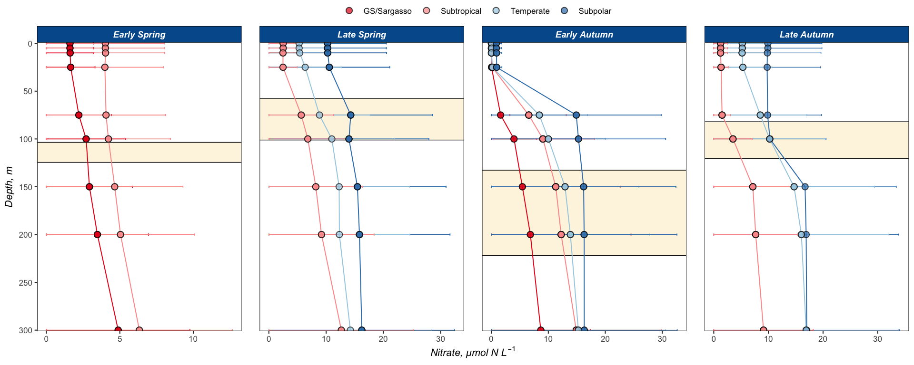

## Phosphate

### Surface 100 m

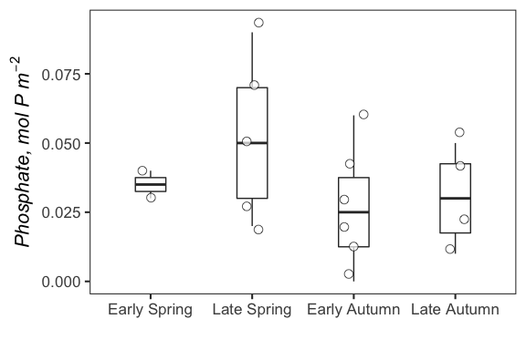

### Euphotic Zone

#### Welch’s one-Way ANOVA test

Alternative to standard one-way ANOVA in the situation where the
homogeneity of variance assumption is violated

``` r
p_ez <-  export %>%
  select(Season, Ez, int_PO4_ez) %>% 
  mutate(int_PO4_ez = ((int_PO4_ez)/Ez)/10) %>% 
  distinct() %>% 
  drop_na(int_PO4_ez) 

p_anova <- welch_anova_test(int_PO4_ez ~ Season, data = p_ez) 
p_anova 
```

    ## # A tibble: 1 x 7
    ##   .y.            n statistic   DFn   DFd     p method     
    ## * <chr>      <int>     <dbl> <dbl> <dbl> <dbl> <chr>      
    ## 1 int_PO4_ez    29      1.77     3  12.0 0.207 Welch ANOVA

#### Post-hoc analysis

Games-Howell test used to compare all possible combinations of group
differences when the assumption of homogeneity of variances is violated

``` r
p_gh <- games_howell_test(int_PO4_ez ~ Season, data = p_ez)
p_gh
```

    ## # A tibble: 6 x 8
    ##   .y.       group1     group2     estimate conf.low conf.high p.adj p.adj.signif
    ## * <chr>     <chr>      <chr>         <dbl>    <dbl>     <dbl> <dbl> <chr>       
    ## 1 int_PO4_… Early Aut… Early Spr… -0.00901  -0.0265   0.00846 0.455 ns          
    ## 2 int_PO4_… Early Aut… Late Autu… -0.0116   -0.0357   0.0124  0.517 ns          
    ## 3 int_PO4_… Early Aut… Late Spri…  0.0140   -0.0300   0.0580  0.729 ns          
    ## 4 int_PO4_… Early Spr… Late Autu… -0.00262  -0.0240   0.0188  0.977 ns          
    ## 5 int_PO4_… Early Spr… Late Spri…  0.0230   -0.0215   0.0676  0.343 ns          
    ## 6 int_PO4_… Late Autu… Late Spri…  0.0256   -0.0188   0.0700  0.313 ns

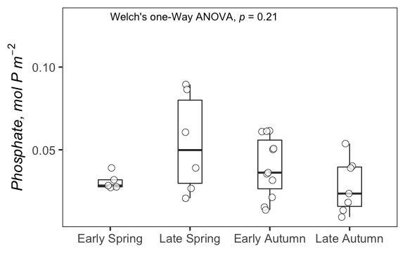

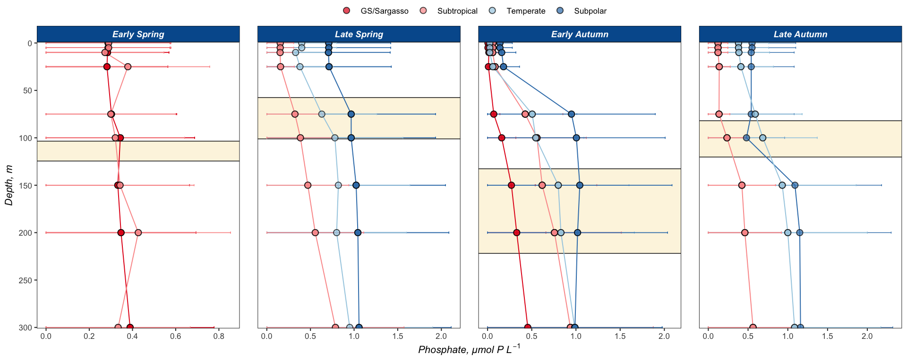

## N:P

### Euphotic Zone

#### Welch’s one-Way ANOVA test

Alternative to standard one-way ANOVA in the situation where the
homogeneity of variance assumption is violated

``` r
np_ez <-  export %>%
  select(Season, Ez, int_PO4_ez, int_N_ez) %>% 
  mutate(int_PO4_ez = ((int_PO4_ez)/Ez)/10,
         int_N_ez = ((int_N_ez)/Ez)/10,
         int_NP_ez = int_N_ez/int_PO4_ez) %>% 
  distinct() %>% 
  drop_na(int_PO4_ez) 

np_anova <- welch_anova_test(int_NP_ez ~ Season, data = np_ez) 
np_anova 
```

    ## # A tibble: 1 x 7
    ##   .y.           n statistic   DFn   DFd     p method     
    ## * <chr>     <int>     <dbl> <dbl> <dbl> <dbl> <chr>      
    ## 1 int_NP_ez    29       5.4     3  11.1 0.016 Welch ANOVA

``` r
np_ez %>% 
  filter(Season == "Early Spring") %>% 
  summary()
```

    ##     Season                Ez        int_PO4_ez         int_N_ez     
    ##  Length:5           Min.   : 98   Min.   :0.02720   Min.   :0.1527  
    ##  Class :character   1st Qu.:106   1st Qu.:0.02760   1st Qu.:0.1675  
    ##  Mode  :character   Median :120   Median :0.02838   Median :0.1713  
    ##                     Mean   :114   Mean   :0.03081   Mean   :0.2733  
    ##                     3rd Qu.:120   3rd Qu.:0.03187   3rd Qu.:0.2288  
    ##                     Max.   :126   Max.   :0.03902   Max.   :0.6461  
    ##    int_NP_ez     
    ##  Min.   : 5.614  
    ##  1st Qu.: 6.036  
    ##  Median : 6.070  
    ##  Mean   : 8.291  
    ##  3rd Qu.: 7.180  
    ##  Max.   :16.557

#### Post-hoc analysis

Games-Howell test used to compare all possible combinations of group
differences when the assumption of homogeneity of variances is violated

``` r
np_gh <- games_howell_test(int_NP_ez ~ Season, data = np_ez)
np_gh
```

    ## # A tibble: 6 x 8
    ##   .y.      group1      group2     estimate conf.low conf.high p.adj p.adj.signif
    ## * <chr>    <chr>       <chr>         <dbl>    <dbl>     <dbl> <dbl> <chr>       
    ## 1 int_NP_… Early Autu… Early Spr…    -8.47  -16.6      -0.371 0.042 *           
    ## 2 int_NP_… Early Autu… Late Autu…    -4.02   -8.96      0.918 0.122 ns          
    ## 3 int_NP_… Early Autu… Late Spri…    -1.19   -4.13      1.74  0.652 ns          
    ## 4 int_NP_… Early Spri… Late Autu…     4.44   -3.74     12.6   0.356 ns          
    ## 5 int_NP_… Early Spri… Late Spri…     7.27   -0.939    15.5   0.076 ns          
    ## 6 int_NP_… Late Autumn Late Spri…     2.83   -2.04      7.70  0.318 ns

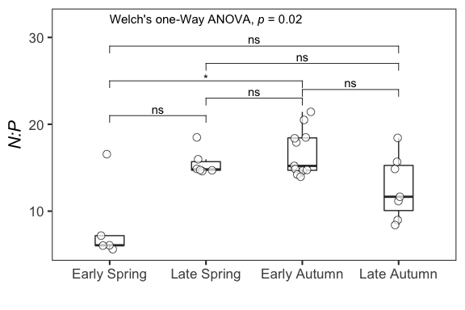

# ∆DOC

``` r
aov.delta_doc <- export %>%
  select(Season, int_delta_DOC_100) %>% 
  distinct() %>% 
  drop_na(int_delta_DOC_100) 
```

## Welch’s one-Way ANOVA test

Alternative to standard one-way ANOVA in the situation where the
homogeneity of variance assumption iss
violated

``` r
ddoc_anova <- welch_anova_test(int_delta_DOC_100 ~ Season, data = aov.delta_doc) 
ddoc_anova 
```

    ## # A tibble: 1 x 7
    ##   .y.                   n statistic   DFn   DFd        p method     
    ## * <chr>             <int>     <dbl> <dbl> <dbl>    <dbl> <chr>      
    ## 1 int_delta_DOC_100    27      13.5     3  12.2 0.000355 Welch ANOVA

## Post-hoc analysis

Games-Howell test used to compare all possible combinations of group
differences when the assumption of homogeneity of variances is
violated

``` r
ddoc_gh <- games_howell_test(int_delta_DOC_100 ~ Season, data = aov.delta_doc)
ddoc_gh
```

    ## # A tibble: 6 x 8
    ##   .y.        group1    group2   estimate conf.low conf.high   p.adj p.adj.signif
    ## * <chr>      <chr>     <chr>       <dbl>    <dbl>     <dbl>   <dbl> <chr>       
    ## 1 int_delta… Early Au… Early S…   -0.589  -0.886   -0.292   3.72e-4 ***         
    ## 2 int_delta… Early Au… Late Au…   -0.253  -0.595    0.0892  1.88e-1 ns          
    ## 3 int_delta… Early Au… Late Sp…   -0.545  -0.855   -0.235   9.43e-4 ***         
    ## 4 int_delta… Early Sp… Late Au…    0.336   0.0635   0.609   1.70e-2 *           
    ## 5 int_delta… Early Sp… Late Sp…    0.044  -0.177    0.265   9.14e-1 ns          
    ## 6 int_delta… Late Aut… Late Sp…   -0.292  -0.578   -0.00552 4.60e-2 *

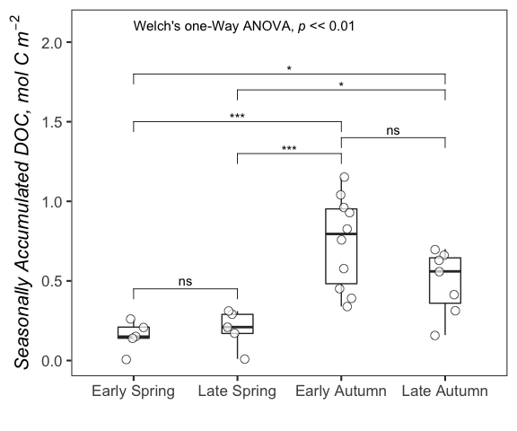

# DOC:DON

``` r
aov.cn <- export %>%
  select(Season, doc_don_100) %>% 
  distinct() %>% 
  drop_na(doc_don_100) %>% 
  filter(!doc_don_100 > 90) 
```

## Welch’s one-Way ANOVA test

Alternative to standard one-way ANOVA in the situation where the
homogeneity of variance assumption iss violated

``` r
cn_anova <- welch_anova_test(doc_don_100 ~ Season, data = aov.cn) 
cn_anova 
```

    ## # A tibble: 1 x 7
    ##   .y.             n statistic   DFn   DFd     p method     
    ## * <chr>       <int>     <dbl> <dbl> <dbl> <dbl> <chr>      
    ## 1 doc_don_100    19      2.37     3  7.51 0.151 Welch ANOVA

## Post-hoc analysis

Games-Howell test used to compare all possible combinations of group
differences when the assumption of homogeneity of variances is violated

``` r
cn_gh <- games_howell_test(doc_don_100 ~ Season, data = aov.cn)
cn_gh
```

    ## # A tibble: 6 x 8
    ##   .y.       group1     group2     estimate conf.low conf.high p.adj p.adj.signif
    ## * <chr>     <chr>      <chr>         <dbl>    <dbl>     <dbl> <dbl> <chr>       
    ## 1 doc_don_… Early Aut… Early Spr…   -12.4    -28.3       3.57 0.126 ns          
    ## 2 doc_don_… Early Aut… Late Autu…   -11.0    -26.9       4.86 0.183 ns          
    ## 3 doc_don_… Early Aut… Late Spri…   -12.4    -29.4       4.67 0.177 ns          
    ## 4 doc_don_… Early Spr… Late Autu…     1.33    -2.39      5.06 0.624 ns          
    ## 5 doc_don_… Early Spr… Late Spri…     0      -13.7      13.7  1     ns          
    ## 6 doc_don_… Late Autu… Late Spri…    -1.33   -14.4      11.7  0.969 ns

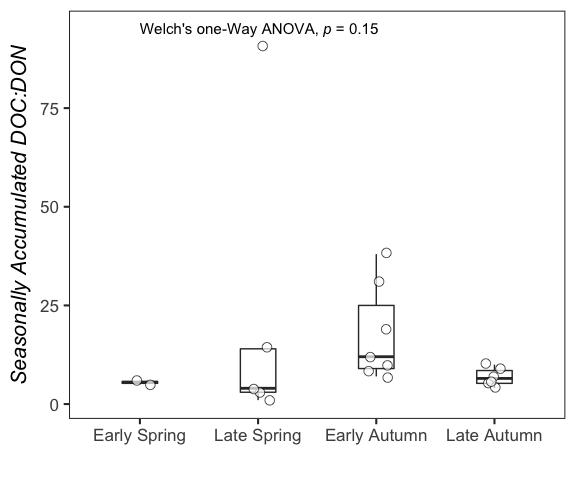

``` r
export %>%
  select(Season, int_delta_DOC_100, doc_don_100) %>% 
  rename(accm_doc = int_delta_DOC_100) %>% 
  group_by(Season) %>% 
  summarise(ave_accm_doc = round(mean(accm_doc, na.rm = T), 2),
            sd_accm_doc = round(sd(accm_doc, na.rm = T), 2),
            med_accm_doc = round(median(accm_doc, na.rm = T), 2),
            min_accm_doc = round(min(accm_doc, na.rm = T), 2),
            max_accm_doc = round(max(accm_doc, na.rm = T), 2),
            
            ave_doc_don = round(mean(doc_don_100, na.rm = T)),
            sd_doc_don = round(sd(doc_don_100, na.rm = T)),
            med_doc_don = round(median(doc_don_100, na.rm = T)),
            min_doc_don = round(min(doc_don_100, na.rm = T)),
            max_doc_don = round(max(doc_don_100, na.rm = T))
            ) %>% 
   arrange(factor(Season, levels = levels))
```

    ## # A tibble: 4 x 11
    ##   Season ave_accm_doc sd_accm_doc med_accm_doc min_accm_doc max_accm_doc
    ##   <chr>         <dbl>       <dbl>        <dbl>        <dbl>        <dbl>
    ## 1 Early…         0.15        0.08         0.15         0.01         0.26
    ## 2 Late …         0.19        0.1          0.21         0.01         0.31
    ## 3 Early…         0.73        0.28         0.83         0.34         1.15
    ## 4 Late …         0.51        0.17         0.56         0.16         0.7 
    ## # … with 5 more variables: ave_doc_don <dbl>, sd_doc_don <dbl>,
    ## #   med_doc_don <dbl>, min_doc_don <dbl>, max_doc_don <dbl>

``` r
export %>%
  select(Season, doc_don_100) %>% 
  group_by(Season) %>% 
  filter(!doc_don_100 > 90) %>% 
  summarise(ave_doc_don = round(mean(doc_don_100, na.rm = T)),
            sd_doc_don = round(sd(doc_don_100, na.rm = T)),
            med_doc_don = round(median(doc_don_100, na.rm = T)),
            min_doc_don = round(min(doc_don_100, na.rm = T)),
            max_doc_don = round(max(doc_don_100, na.rm = T))
            ) %>% 
   arrange(factor(Season, levels = levels))
```

    ## # A tibble: 4 x 6
    ##   Season       ave_doc_don sd_doc_don med_doc_don min_doc_don max_doc_don
    ##   <chr>              <dbl>      <dbl>       <dbl>       <dbl>       <dbl>
    ## 1 Early Spring           6          1           6           5           6
    ## 2 Late Spring            5          5           3           1          14
    ## 3 Early Autumn          18         10          12           7          38
    ## 4 Late Autumn            7          2           6           4          10

# Remineralization of Seasonally Accumulated DOC

### NAAMES 2

#### No Addition

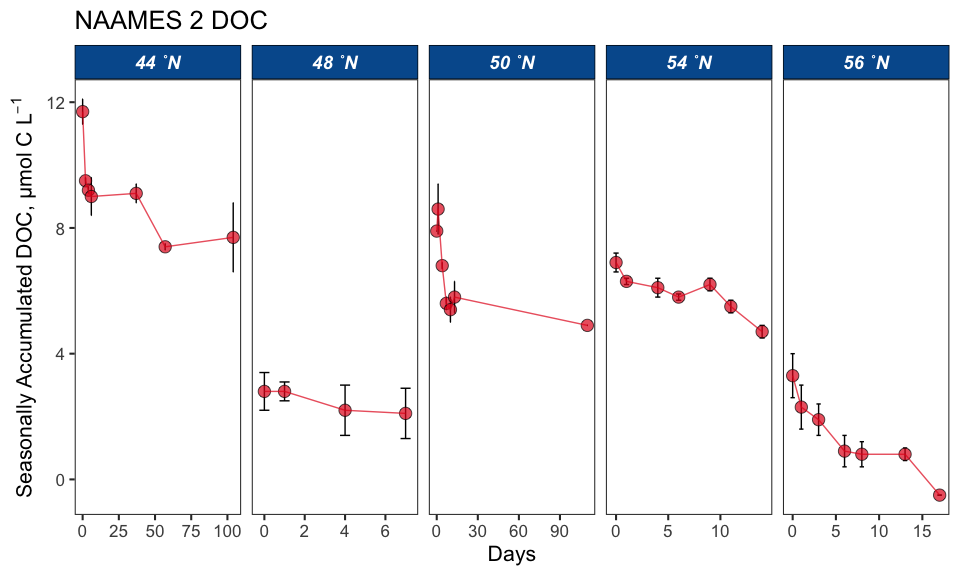

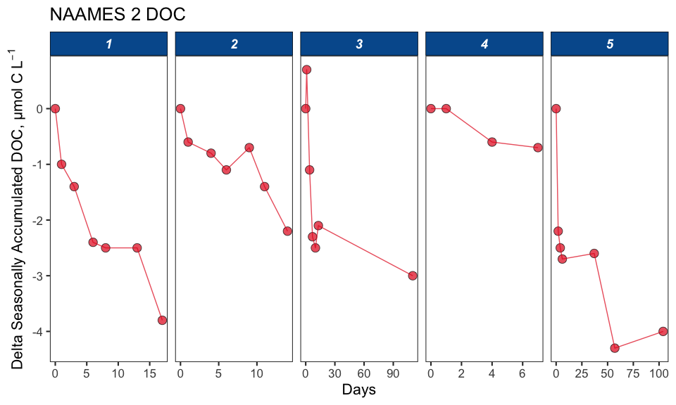

#### Additions


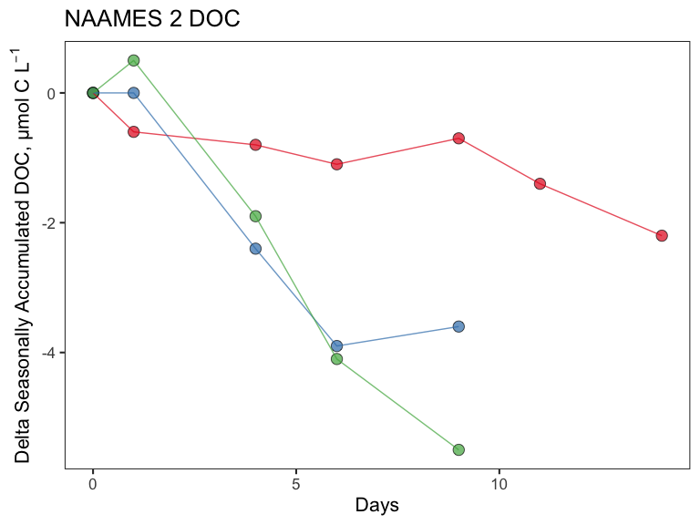

## NAAMES 3

#### No Additions

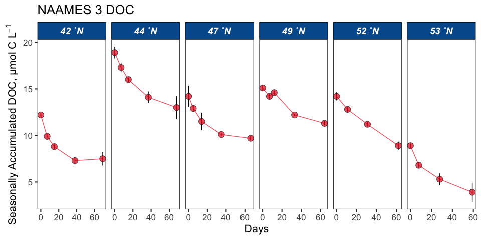

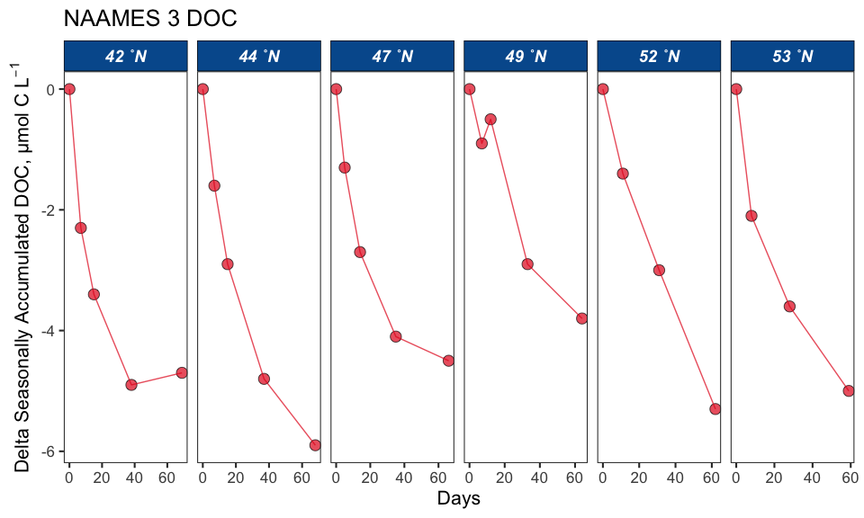

#### Additions

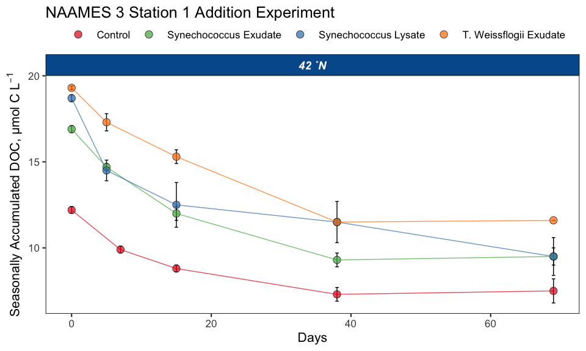

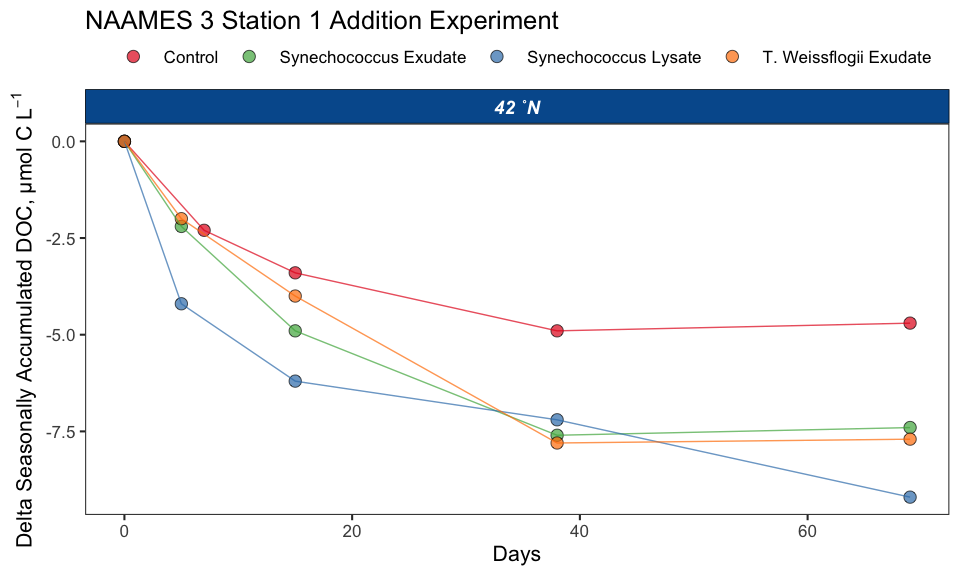

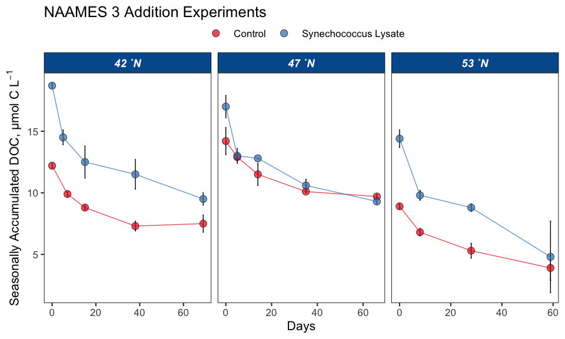

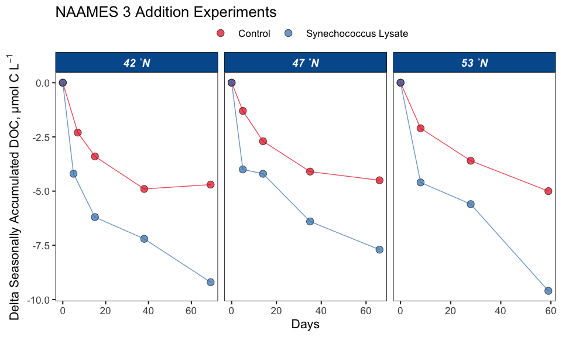

### NAAMES 4

#### No Additions

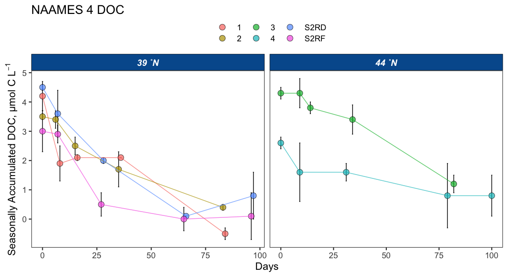

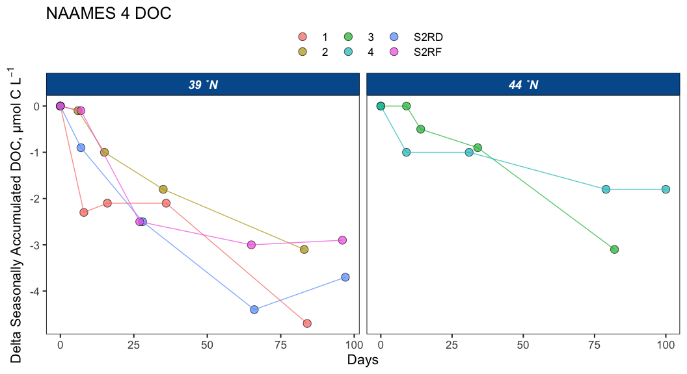

#### Additions

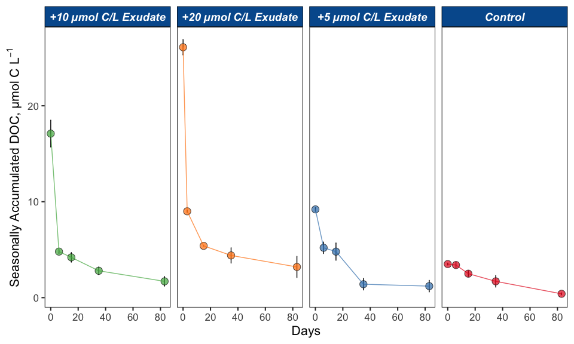

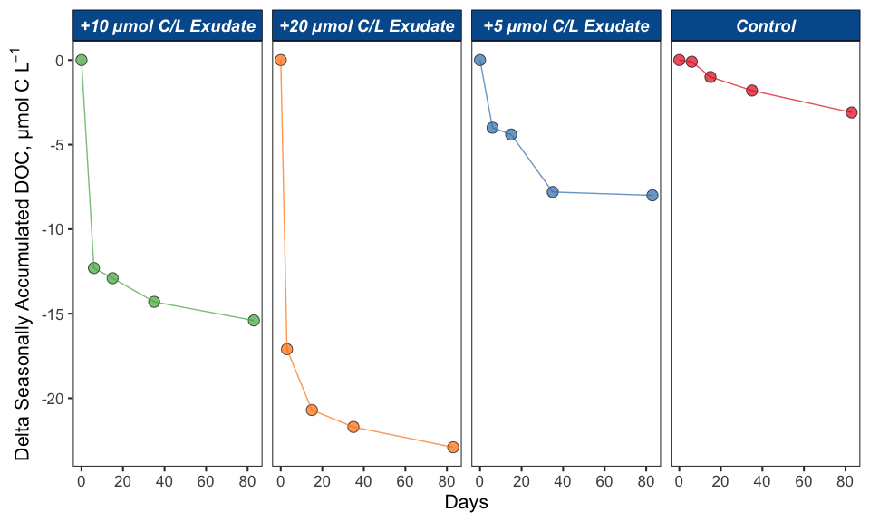

## Seasonal Comparison


``` r
bioav.table <- export_bioav %>% 
  filter(Depth == 10, Treatment == "Control") %>% 
  select(Season:Subregion, contains("bioav_doc"), contains("per_bioav"), contains("persis"), contains("ddoc")) %>% 
  distinct() %>% 
  group_by(Season, degree_bin) %>% 
  summarise(ave_total.per_bioav = round(mean(total.per_bioav, na.rm = T), 2),
            sd_total.per_bioav = round(sd(total.per_bioav, na.rm = T), 2),
            ave_st.per_bioav = round(mean(st.per_bioav, na.rm = T), 2),
            sd_st.per_bioav = round(sd(st.per_bioav, na.rm = T), 2),
            ave_lt.per_bioav = round(mean(lt.per_bioav, na.rm = T), 2),
            sd_lt.per_bioav = round(sd(lt.per_bioav, na.rm = T), 2),
            
            ave_per_persis = round(mean(per_persis, na.rm = T), 2),
            sd_per_persis = round(sd(per_persis, na.rm = T), 2),
            
            ave_st.ddoc = round(mean(st.ddoc, na.rm = T), 2),
            sd_st.ddoc = round(sd(st.ddoc, na.rm = T), 2),
            ave_lt.ddoc = round(mean(lt.ddoc, na.rm = T), 2),
            sd_lt.ddoc = round(sd(lt.ddoc, na.rm = T), 2),
            ave_total.ddoc = round(mean(total.ddoc, na.rm = T), 2),
            sd_total.ddoc = round(sd(total.ddoc, na.rm = T), 2),
            
            ) %>%
   arrange(factor(Season, levels = levels)) %>% 
  ungroup()
```

| Season       | degree\_bin | ave\_total.per\_bioav | sd\_total.per\_bioav | ave\_st.per\_bioav | sd\_st.per\_bioav | ave\_lt.per\_bioav | sd\_lt.per\_bioav | ave\_per\_persis | sd\_per\_persis | ave\_st.ddoc | sd\_st.ddoc | ave\_lt.ddoc | sd\_lt.ddoc | ave\_total.ddoc | sd\_total.ddoc |
| :----------- | ----------: | --------------------: | -------------------: | -----------------: | ----------------: | -----------------: | ----------------: | ---------------: | --------------: | -----------: | ----------: | -----------: | ----------: | --------------: | -------------: |
| Early Spring |          39 |                  95.0 |                12.88 |               20.0 |             19.95 |              74.75 |             14.59 |              5.0 |           12.88 |          118 |      122.18 |         33.5 |        3.00 |           40.25 |          11.09 |
| Early Spring |          44 |                  70.5 |                 2.12 |               13.5 |             19.09 |              57.00 |             21.21 |             29.5 |            2.12 |           50 |       70.71 |         26.5 |       20.51 |           28.00 |          14.14 |
| Late Spring  |          44 |                  34.0 |                   NA |               23.0 |                NA |              11.00 |                NA |             66.0 |              NA |          386 |          NA |         13.0 |          NA |           38.00 |             NA |
| Late Spring  |          48 |                   NaN |                   NA |               25.0 |                NA |                NaN |                NA |              NaN |              NA |          100 |          NA |          NaN |          NA |             NaN |             NA |
| Late Spring  |          50 |                   NaN |                   NA |               29.0 |                NA |                NaN |                NA |              NaN |              NA |          329 |          NA |          NaN |          NA |             NaN |             NA |
| Late Spring  |          54 |                   NaN |                   NA |               14.0 |                NA |                NaN |                NA |              NaN |              NA |          143 |          NA |          NaN |          NA |             NaN |             NA |
| Late Spring  |          56 |                   NaN |                   NA |               76.0 |                NA |                NaN |                NA |              NaN |              NA |          357 |          NA |          NaN |          NA |             NaN |             NA |
| Early Autumn |          42 |                  39.0 |                   NA |               19.0 |                NA |              20.00 |                NA |             61.0 |              NA |          329 |          NA |         39.0 |          NA |           68.00 |             NA |
| Early Autumn |          44 |                  31.0 |                   NA |                8.0 |                NA |              23.00 |                NA |             69.0 |              NA |          229 |          NA |         70.0 |          NA |           87.00 |             NA |
| Early Autumn |          47 |                  32.0 |                   NA |               11.0 |                NA |              20.00 |                NA |             68.0 |              NA |          229 |          NA |         49.0 |          NA |           68.00 |             NA |
| Early Autumn |          49 |                  25.0 |                   NA |                6.0 |                NA |              19.00 |                NA |             75.0 |              NA |          129 |          NA |         51.0 |          NA |           59.00 |             NA |
| Early Autumn |          52 |                  37.0 |                   NA |                6.0 |                NA |              31.00 |                NA |             63.0 |              NA |          129 |          NA |         80.0 |          NA |           85.00 |             NA |
| Early Autumn |          53 |                  56.0 |                   NA |               20.0 |                NA |              36.00 |                NA |             44.0 |              NA |          257 |          NA |         62.0 |          NA |           85.00 |             NA |

Seasonal Accumulated DOC Bioavailability and Persistance

``` r
bcd_bioav_table <- int_bcd %>% 
  select(Cruise:Station, degree_bin,  int.bcd.cr_bge.100, int.bcd.100, int.bcd.ez) %>% 
  distinct() %>% 
  #convert from µmol C m-3 d-1 to µmol C m-2 d-1
  mutate_at(vars(int.bcd.cr_bge.100:int.bcd.100), funs(./1000)) %>% 
  pivot_longer(cols = c(int.bcd.cr_bge.100, int.bcd.100), names_to = "var", values_to = "bcd") %>%
  select(-var) %>%
  distinct() %>% 
  group_by(Cruise, Season, Subregion, degree_bin, Station) %>% 
  summarise(ave_BCD = mean(bcd),
            sd_BCD = sd(bcd)) %>% 
  ungroup() %>% 
  mutate(Station = as.character(Station)) %>% 
  left_join(. , export) %>% 
   arrange(factor(Season, levels = levels))  %>% 
  filter(!doc_don_100 > 50) 
```

    ## Joining, by = c("Cruise", "Season", "Subregion", "degree_bin", "Station")

    ## RMA was not requested: it will not be computed.

    ## 
    ## Model II regression
    ## 
    ## Call: lmodel2(formula = ave_BCD ~ int_delta_DOC_100, data =
    ## bcd_bioav_table, nperm = 99)
    ## 
    ## n = 383   r = -0.3519874   r-square = 0.1238952 
    ## Parametric P-values:   2-tailed = 1.299928e-12    1-tailed = 6.499638e-13 
    ## Angle between the two OLS regression lines = 34.47299 degrees
    ## 
    ## Permutation tests of OLS, MA, RMA slopes: 1-tailed, tail corresponding to sign
    ## A permutation test of r is equivalent to a permutation test of the OLS slope
    ## P-perm for SMA = NA because the SMA slope cannot be tested
    ## 
    ## Regression results
    ##   Method Intercept      Slope Angle (degrees) P-perm (1-tailed)
    ## 1    OLS 0.2408041 -0.1058798       -6.043948              0.01
    ## 2     MA 0.2448003 -0.1148771       -6.553246              0.01
    ## 3    SMA 0.3273807 -0.3008057      -16.741584                NA
    ## 
    ## Confidence intervals
    ##   Method 2.5%-Intercept 97.5%-Intercept 2.5%-Slope 97.5%-Slope
    ## 1    OLS      0.2257440       0.2558642 -0.1342415 -0.07751817
    ## 2     MA      0.2311742       0.2585218 -0.1457708 -0.08419826
    ## 3    SMA      0.3153764       0.3405701 -0.3305014 -0.27377810
    ## 
    ## Eigenvalues: 0.08594616 0.006650488 
    ## 
    ## H statistic used for computing C.I. of MA: 0.0009223926

    ## RMA was not requested: it will not be computed.

    ## 
    ## Model II regression
    ## 
    ## Call: lmodel2(formula = ave_BCD ~ doc_don_100, data = bcd_bioav_table,
    ## nperm = 99)
    ## 
    ## n = 383   r = -0.2649284   r-square = 0.07018705 
    ## Parametric P-values:   2-tailed = 1.42402e-07    1-tailed = 7.120102e-08 
    ## Angle between the two OLS regression lines = 1.886673 degrees
    ## 
    ## Permutation tests of OLS, MA, RMA slopes: 1-tailed, tail corresponding to sign
    ## A permutation test of r is equivalent to a permutation test of the OLS slope
    ## P-perm for SMA = NA because the SMA slope cannot be tested
    ## 
    ## Regression results
    ##   Method Intercept        Slope Angle (degrees) P-perm (1-tailed)
    ## 1    OLS 0.2193915 -0.002486742      -0.1424795              0.01
    ## 2     MA 0.2193936 -0.002486946      -0.1424912              0.01
    ## 3    SMA 0.2904605 -0.009386469      -0.5377893                NA
    ## 
    ## Confidence intervals
    ##   Method 2.5%-Intercept 97.5%-Intercept   2.5%-Slope  97.5%-Slope
    ## 1    OLS      0.2067229       0.2320601 -0.003398475 -0.001575010
    ## 2     MA      0.2100018       0.2287855 -0.003398755 -0.001575140
    ## 3    SMA      0.2815245       0.3003066 -0.010342377 -0.008518912
    ## 
    ## Eigenvalues: 87.20596 0.007143991 
    ## 
    ## H statistic used for computing C.I. of MA: 8.313821e-07

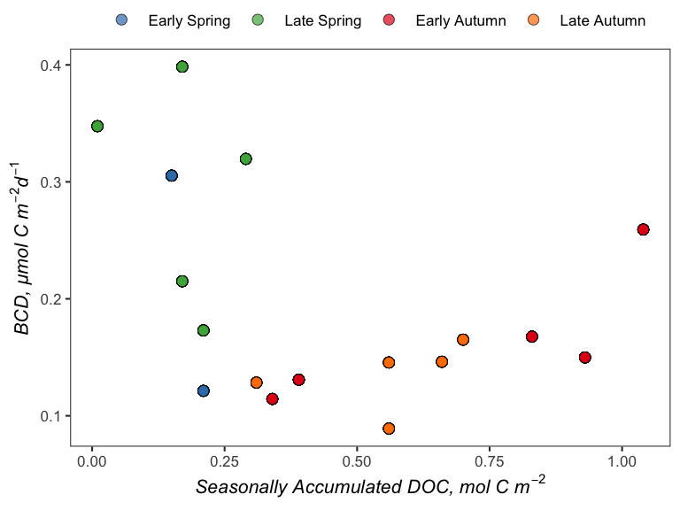

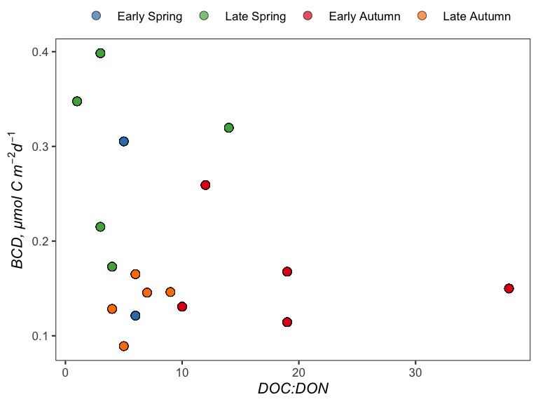

This seasonal comparison is best exemplifies at 44˚N where we have
experiments from all cruises. It shows:

  - an increase in the accumulated DOC pool from the early spring to the
    early autumn
  - an increase in the persistent fraction of the bulk DOC as the
    seasons progress
      - DOC in the early spring does not accumulate (also apparent at
        39˚N)
      - 64% of DOC pool in the late spring was persistent while 69% of
        the DOC pool in the early autumn was persistent. This would
        imply an increase of the persistent DOC fraction by 5%. I think
        this suggests that most of the net production of persistent DOC
        occurs in the late spring, closer to the timing of the bloom
        peak.

Overall, there are elevated persistent fractions in the late spring and
early autumn, with greater proportion of the early autumn pool beeing
more consistently persistant.

Our addition experiments are consistent with our definition of DOC
persistence. In every cruise, the addition of SPE-DOM substrates
(different quality and substrates) stimulated drawdown of accumulated
DOC and bacterioplankton growth, but did not result in drawdown into the
persistent
pool.

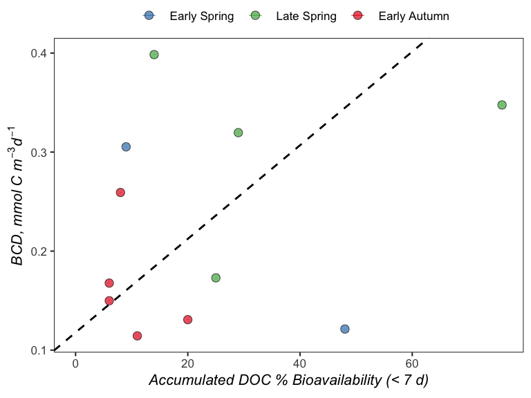
