NAAMES DOC Remineralization Bioassays - Bottles
================
Nicholas Baetge
2/29/2020

# Intro

This document shows how **individual bottle** data from NAAMES DOC
remineralization bioassays were processed, QC’d, and analyzed.

``` r
library(tidyverse) 
library(rmarkdown)
library(knitr)
library(data.table) 
library(scales)
library(zoo)
library(oce)
#rmarkdown tables
library(stargazer)
library(pander)
library(growthcurver)
#stat tests
library(lmtest)
library(lmodel2)
```

# Bacterial Abundance

Here, growth curves are fitted to the logistic equation using the
GrowthCurver package. The timing of the onset of the stationary growth
phase is determined from the model
fit.

## Import and Tidy Data

``` r
ba.df <- read_csv("~/naames_bioav_ms/Input/N2-4_BactA_Remin_Master.csv") %>% 
  mutate(Season = Cruise,
         Season = gsub("AT34", "Late Spring", Season),
         Season = gsub("AT38", "Early Autumn", Season),
         Season = gsub("AT39", "Early Spring", Season),
         Treatment = ifelse(Bottle == "Niskin", "Niskin", Treatment),
         Treatment = ifelse(Bottle == "GF75", "GF75", Treatment),
         Treatment = gsub("TW15", "TW20", Treatment),
         Treatment = ifelse(is.na(Treatment), Bottle, Treatment),
         Treatment = ifelse(Treatment %in% c("100mls", "250mls", "500mls", "1L"), "Volume", Treatment),
         Treatment = gsub("Surface", "Parallel", Treatment),
         Treatment_Btl = ifelse(Bottle == "Niskin", "Niskin", Treatment_Btl),
         Treatment_Btl = ifelse(Bottle == "GF75" & is.na(Treatment_Btl), "GF75", Treatment_Btl),
         Treatment_Btl = gsub("TW15", "TW20", Treatment_Btl),
         Treatment_Btl = gsub("TW12-A", "TW12-C", Treatment_Btl),
         Treatment_Btl = gsub("TW12-B", "TW12-D", Treatment_Btl),
         Treatment_Btl = gsub("TW13-A", "TW12-E", Treatment_Btl),
         Treatment_Btl = gsub("TW13-B", "TW12-F", Treatment_Btl),
         Treatment_Btl = ifelse(is.na(Treatment_Btl), Bottle, Treatment_Btl),
         Bottle = gsub("SA", "A", Bottle),
         Bottle = gsub("SB", "B", Bottle),
         Bottle = gsub("DA", "C", Bottle),
         Bottle = gsub("DB", "D", Bottle),
         Bottle = ifelse(Bottle == "GF75", Treatment_Btl, Bottle),
         Bottle = gsub("Control-", "", Bottle),
         Bottle = gsub("TW12-", "", Bottle),
         Bottle = gsub("TW13-", "", Bottle),
         Bottle = gsub("MixDS-", "", Bottle),
         Bottle = gsub("MixSD-", "", Bottle),
         Bottle = gsub("SynExd-", "", Bottle),
         Bottle = gsub("TWExd-", "", Bottle),
         Bottle = gsub("SynLys-", "", Bottle),
         Bottle = gsub("TW5-", "", Bottle),
         Bottle = gsub("TW10-", "", Bottle),
         Bottle = gsub("TW20-", "", Bottle),
         Bottle = gsub("12", "", Bottle),
         Bottle = gsub("13", "", Bottle),
         Bottle = ifelse(Cruise == "AT34" & Station == 2 & Depth == 10 & Treatment == "TW12" & Bottle == "A", gsub("A", "C", Bottle), Bottle),
         Bottle = ifelse(Cruise == "AT34" & Station == 2 & Depth == 10 & Treatment == "TW12" & Bottle == "B", gsub("B", "D", Bottle), Bottle),
          Bottle = ifelse(Cruise == "AT34" & Station == 2 & Depth == 10 & Treatment == "TW13" & Bottle == "A", gsub("A", "E", Bottle), Bottle),
         Bottle = ifelse(Cruise == "AT34" & Station == 2 & Depth == 10 & Treatment == "TW13" & Bottle == "B", gsub("B", "F", Bottle), Bottle),
          Bottle = ifelse(Cruise == "AT34" & Station == 2 & Depth == 200 & Treatment == "Control" & Bottle == "C", gsub("C", "G", Bottle), Bottle),
         Bottle = ifelse(Cruise == "AT34" & Station == 2 & Depth == 200 & Treatment == "Control" & Bottle == "D", gsub("D", "H", Bottle), Bottle),
         Bottle = ifelse(Cruise == "AT34" & Station == 2 & Depth == 200 & Treatment == "TW12" & Bottle == "C", gsub("C", "I", Bottle),Bottle),
         Bottle = ifelse(Cruise == "AT34" & Station == 2 & Depth == 200 & Treatment == "TW12" & Bottle == "D", gsub("D", "J", Bottle), Bottle),
          Bottle = ifelse(Cruise == "AT34" & Station == 2 & Depth == 200 & Treatment == "TW13" & Bottle == "C", gsub("C", "K", Bottle), Bottle),
         Bottle = ifelse(Cruise == "AT34" & Station == 2 & Depth == 200 & Treatment == "TW13" & Bottle == "D", gsub("D", "L", Bottle), Bottle),
          Bottle = ifelse(Cruise == "AT34" & Station == 2 & Depth == 200 & Treatment == "GF75" & Bottle == "A", gsub("A", "G", Bottle), Bottle),
         Bottle = ifelse(Cruise == "AT34" & Station == 2 & Depth == 200 & Treatment == "GF75" & Bottle == "B", gsub("B", "H", Bottle), Bottle),
         Bottle = ifelse(Cruise == "AT34" & Station == 2 & Depth == 200 & Treatment == "GF75" & Bottle == "C", gsub("C", "I", Bottle), Bottle),
         Bottle = ifelse(Cruise == "AT34" & Station == 2 & Depth == 200 & Treatment == "GF75" & Bottle == "D", gsub("D", "J", Bottle), Bottle),
          Bottle = ifelse(Cruise == "AT34" & Station == 2 & Depth == 200 & Treatment == "GF75" & Bottle == "E", gsub("E", "K", Bottle), Bottle),
         Bottle = ifelse(Cruise == "AT34" & Station == 2 & Depth == 200 & Treatment == "GF75" & Bottle == "F", gsub("F", "L", Bottle), Bottle),
          Bottle = ifelse(Cruise == "AT34" & Station == 1 & Depth == 200 & Treatment == "GF75" & Bottle == "A", gsub("A", "C", Bottle), Bottle),
         Bottle = ifelse(Cruise == "AT34" & Station == 1 & Depth == 200 & Treatment == "GF75" & Bottle == "B", gsub("B", "D", Bottle), Bottle),
           Bottle = ifelse(Cruise == "AT34" & Station == 4 & Depth == 200 & Treatment == "GF75" & Bottle == "A", gsub("A", "C", Bottle), Bottle),
         Bottle = ifelse(Cruise == "AT34" & Station == 4 & Depth == 200 & Treatment == "GF75" & Bottle == "B", gsub("B", "D", Bottle), Bottle),
         Bottle = ifelse(Cruise == "AT34" & Station == 5 & Depth == 200 & Treatment == "GF75" & Bottle == "A", gsub("A", "C", Bottle), Bottle),
         Bottle = ifelse(Cruise == "AT34" & Station == 5 & Depth == 200 & Treatment == "GF75" & Bottle == "B", gsub("B", "D", Bottle), Bottle),
         Depth = gsub(5, 10, Depth),
         Depth = as.numeric(Depth)) %>% 
  rename(cells = cellsperL,
         sd_cells = sd_cellsperL,
         p_cells = p_cellsperL,
         sd_p_cells = p_sdcellsperL) %>% 
  drop_na(cells) %>% 
  select(-Treatment_Btl) %>% 
  select(Season, everything()) %>% 
  arrange(Cruise, Station, Depth, Treatment, Bottle, Hours)

ba.df$Season <- factor(ba.df$Season, levels = levels)
```

## Inspect Growth Curves

To be able to calculate derived variables, such as carbon per cell and
BGE, we’ll need to inspect the growth curves and define the stationary
phase for each experiment.

We are using the growthcurver package to fit growth curve data to the
standard form of the logistic equation and then return a data table with
population-level information. Specifically, the model outputs we are
really only interested in are:

  - t\_mid, the time at which 1/2 carrying capacity is reached. We will
    double this estimate to attain the time at which carrying capacity
    is reached (stationary)
  - sigma, a measure of the goodnesss of fit of the parameters of the
    logistic equation for the data; it is the residual sum of squares
    from the nonlinear regression model. Smaller sigma values indicate a
    better fit of the logistic curve to the data than larger values.
  - df, degrees of freedom

<!-- end list -->

``` r
gc_input <- ba.df %>% 
  filter(!Treatment %in% c("Niskin","GF75", "Volume", "Parallel", "TFF-Ret")) %>% 
  group_by(Cruise, Station, Depth, Treatment, Bottle) %>% 
  #calculate the running delta of nat log cells for each exp
  mutate(lncells = round(log(cells), 2),
         delta_lncells = lncells - lncells[which.min(Hours)],
         delta_lncells = ifelse(delta_lncells < 0, 0, delta_lncells)) 

gc_input_keys <- gc_input %>% 
  group_keys() %>% 
  mutate(key = paste(Cruise, ", S", Station, ", Z =", Depth, ",", Treatment, ",", Bottle))
gc_input_header <- gc_input_keys$key

gc_input_list <- gc_input %>% 
  group_split()
names(gc_input_list) <- gc_input_header
```

``` r
gcplot.func <- function(x){
  gc_fit <- SummarizeGrowth(x$Hours, x$delta_lncells) 
}
gcplot.list <- lapply(gc_input_list, gcplot.func)
```

For the sake of keeping the length of this document as short as
possible, the growth curve model plots are not included here. However,
they are included below in the section “Re-evaluate Growth Curves”.

## Re-evaluate Growth Curves

To improve the model fits and thus, the timing estimates of the
stationary transition for each experiment, we need to evaluate each
growth curve, manually filtering out death/secondary growth phases and
poorly replicated samples that skew the model results.

``` r
eval_gc_input <- gc_input %>% 
  mutate(key = paste(Cruise, Station, Depth, Treatment, Bottle, Timepoint, sep = ".")) %>% 
  select(Season:Treatment, key, everything()) %>% 
  filter(!Hours >= 300) %>% 
  filter(!key %in% c("AT34.1.10.Control.A.1","AT34.1.10.Control.B.1", "AT34.1.200.Control.C.3", "AT34.1.200.Control.D.3","AT34.2.10.Control.A.4", "AT34.2.10.Control.A.9", "AT34.2.10.Control.A.10", "AT34.2.10.Control.A.11","AT34.2.10.Control.A.4", "AT34.2.10.Control.B.7", "AT34.2.10.Control.B.9", "AT34.2.10.Control.A.11", "AT34.2.10.TW12.C.5",
  "AT34.2.10.TW13.E.2", "AT34.2.10.TW13.F.3", "AT34.2.200.Control.G.2", "AT34.2.200.Control.G.5", "AT34.2.200.Control.G.6", "AT34.2.200.Control.G.7", "AT34.2.200.Control.H.5", "AT34.2.200.Control.H.6", "AT34.2.200.Control.H.7", "AT34.2.200.TW12.I.2", "AT34.2.200.TW12.J.2", "AT34.2.200.TW13.K.2", "AT34.3.10.Control.A.8", "AT34.3.10.Control.A.9", "AT34.3.10.Control.A.10", "AT34.3.10.Control.B.8", "AT34.3.10.Control.B.9", "AT34.3.10.Control.B.10", "AT34.3.200.Control.C.4", "AT34.3.200.Control.C.6", "AT34.3.200.Control.C.9", "AT34.3.200.Control.D.7", "AT34.4.200.Control.C.5", "AT34.4.200.Control.C.6", "AT34.4.200.Control.C.7", "AT34.4.200.Control.D.5", "AT34.4.200.Control.D.6", "AT34.4.200.Control.D.7", "AT34.5.10.Control.A.5", "AT34.5.10.Control.B.5", "AT34.U.10.Control.A.5", "AT34.U.10.Control.B.8", "AT34.U.10.Control.B.1", "AT38.1.10.Control.A.1", "AT38.1.10.Control.B.7", "AT38.1.10.MixSD.G.6", "AT38.1.10.SynExd.I.8", "AT38.1.10.SynExd.I.9", "AT38.1.10.SynExd.I.10", "AT38.1.10.SynExd.J.8", "AT38.1.10.SynExd.J.9", "AT38.1.10.SynExd.J.10", "AT38.1.10.SynLys.M.9", "AT38.1.10.SynLys.M.10", "AT38.1.10.SynLys.N.9", "AT38.1.10.SynLys.N.10", "AT38.1.200.Control.F.5", "AT38.1.200.Control.F.6", "AT38.1.200.Control.E.5", "AT38.1.200.Control.E.6", "AT38.1.200.MixDS.C.5", "AT38.1.200.MixDS.C.8", "AT38.1.200.MixDS.D.5", "AT38.1.200.MixDS.D.6", "AT38.4.10.Control.A.7", "AT38.4.10.Control.B.7", "AT38.4.10.Control.B.8", "AT38.5.10.Control.A.9", "AT38.5.10.Control.A.10", "AT38.5.10.Control.A.11", "AT38.5.10.Control.B.7"))

eval_gc_input_keys <- eval_gc_input %>% 
  group_keys() %>% 
  mutate(key = paste(Cruise, ", S", Station, ", Z =", Depth, ",", Treatment, ",", Bottle)) 
eval_gc_input_header <- eval_gc_input_keys$key

eval_gc_input_list <- eval_gc_input %>% 
  group_split()
names(eval_gc_input_list) <- eval_gc_input_header

eval_gcplot.list <- lapply(eval_gc_input_list, gcplot.func)
```

We’ve omitted 88 of the 768 (~11%) of the observations to improve the
model fit. 47% of those omitted observations were taken after 300 hours,
which for many experiments constituted the death phase.

``` r
for (i in 1:length(eval_gcplot.list)) {
  plot(eval_gcplot.list[[i]], main = names(eval_gcplot.list[i]), xlab = expression(italic("Hours")) , ylab = expression(italic(paste("ln cells, L"^"-1") ))) 
}
```

<!-- -->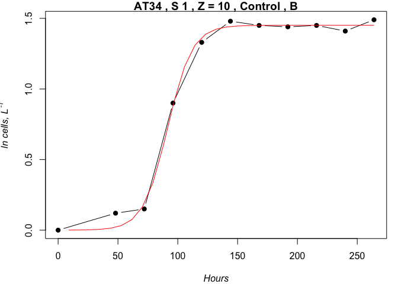<!-- --><!-- --><!-- --><!-- --><!-- --><!-- --><!-- --><!-- --><!-- --><!-- --><!-- --><!-- --><!-- --><!-- --><!-- --><!-- --><!-- --><!-- --><!-- -->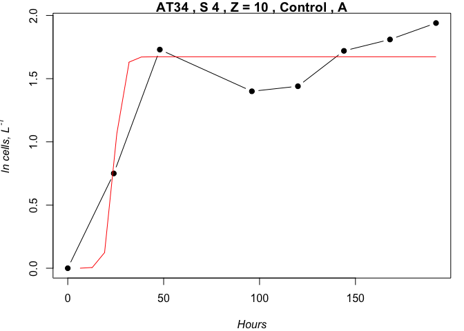<!-- -->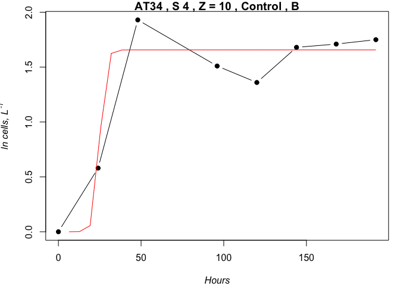<!-- --><!-- --><!-- --><!-- --><!-- --><!-- --><!-- --><!-- --><!-- --><!-- -->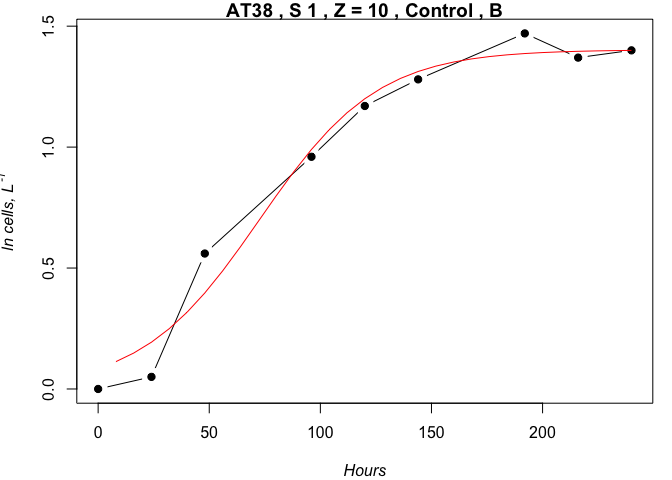<!-- --><!-- --><!-- --><!-- --><!-- --><!-- --><!-- --><!-- --><!-- --><!-- --><!-- --><!-- --><!-- --><!-- --><!-- --><!-- --><!-- --><!-- --><!-- --><!-- --><!-- --><!-- --><!-- --><!-- --><!-- -->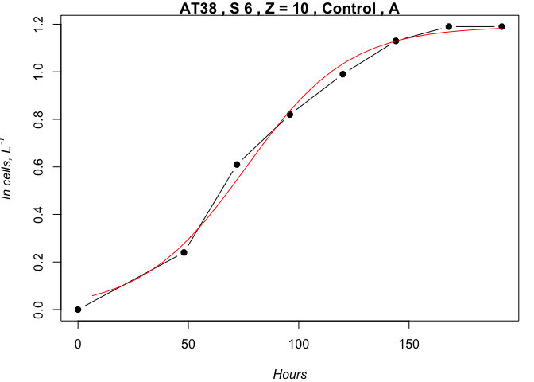<!-- --><!-- --><!-- --><!-- -->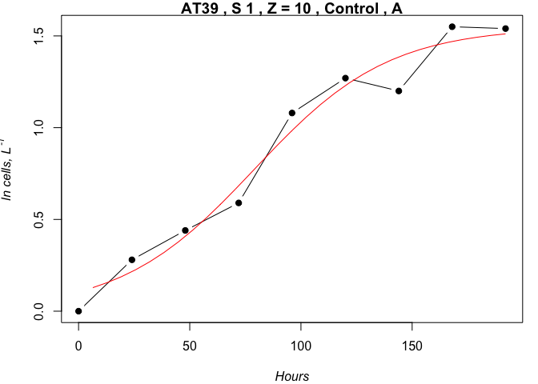<!-- -->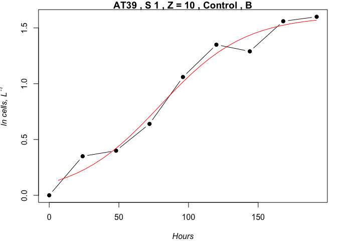<!-- -->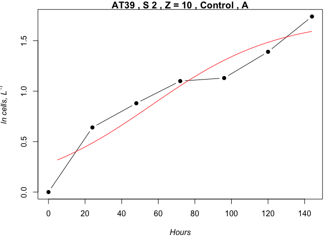<!-- -->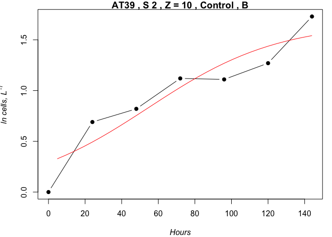<!-- -->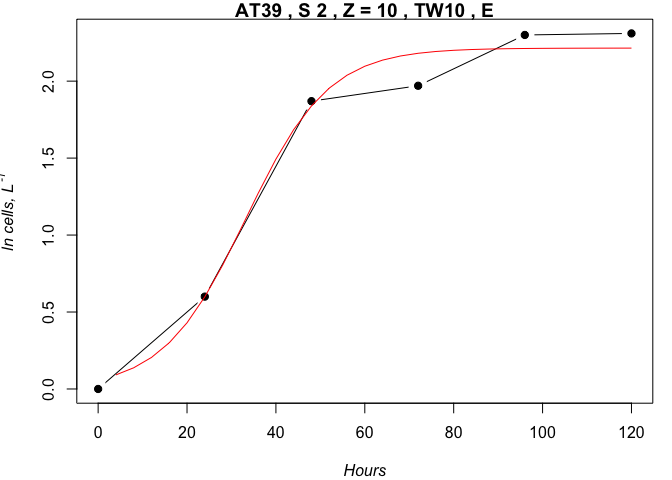<!-- --><!-- --><!-- --><!-- --><!-- -->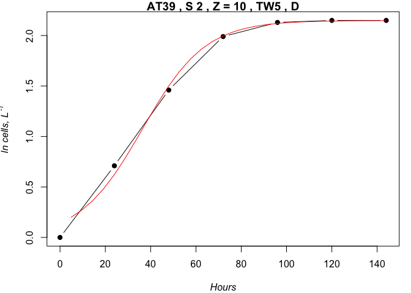<!-- --><!-- --><!-- -->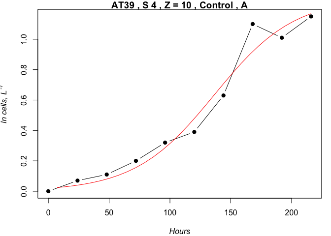<!-- --><!-- -->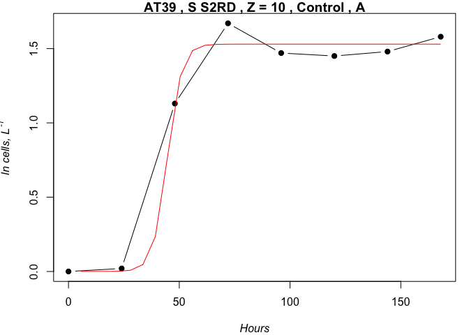<!-- --><!-- --><!-- -->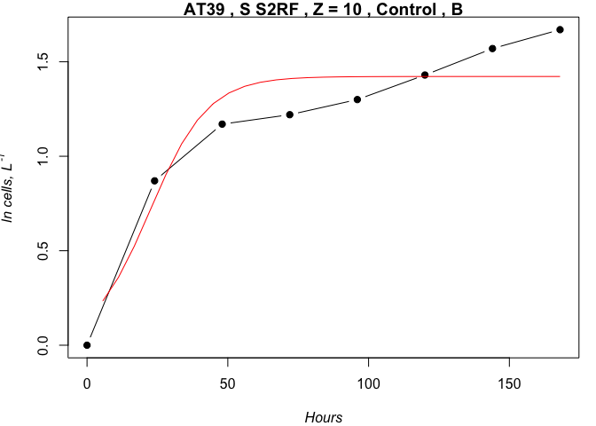<!-- -->

## Wrangle GrowthCurver Data

We’ll add the model output data to the original dataframe, but first
we’ll tidy the model output and look at the distribution of the model
fits.

We’ll determine thresholds for sigma (smaller sigma values indicate a
better fit) and df for omission of model fit data.

``` r
gcdata.func <- function(y){
  gc.fit <- SummarizeGrowth(y$Hours, y$delta_lncells)
  gcdata.df <- as.data.frame(unlist(gc.fit$vals), stringsAsFactors = FALSE)
}

gcdata <- eval_gc_input_list %>% 
  lapply(., gcdata.func) %>% 
  #save the list as a data frame %>% 
  data.frame(.) %>% 
  t(.) %>% 
  as_data_frame(.) %>% 
  mutate_at(., vars(k:auc_e), as.numeric) %>% 
  mutate_at(vars(sigma, t_mid), round, 2) %>% 
  #calculate time to stationary for each curve
  mutate(stationary = round(t_mid*2)) %>% 
  mutate(key = eval_gc_input_header) %>% 
  ungroup() 
```

    ## Warning: `as_data_frame()` is deprecated, use `as_tibble()` (but mind the new semantics).
    ## This warning is displayed once per session.


Based on these two histograms, we’ll omit model fit data where sigma \>
0.21 and df \< 4. In these experiments, we cannot reliably distinguish
the onset of stationary.

``` r
gcmerge.df <- eval_gc_input %>% 
  mutate(key = paste(Cruise, ", S", Station, ", Z =", Depth, ",", Treatment, ",", Bottle)) %>% 
  full_join(., gcdata %>% filter(!sigma > 0.21 | !df < 4)) %>% 
  ungroup() 
```

## Add Stationary Timepoint

We’ll add a row to each experiment that includes the stationary
timepoint.

``` r
gcmerge.list <- gcmerge.df %>% 
  #Split the dataframe into lists
  split(.,  .$key)

#add row to each list element
newrow.func <- function(morty){
  morty[nrow(morty) + 1,] <- NA
  rick <- morty %>% 
    fill(Season:Bottle, Treatment, key, stationary)
  rick
}

#apply function to list
gcstat.list <- lapply(gcmerge.list, newrow.func)

gcstat.df <- plyr::ldply(gcstat.list, data.frame) %>% 
  select(Season:Hours, stationary, cells:auc_e) %>%
  mutate(Hours = ifelse(is.na(Hours), stationary, Hours))
```

# Organic Carbon

## Import and Tidy Data

We will need to tidy the data in the same way the bacterial abundance
dataframe was tidied before merging the datasets. We’ll then omit data
low quality data i.e. poor replication or possible contamination. We
observed contamination in many of the NAAMES 2 experiments after
incubations were transferred to
WHOI.

``` r
oc.df <- read_csv("~/naames_bioav_ms/Input/N2-4_DOC_Remin_Master.csv") %>%
  mutate(Season = Cruise,
         Season = gsub("AT34", "Late Spring", Season),
         Season = gsub("AT38", "Early Autumn", Season),
         Season = gsub("AT39", "Early Spring", Season),
         Treatment = ifelse(Bottle == "Niskin", "Niskin", Treatment),
         Treatment = ifelse(Bottle == "GF75", "GF75", Treatment),
         Treatment = gsub("TW15", "TW20", Treatment),
         Treatment = ifelse(is.na(Treatment), Bottle, Treatment),
         Treatment = ifelse(Treatment %in% c("Surface", "Deep"), "Parallel", Treatment),
         Treatment = ifelse(Treatment %in% c("100mls", "250mls", "500mls", "1L"), "Volume", Treatment),
         Treatment_Btl = ifelse(Bottle == "Niskin", "Niskin", Treatment_Btl),
         Treatment_Btl = ifelse(Bottle == "GF75" & is.na(Treatment_Btl), "GF75", Treatment_Btl),
         Treatment_Btl = gsub("TW15", "TW20", Treatment_Btl),
         Treatment_Btl = gsub("TW12-A", "TW12-C", Treatment_Btl),
         Treatment_Btl = gsub("TW12-B", "TW12-D", Treatment_Btl),
         Treatment_Btl = gsub("TW13-A", "TW12-E", Treatment_Btl),
         Treatment_Btl = gsub("TW13-B", "TW12-F", Treatment_Btl),
         Treatment_Btl = ifelse(is.na(Treatment_Btl), Bottle, Treatment_Btl),
         Bottle = gsub("SA", "A", Bottle),
         Bottle = gsub("SB", "B", Bottle),
         Bottle = gsub("DA", "C", Bottle),
         Bottle = gsub("DB", "D", Bottle),
         Bottle = ifelse(Bottle == "GF75", Treatment_Btl, Bottle),
         Bottle = gsub("Control-", "", Bottle),
         Bottle = gsub("TW12-", "", Bottle),
         Bottle = gsub("TW13-", "", Bottle),
         Bottle = gsub("MixDS-", "", Bottle),
         Bottle = gsub("MixSD-", "", Bottle),
         Bottle = gsub("SynExd-", "", Bottle),
         Bottle = gsub("TWExd-", "", Bottle),
         Bottle = gsub("SynLys-", "", Bottle),
         Bottle = gsub("TW5-", "", Bottle),
         Bottle = gsub("TW10-", "", Bottle),
         Bottle = gsub("TW20-", "", Bottle),
         Bottle = gsub("12", "", Bottle),
         Bottle = gsub("13", "", Bottle),
         Bottle = ifelse(Cruise == "AT34" & Station == 2 & Depth == 10 & Treatment == "TW12" & Bottle == "A", gsub("A", "C", Bottle), Bottle),
         Bottle = ifelse(Cruise == "AT34" & Station == 2 & Depth == 10 & Treatment == "TW12" & Bottle == "B", gsub("B", "D", Bottle), Bottle),
         Bottle = ifelse(Cruise == "AT34" & Station == 2 & Depth == 10 & Treatment == "TW13" & Bottle == "A", gsub("A", "E", Bottle), Bottle),
         Bottle = ifelse(Cruise == "AT34" & Station == 2 & Depth == 10 & Treatment == "TW13" & Bottle == "B", gsub("B", "F", Bottle), Bottle),
         Bottle = ifelse(Cruise == "AT34" & Station == 2 & Depth == 200 & Treatment == "Control" & Bottle == "C", gsub("C", "G", Bottle), Bottle),
         Bottle = ifelse(Cruise == "AT34" & Station == 2 & Depth == 200 & Treatment == "Control" & Bottle == "D", gsub("D", "H", Bottle), Bottle),
         Bottle = ifelse(Cruise == "AT34" & Station == 2 & Depth == 200 & Treatment == "TW12" & Bottle == "C", gsub("C", "I", Bottle),Bottle),
         Bottle = ifelse(Cruise == "AT34" & Station == 2 & Depth == 200 & Treatment == "TW12" & Bottle == "D", gsub("D", "J", Bottle), Bottle),
         Bottle = ifelse(Cruise == "AT34" & Station == 2 & Depth == 200 & Treatment == "TW13" & Bottle == "C", gsub("C", "K", Bottle), Bottle),
         Bottle = ifelse(Cruise == "AT34" & Station == 2 & Depth == 200 & Treatment == "TW13" & Bottle == "D", gsub("D", "L", Bottle), Bottle),
         Depth = gsub(5, 10, Depth),
         Depth = as.numeric(Depth),
         key = paste(Cruise, Station, Depth, Treatment, Bottle, Timepoint, sep = "."),
         PTOC_ave = ifelse(Treatment == "Parallel", TOC_ave, PTOC_ave),
         PTOC_sd = ifelse(Treatment == "Parallel", TOC_sd, PTOC_sd)) %>% 
  rename(doc = DOC_ave,
         sd_doc = DOC_sd,
         toc = TOC_ave, 
         sd_toc = TOC_sd, 
         ptoc = PTOC_ave, 
         sd_ptoc = PTOC_sd, 
         pdoc = PDOC_ave, 
         sd_pdoc = PDOC_sd) %>%
  filter(!Treatment %in% c("Niskin", "GF75", "TFF-Ret", "Volume")) %>% 
  select(-Treatment_Btl) %>% 
  select(Season, everything()) %>% 
  arrange(Cruise, Station, Depth, Treatment, Bottle, Hours)  %>% 
  filter(!is.na(Hours))
```

Because a different suite of organic carbon samples were taken on each
cruise, we’ll separate the cruise datasets, drop NA values, quality
filter them, and then recombine the datasets. To quality filter, we’ll
calculate rolling ∆DOC values i.e. the diffence between the one
observation and the one before it. We’ll omit the data where ∆DOC
indicates contamination due to transport etc. after the 21 d shipboard
occupation (increase greater than our detection limit, 1.5 µmol C
L<sup>-1</sup>).

``` r
n2_oc <- oc.df %>% 
  filter(Cruise == "AT34") %>% 
  drop_na(doc) %>%
  group_by(Station, Depth, Treatment, Bottle) %>%
  mutate(doc_from_last = lag(doc) - doc) %>% 
  filter(!doc_from_last <= -1.5 | is.na(doc_from_last) | !Hours > 504)  %>% 
  mutate(doc_from_last = lag(doc) - doc) %>% 
  filter(!doc_from_last <= -1.5 | is.na(doc_from_last) | !Hours > 504) %>% 
  mutate(doc_from_last = lag(doc) - doc) %>% 
  filter(!doc_from_last <= -1.5 | is.na(doc_from_last) | !Hours > 504) %>% 
  mutate(doc_from_last = lag(doc) - doc,
         doc_from_t0 = first(doc) - doc) %>% 
  filter(!Station == 4 | !Hours == 192) %>% 
  ungroup()

n3_4_oc <- oc.df %>% 
  filter(!Cruise == "AT34") %>% 
  drop_na(ptoc) %>% 
  group_by(Cruise, Station, Depth, Treatment, Bottle) %>% 
  mutate(ptoc_from_last = lag(ptoc) - ptoc) %>% 
  filter(!ptoc_from_last <= -1.5 | is.na(ptoc_from_last) | !Hours > 504) %>% 
  mutate(ptoc_from_last = lag(ptoc) - ptoc,
         ptoc_from_t0 = first(ptoc) - ptoc,
         doc_from_t0 = first(doc) - doc,
         toc_from_t0 = first(toc) - toc, 
         pdoc_from_t0 = first(pdoc) - pdoc) %>%
  ungroup()

oc_p <- bind_rows(n2_oc, n3_4_oc) %>% 
  mutate(Days = round(Hours/24, 1),
         facet_depth = paste(Depth, "m"), 
         facet_treatment = Treatment, 
         facet_treatment = gsub("MixSD", "Surface Comm., Deep DOM", facet_treatment),
         facet_treatment = gsub("MixDS", "Deep Comm., Surface DOM", facet_treatment),
          facet_treatment = gsub("SynExd", "Synechococcus Exudate", facet_treatment),
         facet_treatment = gsub("SynLys", "Synechococcus Lysate", facet_treatment),
          facet_treatment = gsub("TWExd", "T. Weissflogii Exudate", facet_treatment),
         facet_treatment = gsub("TW5", "+5 µmol C/L Exudate", facet_treatment),
          facet_treatment = gsub("TW10", "+10 µmol C/L Exudate", facet_treatment),
          facet_treatment = gsub("TW20", "+20 µmol C/L Exudate", facet_treatment),
           facet_treatment = gsub("TW12", "T. Weissflogii 12C Exudate", facet_treatment),
          facet_treatment = gsub("TW13", "T. Weissflogii 13C Exudate", facet_treatment),
         facet_bottle = Bottle,
         facet_bottle = gsub("W", "Whole Seawater", facet_bottle),
          facet_bottle = gsub("1.2", "1.2 µm Filtrate", facet_bottle), 
          facet_bottle = gsub("NV", "1.2 µm Filtrate: TFF Filtrate (3:7)", facet_bottle)) 

oc_p$Treatment <- factor(oc_p$Treatment, levels = levels)
oc_p$facet_treatment <- factor(oc_p$facet_treatment, levels = levels)
oc_p$facet_bottle <- factor(oc_p$facet_bottle, levels = levels)
```

## Plot Curves

### NAAMES 2

#### No Addition: Long-term


#### No Addition: Short-term


#### Additions


There looks to be some poor replication between the experiments
conducted at station 4 and U:

  - S4 bottle A measurements look suspect. additionally, the increase
    between day 6 and 7 for both bottles are suspect
  - SU bottle B measurements at 24 h is suspect relative to the downward
    trend in both bottles

These points will affect BGE calculations and my need to be omitted. The
BGE from S4 Bottle A may be unreliable.

BGEs cannot be calculated for the 200 m control experiments given that
not DOC drawdown was
observed.

### NAAMES 3

#### No Additions


#### Mixing


#### Additions


### NAAMES 4

#### No Additions


The replication between experiments at Station 4 is
poor.

#### Additions


#### Variable Set-Up


# Bacterial Carbon

POC from DOC remineralization bioassays was estimated by filtering cells
onto double-stacked GF75 filters (0.3 µm pore size) and then running
each filter on an elemental analyzer at Bigelow (Maine). This document
shows how bacterial carbon estimates were calculated from those
measurements.

Upon importing the dataset, we’ll add two categorical variables that
indicate what type of filtrate was used as the “blank” water. On NAAMES
2, 0.2 µm-filtered water was used and on NAAMES 4, TFF-filtered water
was used. Unfortunately, blanks were not taken on NAAMES
3.

``` r
bigelow <- read_csv("~/naames_bioav_ms/Input/N2-4_BactC_Processing.csv") %>% 
  select(-c(Treatment_Btl:Days)) %>% 
  rename(Filter = Rep) %>% 
  mutate(BlnkFiltrate = ifelse(Cruise == "AT34", "0.2 µm", "TFF"),
         BlnkFiltrate = ifelse(Cruise == "AT38", NA, BlnkFiltrate),
         facetlabel = paste(Depth, " m"),
         Season = Cruise,
         Season = gsub("AT34", "Late Spring", Season),
         Season = gsub("AT38", "Early Autumn", Season),
         Season = gsub("AT39", "Early Spring", Season),
         Treatment = ifelse(is.na(Treatment), "Niskin", Treatment),
         Treatment = ifelse(Bottle %in% c("SA13", "SB13", "DA13", "DB13"), "TW13", Treatment),
         Bottle = gsub("SA", "A", Bottle),
         Bottle = gsub("SB", "B", Bottle),
         Bottle = gsub("DA", "C", Bottle),
         Bottle = gsub("DB", "D", Bottle), 
         Timepoint = ifelse(Treatment == "Niskin", 0, Timepoint)
         ) %>% 
  mutate_at(vars(BactN_µg, BactC_µg), round, 1)

bigelow$Season <- factor(bigelow$Season, levels = levels)
```

## Determine Blank Values

``` r
blank.data <- bigelow %>% 
  filter(Bottle == "Blank") 
```

### Filter 1 Summary Statistics

``` r
blank.data %>% 
  filter(Filter == 1) %>% 
  select(BactC_µg) %>% 
  summary()
```

    ##     BactC_µg    
    ##  Min.   :1.800  
    ##  1st Qu.:3.200  
    ##  Median :4.100  
    ##  Mean   :4.312  
    ##  3rd Qu.:5.100  
    ##  Max.   :9.800

### Filter 2 Summary Statistics

``` r
blank.data %>% 
  filter(Filter == 2) %>% 
  select(BactC_µg) %>% 
  summary()
```

    ##     BactC_µg    
    ##  Min.   :2.000  
    ##  1st Qu.:2.400  
    ##  Median :3.000  
    ##  Mean   :2.965  
    ##  3rd Qu.:3.100  
    ##  Max.   :6.500

In the filter 2 set, the filter value of 6.46 appears to be an outlier
relative to all the other filters (across cruises and filtrate types),
indicating possible contamination or the compromised integrity of the
first filter. This sample (filter 1 & 2), will be omitted from analysis.

### Revised Filter 1 Summary Statistics

``` r
blank.data %>% 
  filter(Filter == 1, !Season == "Late Spring" | !Station == 1 | !Depth == 10) %>% 
  select(BactC_µg) %>% 
  summary()
```

    ##     BactC_µg    
    ##  Min.   :1.800  
    ##  1st Qu.:3.050  
    ##  Median :4.000  
    ##  Mean   :4.244  
    ##  3rd Qu.:5.025  
    ##  Max.   :9.800

### Revised Filter 2 Summary Statistics

``` r
filter2.sum <- blank.data %>% 
  filter(Filter == 2, !Season == "Late Spring" | !Station == 1 | !Depth == 10) %>% 
  select(BactC_µg) %>% 
  summary()
```


This plot shows greater variability in the POC values from the first
blank filter (red points). Whether using surface or deep water, 0.2 µm
filtrate or TFF filtrate, the small range in the POC values of the
second filter indicates that the second filter provides a reasonable
estimate of DOC adsorption onto GF75s.

## Blank Corrections and Bacterial Carbon Estimates

The mean of all blank water filter 2 POC values will be used as a
universal correction factor. It will be subtracted from each sample
filter to estimate bacterial carbon in µg. Values below the detection
limits for N (\<0.1) are converted to 0. The addition of the corrected
value from filter 1 and from filter 2 of each sample will provide the
bacterial carbon estimate for that sample.

Bacterial carbon estimates will then be converted to µmol
C<sup>-1</sup>. The same will be done for PON.

``` r
corrfactor <- blank.data %>% 
  filter(Filter == 2, !Season == "Late Spring" | !Station == 1 | !Depth == 10) %>% 
  mutate(ave_c_blank = round(mean(BactC_µg),1),
         ave_n_blank = round(mean(BactN_µg),1)) %>% 
  select(ave_c_blank, ave_n_blank) %>% 
  distinct()

corrfactor
```

    ## # A tibble: 1 x 2
    ##   ave_c_blank ave_n_blank
    ##         <dbl>       <dbl>
    ## 1         2.7         0.2

``` r
bactcarbon <- bigelow %>%
  filter(!Bottle == "Blank") %>%
  cbind(., corrfactor) %>% 
  mutate(c_corr = BactC_µg - ave_c_blank,
         c_corr = ifelse(c_corr < 0, 0, c_corr), 
         n_corr = BactN_µg - ave_n_blank,
         n_corr = ifelse(n_corr < 0.1, 0, n_corr)) %>%
  group_by(Cruise, Station, Depth, Bottle, Timepoint) %>% 
  mutate(bactC = round((sum(c_corr))/12,1),
         bactN = round((sum(n_corr))/14,1),
         bactC_N = ifelse(bactN > 0, round(bactC/bactN,1), NA)) %>% 
  ungroup() %>% 
  select(-c(Filter, BlnkFiltrate, BactN_µg, BactC_µg, ave_c_blank:n_corr)) %>% 
  select(Season, Cruise, Station, Depth, facetlabel, Treatment, everything()) %>% 
  distinct() %>% 
  arrange(Season, Cruise, Station, Depth, Treatment, Timepoint) %>% 
  mutate(Treatment = ifelse(Bottle %in% c("1L", "100mls", "250mls", "500mls"), "Volume", Treatment))
```

## Sampling Volume Effect on Bacterial Carbon


This test needs to be done again \#flattenthecurve

## Calculate Carbon Per Cell

Here we calculate fg C or fg N cell<sup>-1</sup> by:

  - Estimating the cell abundance captured on the 0.3 µm GF75 filters
    (whole water - filtrate, cells L<sup>-1</sup>)
  - Dividing the GF75 POC or PON value (µmol C or N L<sup>-1</sup>) (see
    Bacterial\_Carbon.Rmd) by the cell abundance on the GF75 filter,
    then applying the subsequent conversions

The GF75 POC data is tidied before calculations are made (e.g renaming
bottle identifiers so they are congruent with datasets to be merged
with, duplicating values for initial timepoints where one POC value was
taken for replicate bottles). For ease, initial POC and cell abundance
data are handled separately from data collected at stationary
timepoints.

### Calculate Filter Cell Abundance and Retention

``` r
#initial cell abundance
gf75.t0 <- ba.df %>% 
  select(Season:cells) %>% 
  filter(Timepoint == 0, Bottle %in% c("GF75", "Niskin")) %>% 
  group_by(Cruise, Station, Depth) %>% 
  mutate(filtrate_cells = ifelse(Bottle == "GF75", cells, NA)) %>% 
  fill(filtrate_cells, .direction = "downup") %>% 
  filter(Bottle == "Niskin") %>% 
  mutate(initial_gf75_cells = cells - filtrate_cells,
         initial_gf75_retention = round((cells - filtrate_cells)/cells, 2)) %>% 
  ungroup() %>% 
  select(Season:Depth, initial_gf75_cells, initial_gf75_retention)

#stationary cell abundance
gf75.st <- ba.df %>% 
  select(Season:cells) %>% 
  filter(!Timepoint == 0) %>% 
  arrange(Cruise, Station, Depth, Bottle, Timepoint) %>% 
  group_by(Cruise, Station,  Depth, Bottle) %>%
  mutate(gf75_timepoint = ifelse(Treatment == "GF75", Timepoint, NA)) %>% 
  fill(gf75_timepoint, .direction = "updown") %>% 
  filter(Timepoint == gf75_timepoint) %>% 
  mutate(filtrate_cells = ifelse(Treatment == "GF75", cells, NA)) %>% 
  fill(filtrate_cells, .direction = "updown") %>%  
  filter(!Treatment == "GF75") %>% 
  mutate(stationary_gf75_cells = cells - filtrate_cells,
         stationary_gf75_retention = round((cells - filtrate_cells)/cells, 2)) %>% 
  ungroup() %>% 
  select(Season:Bottle, Treatment, stationary_gf75_cells, stationary_gf75_retention)
```

### Combine Cell Abundance and POC Data, Calculate CCF

``` r
bc.df <- bactcarbon %>% 
  filter(!Treatment == "Volume") %>% 
  select(Season, Cruise, Station, Depth, Treatment:bactC_N)

#initial timepoints
fg_cell.t0 <- bc.df %>% 
  filter(Timepoint == 0) %>% 
  select(-c(Treatment:Timepoint)) %>% 
  mutate(Station = gsub("2RD", "S2RD", Station),
         Station = gsub("2RF", "S2RF", Station)) %>% 
  left_join(., gf75.t0) %>% 
  mutate(initial_ccf = round(bactC/initial_gf75_cells * 12 * 10^9),
         initial_ncf = round(bactN/initial_gf75_cells * 14 * 10^9), 1) %>% 
  rename(initial_bactC_N = bactC_N) %>% 
  select(Season:Depth, initial_bactC_N, initial_gf75_retention:initial_ncf) %>% 
  ungroup()

#stationary timepoints
fg_cell.st <- bc.df %>% 
  filter(!Timepoint == 0) %>% 
  select(Season:Bottle, bactC:bactC_N) %>% 
  mutate(Station = gsub("2RD", "S2RD", Station),
         Station = gsub("2RF", "S2RF", Station),
         Treatment = gsub("TW15", "TW20", Treatment),
         Bottle = ifelse(Cruise == "AT34" & Station == 2 & Depth == 10 & Treatment == "TW12" & Bottle == "A12", gsub("A12", "C", Bottle), Bottle),
         Bottle = ifelse(Cruise == "AT34" & Station == 2 & Depth == 10 & Treatment == "TW12" & Bottle == "B12", gsub("B12", "D", Bottle), Bottle),
         Bottle = ifelse(Cruise == "AT34" & Station == 2 & Depth == 10 & Treatment == "TW13" & Bottle == "A13", gsub("A13", "E", Bottle), Bottle),
         Bottle = ifelse(Cruise == "AT34" & Station == 2 & Depth == 10 & Treatment == "TW13" & Bottle == "B13", gsub("B13", "F", Bottle), Bottle),
         Bottle = ifelse(Cruise == "AT34" & Station == 2 & Depth == 200 & Treatment == "Control" & Bottle == "C", gsub("C", "G", Bottle), Bottle),
         Bottle = ifelse(Cruise == "AT34" & Station == 2 & Depth == 200 & Treatment == "Control" & Bottle == "D", gsub("D", "H", Bottle), Bottle),
         Bottle = ifelse(Cruise == "AT34" & Station == 2 & Depth == 200 & Treatment == "TW12" & Bottle == "C12", gsub("C12", "I", Bottle), Bottle),
         Bottle = ifelse(Cruise == "AT34" & Station == 2 & Depth == 200 & Treatment == "TW12" & Bottle == "D12", gsub("D12", "J", Bottle), Bottle),
         Bottle = ifelse(Cruise == "AT34" & Station == 2 & Depth == 200 & Treatment == "TW13" & Bottle == "C13", gsub("C13", "K", Bottle), Bottle),
         Bottle = ifelse(Cruise == "AT34" & Station == 2 & Depth == 200 & Treatment == "TW13" & Bottle == "D13", gsub("D13", "L", Bottle), Bottle)) %>% 
  add_row(Season = "Early Autumn", Cruise = "AT38", Station = 1, Depth = 10, Treatment = "SynExd", Bottle = "I") %>% 
    add_row(Season = "Early Autumn", Cruise = "AT38", Station = 1, Depth = 10, Treatment = "SynLys", Bottle = "N") %>% 
  add_row(Season = "Early Autumn", Cruise = "AT38", Station = 1, Depth = 10, Treatment = "TWExd", Bottle = "K") %>% 
  add_row(Season = "Early Autumn", Cruise = "AT38", Station = 1, Depth = 200, Treatment = "SynLys", Bottle = "P") %>% 
  arrange(Cruise, Station, Depth, Treatment, Bottle) %>% 
  group_by(Cruise, Station, Depth, Treatment) %>% 
  fill(bactC:bactN, .direction = "updown") %>% 
  mutate(bactN = ifelse(Cruise == "AT38" & Treatment == "MixDS" & Bottle == "C", NA, bactN),
         bactN = ifelse(Cruise == "AT38" & Station == 6 & Treatment == "SynLys" & Bottle == "C", NA, bactN), 
         Bottle = gsub("JI", "J", Bottle),
         Bottle = gsub("MN", "M", Bottle),
         Bottle = gsub("LK", "L", Bottle),
         Bottle = gsub("OP", "O", Bottle),
         bactC_N = ifelse(bactN > 0, round(bactC/bactN, 1), NA)) %>% 
  left_join(., gf75.st) %>% 
  mutate(stationary_ccf = round((bactC/stationary_gf75_cells) * 12 * 10^9),
         stationary_ncf = round((bactN/stationary_gf75_cells) * 14 * 10^9), 1) %>%
  rename(stationary_bactC_N = bactC_N) %>% 
  select(Season:Bottle, stationary_bactC_N, stationary_gf75_retention:stationary_ncf) %>% 
  ungroup()

fg_cell <- left_join(fg_cell.st, fg_cell.t0) %>% 
  select(Season:Bottle, initial_bactC_N, stationary_bactC_N, initial_ccf, stationary_ccf, initial_ncf, stationary_ncf, initial_gf75_retention, stationary_gf75_retention)

fg_cell$Season <- factor(fg_cell$Season, levels = levels)
```

### Plot Retention of GF75 Filters


This figure shows that while GF75 filter retention is fairly consistent
across the samples taken during the stationary phase of cell growth
(median 85%, mean 83%), they are pretty variable for the samples taken
at the initial condition (median 73%, mean 66%, range 10 - 88%, 1st Qu =
56%). Those samples with filter retentions \<= 0.56 (1st Qu.) likely
reflect faulty procedure (i.e. ripped filters) and may be associated
with questionable measurements.

### QC Data

As a result, we will replace the C:N, CCF, and NCF values of those
samples with the following criteria:

  - If samples were taken from the initial condition, values will be
    replaced by cruise means.
  - If samples were taken from the stationary phase, values will be
    replaced with those taken from the replicate sample from the same
    treatment if possible. There are 3 sets of experiments that do not
    have conversion factors for the stationary phase of either replicate
    bottle: AT34 S3 200 m, AT38 S1 MixDS, AT38 S1 MixSD.
      - For AT34 S3 200 m, the mean value of samples taken from
        stationary in the 200 m control experiments of AT34 will be used
      - For AT38 S1 MixDS, the mean value of samples taken from
        stationary in the deep-deep incubations will be used (cell
        growth is similar)
      - For AT38 S1 MixSD, the mean value of samples taken from
        stationary in the surface-surface incubations will be used (cell
        growth is similar)

<!-- end list -->

``` r
fg_cell.rm <- fg_cell %>% 
  mutate(initial_bactC_N = ifelse(initial_gf75_retention <= 0.56, NA, initial_bactC_N),
         initial_ccf = ifelse(initial_gf75_retention <= 0.56, NA, initial_ccf),
         initial_ncf = ifelse(initial_gf75_retention <= 0.56, NA, initial_ncf),
         stationary_bactC_N = ifelse(stationary_gf75_retention <= 0.56, NA, stationary_bactC_N),
         stationary_ccf = ifelse(stationary_gf75_retention <= 0.56, NA, stationary_ccf),
         stationary_ncf = ifelse(stationary_gf75_retention <= 0.56, NA, stationary_ncf)) 
```

``` r
fg_cell.qc <- fg_cell.rm %>% 
  group_by(Season) %>% 
  mutate(Depth = as.numeric(Depth),
         Depth = ifelse(Treatment == "MixDS", 200, Depth),
         Depth = ifelse(Treatment == "MixSD", 10, Depth),
         mean_initial_bactC_N = round(mean(initial_bactC_N, na.rm = T), 1),
         mean_initial_ccf = round(mean(initial_ccf, na.rm = T)),
         mean_initial_ncf = round(mean(initial_ncf, na.rm = T), 1),
         initial_bactC_N = ifelse(is.na(initial_bactC_N), mean_initial_bactC_N, initial_bactC_N),
         initial_ccf = ifelse(is.na(initial_ccf), mean_initial_ccf, initial_ccf),
         initial_ncf = ifelse(is.na(initial_ncf), mean_initial_ncf, initial_ncf)) %>% 
  ungroup() %>% 
  group_by(Cruise, Station, Depth, Treatment) %>% 
  fill(c(stationary_bactC_N, stationary_ccf, stationary_ncf), .direction = "downup") %>%
  ungroup() %>% 
  group_by(Cruise, Depth, Treatment) %>% 
  mutate(mean_stationary_ccf = round(mean(stationary_ccf, na.rm = T)),
         mean_stationary_ncf = round(mean(stationary_ncf, na.rm = T)),
         stationary_ccf = ifelse(is.na(stationary_ccf), mean_stationary_ccf, stationary_ccf),
         stationary_ncf = ifelse(is.na(stationary_ncf), mean_stationary_ncf, stationary_ncf)) %>% 
ungroup() %>% 
   group_by(Cruise, Station, Depth, Treatment) %>% 
  mutate(mean_stationary_ccf = round(mean(stationary_ccf, na.rm = T)),
         mean_stationary_ncf = round(mean(stationary_ncf, na.rm = T)),
         stationary_ccf = ifelse(Treatment == "MixDS", 34, stationary_ccf),
         stationary_ncf = ifelse(Treatment == "MixDS", 6, stationary_ncf),
         stationary_ccf = ifelse(Treatment == "MixSD", 42, stationary_ccf),
         stationary_ncf = ifelse(Treatment == "MixSD", 5, stationary_ncf),
         ) %>% 
  ungroup() 
```

### Plot CCFs and C:N ratios


initial\_bactC\_N stationary\_bactC\_N initial\_ccf stationary\_ccf Min.
: 2.500 Min. : 2.000 Min. : 5.00 Min. : 6.00  
1st Qu.: 7.000 1st Qu.: 4.500 1st Qu.:11.00 1st Qu.:18.25  
Median : 7.700 Median : 5.300 Median :20.50 Median :28.00  
Mean : 9.205 Mean : 6.718 Mean :26.36 Mean :29.61  
3rd Qu.: 9.375 3rd Qu.: 7.500 3rd Qu.:43.00 3rd Qu.:40.75  
Max. :22.500 Max. :29.000 Max. :60.00 Max. :86.00  
NA’s :42 NA’s :13 NA’s :24 NA’s :10  
initial\_ncf stationary\_ncf  
Min. :0.000 Min. : 0.000  
1st Qu.:0.000 1st Qu.: 3.000  
Median :2.000 Median : 5.000  
Mean :2.786 Mean : 5.942  
3rd Qu.:3.000 3rd Qu.: 8.000  
Max. :9.000 Max. :16.000  
NA’s :24 NA’s :11

Overall, the mean bacterial C:N ratios for the in situ community
(initial condition) estimated here are higher than those reported for
oceanic bacteria by Fukuda et al. (1998): \[6.8 \pm 1.2\]

The mean aveage contents of carbon and nitrogen are also higher than
those reported by Fukuda et al. (1998): \[12.4 \pm 6.3\] and
\[2.1 \pm 1.1\] fg cell<sup>-1</sup>

These deviations from Fukuda et al. may be in part due to differences in
sampling locations (NA v Pacific and Southern Ocean) and time of
collection (range of seasons for NAAMES, winter in both Pacific and
Southern Ocean). They could also be due to differences in growth
conditions (i.e nutrient limitation) and differences in bacterial
communities (Vrede et al 2002).

# Biovolume

Cell biovolume was determined from 10 images captured with a digital
camera (Retiga Exi-QImaging, Surrey, BC, Canada). Images were processed
using ImageJ software according to established image analyses protocols
(Baldwin and Bankston 1988; Sieracki et al. 1989, Ducklow et al., 1995).
In addition to calculating cell carbon using GF75 POC-derived CCFs,
we’ll also caclulate cell carbon based on the biovolume measurements
we have. Biovolume-based cell carbon will be calculated as: **Bacterial
Abundance \* Cell Biovolume \* CCF of 148 fg C µm<sup>-3</sup>**

``` r
biovol <- read_csv("~/naames_bioav_ms/Input/Biovolume_Summary.csv") %>% 
  select(Cruise:Timepoint, Biovol_Mean_All) %>% 
  rename(biovol = Biovol_Mean_All) %>% 
  mutate_at(vars(biovol), round, 3) %>% 
  mutate(phase = ifelse(Timepoint == 0, "initial", "stationary")) %>% 
  group_by(phase) %>% 
  mutate(mean_biovol = round(mean(biovol, na.rm = T),3),
         sd_biovol = round(sd(biovol, na.rm = T),3)) %>% 
  add_tally() %>% 
  rename(n_biovol = n) %>% 
  select(Cruise, phase:n_biovol) %>% 
  ungroup() %>% 
  add_row(Cruise = "AT34", phase = "initial") %>% 
  add_row(Cruise = "AT34", phase = "stationary") %>% 
  group_by(phase) %>% 
  fill(mean_biovol:n_biovol) %>% 
  ungroup() %>% 
  distinct() 
```

    ## Parsed with column specification:
    ## cols(
    ##   .default = col_double(),
    ##   Cruise = col_character(),
    ##   Station = col_character(),
    ##   Bottle = col_character()
    ## )

    ## See spec(...) for full column specifications.

``` r
biovol_table <- biovol %>% select(-Cruise) %>% distinct()

biovol_merge <- biovol %>% 
  select(Cruise, phase, mean_biovol) %>% 
  spread(., phase, mean_biovol) %>% 
  rename(initial_biovol = initial,
         stationary_biovol = stationary)
```

| phase      | mean\_biovol | sd\_biovol | n\_biovol |
| :--------- | -----------: | ---------: | --------: |
| initial    |        0.044 |      0.021 |        11 |
| stationary |        0.046 |      0.025 |        26 |

Mean Biovolume AT38, AT39

# Merge Data

``` r
ba.merge <- gcstat.df %>% 
  mutate(key = paste(Cruise, Station, Depth, Treatment, Bottle, Timepoint, sep = "."),
         Depth = as.numeric(Depth)) %>% 
  filter(!Treatment %in% c("GF75", "Niskin", "TFF-Ret", "Volume", "Parallel"))

oc.merge <- oc_p %>% 
  select(-Days) %>% 
  filter(!Treatment == "Parallel")


merge <- full_join(ba.merge, oc.merge) %>% 
  left_join(., fg_cell.qc) %>% 
  left_join(., biovol_merge) %>% 
  arrange(Cruise, Station, Depth, Treatment, Bottle, Hours) %>%
  group_by(Cruise, Station, Depth, Treatment, Bottle) %>% 
  fill(stationary, .direction = "downup") %>% 
  fill(facet_depth:facet_bottle, .direction = "downup") %>% 
  fill(k:auc_e, .direction = "downup") %>% 
  mutate(Days = round(Hours/24, 1)) %>% 
  ungroup() %>% 
  drop_na(Hours) %>% 
  select(Season:Depth, facet_depth,  Treatment, facet_treatment, Bottle, facet_bottle, Hours, stationary, Days, cells:sd_p_cells, doc, sd_doc, ptoc, sd_ptoc, doc_from_t0, ptoc_from_t0, initial_biovol, stationary_biovol, initial_ccf:stationary_ncf) 
```

# Bottle v. Vial Incubation Comparisons

## PTOC v. PDOC

### Absolute

``` r
ptoc_pdoc.data <- oc_p %>% 
  filter(Cruise == "AT39", !Treatment == "Parallel") 
ptoc_pdoc.reg <- lmodel2(pdoc ~ ptoc, data = ptoc_pdoc.data , nperm = 99)
```

    ## 
    ## Model II regression
    ## 
    ## Call: lmodel2(formula = pdoc ~ ptoc, data = ptoc_pdoc.data, nperm = 99)
    ## 
    ## n = 71   r = 0.9732196   r-square = 0.9471563 
    ## Parametric P-values:   2-tailed = 8.622836e-46    1-tailed = 4.311418e-46 
    ## Angle between the two OLS regression lines = 1.554332 degrees
    ## 
    ## Permutation tests of OLS, MA, RMA slopes: 1-tailed, tail corresponding to sign
    ## A permutation test of r is equivalent to a permutation test of the OLS slope
    ## P-perm for SMA = NA because the SMA slope cannot be tested
    ## 
    ## Regression results
    ##   Method Intercept     Slope Angle (degrees) P-perm (1-tailed)
    ## 1    OLS  3.337716 0.9424277        43.30229              0.01
    ## 2     MA  1.863641 0.9675048        44.05379              0.01
    ## 3    SMA  1.813323 0.9683609        44.07912                NA
    ## 
    ## Confidence intervals
    ##   Method 2.5%-Intercept 97.5%-Intercept 2.5%-Slope 97.5%-Slope
    ## 1    OLS      0.1837596        6.491672  0.8889664   0.9958891
    ## 2     MA     -1.4548804        5.004919  0.9140651   1.0239599
    ## 3    SMA     -1.4159087        4.869193  0.9163741   1.0232969
    ## 
    ## Eigenvalues: 48.72439 0.6605831 
    ## 
    ## H statistic used for computing C.I. of MA: 0.0008036195


### Delta

``` r
delta_ptoc_pdoc.reg <- lmodel2(pdoc_from_t0 ~ ptoc_from_t0, data = ptoc_pdoc.data , nperm = 99)
```

    ## 
    ## Model II regression
    ## 
    ## Call: lmodel2(formula = pdoc_from_t0 ~ ptoc_from_t0, data =
    ## ptoc_pdoc.data, nperm = 99)
    ## 
    ## n = 71   r = 0.9711193   r-square = 0.9430727 
    ## Parametric P-values:   2-tailed = 1.126827e-44    1-tailed = 5.634135e-45 
    ## Angle between the two OLS regression lines = 1.678043 degrees
    ## 
    ## Permutation tests of OLS, MA, RMA slopes: 1-tailed, tail corresponding to sign
    ## A permutation test of r is equivalent to a permutation test of the OLS slope
    ## P-perm for SMA = NA because the SMA slope cannot be tested
    ## 
    ## Regression results
    ##   Method   Intercept     Slope Angle (degrees) P-perm (1-tailed)
    ## 1    OLS  0.09589786 0.9411488        43.26345              0.01
    ## 2     MA -0.02473289 0.9682354        44.07541              0.01
    ## 3    SMA -0.02875343 0.9691382        44.10209                NA
    ## 
    ## Confidence intervals
    ##   Method 2.5%-Intercept 97.5%-Intercept 2.5%-Slope 97.5%-Slope
    ## 1    OLS     -0.3359442       0.5277399  0.8856156    0.996682
    ## 2     MA     -0.2867641       0.2227450  0.9126664    1.027072
    ## 3    SMA     -0.2831516       0.2114846  0.9151948    1.026261
    ## 
    ## Eigenvalues: 78.77687 1.153065 
    ## 
    ## H statistic used for computing C.I. of MA: 0.0008695124


## Bottle TOC v. Vial TOC

Because the same samples are measured for TOC and PTOC for T0, these
data are omitted from the regression analysis.

### Absolute

``` r
toc_ptoc.data <- oc_p %>% 
  filter(!Cruise == "AT34", !Timepoint == 0, !Treatment == "Parallel") 
toc_ptoc.reg <- lmodel2(ptoc ~ toc, data = toc_ptoc.data, nperm = 99)
```

    ## 
    ## Model II regression
    ## 
    ## Call: lmodel2(formula = ptoc ~ toc, data = toc_ptoc.data, nperm = 99)
    ## 
    ## n = 72   r = 0.9607479   r-square = 0.9230365 
    ## Parametric P-values:   2-tailed = 1.034424e-40    1-tailed = 5.172118e-41 
    ## Angle between the two OLS regression lines = 2.287741 degrees
    ## 
    ## Permutation tests of OLS, MA, RMA slopes: 1-tailed, tail corresponding to sign
    ## A permutation test of r is equivalent to a permutation test of the OLS slope
    ## P-perm for SMA = NA because the SMA slope cannot be tested
    ## 
    ## Regression results
    ##   Method Intercept     Slope Angle (degrees) P-perm (1-tailed)
    ## 1    OLS  4.590834 0.8938486        41.79189              0.01
    ## 2     MA  2.378699 0.9276331        42.85002              0.01
    ## 3    SMA  2.199658 0.9303675        42.93411                NA
    ## 
    ## Confidence intervals
    ##   Method 2.5%-Intercept 97.5%-Intercept 2.5%-Slope 97.5%-Slope
    ## 1    OLS      0.5468351        8.634833  0.8323213   0.9553760
    ## 2     MA     -1.9423592        6.432959  0.8657150   0.9936259
    ## 3    SMA     -1.9620843        6.095265  0.8708724   0.9939271
    ## 
    ## Eigenvalues: 60.6155 1.206903 
    ## 
    ## H statistic used for computing C.I. of MA: 0.001177878


### Delta

``` r
delta_toc_ptoc.reg <- lmodel2(ptoc_from_t0 ~ toc_from_t0, data = toc_ptoc.data, nperm = 99)
```

    ## 
    ## Model II regression
    ## 
    ## Call: lmodel2(formula = ptoc_from_t0 ~ toc_from_t0, data =
    ## toc_ptoc.data, nperm = 99)
    ## 
    ## n = 72   r = 0.9158719   r-square = 0.8388214 
    ## Parametric P-values:   2-tailed = 1.864721e-29    1-tailed = 9.323607e-30 
    ## Angle between the two OLS regression lines = 4.975145 degrees
    ## 
    ## Permutation tests of OLS, MA, RMA slopes: 1-tailed, tail corresponding to sign
    ## A permutation test of r is equivalent to a permutation test of the OLS slope
    ## P-perm for SMA = NA because the SMA slope cannot be tested
    ## 
    ## Regression results
    ##   Method Intercept     Slope Angle (degrees) P-perm (1-tailed)
    ## 1    OLS  2.529435 0.7907834        38.33636              0.01
    ## 2     MA  2.490784 0.8519461        40.42921              0.01
    ## 3    SMA  2.483532 0.8634214        40.80803                NA
    ## 
    ## Confidence intervals
    ##   Method 2.5%-Intercept 97.5%-Intercept 2.5%-Slope 97.5%-Slope
    ## 1    OLS       2.201944        2.856927  0.7081515   0.8734153
    ## 2     MA       2.431858        2.544742  0.7665617   0.9451910
    ## 3    SMA       2.428820        2.533258  0.7847345   0.9499984
    ## 
    ## Eigenvalues: 25.98195 1.114466 
    ## 
    ## H statistic used for computing C.I. of MA: 0.002660834


## Bottle v. Vial Cell Abundance

``` r
btl_vial_cell.data <- merge %>% 
 drop_na(p_cells)
btl_vial_cell.reg <- lmodel2(p_cells ~ cells, data = btl_vial_cell.data, nperm = 99)
```

    ## 
    ## Model II regression
    ## 
    ## Call: lmodel2(formula = p_cells ~ cells, data = btl_vial_cell.data,
    ## nperm = 99)
    ## 
    ## n = 17   r = 0.979752   r-square = 0.959914 
    ## Parametric P-values:   2-tailed = 6.869573e-12    1-tailed = 3.434786e-12 
    ## Angle between the two OLS regression lines = 1.169037 degrees
    ## 
    ## Permutation tests of OLS, MA, RMA slopes: 1-tailed, tail corresponding to sign
    ## A permutation test of r is equivalent to a permutation test of the OLS slope
    ## P-perm for SMA = NA because the SMA slope cannot be tested
    ## 
    ## Regression results
    ##   Method Intercept    Slope Angle (degrees) P-perm (1-tailed)
    ## 1    OLS -62025907 1.051394        46.43514              0.01
    ## 2     MA -89040705 1.074686        47.06169              0.01
    ## 3    SMA -87227207 1.073123        47.02008                NA
    ## 
    ## Confidence intervals
    ##   Method 2.5%-Intercept 97.5%-Intercept 2.5%-Slope 97.5%-Slope
    ## 1    OLS     -226182286       102130471  0.9331511    1.169637
    ## 2     MA     -238461187        43365926  0.9605251    1.203517
    ## 3    SMA     -231900733        42380931  0.9613744    1.197860
    ## 
    ## Eigenvalues: 1.3175e+18 1.340652e+16 
    ## 
    ## H statistic used for computing C.I. of MA: 0.003145633


# Tidy and Wrangle Merged Data

## Condense DOC Data

Because DOC and TOC samples are essentially the same in this dataset, we
will treat them as such. We’ll use the DOC samples from AT34 and the
parallel TOC samples from AT38 and AT39.

``` r
tidy_merge <- merge %>% 
  mutate(ptoc = ifelse(Cruise == "AT34", doc, ptoc),
         sd_ptoc = ifelse(Cruise == "AT34", sd_doc, sd_ptoc),
         ptoc_from_t0 = ifelse(Cruise == "AT34", doc_from_t0, ptoc_from_t0)) %>% 
  select(-c(p_cells, sd_p_cells, doc, sd_doc, doc_from_t0)) %>% 
  rename(doc = ptoc,
         sd_doc = sd_ptoc,
         doc_from_t0 = ptoc_from_t0) %>% 
  # merge duplicate stationary timepoints
  group_by(Cruise, Station, Depth, Treatment, Bottle, Hours) %>%
  fill(cells:stationary_ncf, .direction = "downup") %>% 
  distinct() %>% 
  ungroup() %>% 
  group_by(Cruise, Station, Depth, Treatment, Bottle) 

tidy_merge_keys <- tidy_merge %>% 
  group_keys() %>%
  mutate(key = paste(Cruise, ", S", Station, ", Z =", Depth, ",", Treatment, ",", Bottle))
tidy_merge_header <- tidy_merge_keys$key

tidy_merge_list <- tidy_merge %>%
  group_split()
names(tidy_merge_list) <- tidy_merge_header
```

## Interpolate Stationary Timepoint

``` r
interp.func <- function(x) {
  y <- zoo(x, order.by = x$Hours)
  interp_cells <- round(as.numeric(na.approx(y$cells, na.rm = F)))
  interp_doc <- round(as.numeric(na.approx(y$doc, na.rm = F)), 1)
  z <- cbind(y, interp_cells,  interp_doc)
  as_tibble(z)
}

interp_st <- lapply(tidy_merge_list, interp.func) %>% 
  plyr::ldply(., as.data.frame) %>% 
  select(-.id) %>% 
  mutate_at(vars(Depth, Hours:interp_doc), as.numeric)
```

# Calculate Derived Variables

We’ll calculate and define:

  - Division rates (**r**) between each timepoint (Monod 1949). We
    assume all cells are viable.
  - Duration of lag, log, stationary phases based on calculated division
    rates and timing of stationary determined via GrowthCurver
      - lag phase ends when r \> 0.01
      - we’ve already filtered out the death phases so stationary runs
        from GrowthCurver determined timepoint until cell counts cease
      - we do not determine growth phases where there is no observable
        growth
  - Carrying Capacity (**k**), mean of cell abundance during stationary
  - Exponential growth rate day<sup>-1</sup>
  - Dynamic CCFs: we use a weighted function to determine the CCF from
    the initial condition to the beginning of stationary, end members
    which we have measured:
      - CCF<sub>t</sub> = CCF<sub>initial</sub> +
        w(CCF<sub>stationary</sub> - CCF<sub>initial</sub>), where w =
        cells<sub>t</sub> / cells<sub>st</sub>
      - for this to work, we normalize the cell counts to those at
        stationary
  - Cell carbon in µmol C L<sup>-1</sup>, using the dynamic CCFS
  - Biovolume-based cell carbon will be calculated using dynamic
    biovolumes, in the same way as above.
  - Bacterial growth efficiencies (BGE) using multiple approaches, only
    where ∆DOC is resolvable:
      - point-to-point (**BGE\_p**), ∆BC and ∆DOC from T0 to stationary
      - phase-to-phase (**BGE\_ph**), ∆BC and ∆DOC using means of lag
        phase and stationary phase values
      - area under the curve (**BGE\_ac**)

<!-- end list -->

``` r
calcs <- interp_st %>%
  group_by(Cruise, Station, Depth, Treatment, Bottle) %>% 
  #division rates 
  mutate(r = round((log(interp_cells) - lag(log(interp_cells)))/(Hours - lag(Hours)), 2),
         r = ifelse(Hours == 0, 0, r)) %>% 
  #cell growth phase
  mutate(cell_div = ifelse(Hours >= stationary & !is.na(interp_cells), "stationary", NA),
         cell_div = ifelse(Hours > stationary & is.na(cell_div), "out of bounds", cell_div),
         cell_div = ifelse(Hours < stationary & r > 0.01, "exponential", cell_div)) %>% 
  fill(cell_div, .direction = "down") %>% 
  mutate(cell_div = ifelse(Hours < stationary & r == 0 & is.na(cell_div), "lag", cell_div)) %>% 
  fill(cell_div, .direction = "down") %>% 
  mutate(full_curve = ifelse(cell_div == "stationary", cell_div, NA)) %>% 
  fill(full_curve, .direction = "downup") %>% 
  mutate(full_curve = ifelse(full_curve == "stationary", T, F),
         full_curve = ifelse(is.na(full_curve), F, full_curve),
         cell_div = ifelse(full_curve == F, "no growth", cell_div),
         full_curve = ifelse(cell_div == "exponential", T, NA)) %>% 
  fill(full_curve, .direction = "downup") %>% 
  mutate(full_curve = ifelse(is.na(full_curve), F, full_curve),
         cell_div = ifelse(full_curve == F, "no growth", cell_div)) %>% 
  # carrying capacity
  mutate(k = ifelse(cell_div == "stationary", interp_cells, NA),
         k = ifelse(!is.na(k), mean(k, na.rm = T), NA)) %>% 
  #exponential growth rate
  mutate(end_lag_t = ifelse(cell_div == "lag", Hours, NA),
         end_lag_t = ifelse(!is.na(end_lag_t), max(end_lag_t, na.rm = T), NA),
         end_lag_cells = ifelse(Hours == end_lag_t, interp_cells, NA),
         beg_stationary_cells = ifelse(Hours == stationary, interp_cells, NA)) %>% 
  fill(k:beg_stationary_cells, .direction = "downup") %>% 
  mutate(mew = ifelse(!is.na(end_lag_cells), ((log(beg_stationary_cells) - log(end_lag_cells))/(stationary - end_lag_t)) * 24, NA )) %>% 
  #weighted CCF and cell carbon
  mutate(initial_cells = ifelse(Hours == 0, interp_cells, NA)) %>% 
  fill(initial_cells, .direction = "updown") %>% 
  mutate(delta_cells = interp_cells - initial_cells,
         stationary_delta_cells = ifelse(Hours == stationary & stationary != 0 & full_curve == T, delta_cells, NA)) %>% 
  fill(stationary_delta_cells, .direction = "updown") %>% 
  mutate(norm_cells = ifelse(!is.na(stationary_delta_cells), round(delta_cells/stationary_delta_cells,2), NA)) %>% 
  rename(weight = norm_cells) %>% 
  mutate(ccf = round(initial_ccf + (weight * (stationary_ccf - initial_ccf)),1),
         ccf_biovol = round(initial_biovol + (weight * (stationary_biovol - initial_biovol)),3),
         cell_carbon =  round((interp_cells * ccf) / (12*10^9), 1),
         cell_carbon_biovol = round((interp_cells * ccf_biovol * 148)/(12*10^9), 1)) %>% 
  #BGE_p
  mutate(cell_carbon_from_t0 = cell_carbon - first(cell_carbon),
         cell_carbon_from_t0_biovol = cell_carbon_biovol - first(cell_carbon_biovol),
         interp_doc_from_t0 = first(interp_doc) - interp_doc,
         ddoc_resolve_p = ifelse(Hours == stationary & interp_doc_from_t0 >= 1.5, T, NA)) %>% 
  fill(ddoc_resolve_p, .direction = "downup") %>% 
  mutate(ddoc_resolve_p = ifelse(is.na(ddoc_resolve_p), F, ddoc_resolve_p),
         bge_p = ifelse(Hours == stationary & ddoc_resolve_p == T, round(((first(cell_carbon) - cell_carbon))/(interp_doc - first(interp_doc)),2), NA),
          bge_p_biovol = ifelse(Hours == stationary & ddoc_resolve_p == T, round(((first(cell_carbon_biovol) - cell_carbon_biovol))/(interp_doc - first(interp_doc)),2), NA)) %>%
  fill(bge_p:bge_p_biovol, .direction = "downup") %>% 
  #BGE_ph 
  ungroup() %>% 
  group_by(Cruise, Station, Depth, Treatment, Bottle, cell_div) %>% 
  mutate(cell_carbon_cell_div = round(mean(cell_carbon, na.rm = T), 1),
         cell_carbon_cell_div_biovol = round(mean(cell_carbon_biovol, na.rm = T), 1),
         doc_cell_div = round(mean(interp_doc, na.rm = T), 1),
         cell_carbon_lag = ifelse(cell_div == "lag", cell_carbon_cell_div, NA),
         cell_carbon_st = ifelse(cell_div == "stationary", cell_carbon_cell_div, NA),
           cell_carbon_lag_biovol = ifelse(cell_div == "lag", cell_carbon_cell_div_biovol, NA),
         cell_carbon_st_biovol = ifelse(cell_div == "stationary", cell_carbon_cell_div_biovol, NA),
         doc_lag = ifelse(cell_div == "lag", doc_cell_div, NA),
         doc_st = ifelse(cell_div == "stationary", doc_cell_div, NA) ) %>%
  ungroup() %>% 
  group_by(Cruise, Station, Depth, Treatment, Bottle) %>%
  fill(cell_carbon_lag:doc_st, .direction = "downup") %>% 
  mutate(ddoc_ph = doc_lag - doc_st,
         ddoc_resolve_ph = ifelse(ddoc_ph >= 1.5, T, F),
         bge_ph = ifelse(ddoc_resolve_ph == T, round((cell_carbon_st - cell_carbon_lag)/(doc_lag - doc_st), 2), NA),
         bge_ph_biovol = ifelse(ddoc_resolve_ph == T, round((cell_carbon_st_biovol - cell_carbon_lag_biovol)/(doc_lag - doc_st), 2), NA)) %>% 
  ungroup()
  
bge <- calcs %>%
  group_by(Cruise, Station, Depth, Treatment, Bottle) %>%
  filter(full_curve == T) %>% 
  drop_na(interp_doc_from_t0, cell_carbon_from_t0) %>% 
  mutate(auc_cell_carbon = round(integrateTrapezoid(Hours, cell_carbon_from_t0, type = "A"), 1),
         auc_cell_carbon_biovol = round(integrateTrapezoid(Hours, cell_carbon_from_t0_biovol, type = "A"), 1),
         auc_doc = round(integrateTrapezoid(Hours, interp_doc_from_t0, type = "A"), 1),
         bge_ac = round(auc_cell_carbon/auc_doc, 2),
         bge_ac = ifelse(ddoc_resolve_p == F & ddoc_resolve_ph == F, NA, bge_ac),
         bge_ac_biovol = round(auc_cell_carbon_biovol/auc_doc, 2),
         bge_ac_biovol = ifelse(ddoc_resolve_p == F & ddoc_resolve_ph == F, NA, bge_ac)) %>% 
  select(Cruise, Station, Depth, Treatment, Bottle, auc_cell_carbon:bge_ac_biovol) %>%  
  distinct() %>% 
  drop_na() %>% 
  left_join(calcs, .) %>% 
  ungroup() 

bge$Season <- factor(bge$Season, levels = levels)

test <- bge %>% 
  select(Cruise, Station, Depth, Treatment, bge_p, bge_p_biovol, bge_ph, bge_ph_biovol, bge_ac, bge_ac_biovol) %>% 
  distinct()
```


Despite all this… BGEs based on POC are trash. BUT it would seem that it
doesn’t really matter how one calculates BGE as the different approaches
are fairly consistent.

Major factors are likely problems with:

  - CCFs
      - especially the AT38 values, which seem really high for open
        ocean during a stratified period
  - Short-term DOC dynamics
      - small flucuations could be making a big difference, especially
        for area under the curve/phase mean calculations.
  - Bacterial abundance
      - counts overstimated? a spot check of initial condition counts
        with Niskin counts suggests that counts are fine (initial
        experimentalcondition is 30% of whole water counts) … unless all
        counts are off, but this is unlikely.

Biovolume-based BGEs seem to be much more reasonable, particulary those
calculated via the phase-to-phase approach.

# Recalculations Using Mean CCFs

Because the surface and deepwater CCFs calculated for AT38 are high
relative to the surface values of the other cruises, they are
suspicious.

To workaround using them, we’ll:

  - calculate mean conversion factors for the initial and stationary
    condition for addition (A) and non-addition (NA) experiments at 10
    and 200 m
  - as above, use a weighted function to determine the conversion
    factors between the initial and stationary conditions
  - recalculate cell carbon using those conversion factors

This is still a slightly better approach than applying a single
conversion factor (from the literature) across all data. It does make
some sense to do in comparing experiments across the different seasons.

``` r
rm_n3_ccf <- fg_cell.rm %>% 
  filter(Cruise == "AT38") %>% 
  select(Season:Bottle)


mean_ccf <- fg_cell.rm %>% 
  filter(!Cruise == "AT38") %>% 
  bind_rows(., rm_n3_ccf) %>% 
  mutate(Depth = as.numeric(Depth),
         Depth = ifelse(Treatment == "MixDS", 200, Depth),
         Depth = ifelse(Treatment == "MixSD", 10, Depth),
         Addition = ifelse(Treatment %in% c("Control", "MixSD", "MixDS"), F, T)) %>% 
  group_by(Depth) %>% 
  mutate(ave_initial_ccf = round(mean(initial_ccf, na.rm = T)),
         sd_initial_ccf = round(sd(initial_ccf, na.rm = T)),
         ave_initial_bactC_N = round(mean(initial_bactC_N, na.rm = T)),
         sd_initial_bactC_N = round(sd(initial_bactC_N, na.rm = T))) %>% 
  ungroup() %>% 
  group_by(Depth, Addition) %>% 
  mutate(ave_NA_stationary_ccf = ifelse(Addition == F, round(mean(stationary_ccf, na.rm = T)), NA),
         sd_NA_stationary_ccf = ifelse(Addition == F, round(sd(stationary_ccf, na.rm = T)), NA),
         ave_NA_stationary_bactC_N = ifelse(Addition == F, round(mean(stationary_bactC_N, na.rm = T)), NA),
         sd_NA_stationary_bactC_N = ifelse(Addition == F, round(sd(stationary_bactC_N, na.rm = T)), NA),
         ave_A_stationary_ccf = ifelse(Addition == T, round(mean(stationary_ccf, na.rm = T)), NA),
         sd_A_stationary_ccf = ifelse(Addition == T, round(sd(stationary_ccf, na.rm = T)), NA),
          ave_A_stationary_bactC_N = ifelse(Addition == T, round(mean(stationary_bactC_N, na.rm = T)), NA),
         sd_A_stationary_bactC_N = ifelse(Addition == T, round(sd(stationary_bactC_N, na.rm = T)), NA)) %>%
  ungroup() %>% 
  mutate(ave_stationary_ccf = ave_NA_stationary_ccf,
         ave_stationary_ccf = ifelse(is.na(ave_stationary_ccf), ave_A_stationary_ccf, ave_stationary_ccf),
         sd_stationary_ccf = sd_NA_stationary_ccf,
         sd_stationary_ccf = ifelse(is.na(sd_stationary_ccf), sd_A_stationary_ccf, sd_stationary_ccf),
         ave_stationary_bactC_N = ave_NA_stationary_bactC_N,
         ave_stationary_bactC_N = ifelse(is.na(ave_stationary_bactC_N), ave_A_stationary_bactC_N, ave_stationary_bactC_N),
         sd_stationary_bactC_N = sd_NA_stationary_bactC_N,
         sd_stationary_bactC_N = ifelse(is.na(sd_stationary_bactC_N), sd_A_stationary_bactC_N, sd_stationary_bactC_N)) %>% 
  select(Season:Bottle, Addition, ave_initial_bactC_N, sd_initial_bactC_N, ave_stationary_bactC_N, sd_stationary_bactC_N, ave_initial_ccf, sd_initial_ccf, ave_stationary_ccf, sd_stationary_ccf )
```

| Depth | Addition | ave\_initial\_bactC\_N | sd\_initial\_bactC\_N | ave\_stationary\_bactC\_N | sd\_stationary\_bactC\_N | ave\_initial\_ccf | sd\_initial\_ccf | ave\_stationary\_ccf | sd\_stationary\_ccf |
| ----: | :------- | ---------------------: | --------------------: | ------------------------: | -----------------------: | ----------------: | ---------------: | -------------------: | ------------------: |
|    10 | FALSE    |                      7 |                     2 |                         7 |                        5 |                11 |                4 |                   19 |                  10 |
|    10 | TRUE     |                      7 |                     2 |                         5 |                        1 |                11 |                4 |                   31 |                  14 |
|   200 | FALSE    |                      3 |                     0 |                         3 |                        0 |                 6 |                2 |                   25 |                  13 |
|   200 | TRUE     |                      3 |                     0 |                         5 |                        1 |                 6 |                2 |                   40 |                  11 |

Mean Bacterioplankton C:N and Converstion Factors

``` r
calcs_ave_ccf <- interp_st %>%
  left_join(., mean_ccf) %>% 
  select(Season, Cruise:facet_treatment, Addition, Bottle:doc_from_t0, ave_initial_ccf, ave_stationary_ccf, initial_biovol, stationary_biovol, interp_cells, interp_doc) %>% 
  rename(initial_ccf = ave_initial_ccf,
         stationary_ccf = ave_stationary_ccf) %>% 
  group_by(Cruise, Station, Depth, Treatment, Bottle) %>% 
  #division rates 
  mutate(r = round((log(interp_cells) - lag(log(interp_cells)))/(Hours - lag(Hours)), 2),
         r = ifelse(Hours == 0, 0, r)) %>% 
  #cell growth phase
  mutate(cell_div = ifelse(Hours >= stationary & !is.na(interp_cells), "stationary", NA),
         cell_div = ifelse(Hours > stationary & is.na(cell_div), "out of bounds", cell_div),
         cell_div = ifelse(Hours < stationary & r > 0.01, "exponential", cell_div)) %>% 
  fill(cell_div, .direction = "down") %>% 
  mutate(cell_div = ifelse(Hours < stationary & r == 0 & is.na(cell_div), "lag", cell_div)) %>% 
  fill(cell_div, .direction = "down") %>% 
  mutate(full_curve = ifelse(cell_div == "stationary", cell_div, NA)) %>% 
  fill(full_curve, .direction = "downup") %>% 
  mutate(full_curve = ifelse(full_curve == "stationary", T, F),
         full_curve = ifelse(is.na(full_curve), F, full_curve),
         cell_div = ifelse(full_curve == F, "no growth", cell_div),
         full_curve = ifelse(cell_div == "exponential", T, NA)) %>% 
  fill(full_curve, .direction = "downup") %>% 
  mutate(full_curve = ifelse(is.na(full_curve), F, full_curve),
         cell_div = ifelse(full_curve == F, "no growth", cell_div)) %>% 
  #carrying capacity
  mutate(k = ifelse(cell_div == "stationary", interp_cells, NA),
         k = ifelse(!is.na(k), mean(k, na.rm = T), NA)) %>% 
  #exponential growth rate
  mutate(end_lag_t = ifelse(cell_div == "lag", Hours, NA),
         end_lag_t = ifelse(!is.na(end_lag_t), max(end_lag_t, na.rm = T), NA),
         end_lag_cells = ifelse(Hours == end_lag_t, interp_cells, NA),
         beg_stationary_cells = ifelse(Hours == stationary, interp_cells, NA)) %>%
  fill(k:beg_stationary_cells, .direction = "downup") %>% 
  mutate(mew = ifelse(!is.na(end_lag_cells), ((log(beg_stationary_cells) - log(end_lag_cells))/(stationary - end_lag_t)) * 24, NA )) %>% 
  #weighted CCF and cell carbon
  mutate(initial_cells = ifelse(Hours == 0, interp_cells, NA)) %>% 
  fill(initial_cells, .direction = "updown") %>% 
  mutate(delta_cells = interp_cells - initial_cells,
         stationary_delta_cells = ifelse(Hours == stationary & stationary != 0 & full_curve == T, delta_cells, NA)) %>% 
  fill(stationary_delta_cells, .direction = "updown") %>% 
  mutate(norm_cells = ifelse(!is.na(stationary_delta_cells), round(delta_cells/stationary_delta_cells,2), NA)) %>% 
  rename(weight = norm_cells) %>% 
  mutate(ccf = round(initial_ccf + (weight * (stationary_ccf - initial_ccf)),1),
         ccf_biovol = round(initial_biovol + (weight * (stationary_biovol - initial_biovol)),3),
         cell_carbon =  round((interp_cells * ccf) / (12*10^9), 1),
         cell_carbon_biovol = round((interp_cells * ccf_biovol * 148)/(12*10^9), 1)) %>% 
  #BGE_p
 #BGE_p
  mutate(cell_carbon_from_t0 = cell_carbon - first(cell_carbon),
         cell_carbon_from_t0_biovol = cell_carbon_biovol - first(cell_carbon_biovol),
         interp_doc_from_t0 = first(interp_doc) - interp_doc,
         ddoc_resolve_p = ifelse(Hours == stationary & interp_doc_from_t0 >= 1.5, T, NA)) %>% 
  fill(ddoc_resolve_p, .direction = "downup") %>% 
  mutate(ddoc_resolve_p = ifelse(is.na(ddoc_resolve_p), F, ddoc_resolve_p),
         bge_p = ifelse(Hours == stationary & ddoc_resolve_p == T, round(((first(cell_carbon) - cell_carbon))/(interp_doc - first(interp_doc)),2), NA),
          bge_p_biovol = ifelse(Hours == stationary & ddoc_resolve_p == T, round(((first(cell_carbon_biovol) - cell_carbon_biovol))/(interp_doc - first(interp_doc)),2), NA)) %>%
  fill(bge_p:bge_p_biovol, .direction = "downup") %>% 
  #BGE_ph 
  ungroup() %>% 
  group_by(Cruise, Station, Depth, Treatment, Bottle, cell_div) %>% 
  mutate(cell_carbon_cell_div = round(mean(cell_carbon, na.rm = T), 1),
         cell_carbon_cell_div_biovol = round(mean(cell_carbon_biovol, na.rm = T), 1),
         doc_cell_div = round(mean(interp_doc, na.rm = T), 1),
         cell_carbon_lag = ifelse(cell_div == "lag", cell_carbon_cell_div, NA),
         cell_carbon_st = ifelse(cell_div == "stationary", cell_carbon_cell_div, NA),
           cell_carbon_lag_biovol = ifelse(cell_div == "lag", cell_carbon_cell_div_biovol, NA),
         cell_carbon_st_biovol = ifelse(cell_div == "stationary", cell_carbon_cell_div_biovol, NA),
         doc_lag = ifelse(cell_div == "lag", doc_cell_div, NA),
         doc_st = ifelse(cell_div == "stationary", doc_cell_div, NA) ) %>%
  ungroup() %>% 
  group_by(Cruise, Station, Depth, Treatment, Bottle) %>%
  fill(cell_carbon_lag:doc_st, .direction = "downup") %>% 
  mutate(ddoc_ph = doc_lag - doc_st,
         ddoc_resolve_ph = ifelse(ddoc_ph >= 1.5, T, F),
         bge_ph = ifelse(ddoc_resolve_ph == T, round((cell_carbon_st - cell_carbon_lag)/(doc_lag - doc_st), 2), NA),
         bge_ph_biovol = ifelse(ddoc_resolve_ph == T, round((cell_carbon_st_biovol - cell_carbon_lag_biovol)/(doc_lag - doc_st), 2), NA)) %>% 
  ungroup()
  
bge_ave_ccf <- calcs_ave_ccf %>%
  group_by(Cruise, Station, Depth, Treatment, Bottle) %>%
 filter(full_curve == T) %>% 
  drop_na(interp_doc_from_t0, cell_carbon_from_t0) %>% 
  mutate(auc_cell_carbon = round(integrateTrapezoid(Hours, cell_carbon_from_t0, type = "A"), 1),
         auc_cell_carbon_biovol = round(integrateTrapezoid(Hours, cell_carbon_from_t0_biovol, type = "A"), 1),
         auc_doc = round(integrateTrapezoid(Hours, interp_doc_from_t0, type = "A"), 1),
         bge_ac = round(auc_cell_carbon/auc_doc, 2),
         bge_ac = ifelse(ddoc_resolve_p == F & ddoc_resolve_ph == F, NA, bge_ac),
         bge_ac_biovol = round(auc_cell_carbon_biovol/auc_doc, 2),
         bge_ac_biovol = ifelse(ddoc_resolve_p == F & ddoc_resolve_ph == F, NA, bge_ac)) %>% 
  select(Cruise, Station, Depth, Treatment, Bottle, auc_cell_carbon:bge_ac_biovol) %>%  
  distinct() %>% 
  drop_na() %>% 
  left_join(calcs_ave_ccf, .) %>% 
  ungroup()

bge_ave_ccf$Season <- factor(bge_ave_ccf$Season, levels = levels)
```


Using mean CCF helps, but still provides unreasonable BGEs for surface
non-addition
experiments.


# Hypotheses on High BGEs in Non-addition Experiments

How can the calculated BGEs be so high in our experiments, even above
the theoretical maximum of 0.7-0.8 constrained by del Giorgio and Cole
(1998) ? The BGEs would imply that in many cases, the incubating
bacterioplankton grew more the remineralization of DOC would allow.

  - Was labile DOC being produced as fast as it is being consumed?
      - since these experiments were dark incubations, photoautotrophy
        is unlikely, but chemoautotrophy can be a source of labile DOC
  - Was the microbial pump at play?
      - the heterotrophic microbes may have been processing the bulk DOM
        successively and repetitively, transforming reactive DOM pools
        to a recalcitrant carbon resevoir of a different chemical
        composition.
      - the bulk concentration may therefore not change as dramatically
        as cell abundance

Though the absolute values of the BGEs calculated using mean CCFs are
nonsensical in relation to the literature, there is some sense to the
seasonal pattern if we assume that one or both of the processes
described above were at play:

  - In the early spring just after/during deep convection and before the
    phytoplankton bloom is in full swing, DOC concentrations and
    accumulation are low. There’s not a ton of material for microbes to
    build into biomass, as indicated by the dampened carrying capacities
    relative to other sesasons.

  - In the late spring, as phytoplankton are blooming, albeit at
    different stages throughout the NAAMES region, there’s a wide spread
    of BGEs wuth many over 1. We would presume that phytoplankton blooms
    lead to the increased production of labile DOC. Capturing different
    stages of that production may explain the spread in BGEs. The
    microbial pump may be enhanced in some of these incubations that may
    have started with more reactive DOM.

  - In the early autumn during the stratified condition, the range of
    BGEs narrows but some are still elevated above 1. The range likely
    decreases as the variability in ecosystem states is dampened
    relative to the late spring. As above, elevated BGEs could reflect
    the strength of the microbial pump.

# Merge Data with Export MS Data

Here, we put our experimental data in the context of the results from
the export MS to explore remineralization of the seasonally accumulated
DOC pool:

  - We first calculate treatment averages for each experiment
  - For the surface values at each station, we then subtract the DOC
    concentration of the winter/early springtime deeply mixed condition
    (from the export MS) from the DOC concentrations in the experiments
    conducted at the respective station (**norm\_doc**).
  - We estimate the concentration of the seasonally accumulated DOC pool
    as the difference between the initial DOC concentration in each
    experiment and the DOC concentration of the mixed condition
    (**accm\_doc**)
  - We then estimate the total DOC drawdown for the experiments
    (**bioav\_doc**), the total remaining DOC after
    drawdown(**persis\_doc**), the percent DOC bioavalability and
    persistence (**per\_bioav** and **per\_persis**, respectively)
  - Lastly we calculate the rate of DOC drawdown (nmol C d<sup>-1</sup>,
    **ddoc**)

<!-- end list -->

``` r
export <- readRDS("~/naames_export_ms/Output/processed_export.rds") %>% 
  mutate(Cruise = gsub("AT39-6", "AT39", Cruise)) %>% 
  select(Cruise, Season, degree_bin, Station, redis_DOC_vol, NCP_mol_100, doc_ncp_100) %>% 
  distinct() %>% 
  mutate_at(vars(redis_DOC_vol), round, 1) %>% 
  mutate_at(vars(NCP_mol_100:doc_ncp_100), round, 2) %>%
  mutate_at(vars(Station), as.character) 

export_bioav <- left_join(bge_ave_ccf, export) %>% 
  mutate(redis_DOC_vol = ifelse(Station %in% c("S2RD", "S2RF"), 55.0, redis_DOC_vol),
         degree_bin = ifelse(is.na(degree_bin), 39, degree_bin)) %>%  
  group_by(Cruise, Station, Depth, Treatment, Hours) %>% 
  mutate(trt_ave_doc = ifelse(!is.na(doc), round(mean(doc, na.rm = T),1), NA),
         trt_sd_doc = ifelse(!is.na(doc), round(sd(doc, na.rm = T),1), NA)) %>% 
  ungroup() %>% 
  group_by(Cruise, Station, Depth, Treatment) %>% 
  mutate(norm_doc = ifelse(Depth != 200 | Treatment == "MixDS", trt_ave_doc - redis_DOC_vol, NA),
         accm_doc = ifelse(Depth == 10 & Treatment == "Control", first(trt_ave_doc) - redis_DOC_vol, NA),
         bioav_accm_doc = ifelse(Depth == 10 & Treatment == "Control", last(trt_ave_doc) - redis_DOC_vol, NA),
         norm_doc_from_t0 = ifelse(!is.na(norm_doc), first(norm_doc) - norm_doc, NA),
         bioav_doc = first(norm_doc) - last(norm_doc),
         persis_doc = accm_doc - bioav_doc,
         per_bioav = round((bioav_doc/accm_doc * 100)),
         per_persis = round((persis_doc/accm_doc * 100)),
         time = last(Days),
         ddoc = round((bioav_doc/time) * 1000)) %>%   
  ungroup() %>% 
  group_by(Cruise, Station, Depth) %>% 
  fill(accm_doc: bioav_accm_doc, .direction = "downup") %>% 
  select(Season, Cruise, degree_bin, Station, redis_DOC_vol:doc_ncp_100, Depth:sd_doc, interp_doc, trt_ave_doc:norm_doc_from_t0, bioav_doc, persis_doc, per_bioav, per_persis, ddoc, interp_cells, initial_ccf, stationary_ccf, ccf, cell_carbon, full_curve, cell_div, r, mew, k, bge_p, bge_ph, bge_ac) %>% 
  ungroup()

export_bioav$Season <- factor(export_bioav$Season, levels = levels)
#export_bioav$Treatment <- factor(export_bioav$Treatment, levels = levels)
#export_bioav$facet_treatment <- factor(export_bioav$facet_treatment, levels = levels)
#export_bioav$facet_bottle <- factor(export_bioav$facet_bottle, levels = levels)
```

# Remineralization of Seasonally Accumulated DOC

### NAAMES 2

#### No Addition


#### Additions


## NAAMES 3

#### No Additions


#### Additions


### NAAMES 4

#### No Additions


The replication between experiments at Station 4 is
poor.

#### Additions


## Seasonal Comparison


| Season       | min\_bioav\_doc | mean\_bioav\_doc | med\_bioav\_doc | max\_bioav\_doc | min\_persis\_doc | mean\_persis\_doc | med\_persis\_doc | max\_persis\_doc | min\_ddoc | mean\_ddoc | med\_ddoc | max\_ddoc | min\_bioav | mean\_bioav | med\_bioav | max\_bioav | min\_persis | mean\_persis | med\_persis | max\_persis |
| :----------- | --------------: | ---------------: | --------------: | --------------: | ---------------: | ----------------: | ---------------: | ---------------: | --------: | ---------: | --------: | --------: | ---------: | ----------: | ---------: | ---------: | ----------: | -----------: | ----------: | ----------: |
| Early Spring |             1.8 |              3.2 |             3.1 |             4.7 |            \-0.5 |               0.2 |              0.2 |              0.8 |        18 |         36 |        38 |        56 |         82 |          94 |         92 |        112 |        \-12 |            6 |           8 |          18 |
| Late Spring  |             2.1 |              3.0 |             3.0 |             4.0 |            \-0.5 |               4.3 |              5.3 |              7.0 |        38 |        145 |       160 |       224 |         27 |          52 |         34 |        115 |        \-15 |           48 |          66 |          73 |
| Early Autumn |             3.8 |              4.9 |             4.9 |             5.9 |              3.9 |               9.1 |              9.3 |             13.0 |        59 |         75 |        76 |        87 |         25 |          37 |         34 |         56 |          44 |           63 |          66 |          75 |

Seasonal Accumulated DOC Bioavailability and Persistance

This seasonal comparison is best exemplifies at 44˚N where we have
experiments from all cruises. It shows:

  - an increase in the accumulated DOC pool from the early spring to the
    early autumn
  - an increase in the persistent fraction of the bulk DOC as the
    seasons progress
      - DOC in the early spring does not accumulate (also apparent at
        39˚N)
      - 64% of DOC pool in the late spring was persistent while 69% of
        the DOC pool in the early autumn was persistent. This would
        imply an increase of the persistent DOC fraction by 5%. I think
        this suggests that most of the net production of persistent DOC
        occurs in the late spring, closer to the timing of the bloom
        peak.

Overall, there are elevated persistent fractions in the late spring and
early autumn, with greater proportion of the early autumn pool beeing
more consistently persistant.

Our addition experiments are consistent with our definition of DOC
persistence. In every cruise, the addition of DOM substrates (different
quality and substrates) stimulated drawdown of accumulated DOC and
bacterioplankton growth, but did not result in drawdown into the
persistent
pool.


