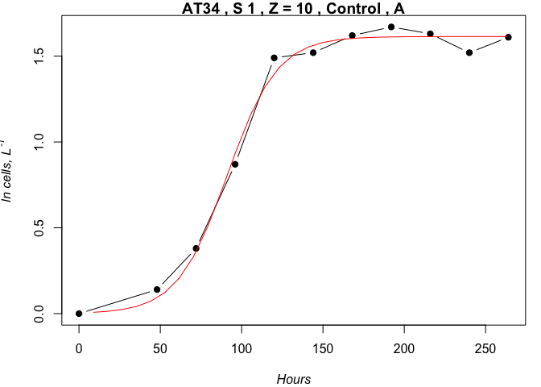
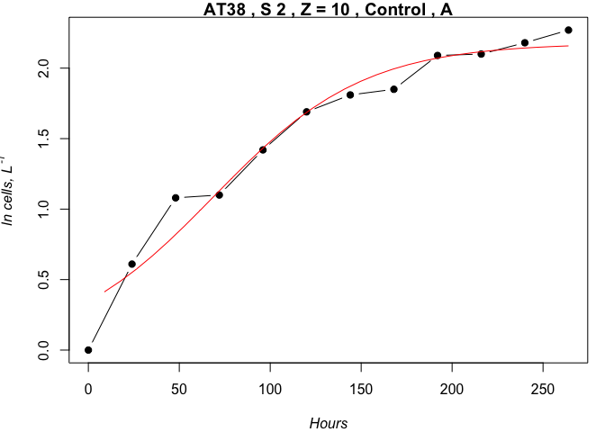
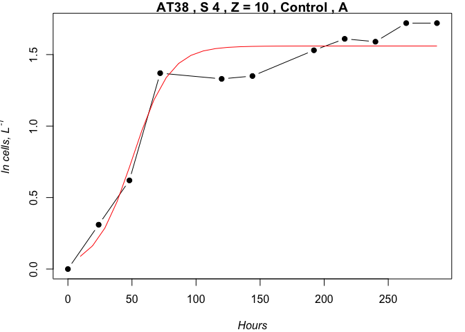

BA\_NAAMES\_Remin\_Bioassays
================
Nicholas Baetge
5/19/2020

# Intro

This document shows how **individual bottle** bacterial abundance data
from NAAMES remineralization bioassays were processed, QC’d, and
analyzed.

``` r
library(tidyverse) 
library(rmarkdown)
library(knitr)
library(readxl)
library(data.table) 
library(scales)
library(zoo)
library(oce)
library(patchwork)
#rmarkdown tables
library(stargazer)
library(pander)
library(growthcurver)
#stat tests
library(lmtest)
library(lmodel2)
library(rstatix)
library(ggpubr)
```

Here, growth curves are fitted to the logistic equation using the
GrowthCurver package. The timing of the onset of the stationary growth
phase is determined from the model
fit.

## Import and Tidy Data

``` r
ba.df <- read_csv("~/naames_bioav_ms/Input/N2-4_BactA_Remin_Master.csv") %>% 
  mutate(Season = Cruise,
         Season = gsub("AT34", "Late Spring", Season),
         Season = gsub("AT38", "Early Autumn", Season),
         Season = gsub("AT39", "Early Spring", Season),
         Treatment = ifelse(Bottle == "Niskin", "Niskin", Treatment),
         Treatment = ifelse(Bottle == "GF75", "GF75", Treatment),
         Treatment = gsub("TW15", "TW20", Treatment),
         Treatment = ifelse(is.na(Treatment), Bottle, Treatment),
         Treatment = ifelse(Treatment %in% c("100mls", "250mls", "500mls", "1L"), "Volume", Treatment),
         Treatment = gsub("Surface", "Parallel", Treatment),
         Treatment_Btl = ifelse(Bottle == "Niskin", "Niskin", Treatment_Btl),
         Treatment_Btl = ifelse(Bottle == "GF75" & is.na(Treatment_Btl), "GF75", Treatment_Btl),
         Treatment_Btl = gsub("TW15", "TW20", Treatment_Btl),
         Treatment_Btl = gsub("TW12-A", "TW12-C", Treatment_Btl),
         Treatment_Btl = gsub("TW12-B", "TW12-D", Treatment_Btl),
         Treatment_Btl = gsub("TW13-A", "TW12-E", Treatment_Btl),
         Treatment_Btl = gsub("TW13-B", "TW12-F", Treatment_Btl),
         Treatment_Btl = ifelse(is.na(Treatment_Btl), Bottle, Treatment_Btl),
         Bottle = gsub("SA", "A", Bottle),
         Bottle = gsub("SB", "B", Bottle),
         Bottle = gsub("DA", "C", Bottle),
         Bottle = gsub("DB", "D", Bottle),
         Bottle = ifelse(Bottle == "GF75", Treatment_Btl, Bottle),
         Bottle = gsub("Control-", "", Bottle),
         Bottle = gsub("TW12-", "", Bottle),
         Bottle = gsub("TW13-", "", Bottle),
         Bottle = gsub("MixDS-", "", Bottle),
         Bottle = gsub("MixSD-", "", Bottle),
         Bottle = gsub("SynExd-", "", Bottle),
         Bottle = gsub("TWExd-", "", Bottle),
         Bottle = gsub("SynLys-", "", Bottle),
         Bottle = gsub("TW5-", "", Bottle),
         Bottle = gsub("TW10-", "", Bottle),
         Bottle = gsub("TW20-", "", Bottle),
         Bottle = gsub("12", "", Bottle),
         Bottle = gsub("13", "", Bottle),
         Bottle = ifelse(Cruise == "AT34" & Station == 2 & Depth == 10 & Treatment == "TW12" & Bottle == "A", gsub("A", "C", Bottle), Bottle),
         Bottle = ifelse(Cruise == "AT34" & Station == 2 & Depth == 10 & Treatment == "TW12" & Bottle == "B", gsub("B", "D", Bottle), Bottle),
          Bottle = ifelse(Cruise == "AT34" & Station == 2 & Depth == 10 & Treatment == "TW13" & Bottle == "A", gsub("A", "E", Bottle), Bottle),
         Bottle = ifelse(Cruise == "AT34" & Station == 2 & Depth == 10 & Treatment == "TW13" & Bottle == "B", gsub("B", "F", Bottle), Bottle),
          Bottle = ifelse(Cruise == "AT34" & Station == 2 & Depth == 200 & Treatment == "Control" & Bottle == "C", gsub("C", "G", Bottle), Bottle),
         Bottle = ifelse(Cruise == "AT34" & Station == 2 & Depth == 200 & Treatment == "Control" & Bottle == "D", gsub("D", "H", Bottle), Bottle),
         Bottle = ifelse(Cruise == "AT34" & Station == 2 & Depth == 200 & Treatment == "TW12" & Bottle == "C", gsub("C", "I", Bottle),Bottle),
         Bottle = ifelse(Cruise == "AT34" & Station == 2 & Depth == 200 & Treatment == "TW12" & Bottle == "D", gsub("D", "J", Bottle), Bottle),
          Bottle = ifelse(Cruise == "AT34" & Station == 2 & Depth == 200 & Treatment == "TW13" & Bottle == "C", gsub("C", "K", Bottle), Bottle),
         Bottle = ifelse(Cruise == "AT34" & Station == 2 & Depth == 200 & Treatment == "TW13" & Bottle == "D", gsub("D", "L", Bottle), Bottle),
          Bottle = ifelse(Cruise == "AT34" & Station == 2 & Depth == 200 & Treatment == "GF75" & Bottle == "A", gsub("A", "G", Bottle), Bottle),
         Bottle = ifelse(Cruise == "AT34" & Station == 2 & Depth == 200 & Treatment == "GF75" & Bottle == "B", gsub("B", "H", Bottle), Bottle),
         Bottle = ifelse(Cruise == "AT34" & Station == 2 & Depth == 200 & Treatment == "GF75" & Bottle == "C", gsub("C", "I", Bottle), Bottle),
         Bottle = ifelse(Cruise == "AT34" & Station == 2 & Depth == 200 & Treatment == "GF75" & Bottle == "D", gsub("D", "J", Bottle), Bottle),
          Bottle = ifelse(Cruise == "AT34" & Station == 2 & Depth == 200 & Treatment == "GF75" & Bottle == "E", gsub("E", "K", Bottle), Bottle),
         Bottle = ifelse(Cruise == "AT34" & Station == 2 & Depth == 200 & Treatment == "GF75" & Bottle == "F", gsub("F", "L", Bottle), Bottle),
          Bottle = ifelse(Cruise == "AT34" & Station == 1 & Depth == 200 & Treatment == "GF75" & Bottle == "A", gsub("A", "C", Bottle), Bottle),
         Bottle = ifelse(Cruise == "AT34" & Station == 1 & Depth == 200 & Treatment == "GF75" & Bottle == "B", gsub("B", "D", Bottle), Bottle),
           Bottle = ifelse(Cruise == "AT34" & Station == 4 & Depth == 200 & Treatment == "GF75" & Bottle == "A", gsub("A", "C", Bottle), Bottle),
         Bottle = ifelse(Cruise == "AT34" & Station == 4 & Depth == 200 & Treatment == "GF75" & Bottle == "B", gsub("B", "D", Bottle), Bottle),
         Bottle = ifelse(Cruise == "AT34" & Station == 5 & Depth == 200 & Treatment == "GF75" & Bottle == "A", gsub("A", "C", Bottle), Bottle),
         Bottle = ifelse(Cruise == "AT34" & Station == 5 & Depth == 200 & Treatment == "GF75" & Bottle == "B", gsub("B", "D", Bottle), Bottle),
         Depth = gsub(5, 10, Depth),
         Depth = as.numeric(Depth)) %>% 
  rename(cells = cellsperL,
         sd_cells = sd_cellsperL,
         p_cells = p_cellsperL,
         sd_p_cells = p_sdcellsperL) %>% 
  drop_na(cells) %>% 
  select(-Treatment_Btl) %>% 
  select(Season, everything()) %>% 
  arrange(Cruise, Station, Depth, Treatment, Bottle, Hours)

ba.df$Season <- factor(ba.df$Season, levels = levels)
```

## Inspect Growth Curves

To be able to calculate derived variables, such as carbon per cell and
BGE, we’ll need to inspect the growth curves and define the stationary
phase for each experiment.

We are using the growthcurver package to fit growth curve data to the
standard form of the logistic equation and then return a data table with
population-level information. Specifically, the model outputs we are
really only interested in are:

  - t\_mid, the time at which 1/2 carrying capacity is reached. We will
    double this estimate to attain the time at which carrying capacity
    is reached (stationary)
  - sigma, a measure of the goodnesss of fit of the parameters of the
    logistic equation for the data; it is the residual sum of squares
    from the nonlinear regression model. Smaller sigma values indicate a
    better fit of the logistic curve to the data than larger values.
  - df, degrees of freedom

<!-- end list -->

``` r
gc_input <- ba.df %>% 
  filter(!Treatment %in% c("Niskin","GF75", "Volume", "Parallel", "TFF-Ret")) %>% 
  group_by(Cruise, Station, Depth, Treatment, Bottle) %>% 
  #calculate the running delta of nat log cells for each exp
  mutate(lncells = round(log(cells), 2),
         delta_lncells = lncells - lncells[which.min(Hours)],
         delta_lncells = ifelse(delta_lncells < 0, 0, delta_lncells)) 

gc_input_keys <- gc_input %>% 
  group_keys() %>% 
  mutate(key = paste(Cruise, ", S", Station, ", Z =", Depth, ",", Treatment, ",", Bottle))
gc_input_header <- gc_input_keys$key

gc_input_list <- gc_input %>% 
  group_split()
names(gc_input_list) <- gc_input_header
```

``` r
gcplot.func <- function(x){
  gc_fit <- SummarizeGrowth(x$Hours, x$delta_lncells) 
}
gcplot.list <- lapply(gc_input_list, gcplot.func)
```

For the sake of keeping the length of this document as short as
possible, the growth curve model plots are not included here. However,
they are included below in the section “Re-evaluate Growth Curves”.

## Re-evaluate Growth Curves

To improve the model fits and thus, the timing estimates of the
stationary transition for each experiment, we need to evaluate each
growth curve, manually filtering out death/secondary growth phases and
poorly replicated samples that skew the model results.

``` r
eval_gc_input <- gc_input %>% 
  mutate(key = paste(Cruise, Station, Depth, Treatment, Bottle, Timepoint, sep = ".")) %>% 
  select(Season:Treatment, key, everything()) %>% 
  filter(!Hours >= 300) %>% 
  filter(!key %in% c("AT34.1.10.Control.A.1","AT34.1.10.Control.B.1", "AT34.1.200.Control.C.3", "AT34.1.200.Control.D.3","AT34.2.10.Control.A.4", "AT34.2.10.Control.A.9", "AT34.2.10.Control.A.10", "AT34.2.10.Control.A.11","AT34.2.10.Control.A.4", "AT34.2.10.Control.B.7", "AT34.2.10.Control.B.9", "AT34.2.10.Control.A.11", "AT34.2.10.TW12.C.5",
  "AT34.2.10.TW13.E.2", "AT34.2.10.TW13.F.3", "AT34.2.200.Control.G.2", "AT34.2.200.Control.G.5", "AT34.2.200.Control.G.6", "AT34.2.200.Control.G.7", "AT34.2.200.Control.H.5", "AT34.2.200.Control.H.6", "AT34.2.200.Control.H.7", "AT34.2.200.TW12.I.2", "AT34.2.200.TW12.J.2", "AT34.2.200.TW13.K.2", "AT34.3.10.Control.A.8", "AT34.3.10.Control.A.9", "AT34.3.10.Control.A.10", "AT34.3.10.Control.B.8", "AT34.3.10.Control.B.9", "AT34.3.10.Control.B.10", "AT34.3.200.Control.C.4", "AT34.3.200.Control.C.6", "AT34.3.200.Control.C.9", "AT34.3.200.Control.D.7", "AT34.4.200.Control.C.5", "AT34.4.200.Control.C.6", "AT34.4.200.Control.C.7", "AT34.4.200.Control.D.5", "AT34.4.200.Control.D.6", "AT34.4.200.Control.D.7", "AT34.5.10.Control.A.5", "AT34.5.10.Control.B.5", "AT34.U.10.Control.A.5", "AT34.U.10.Control.B.8", "AT34.U.10.Control.B.1", "AT38.1.10.Control.A.1", "AT38.1.10.Control.B.7", "AT38.1.10.MixSD.G.6", "AT38.1.10.SynExd.I.8", "AT38.1.10.SynExd.I.9", "AT38.1.10.SynExd.I.10", "AT38.1.10.SynExd.J.8", "AT38.1.10.SynExd.J.9", "AT38.1.10.SynExd.J.10", "AT38.1.10.SynLys.M.9", "AT38.1.10.SynLys.M.10", "AT38.1.10.SynLys.N.9", "AT38.1.10.SynLys.N.10", "AT38.1.200.Control.F.5", "AT38.1.200.Control.F.6", "AT38.1.200.Control.E.5", "AT38.1.200.Control.E.6", "AT38.1.200.MixDS.C.5", "AT38.1.200.MixDS.C.8", "AT38.1.200.MixDS.D.5", "AT38.1.200.MixDS.D.6", "AT38.4.10.Control.A.7", "AT38.4.10.Control.B.7", "AT38.4.10.Control.B.8", "AT38.5.10.Control.A.9", "AT38.5.10.Control.A.10", "AT38.5.10.Control.A.11", "AT38.5.10.Control.B.7"))

eval_gc_input_keys <- eval_gc_input %>% 
  group_keys() %>% 
  mutate(key = paste(Cruise, ", S", Station, ", Z =", Depth, ",", Treatment, ",", Bottle)) 
eval_gc_input_header <- eval_gc_input_keys$key

eval_gc_input_list <- eval_gc_input %>% 
  group_split()
names(eval_gc_input_list) <- eval_gc_input_header

eval_gcplot.list <- lapply(eval_gc_input_list, gcplot.func)
```

We’ve omitted 88 of the 768 (~11%) of the observations to improve the
model fit. 47% of those omitted observations were taken after 300 hours,
which for many experiments constituted the death phase.

``` r
for (i in 1:length(eval_gcplot.list)) {
  plot(eval_gcplot.list[[i]], main = names(eval_gcplot.list[i]), xlab = expression(italic("Hours")) , ylab = expression(italic(paste("ln cells, L"^"-1") ))) 
}
```

<!-- --><!-- --><!-- --><!-- --><!-- --><!-- --><!-- --><!-- --><!-- --><!-- --><!-- --><!-- --><!-- --><!-- --><!-- --><!-- --><!-- --><!-- --><!-- --><!-- --><!-- --><!-- --><!-- --><!-- --><!-- --><!-- --><!-- --><!-- --><!-- --><!-- --><!-- --><!-- --><!-- --><!-- --><!-- --><!-- --><!-- --><!-- --><!-- --><!-- --><!-- --><!-- --><!-- --><!-- --><!-- --><!-- --><!-- --><!-- --><!-- --><!-- --><!-- --><!-- --><!-- --><!-- --><!-- --><!-- --><!-- --><!-- --><!-- --><!-- --><!-- --><!-- --><!-- --><!-- --><!-- --><!-- --><!-- --><!-- --><!-- --><!-- --><!-- --><!-- --><!-- --><!-- --><!-- --><!-- --><!-- --><!-- -->

## Wrangle GrowthCurver Data

We’ll add the model output data to the original dataframe, but first
we’ll tidy the model output and look at the distribution of the model
fits.

We’ll determine thresholds for sigma (smaller sigma values indicate a
better fit) and df for omission of model fit data.

``` r
gcdata.func <- function(y){
  gc.fit <- SummarizeGrowth(y$Hours, y$delta_lncells)
  gcdata.df <- as.data.frame(unlist(gc.fit$vals), stringsAsFactors = FALSE)
}

gcdata <- eval_gc_input_list %>% 
  lapply(., gcdata.func) %>% 
  #save the list as a data frame %>% 
  data.frame(.) %>% 
  t(.) %>% 
  as_tibble(.) %>% 
  mutate_at(., vars(k:auc_e), as.numeric) %>% 
  mutate_at(vars(sigma, t_mid), round, 2) %>% 
  #calculate time to stationary for each curve
  mutate(stationary = round(t_mid*2)) %>% 
  mutate(key = eval_gc_input_header) %>% 
  ungroup() 
```


Based on these two histograms, we’ll omit model fit data where sigma \>
0.21 and df \< 4. In these experiments, we cannot reliably distinguish
the onset of stationary.

``` r
gcmerge.df <- eval_gc_input %>% 
  mutate(key = paste(Cruise, ", S", Station, ", Z =", Depth, ",", Treatment, ",", Bottle)) %>% 
  full_join(., gcdata %>% filter(!sigma > 0.21 | !df < 4)) %>% 
  ungroup() 
```

## Add Stationary Timepoint

We’ll add a row to each experiment that includes the stationary
timepoint.

``` r
gcmerge.list <- gcmerge.df %>% 
  #Split the dataframe into lists
  split(.,  .$key)

#add row to each list element
newrow.func <- function(morty){
  morty[nrow(morty) + 1,] <- NA
  rick <- morty %>% 
    fill(Season:Bottle, Treatment, key, stationary)
  rick
}

#apply function to list
gcstat.list <- lapply(gcmerge.list, newrow.func)

gcstat.df <- plyr::ldply(gcstat.list, data.frame) %>% 
  select(Season:Hours, stationary, cells:auc_e) %>%
  mutate(Hours = ifelse(is.na(Hours), stationary, Hours))
```

## Save Data

``` r
#saveRDS(gcstat.df, "Output/processed_bacterial_abundance.rds")
```
