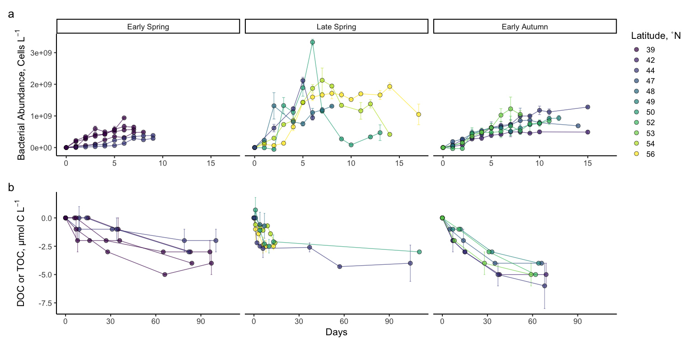

BCD and DOC Bioavailability
================
Nicholas Baetge
5/26/2020

# Intro

This document shows plots and tables of the merged field-experiment
NAAMES DOC data.

``` r
library(tidyverse) 
library(rmarkdown)
library(knitr)
library(readxl)
library(data.table) 
library(scales)
library(zoo)
library(oce)
library(patchwork)
#rmarkdown tables
library(stargazer)
library(pander)
library(growthcurver)
#stat tests
library(lmtest)
library(lmodel2)
library(rstatix)
library(ggpubr)
```

# Import Data

``` r
doc <- read_rds("~/GITHUB/naames_bioav_ms/Output/processed_bioavailability.rds") %>% 
   select(-c(Bottle, doc, interp_doc)) %>% 
  arrange(Cruise, Station, Hours) %>% 
  distinct() %>% 
  mutate(bge = ifelse(Cruise == "AT39" & Station == 4, T, F),
         bge = ifelse(Cruise == "AT34" & Station %in% c(1, 2, 3), T, bge),
         bge = ifelse(Cruise == "AT38" & Station %in% c(3, 6), T, bge),
         degree_bin = as.character(degree_bin))  %>% 
  distinct() 


bcd <- read_rds("~/GITHUB/naames_bioav_ms/Output/processed_integrated_BCD.rds") %>% 
  group_by(Cruise, Station) %>% 
  mutate(ave_int.BCD = mean(int.bcd, na.rm = T),
         sd_int.BCD = sd(int.bcd, na.rm = T),
         ave_int.bp = mean(int.bp, na.rm = T),
         sd_int.bp = sd(int.bp, na.rm = T),
         ave_int.ba = mean(int.ba, na.rm = T),
         sd_int.ba = sd(int.ba, na.rm = T),
         ave_int.bc_i = mean(int.bc_i, na.rm = T),
         sd_int.bc_i = sd(int.bc_i, na.rm = T),
         ave_int.bc_s = mean(int.bc_s, na.rm = T),
         sd_int.bc_s = sd(int.bc_s, na.rm = T),
         ave_int.NPP = mean(int.NPP, na.rm = T),
         sd_int.NPP = sd(int.NPP, na.rm = T),
         ave_int.mew_i = mean(mew.season_i, na.rm = T),
         sd_int.mew_i = sd(mew.season_i, na.rm = T),
         ave_int.mew_s = mean(mew.season_s, na.rm = T),
         sd_int.mew_s = sd(mew.season_s, na.rm = T),
         ave_bcd.npp = mean(bcd.npp, na.rm = T),
         sd_bcd.npp = sd(bcd.npp, na.rm = T)) %>% 
  ungroup() %>% 
  mutate_at(vars(ave_int.bp, sd_int.bp, ave_int.bc_i:sd_int.mew_s), round, 2) %>% 
  mutate_at(vars(ave_bcd.npp, sd_bcd.npp), round)
```

Units for imported data frames are currently:

  - BP, µmol C m<sup>-3</sup> d<sup>-1</sup>
  - BCD, µmol C m<sup>-3</sup> d<sup>-1</sup>
  - BA, cells m<sup>-3</sup>
  - BC, µmol C m<sup>-3</sup>
  - mew, d<sup>-1</sup>
  - NPP, µmol C m<sup>-3</sup> d<sup>-1</sup>
  - ∆DOC (from export MS, integrated to Ez), mol C m<sup>-2</sup>

NPP and BCD are converted to: mmol C m<sup>-3</sup> d<sup>-1</sup>

# Box plots: NPP, BP, BA, µ, ∆DOC

``` r
doc %>% 
  select(Season,  ave_Ez, ave_NCP_mol_ez, ave_int_delta_DOC_ez) %>%
  mutate_at(vars("ave_NCP_mol_ez", "ave_int_delta_DOC_ez"), funs(./ave_Ez * 10^3)) %>% 
  drop_na(ave_NCP_mol_ez) %>% 
  distinct() %>% 
  mutate(doc_ncp = ave_int_delta_DOC_ez/ave_NCP_mol_ez) %>% 
  group_by(Season) %>% 
  summarise(ave_doc_ncp = round(mean(doc_ncp),2),
            sd_doc_ncp = round(sd(doc_ncp), 2))
```

    ## # A tibble: 4 x 3
    ##   Season       ave_doc_ncp sd_doc_ncp
    ##   <chr>              <dbl>      <dbl>
    ## 1 Early Autumn        0.18       0.07
    ## 2 Early Spring        0.11       0.12
    ## 3 Late Autumn         0.14       0.05
    ## 4 Late Spring         0.12       0.06


# Bar plots: NPP, BP, BA, µ, ∆DOC


Error bars for µ represent standard deviation from mean of values
calculated using different CCFs to convert BA to BC (Global Initial CCF,
Global Stationary CCF, Season-Specific Initial CCF, Season-Specific
Stationary CCF). All other error bars represent standard deviation from
mean of station
values.

# Line plots: DOC Decay Curves




Black vertical dashed and dotted lines indicate the 7 and 30-day marks,
respectively. Dashed decay lines indicate experiments in which BGEs
could be calculated.

# Table: ∆DOC, Bioavailability, Persistence

Seasonally accumulated DOC is expressed as mmol C m<sup>-3</sup> or µmol
C L<sup>-1</sup>

``` r
bioav.table <- doc %>% 
  select(Season, Station, degree_bin, ave_Ez, sd_Ez, ave_int_delta_DOC_ez, sd_int_delta_DOC_ez, accm_doc, sd_accm_doc, total.bioav_accm_doc:lt.bioav_accm_doc, total.per_bioav:bge) %>% 
  distinct() %>% 
  mutate_at(vars(ave_int_delta_DOC_ez, sd_int_delta_DOC_ez), funs(round((./ave_Ez) * 10^3, 2))) %>% 
    mutate_at(vars(contains("ddoc")), funs(round(./10^3, 2))) %>% 
  arrange(factor(Season, levels = levels), degree_bin) %>% 
  ungroup()
```

| Season       | Station | degree\_bin | ave\_Ez | sd\_Ez | ave\_int\_delta\_DOC\_ez | sd\_int\_delta\_DOC\_ez | accm\_doc | sd\_accm\_doc | total.bioav\_accm\_doc | st.bioav\_accm\_doc | lt.bioav\_accm\_doc | total.per\_bioav | st.per\_bioav | lt.per\_bioav | persis\_doc | per\_persis | st.ddoc | lt.ddoc | total.ddoc | bge   |
| :----------- | :------ | :---------- | ------: | -----: | -----------------------: | ----------------------: | --------: | ------------: | ---------------------: | ------------------: | ------------------: | ---------------: | ------------: | ------------: | ----------: | ----------: | ------: | ------: | ---------: | :---- |
| Early Spring | 1       | 39          |     106 |      0 |                     1.79 |                    0.28 |       4.2 |           0.6 |                    4.7 |                 2.0 |                 2.7 |              112 |            48 |            64 |       \-0.5 |        \-12 |    0.29 |    0.04 |       0.06 | FALSE |
| Early Spring | 2       | 39          |      98 |      0 |                     1.43 |                    0.20 |       3.5 |           0.1 |                    3.1 |                 0.3 |                 2.8 |               89 |             9 |            80 |         0.4 |          11 |    0.04 |    0.04 |       0.04 | FALSE |
| Early Spring | S2RD    | 39          |      NA |     NA |                       NA |                      NA |       4.5 |           0.1 |                    3.7 |                 0.9 |                 2.8 |               82 |            20 |            62 |         0.8 |          18 |    0.13 |    0.03 |       0.04 | FALSE |
| Early Spring | S2RF    | 39          |      NA |     NA |                       NA |                      NA |       3.0 |           0.7 |                    2.9 |                 0.1 |                 2.8 |               97 |             3 |            93 |         0.1 |           3 |    0.01 |    0.03 |       0.03 | FALSE |
| Early Spring | 3       | 44          |     120 |      0 |                     2.67 |                    0.00 |       4.3 |           0.3 |                    3.1 |                 0.0 |                 3.1 |               72 |             0 |            72 |         1.2 |          28 |    0.00 |    0.04 |       0.04 | FALSE |
| Early Spring | 4       | 44          |     126 |      0 |                     0.08 |                    0.00 |       2.6 |           0.3 |                    1.8 |                 0.7 |                 1.1 |               69 |            27 |            42 |         0.8 |          31 |    0.10 |    0.01 |       0.02 | TRUE  |
| Late Spring  | 5       | 44          |      91 |      0 |                     3.52 |                    1.10 |      11.7 |           0.5 |                    4.0 |                 2.7 |                 1.3 |               34 |            23 |            11 |         7.7 |          66 |    0.39 |    0.01 |       0.04 | FALSE |
| Late Spring  | 4       | 48          |     125 |     31 |                     2.00 |                    0.56 |       2.8 |           0.8 |                     NA |                 0.7 |                  NA |               NA |            25 |            NA |          NA |          NA |    0.10 |      NA |         NA | FALSE |
| Late Spring  | 3       | 50          |      52 |      0 |                     3.85 |                    0.77 |       7.9 |           0.0 |                     NA |                 2.3 |                  NA |               NA |            29 |            NA |          NA |          NA |    0.33 |      NA |         NA | TRUE  |
| Late Spring  | 0       | 54          |      87 |      0 |                     2.07 |                    0.00 |        NA |            NA |                     NA |                  NA |                  NA |               NA |            NA |            NA |          NA |          NA |      NA |      NA |         NA | FALSE |
| Late Spring  | 2       | 54          |      54 |      0 |                     3.33 |                    0.56 |       6.9 |           0.4 |                     NA |                 1.0 |                  NA |               NA |            14 |            NA |          NA |          NA |    0.14 |      NA |         NA | TRUE  |
| Late Spring  | 1       | 56          |      72 |      0 |                     0.42 |                    0.14 |       3.3 |           1.0 |                     NA |                 2.5 |                  NA |               NA |            76 |            NA |          NA |          NA |    0.36 |      NA |         NA | TRUE  |
| Early Autumn | 1       | 42          |     244 |      0 |                     1.72 |                    0.00 |      12.2 |           0.2 |                    4.7 |                 2.3 |                 2.4 |               39 |            19 |            20 |         7.5 |          61 |    0.33 |    0.04 |       0.07 | FALSE |
| Early Autumn | 2       | 44          |     207 |      0 |                     4.30 |                    0.19 |      18.9 |           0.8 |                    5.9 |                 1.6 |                 4.3 |               31 |             8 |            23 |        13.0 |          69 |    0.23 |    0.07 |       0.09 | FALSE |
| Early Autumn | 3       | 47          |     200 |      0 |                     1.10 |                    0.05 |      14.1 |           1.6 |                    4.5 |                 1.6 |                 2.9 |               32 |            11 |            21 |         9.6 |          68 |    0.23 |    0.05 |       0.07 | TRUE  |
| Early Autumn | 4       | 49          |     188 |      0 |                     5.11 |                    0.00 |      15.1 |           0.4 |                    3.8 |                 0.9 |                 2.9 |               25 |             6 |            19 |        11.3 |          75 |    0.13 |    0.05 |       0.06 | FALSE |
| Early Autumn | 5       | 52          |     157 |      0 |                     4.84 |                    0.00 |      14.2 |           0.6 |                    5.3 |                 0.9 |                 4.4 |               37 |             6 |            31 |         8.9 |          63 |    0.13 |    0.08 |       0.09 | FALSE |
| Early Autumn | 6       | 53          |     102 |      6 |                     3.63 |                    0.59 |       8.9 |           0.3 |                    5.0 |                 1.8 |                 3.2 |               56 |            20 |            36 |         3.9 |          44 |    0.26 |    0.06 |       0.09 | TRUE  |
| Late Autumn  | 7       | 40          |     112 |     14 |                     6.25 |                    0.00 |        NA |            NA |                     NA |                  NA |                  NA |               NA |            NA |            NA |          NA |          NA |      NA |      NA |         NA | FALSE |
| Late Autumn  | 6       | 43          |     103 |      0 |                     7.57 |                    0.00 |        NA |            NA |                     NA |                  NA |                  NA |               NA |            NA |            NA |          NA |          NA |      NA |      NA |         NA | FALSE |
| Late Autumn  | 5       | 44          |     103 |      0 |                     5.53 |                    0.00 |        NA |            NA |                     NA |                  NA |                  NA |               NA |            NA |            NA |          NA |          NA |      NA |      NA |         NA | FALSE |
| Late Autumn  | 4       | 46          |     126 |      0 |                     3.10 |                    0.00 |        NA |            NA |                     NA |                  NA |                  NA |               NA |            NA |            NA |          NA |          NA |      NA |      NA |         NA | FALSE |
| Late Autumn  | 3       | 51          |      59 |      0 |                     7.12 |                    0.00 |        NA |            NA |                     NA |                  NA |                  NA |               NA |            NA |            NA |          NA |          NA |      NA |      NA |         NA | FALSE |
| Late Autumn  | 2       | 54          |     104 |      0 |                     1.54 |                    0.00 |        NA |            NA |                     NA |                  NA |                  NA |               NA |            NA |            NA |          NA |          NA |      NA |      NA |         NA | FALSE |

Seasonal Accumulated DOC Bioavailability and Persistance

``` r
bioav.table2 <- bioav.table %>% 
  select(-c(ave_Ez:sd_int_delta_DOC_ez)) %>% 
  drop_na(accm_doc) %>% 
  group_by(Season) %>% 
  summarize(accm = mean(accm_doc, na.rm = T),
            sd_accm = sd(accm_doc, na.rm = T),
            total.bv = mean(total.bioav_accm_doc, na.rm = T),
            sd_total.bv = sd(total.bioav_accm_doc, na.rm = T),
            st.bv = mean(st.bioav_accm_doc, na.rm = T),
            sd_st.bv = sd(st.bioav_accm_doc, na.rm = T),
            total.per_bv = mean(total.per_bioav, na.rm = T),
            sd_total.per_bv = sd(total.per_bioav, na.rm = T),
            st.per_bv = mean(st.per_bioav, na.rm = T),
            sd_st.per_bv = sd(st.per_bioav, na.rm = T),
            pers = mean(persis_doc, na.rm = T),
            sd_pers = sd(persis_doc, na.rm = T),
            per_pers = mean(per_persis, na.rm = T),
            sd_per_pers = sd(per_persis, na.rm = T),
            st.ddoc_rate = mean(st.ddoc, na.rm = T),
            sd_st.ddoc_rate = sd(st.ddoc, na.rm = T),
            total.ddoc_rate = mean(total.ddoc, na.rm = T),
            sd_total.ddoc_rate = sd(total.ddoc, na.rm = T),
            stations = n()
            
            ) %>% 
  mutate_at(vars(accm:sd_st.bv, pers, sd_pers), round, 1) %>% 
  mutate_at(vars(contains(c("per_", "rate"))), round) %>% 
  arrange(factor(Season, levels = levels))
```

| Season       | accm | sd\_accm | total.bv | sd\_total.bv | st.bv | sd\_st.bv | total.per\_bv | sd\_total.per\_bv | st.per\_bv | sd\_st.per\_bv | pers | sd\_pers | per\_pers | sd\_per\_pers | st.ddoc\_rate | sd\_st.ddoc\_rate | total.ddoc\_rate | sd\_total.ddoc\_rate | stations |
| :----------- | ---: | -------: | -------: | -----------: | ----: | --------: | ------------: | ----------------: | ---------: | -------------: | ---: | -------: | --------: | ------------: | ------------: | ----------------: | ---------------: | -------------------: | -------: |
| Early Spring |  3.7 |      0.8 |      3.2 |          1.0 |   0.7 |       0.7 |            87 |                16 |         18 |             18 |  0.5 |      0.6 |        13 |            16 |             0 |                 0 |                0 |                    0 |        6 |
| Late Spring  |  6.5 |      3.6 |      4.0 |           NA |   1.8 |       0.9 |            34 |                NA |         33 |             24 |  7.7 |       NA |        66 |            NA |             0 |                 0 |                0 |                   NA |        5 |
| Early Autumn | 13.9 |      3.3 |      4.9 |          0.7 |   1.5 |       0.5 |            37 |                11 |         12 |              6 |  9.0 |      3.2 |        63 |            11 |             0 |                 0 |                0 |                    0 |        6 |

Seasonal Accumulated DOC Bioavailability and Persistance

``` r
bioav.table3 <- bioav.table %>% 
  select(-c(ave_Ez:sd_int_delta_DOC_ez)) %>% 
  drop_na(accm_doc) %>% 
  group_by(Season, degree_bin) %>% 
  summarize(accm = mean(accm_doc, na.rm = T),
            sd_accm = sd(accm_doc, na.rm = T),
            total.bv = mean(total.bioav_accm_doc, na.rm = T),
            sd_total.bv = sd(total.bioav_accm_doc, na.rm = T),
            st.bv = mean(st.bioav_accm_doc, na.rm = T),
            sd_st.bv = sd(st.bioav_accm_doc, na.rm = T),
            total.per_bv = mean(total.per_bioav, na.rm = T),
            sd_total.per_bv = sd(total.per_bioav, na.rm = T),
            st.per_bv = mean(st.per_bioav, na.rm = T),
            sd_st.per_bv = sd(st.per_bioav, na.rm = T),
            pers = mean(persis_doc, na.rm = T),
            sd_pers = sd(persis_doc, na.rm = T),
            per_pers = mean(per_persis, na.rm = T),
            sd_per_pers = sd(per_persis, na.rm = T),
            st.ddoc_rate = mean(st.ddoc, na.rm = T),
            sd_st.ddoc_rate = sd(st.ddoc, na.rm = T),
            total.ddoc_rate = mean(total.ddoc, na.rm = T),
            sd_total.ddoc_rate = sd(total.ddoc, na.rm = T),
            stations = n()
            
            ) %>% 
  mutate_at(vars(accm:sd_st.bv, pers, sd_pers), round, 1) %>% 
  mutate_at(vars(contains(c("per_", "rate"))), round) %>% 
  arrange(factor(Season, levels = levels))
```

| Season       | degree\_bin | accm | sd\_accm | total.bv | sd\_total.bv | st.bv | sd\_st.bv | total.per\_bv | sd\_total.per\_bv | st.per\_bv | sd\_st.per\_bv | pers | sd\_pers | per\_pers | sd\_per\_pers | st.ddoc\_rate | sd\_st.ddoc\_rate | total.ddoc\_rate | sd\_total.ddoc\_rate | stations |
| :----------- | :---------- | ---: | -------: | -------: | -----------: | ----: | --------: | ------------: | ----------------: | ---------: | -------------: | ---: | -------: | --------: | ------------: | ------------: | ----------------: | ---------------: | -------------------: | -------: |
| Early Spring | 39          |  3.8 |      0.7 |      3.6 |          0.8 |   0.8 |       0.9 |            95 |                13 |         20 |             20 |  0.2 |      0.5 |         5 |            13 |             0 |                 0 |                0 |                    0 |        4 |
| Early Spring | 44          |  3.4 |      1.2 |      2.4 |          0.9 |   0.4 |       0.5 |            70 |                 2 |         14 |             19 |  1.0 |      0.3 |        30 |             2 |             0 |                 0 |                0 |                    0 |        2 |
| Late Spring  | 44          | 11.7 |       NA |      4.0 |           NA |   2.7 |        NA |            34 |                NA |         23 |             NA |  7.7 |       NA |        66 |            NA |             0 |                NA |                0 |                   NA |        1 |
| Late Spring  | 48          |  2.8 |       NA |      NaN |           NA |   0.7 |        NA |           NaN |                NA |         25 |             NA |  NaN |       NA |       NaN |            NA |             0 |                NA |              NaN |                   NA |        1 |
| Late Spring  | 50          |  7.9 |       NA |      NaN |           NA |   2.3 |        NA |           NaN |                NA |         29 |             NA |  NaN |       NA |       NaN |            NA |             0 |                NA |              NaN |                   NA |        1 |
| Late Spring  | 54          |  6.9 |       NA |      NaN |           NA |   1.0 |        NA |           NaN |                NA |         14 |             NA |  NaN |       NA |       NaN |            NA |             0 |                NA |              NaN |                   NA |        1 |
| Late Spring  | 56          |  3.3 |       NA |      NaN |           NA |   2.5 |        NA |           NaN |                NA |         76 |             NA |  NaN |       NA |       NaN |            NA |             0 |                NA |              NaN |                   NA |        1 |
| Early Autumn | 42          | 12.2 |       NA |      4.7 |           NA |   2.3 |        NA |            39 |                NA |         19 |             NA |  7.5 |       NA |        61 |            NA |             0 |                NA |                0 |                   NA |        1 |
| Early Autumn | 44          | 18.9 |       NA |      5.9 |           NA |   1.6 |        NA |            31 |                NA |          8 |             NA | 13.0 |       NA |        69 |            NA |             0 |                NA |                0 |                   NA |        1 |
| Early Autumn | 47          | 14.1 |       NA |      4.5 |           NA |   1.6 |        NA |            32 |                NA |         11 |             NA |  9.6 |       NA |        68 |            NA |             0 |                NA |                0 |                   NA |        1 |
| Early Autumn | 49          | 15.1 |       NA |      3.8 |           NA |   0.9 |        NA |            25 |                NA |          6 |             NA | 11.3 |       NA |        75 |            NA |             0 |                NA |                0 |                   NA |        1 |
| Early Autumn | 52          | 14.2 |       NA |      5.3 |           NA |   0.9 |        NA |            37 |                NA |          6 |             NA |  8.9 |       NA |        63 |            NA |             0 |                NA |                0 |                   NA |        1 |
| Early Autumn | 53          |  8.9 |       NA |      5.0 |           NA |   1.8 |        NA |            56 |                NA |         20 |             NA |  3.9 |       NA |        44 |            NA |             0 |                NA |                0 |                   NA |        1 |

Seasonal Accumulated DOC Bioavailability and
Persistance

# Bar plots: Experiment ∆DOC and %Bioavailability


# Table: NPP and BCD

NPP and BCD are converted to: mmol C m<sup>-3</sup> d<sup>-1</sup>

``` r
bcd_table <- bcd %>% 
  select(Cruise:degree_bin, ave_int.BCD, sd_int.BCD) %>% 
  distinct() %>% 
  mutate_at(vars(ave_int.BCD, sd_int.BCD), funs(./10^3)) %>% 
  distinct() %>% 
  left_join(., bcd %>%
              group_by(Cruise, Station) %>% 
              mutate(ave_Ez = mean(Ez, na.rm = T),
                     sd_Ez = sd(Ez, na.rm = T)) %>% 
              ungroup() %>% 
              select(Cruise:degree_bin, ave_Ez, sd_Ez, ave_int.NPP, sd_int.NPP) %>% 
              distinct() %>% 
              mutate_at(vars(contains("NPP")), funs(round(./10^3, 2)))
            ) %>% 
  left_join(., bcd %>% 
              select(Cruise:degree_bin, ave_bcd.npp, sd_bcd.npp) %>% 
              distinct()
            ) %>% 
  select(Cruise:degree_bin, ave_Ez:sd_int.NPP, everything()) %>% 
  mutate_at(vars(ave_Ez, sd_Ez), round) %>% 
  mutate_at(vars(ave_int.NPP:sd_int.BCD), round, 2) %>% 
  arrange(factor(Season, levels = levels), degree_bin)
```

| Cruise | Subregion   | Season       | Station | degree\_bin | ave\_Ez | sd\_Ez | ave\_int.NPP | sd\_int.NPP | ave\_int.BCD | sd\_int.BCD | ave\_bcd.npp | sd\_bcd.npp |
| :----- | :---------- | :----------- | ------: | ----------: | ------: | -----: | -----------: | ----------: | -----------: | ----------: | -----------: | ----------: |
| AT39   | GS/Sargasso | Early Spring |       1 |          39 |     106 |      0 |         0.60 |        0.00 |         0.11 |        0.00 |           19 |           0 |
| AT39   | GS/Sargasso | Early Spring |       2 |          39 |      98 |      0 |         1.31 |        0.00 |         0.30 |        0.00 |           23 |           0 |
| AT39   | Subtropical | Early Spring |       3 |          44 |     120 |      0 |         0.41 |        0.00 |         0.09 |        0.00 |           21 |           0 |
| AT39   | Subtropical | Early Spring |       4 |          44 |     126 |      0 |         0.56 |        0.00 |         0.06 |        0.00 |           11 |           0 |
| AT34   | Subtropical | Late Spring  |       5 |          44 |      91 |      0 |         0.99 |        0.00 |         0.51 |        0.00 |           52 |           0 |
| AT34   | Subtropical | Late Spring  |       4 |          48 |     116 |     22 |         0.82 |        0.15 |         0.17 |        0.07 |           20 |           5 |
| AT34   | Temperate   | Late Spring  |       3 |          50 |      52 |      0 |         3.34 |        0.00 |         0.47 |        0.00 |           14 |           0 |
| AT34   | Subpolar    | Late Spring  |       0 |          54 |      87 |      0 |         1.47 |        0.00 |         0.24 |        0.00 |           16 |           0 |
| AT34   | Subpolar    | Late Spring  |       2 |          54 |      54 |      0 |         2.86 |        0.00 |         0.62 |        0.00 |           22 |           0 |
| AT34   | Subpolar    | Late Spring  |       1 |          56 |      72 |      0 |         1.36 |        0.00 |         0.40 |        0.00 |           29 |           0 |
| AT38   | GS/Sargasso | Early Autumn |       1 |          42 |     244 |      0 |         0.11 |        0.00 |         0.12 |        0.00 |          103 |           0 |
| AT38   | Subtropical | Early Autumn |       2 |          44 |     207 |      0 |         0.23 |        0.00 |         0.15 |        0.00 |           65 |           0 |
| AT38   | Subtropical | Early Autumn |       3 |          47 |     200 |      0 |         0.18 |        0.00 |         0.07 |        0.00 |           38 |           0 |
| AT38   | Subtropical | Early Autumn |       4 |          49 |     188 |      0 |         0.19 |        0.00 |         0.09 |        0.00 |           48 |           0 |
| AT38   | Temperate   | Early Autumn |       5 |          52 |     157 |      0 |         0.42 |        0.00 |         0.12 |        0.00 |           28 |           0 |
| AT38   | Subpolar    | Early Autumn |       6 |          53 |     103 |      6 |         0.66 |        0.07 |         0.13 |        0.03 |           20 |           5 |
| AT32   | Subtropical | Late Autumn  |       7 |          40 |      98 |      0 |         0.25 |        0.00 |         0.17 |        0.00 |           69 |           0 |
| AT32   | Subtropical | Late Autumn  |       6 |          43 |     103 |      0 |         0.19 |        0.00 |         0.15 |        0.00 |           79 |           0 |
| AT32   | Subtropical | Late Autumn  |       5 |          44 |     103 |      0 |         0.17 |        0.00 |         0.15 |        0.00 |           89 |           0 |
| AT32   | Subtropical | Late Autumn  |       4 |          46 |     126 |      0 |         0.17 |        0.00 |         0.13 |        0.00 |           74 |           0 |
| AT32   | Temperate   | Late Autumn  |       3 |          51 |      59 |      0 |         0.11 |        0.00 |         0.13 |        0.00 |          114 |           0 |
| AT32   | Subpolar    | Late Autumn  |       2 |          54 |     104 |      0 |         0.18 |        0.00 |         0.13 |        0.00 |           72 |           0 |

BCD & NPP

``` r
bcd_table2 <- bcd_table %>% 
  group_by(Cruise) %>% 
  summarize(Ez = mean(ave_Ez),
            sd_Ez = sd(ave_Ez),
            NPP = mean(ave_int.NPP), 
            sd_NPP = sd(ave_int.NPP),
            BCD = mean(ave_int.BCD),
            sd_BCD = sd(ave_int.BCD),
            BCD_NPP = mean(ave_bcd.npp),
            sd_BCD_NPP = sd(ave_bcd.npp))
```

# Bar plots: BCD and BCD:NPP

We’ll convert BCD and NPP to mmol C m<sup>-3</sup> d<sup>-1</sup> before
plotting.


# Merge DOC and BCD data

Here we merge the integrated and depth-normalized data. We’ll also
convert:

  - BCD to mmol C m<sup>-3</sup> d<sup>-1</sup>
  - BC to mmol C m<sup>-3</sup>
  - NPP to mmol C m<sup>-3</sup> d<sup>-1</sup>
  - ∆DOC to mmol C m<sup>-3</sup> (µmol C L<sup>-1</sup>)

<!-- end list -->

``` r
bcd_bioav <- bcd %>% 
  group_by(Cruise, Station) %>%
  mutate(ave_Ez = mean(Ez, na.rm = T),
         sd_Ez = sd(Ez, na.rm = T)) %>% 
  ungroup() %>% 
  select(Cruise:degree_bin, contains(c("_Ez", "_int.", "_bcd.npp"))) %>% distinct() %>% 
  mutate(Station = as.character(Station)) %>% 
  left_join(., doc %>% 
              select(Cruise:Subregion, degree_bin, ave_int_delta_DOC_ez, sd_int_delta_DOC_ez, accm_doc:bge) %>%
              distinct() %>% 
              mutate(degree_bin = as.numeric(degree_bin))
            ) %>% 
  mutate_at(vars(ave_int.bc_i:sd_int.NPP, ave_int.BCD, sd_int.BCD),
            funs(round(./10^3, 2))) %>% 
  mutate_at(vars(ave_int_delta_DOC_ez, sd_int_delta_DOC_ez),
            funs(round(./ave_Ez * 10^3, 2))) %>% 
  group_by(Cruise, Station) %>% 
  mutate(ave_int.mew = (ave_int.mew_i + ave_int.mew_s)/2,
         sd_int.mew = sqrt(mean(c((ave_int.mew_i - ave_int.mew)^2,  (ave_int.mew_s - ave_int.mew)^2))))
```

# Regressions: Property-Property

## \*\* BCD v NPP

    ## RMA was not requested: it will not be computed.

    ## 
    ## Model II regression
    ## 
    ## Call: lmodel2(formula = ave_int.BCD ~ ave_int.NPP, data = bcd_bioav,
    ## nperm = 99)
    ## 
    ## n = 22   r = 0.8370984   r-square = 0.7007338 
    ## Parametric P-values:   2-tailed = 1.190448e-06    1-tailed = 5.952238e-07 
    ## Angle between the two OLS regression lines = 3.5289 degrees
    ## 
    ## Permutation tests of OLS, MA, RMA slopes: 1-tailed, tail corresponding to sign
    ## A permutation test of r is equivalent to a permutation test of the OLS slope
    ## P-perm for SMA = NA because the SMA slope cannot be tested
    ## 
    ## Regression results
    ##   Method  Intercept     Slope Angle (degrees) P-perm (1-tailed)
    ## 1    OLS 0.09272980 0.1489713        8.473114              0.01
    ## 2     MA 0.09167930 0.1503652        8.551230              0.01
    ## 3    SMA 0.07088173 0.1779615       10.090803                NA
    ## 
    ## Confidence intervals
    ##   Method 2.5%-Intercept 97.5%-Intercept 2.5%-Slope 97.5%-Slope
    ## 1    OLS     0.04104343       0.1444162  0.1035618   0.1943808
    ## 2     MA     0.05686724       0.1260248  0.1047922   0.1965573
    ## 3    SMA     0.03236217       0.1008067  0.1382541   0.2290731
    ## 
    ## Eigenvalues: 0.7793176 0.007066147 
    ## 
    ## H statistic used for computing C.I. of MA: 0.002008922

## BCD v Seasonally Accumulated DOC

    ## RMA was not requested: it will not be computed.

    ## 
    ## Model II regression
    ## 
    ## Call: lmodel2(formula = ave_int.BCD ~ ave_int_delta_DOC_ez, data =
    ## bcd_bioav, nperm = 99)
    ## 
    ## n = 22   r = -0.06408674   r-square = 0.00410711 
    ## Parametric P-values:   2-tailed = 0.7769175    1-tailed = 0.3884587 
    ## Angle between the two OLS regression lines = 48.08123 degrees
    ## 
    ## Permutation tests of OLS, MA, RMA slopes: 1-tailed, tail corresponding to sign
    ## A permutation test of r is equivalent to a permutation test of the OLS slope
    ## P-perm for SMA = NA because the SMA slope cannot be tested
    ## 
    ## Regression results
    ##   Method Intercept        Slope Angle (degrees) P-perm (1-tailed)
    ## 1    OLS 0.2205283 -0.004617140      -0.2645408               0.4
    ## 2     MA 0.2206090 -0.004641131      -0.2659153               0.4
    ## 3    SMA 0.4473010 -0.072045177      -4.1207648                NA
    ## 
    ## Confidence intervals
    ##   Method 2.5%-Intercept 97.5%-Intercept  2.5%-Slope 97.5%-Slope
    ## 1    OLS     0.08743695       0.3536196 -0.03815250  0.02891822
    ## 2     MA     0.10719073       0.3340627 -0.03837518  0.02908236
    ## 3    SMA     0.35947908       0.5850501 -0.11300313 -0.04593242
    ## 
    ## Eigenvalues: 4.650989 0.02404081 
    ## 
    ## H statistic used for computing C.I. of MA: 0.001136288

## BCD v % DOC Bioavailability

    ## RMA was not requested: it will not be computed.

    ## 
    ## Model II regression
    ## 
    ## Call: lmodel2(formula = ave_int.BCD ~ total.per_bioav, data =
    ## bcd_bioav, nperm = 99)
    ## 
    ## n = 11   r = -0.06147507   r-square = 0.003779184 
    ## Parametric P-values:   2-tailed = 0.8575024    1-tailed = 0.4287512 
    ## Angle between the two OLS regression lines = 4.37977 degrees
    ## 
    ## Permutation tests of OLS, MA, RMA slopes: 1-tailed, tail corresponding to sign
    ## A permutation test of r is equivalent to a permutation test of the OLS slope
    ## P-perm for SMA = NA because the SMA slope cannot be tested
    ## 
    ## Regression results
    ##   Method Intercept         Slope Angle (degrees) P-perm (1-tailed)
    ## 1    OLS 0.1748337 -0.0002905547     -0.01664756              0.53
    ## 2     MA 0.1748340 -0.0002905611     -0.01664793              0.53
    ## 3    SMA 0.4151749 -0.0047263823     -0.27079974                NA
    ## 
    ## Confidence intervals
    ##   Method 2.5%-Intercept 97.5%-Intercept   2.5%-Slope  97.5%-Slope
    ## 1    OLS    -0.04021443       0.3898818 -0.003847754  0.003266644
    ## 2     MA    -0.01790678       0.3675753 -0.003847866  0.003266736
    ## 3    SMA     0.28686434       0.6723354 -0.009472633 -0.002358235
    ## 
    ## Eigenvalues: 790.9637 0.01760231 
    ## 
    ## H statistic used for computing C.I. of MA: 1.265423e-05

    ## RMA was not requested: it will not be computed.

    ## 
    ## Model II regression
    ## 
    ## Call: lmodel2(formula = ave_int.BCD ~ st.per_bioav, data = bcd_bioav,
    ## nperm = 99)
    ## 
    ## n = 15   r = 0.2696376   r-square = 0.07270445 
    ## Parametric P-values:   2-tailed = 0.3311167    1-tailed = 0.1655584 
    ## Angle between the two OLS regression lines = 1.875269 degrees
    ## 
    ## Permutation tests of OLS, MA, RMA slopes: 1-tailed, tail corresponding to sign
    ## A permutation test of r is equivalent to a permutation test of the OLS slope
    ## P-perm for SMA = NA because the SMA slope cannot be tested
    ## 
    ## Regression results
    ##   Method  Intercept       Slope Angle (degrees) P-perm (1-tailed)
    ## 1    OLS 0.17239292 0.002567309       0.1470957              0.18
    ## 2     MA 0.17238830 0.002567525       0.1471080              0.18
    ## 3    SMA 0.02357684 0.009521332       0.5455156                NA
    ## 
    ## Confidence intervals
    ##   Method 2.5%-Intercept 97.5%-Intercept   2.5%-Slope 97.5%-Slope
    ## 1    OLS     0.01636868       0.3284172 -0.002926366 0.008060984
    ## 2     MA     0.05481033       0.2899629 -0.002926617 0.008061822
    ## 3    SMA    -0.12547195       0.1096573  0.005498878 0.016486228
    ## 
    ## Eigenvalues: 373.5453 0.03140155 
    ## 
    ## H statistic used for computing C.I. of MA: 3.018514e-05

## BCD v DOC removal rate

    ## RMA was not requested: it will not be computed.

    ## 
    ## Model II regression
    ## 
    ## Call: lmodel2(formula = ave_int.BCD ~ total.ddoc, data = bcd_bioav,
    ## nperm = 99)
    ## 
    ## n = 11   r = -0.2599681   r-square = 0.06758343 
    ## Parametric P-values:   2-tailed = 0.4401019    1-tailed = 0.220051 
    ## Angle between the two OLS regression lines = 1.181336 degrees
    ## 
    ## Permutation tests of OLS, MA, RMA slopes: 1-tailed, tail corresponding to sign
    ## A permutation test of r is equivalent to a permutation test of the OLS slope
    ## P-perm for SMA = NA because the SMA slope cannot be tested
    ## 
    ## Regression results
    ##   Method Intercept        Slope Angle (degrees) P-perm (1-tailed)
    ## 1    OLS 0.2459200 -0.001494710     -0.08564053              0.18
    ## 2     MA 0.2459227 -0.001494756     -0.08564317              0.18
    ## 3    SMA 0.4930899 -0.005749591     -0.32942366                NA
    ## 
    ## Confidence intervals
    ##   Method 2.5%-Intercept 97.5%-Intercept   2.5%-Slope  97.5%-Slope
    ## 1    OLS   -0.014193378       0.5060334 -0.005681137  0.002691716
    ## 2     MA    0.002721251       0.4891271 -0.005681375  0.002691809
    ## 3    SMA    0.329054096       0.8154407 -0.011298667 -0.002925814
    ## 
    ## Eigenvalues: 534.4921 0.01647492 
    ## 
    ## H statistic used for computing C.I. of MA: 1.752717e-05

    ## RMA was not requested: it will not be computed.

    ## 
    ## Model II regression
    ## 
    ## Call: lmodel2(formula = ave_int.BCD ~ st.ddoc, data = bcd_bioav, nperm
    ## = 99)
    ## 
    ## n = 15   r = 0.3490815   r-square = 0.1218579 
    ## Parametric P-values:   2-tailed = 0.2022112    1-tailed = 0.1011056 
    ## Angle between the two OLS regression lines = 0.2204297 degrees
    ## 
    ## Permutation tests of OLS, MA, RMA slopes: 1-tailed, tail corresponding to sign
    ## A permutation test of r is equivalent to a permutation test of the OLS slope
    ## P-perm for SMA = NA because the SMA slope cannot be tested
    ## 
    ## Regression results
    ##   Method   Intercept        Slope Angle (degrees) P-perm (1-tailed)
    ## 1    OLS  0.11892114 0.0005338749      0.03058877              0.15
    ## 2     MA  0.11892092 0.0005338760      0.03058884              0.15
    ## 3    SMA -0.08323077 0.0015293702      0.08762639                NA
    ## 
    ## Confidence intervals
    ##   Method 2.5%-Intercept 97.5%-Intercept    2.5%-Slope 97.5%-Slope
    ## 1    OLS    -0.08200620       0.3198485 -0.0003248444 0.001392594
    ## 2     MA    -0.05545684       0.2932985 -0.0003248450 0.001392598
    ## 3    SMA    -0.30321452       0.0455400  0.0008952397 0.002612678
    ## 
    ## Eigenvalues: 14478.07 0.02973723 
    ## 
    ## H statistic used for computing C.I. of MA: 7.374014e-07

## \*\* µ v NPP

    ## RMA was not requested: it will not be computed.

    ## 
    ## Model II regression
    ## 
    ## Call: lmodel2(formula = ave_int.mew_i ~ ave_int.NPP, data = bcd_bioav,
    ## nperm = 99)
    ## 
    ## n = 22   r = 0.6495765   r-square = 0.4219496 
    ## Parametric P-values:   2-tailed = 0.001069158    1-tailed = 0.000534579 
    ## Angle between the two OLS regression lines = 1.848474 degrees
    ## 
    ## Permutation tests of OLS, MA, RMA slopes: 1-tailed, tail corresponding to sign
    ## A permutation test of r is equivalent to a permutation test of the OLS slope
    ## P-perm for SMA = NA because the SMA slope cannot be tested
    ## 
    ## Regression results
    ##   Method   Intercept      Slope Angle (degrees) P-perm (1-tailed)
    ## 1    OLS 0.018586145 0.02358895        1.351297              0.01
    ## 2     MA 0.018572591 0.02360694        1.352327              0.01
    ## 3    SMA 0.008995819 0.03631435        2.079745                NA
    ## 
    ## Confidence intervals
    ##   Method 2.5%-Intercept 97.5%-Intercept 2.5%-Slope 97.5%-Slope
    ## 1    OLS    0.003927892      0.03324440 0.01071082  0.03646708
    ## 2     MA    0.008856002      0.02828327 0.01072184  0.03649988
    ## 3    SMA   -0.002379573      0.01703128 0.02565210  0.05140836
    ## 
    ## Eigenvalues: 0.7626678 0.0005807298 
    ## 
    ## H statistic used for computing C.I. of MA: 0.0001659143

## µ v Seasonally Accumulated DOC

    ## RMA was not requested: it will not be computed.

    ## 
    ## Model II regression
    ## 
    ## Call: lmodel2(formula = ave_int.mew ~ ave_int_delta_DOC_ez, data =
    ## bcd_bioav, nperm = 99)
    ## 
    ## n = 22   r = -0.1846927   r-square = 0.0341114 
    ## Parametric P-values:   2-tailed = 0.4106029    1-tailed = 0.2053015 
    ## Angle between the two OLS regression lines = 3.705372 degrees
    ## 
    ## Permutation tests of OLS, MA, RMA slopes: 1-tailed, tail corresponding to sign
    ## A permutation test of r is equivalent to a permutation test of the OLS slope
    ## P-perm for SMA = NA because the SMA slope cannot be tested
    ## 
    ## Regression results
    ##   Method  Intercept        Slope Angle (degrees) P-perm (1-tailed)
    ## 1    OLS 0.04360225 -0.002287465      -0.1310618              0.26
    ## 2     MA 0.04360339 -0.002287804      -0.1310813              0.26
    ## 3    SMA 0.07756292 -0.012385245      -0.7095860                NA
    ## 
    ## Confidence intervals
    ##   Method 2.5%-Intercept 97.5%-Intercept   2.5%-Slope  97.5%-Slope
    ## 1    OLS     0.02106989      0.06613461 -0.007965000  0.003390071
    ## 2     MA     0.02450592      0.06270136 -0.007966345  0.003390591
    ## 3    SMA     0.06263639      0.10082555 -0.019302098 -0.007947027
    ## 
    ## Eigenvalues: 4.650914 0.0006890806 
    ## 
    ## H statistic used for computing C.I. of MA: 3.224362e-05

## µ v % DOC Bioavailability

    ## RMA was not requested: it will not be computed.

    ## 
    ## Model II regression
    ## 
    ## Call: lmodel2(formula = ave_int.mew ~ total.per_bioav, data =
    ## bcd_bioav, nperm = 99)
    ## 
    ## n = 11   r = 0.2797637   r-square = 0.07826775 
    ## Parametric P-values:   2-tailed = 0.4047332    1-tailed = 0.2023666 
    ## Angle between the two OLS regression lines = 0.2202087 degrees
    ## 
    ## Permutation tests of OLS, MA, RMA slopes: 1-tailed, tail corresponding to sign
    ## A permutation test of r is equivalent to a permutation test of the OLS slope
    ## P-perm for SMA = NA because the SMA slope cannot be tested
    ## 
    ## Regression results
    ##   Method   Intercept        Slope Angle (degrees) P-perm (1-tailed)
    ## 1    OLS  0.01413558 0.0003263568      0.01869887              0.19
    ## 2     MA  0.01413555 0.0003263572      0.01869889              0.19
    ## 3    SMA -0.03138731 0.0011665443      0.06683804                NA
    ## 
    ## Confidence intervals
    ##   Method 2.5%-Intercept 97.5%-Intercept    2.5%-Slope 97.5%-Slope
    ## 1    OLS    -0.03691876    0.0651899147 -0.0005181539 0.001170868
    ## 2     MA    -0.03162166    0.0598927415 -0.0005181546 0.001170870
    ## 3    SMA    -0.09196874   -0.0004544876  0.0005956365 0.002284658
    ## 
    ## Eigenvalues: 790.9637 0.000992119 
    ## 
    ## H statistic used for computing C.I. of MA: 7.132e-07

    ## RMA was not requested: it will not be computed.

    ## 
    ## Model II regression
    ## 
    ## Call: lmodel2(formula = ave_int.mew_i ~ st.per_bioav, data = bcd_bioav,
    ## nperm = 99)
    ## 
    ## n = 15   r = 0.2668724   r-square = 0.07122089 
    ## Parametric P-values:   2-tailed = 0.3362917    1-tailed = 0.1681458 
    ## Angle between the two OLS regression lines = 0.367185 degrees
    ## 
    ## Permutation tests of OLS, MA, RMA slopes: 1-tailed, tail corresponding to sign
    ## A permutation test of r is equivalent to a permutation test of the OLS slope
    ## P-perm for SMA = NA because the SMA slope cannot be tested
    ## 
    ## Regression results
    ##   Method   Intercept        Slope Angle (degrees) P-perm (1-tailed)
    ## 1    OLS 0.032816659 0.0004914334      0.02815706              0.13
    ## 2     MA 0.032816626 0.0004914349      0.02815714              0.13
    ## 3    SMA 0.003926211 0.0018414543      0.10550744                NA
    ## 
    ## Confidence intervals
    ##   Method 2.5%-Intercept 97.5%-Intercept    2.5%-Slope 97.5%-Slope
    ## 1    OLS     0.00261697      0.06301635 -0.0005719096 0.001554776
    ## 2     MA     0.01006099      0.05557224 -0.0005719114 0.001554782
    ## 3    SMA    -0.02492755      0.02058353  0.0010630748 0.003189761
    ## 
    ## Eigenvalues: 373.5429 0.001176453 
    ## 
    ## H statistic used for computing C.I. of MA: 1.130705e-06

## \*\* BCD:NPP v NPP

### exponential model using lm function

``` r
reg11 <- lm(log(ave_bcd.npp) ~ ave_int.NPP, data = bcd_bioav)

reg11.df <- data.frame(x = bcd_bioav$ave_int.NPP, y = exp(fitted(reg11)))
```

### manual exponential model

y = alpha \* (e^beta \* x) + theta

    ## $alpha
    ## (Intercept) 
    ##    46.16852 
    ## 
    ## $beta
    ## ave_int.NPP 
    ##  -0.5890522 
    ## 
    ## $theta
    ## [1] 5.5

``` r
model <- nls(ave_bcd.npp ~ alpha * exp(beta * ave_int.NPP) + theta , data = bcd_bioav, start = start)
```

``` r
model.df <- data.frame(x = bcd_bioav$ave_int.NPP, y = predict(model, list(x = bcd_bioav$ave_int.NPP)) )
```

``` r
summary(model)
```

    ## 
    ## Formula: ave_bcd.npp ~ alpha * exp(beta * ave_int.NPP) + theta
    ## 
    ## Parameters:
    ##       Estimate Std. Error t value Pr(>|t|)    
    ## alpha  209.133     61.314   3.411 0.002932 ** 
    ## beta    -8.178      2.070  -3.950 0.000859 ***
    ## theta   22.242      4.463   4.984 8.24e-05 ***
    ## ---
    ## Signif. codes:  0 '***' 0.001 '**' 0.01 '*' 0.05 '.' 0.1 ' ' 1
    ## 
    ## Residual standard error: 13.86 on 19 degrees of freedom
    ## 
    ## Number of iterations to convergence: 9 
    ## Achieved convergence tolerance: 1.704e-06

# Plots: Property-Property


