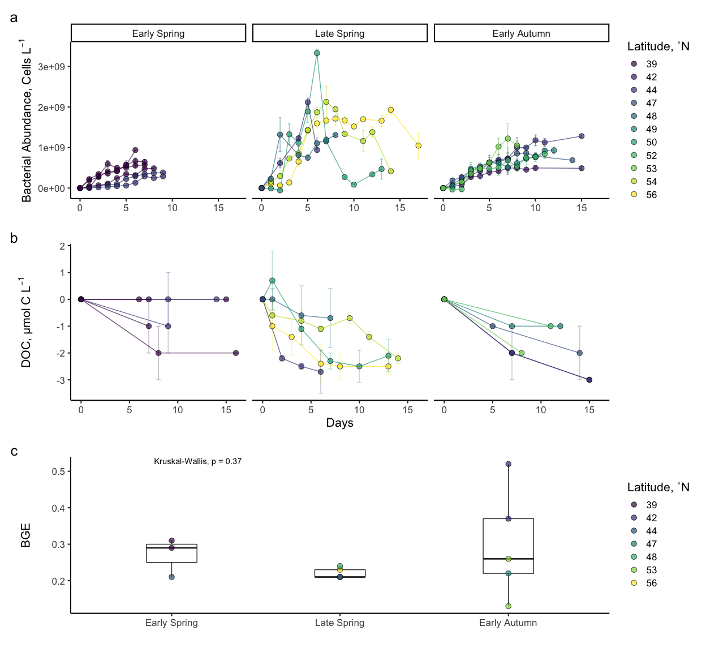
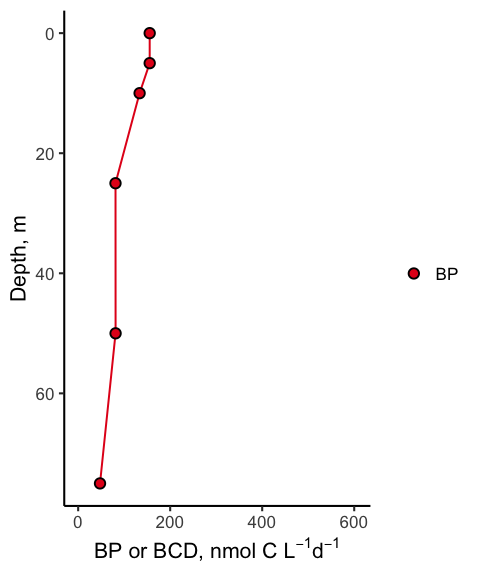

BCD and DOC Bioavailability
================
Nicholas Baetge
5/26/2020

# Intro

This document shows plots and tables of the merged field-experiment
NAAMES DOC data.

``` r
library(tidyverse) 
library(rmarkdown)
library(knitr)
library(readxl)
library(data.table) 
library(scales)
library(zoo)
library(oce)
library(patchwork)
#rmarkdown tables
library(stargazer)
library(pander)
library(growthcurver)
#stat tests
library(lmtest)
library(lmodel2)
library(rstatix)
library(ggpubr)
```

# Import Data

``` r
export <- readRDS("~/GITHUB/naames_bioav_ms/Output/processed_field.rds") 

doc <- read_rds("~/GITHUB/naames_bioav_ms/Output/processed_bioavailability.rds") %>% 
   select(-c(Bottle, doc, interp_doc)) %>% 
  arrange(Cruise, Station, Hours) %>% 
  distinct() %>% 
  mutate(bge = ifelse(Cruise == "AT39" & Station == 4, T, F),
         bge = ifelse(Cruise == "AT34" & Station %in% c(1, 2, 3), T, bge),
         bge = ifelse(Cruise == "AT38" & Station %in% c(3, 6), T, bge),
         degree_bin = as.character(degree_bin))  %>% 
  distinct() 


bcd <- read_rds("~/GITHUB/naames_bioav_ms/Output/processed_integrated_BCD.rds") %>% 
  mutate(bp.npp = int.bp/int.NPP * 100) %>% 
  group_by(Cruise, Station) %>% 
  mutate(ave_int.BCD = mean(int.bcd, na.rm = T),
         sd_int.BCD = sd(int.bcd, na.rm = T),
         ave_int.bp = mean(int.bp, na.rm = T),
         sd_int.bp = sd(int.bp, na.rm = T),
         ave_int.ba = mean(int.ba, na.rm = T),
         sd_int.ba = sd(int.ba, na.rm = T),
         ave_int.bc_i = mean(int.bc_i, na.rm = T),
         sd_int.bc_i = sd(int.bc_i, na.rm = T),
         ave_int.bc_s = mean(int.bc_s, na.rm = T),
         sd_int.bc_s = sd(int.bc_s, na.rm = T),
         ave_int.NPP = mean(int.NPP, na.rm = T),
         sd_int.NPP = sd(int.NPP, na.rm = T),
         ave_int.mew_i = mean(mew.season_i, na.rm = T),
         sd_int.mew_i = sd(mew.season_i, na.rm = T),
         ave_int.mew_s = mean(mew.season_s, na.rm = T),
         sd_int.mew_s = sd(mew.season_s, na.rm = T),
         ave_bcd.npp = mean(bcd.npp, na.rm = T),
         sd_bcd.npp = sd(bcd.npp, na.rm = T),
         ave_bp.npp = mean(bp.npp, na.rm = T),
         sd_bp.npp = sd(bp.npp, na.rm = T)) %>% 
  ungroup() %>% 
  mutate_at(vars(ave_int.bp, sd_int.bp, ave_int.bc_i:sd_int.mew_s), round, 3) %>% 
  mutate_at(vars(ave_bcd.npp:sd_bp.npp), round)
```

Units for imported data frames are currently:

  - BP, µmol C m<sup>-3</sup> d<sup>-1</sup>
  - BCD, µmol C m<sup>-3</sup> d<sup>-1</sup>
  - BA, cells m<sup>-3</sup>
  - BC, µmol C m<sup>-3</sup>
  - mew, d<sup>-1</sup>
  - NPP, µmol C m<sup>-3</sup> d<sup>-1</sup>
  - ∆DOC and NCP (from export MS, integrated to Ez), mol C
    m<sup>-2</sup>

NPP, NCP and BCD are converted to: mmol C m<sup>-3</sup>
d<sup>-1</sup>

# Box plots: NPP, BP, BA, µ, ∆DOC


``` r
bact_table <- bcd %>% 
  select(Cruise:degree_bin, ave_int.bp, sd_int.bp, ave_int.ba, sd_int.ba) %>% 
  distinct() %>% 
  mutate_at(vars(ave_int.bp, sd_int.bp), funs(./10^3)) %>% 
  distinct() %>% 
  left_join(., bcd %>%
              group_by(Cruise, Station) %>% 
              mutate(ave_Ez = mean(Ez, na.rm = T),
                     sd_Ez = sd(Ez, na.rm = T)) %>% 
              ungroup() %>% 
              select(Cruise:degree_bin, ave_Ez, sd_Ez, ave_int.NPP, sd_int.NPP) %>% 
              distinct() %>% 
              mutate_at(vars(contains("NPP")), funs(round(./10^3, 2)))
            ) %>% 
  left_join(., bcd %>% 
              select(Cruise:degree_bin, contains("ave_int.mew")) %>% 
              distinct() %>% 
              pivot_longer(cols = c(ave_int.mew_i, ave_int.mew_s), names_to = "ccf", values_to = "mew") %>%  
              mutate(ccf = ifelse(ccf == "ave_int.mew_i", "Initial CCF", NA),
                     ccf = ifelse(is.na(ccf), "Stationary CCF", ccf)) %>% 
              group_by(Cruise, Station) %>% 
              mutate(ave_mew = mean(mew),
                     sd_mew = sd(mew)) %>% 
              ungroup() %>% 
              select(-c(ccf, mew)) %>% 
              distinct()
            ) %>% 
  select(Cruise:degree_bin, ave_Ez:sd_int.NPP, everything()) %>% 
  mutate_at(vars(ave_Ez, sd_Ez), round) %>% 
  mutate_at(vars(ave_int.NPP:sd_int.bp, ave_mew, sd_mew), round, 2) %>% 
  arrange(factor(Season, levels = levels), degree_bin) %>% 
  mutate(bp_npp = ave_int.bp/ave_int.NPP)
```

## Surface 100 m

``` r
export %>% 
  select(Season,  doc_ncp_100) %>%
  group_by(Season) %>% 
  summarise(ave_doc_ncp = round(mean(doc_ncp_100),2),
            sd_doc_ncp = round(sd(doc_ncp_100), 2))
```

    ## # A tibble: 4 x 3
    ##   Season       ave_doc_ncp sd_doc_ncp
    ##   <chr>              <dbl>      <dbl>
    ## 1 Early Autumn        0.19       0.06
    ## 2 Early Spring        0.12       0.1 
    ## 3 Late Autumn         0.14       0.04
    ## 4 Late Spring         0.11       0.06


## Euphotic Zone


# Bar plots: NPP, BP, BA, µ


Error bars for µ represent standard deviation from mean of values
calculated using different CCFs to convert BA to BC (Global Initial CCF,
Global Stationary CCF, Season-Specific Initial CCF, Season-Specific
Stationary CCF). All other error bars represent standard deviation from
mean of station
values.

# Line plots: DOC Decay Curves


## Experiments at 44˚N

### Add 57 Day Timepoints

If experiments do this timepoint, they will be added and then
interpolated. This timepoint is the longest timepoint shared by all all
of the cruises.

``` r
keys <-  doc %>% 
  filter(degree_bin == 44) %>% 
  drop_na(sd_doc) %>% 
  group_by(Cruise, Station) %>%
  group_keys() %>%
  mutate(key = paste(Cruise, ", S", Station, sep = ""))
header <- keys$key

list <- doc %>% 
  filter(degree_bin == 44) %>% 
  drop_na(sd_doc) %>% 
  group_by(Cruise, Station) %>%
  group_split()
names(list) <- header

newrow.func <- function(morty){
   morty[nrow(morty) + 1,] <- NA
   morty$Days[is.na(morty$Days)] <- 68
  rick <- morty %>% 
    fill(., Cruise:Subregion, degree_bin:sd_doc_ncp_ez, accm_doc:bge, .direction = c("updown")) 
}

add <- lapply(list, newrow.func) %>% 
  plyr::ldply(., as.data.frame) %>% 
  select(-.id) %>% 
  arrange(Cruise, Station, Days) %>% 
  group_by(Cruise, Station, Days) %>%
  fill(Hours, ave_doc:norm_doc, .direction = "downup") %>% 
  distinct() %>% 
  ungroup() %>% 
  mutate(Hours = ifelse(is.na(Hours), 1632, Hours)) %>% 
  group_by(Cruise, Station)  

add_keys <- add %>% 
  group_keys() %>%
  mutate(key = paste(Cruise, ", S", Station, sep = ""))
add_header <- add_keys$key

add_list <- add %>%
  group_split()
names(add_list) <- add_header
```

### Interpolations

``` r
interp.func <- function(x) {
  y <- zoo(x, order.by = x$Hours)
  interp_doc <- round(as.numeric(na.approx(y$ave_doc, na.rm = F)), 1)
  interp_norm_doc <- round(as.numeric(na.approx(y$norm_doc, na.rm = F)), 1)
  z <- cbind(y, interp_doc, interp_norm_doc)
  as_tibble(z)
}

interpolated <- lapply(add_list, interp.func) %>% 
  plyr::ldply(., as.data.frame) %>% 
  select(-.id) %>% 
  mutate_at(vars(Station, Hours:total.ddoc, contains("interp")), as.numeric) %>% 
  select(Cruise:norm_doc, contains("interp"), everything())
```

### Plots

We’ve propogated the error for derived
variables


Black vertical dashed and dotted lines indicate the 7 and 30-day marks,
respectively. Dashed decay lines indicate experiments in which BGEs
could be calculated.

# Table: ∆DOC, Bioavailability, Persistence

Seasonally accumulated DOC is expressed as mmol C m<sup>-3</sup> or µmol
C L<sup>-1</sup>

``` r
bioav.table <- doc %>% 
  select(Season, Station, degree_bin, ave_Ez, sd_Ez, ave_int_delta_DOC_ez, sd_int_delta_DOC_ez, accm_doc, sd_accm_doc, total.bioav_accm_doc:lt.bioav_accm_doc, total.per_bioav:bge) %>% 
  distinct() %>% 
  mutate_at(vars(ave_int_delta_DOC_ez, sd_int_delta_DOC_ez), funs(round((./ave_Ez) * 10^3, 2))) %>% 
    mutate_at(vars(contains("ddoc")), funs(round(./10^3, 2))) %>% 
  arrange(factor(Season, levels = levels), degree_bin) %>% 
  ungroup()
```

| Season       | Station | degree\_bin | ave\_Ez | sd\_Ez | ave\_int\_delta\_DOC\_ez | sd\_int\_delta\_DOC\_ez | accm\_doc | sd\_accm\_doc | total.bioav\_accm\_doc | st.bioav\_accm\_doc | lt.bioav\_accm\_doc | total.per\_bioav | st.per\_bioav | lt.per\_bioav | persis\_doc | per\_persis | st.ddoc | lt.ddoc | total.ddoc | bge   |
| :----------- | :------ | :---------- | ------: | -----: | -----------------------: | ----------------------: | --------: | ------------: | ---------------------: | ------------------: | ------------------: | ---------------: | ------------: | ------------: | ----------: | ----------: | ------: | ------: | ---------: | :---- |
| Early Spring | 1       | 39          |     106 |      7 |                     1.98 |                    0.00 |       4.2 |           0.6 |                    4.7 |                 2.0 |                 2.7 |              112 |            48 |            64 |       \-0.5 |        \-12 |    0.29 |    0.04 |       0.06 | FALSE |
| Early Spring | 2       | 39          |      98 |      7 |                     1.53 |                    0.00 |       3.5 |           0.1 |                    3.1 |                 0.3 |                 2.8 |               89 |             9 |            80 |         0.4 |          11 |    0.04 |    0.04 |       0.04 | FALSE |
| Early Spring | S2RD    | 39          |      NA |     NA |                       NA |                      NA |       4.5 |           0.1 |                    3.7 |                 0.9 |                 2.8 |               82 |            20 |            62 |         0.8 |          18 |    0.13 |    0.03 |       0.04 | FALSE |
| Early Spring | S2RF    | 39          |      NA |     NA |                       NA |                      NA |       3.0 |           0.7 |                    2.9 |                 0.1 |                 2.8 |               97 |             3 |            93 |         0.1 |           3 |    0.01 |    0.03 |       0.03 | FALSE |
| Early Spring | 2.1     | 42          |     120 |      7 |                   \-7.92 |                    0.00 |        NA |            NA |                     NA |                  NA |                  NA |               NA |            NA |            NA |          NA |          NA |      NA |      NA |         NA | FALSE |
| Early Spring | 3       | 44          |     120 |      7 |                     2.67 |                    0.00 |       4.3 |           0.3 |                    3.1 |                 0.0 |                 3.1 |               72 |             0 |            72 |         1.2 |          28 |    0.00 |    0.04 |       0.04 | FALSE |
| Early Spring | 4       | 44          |     126 |      7 |                     0.08 |                    0.00 |       2.6 |           0.3 |                    1.8 |                 0.7 |                 1.1 |               69 |            27 |            42 |         0.8 |          31 |    0.10 |    0.01 |       0.02 | TRUE  |
| Late Spring  | 5       | 44          |      91 |     11 |                     3.52 |                    0.00 |      11.7 |           0.5 |                    4.0 |                 2.7 |                 1.3 |               34 |            23 |            11 |         7.7 |          66 |    0.39 |    0.01 |       0.04 | FALSE |
| Late Spring  | 4       | 48          |     116 |     33 |                     2.07 |                    0.00 |       2.8 |           0.8 |                     NA |                 0.7 |                  NA |               NA |            25 |            NA |          NA |          NA |    0.10 |      NA |         NA | FALSE |
| Late Spring  | 3       | 50          |      52 |      1 |                     3.85 |                    0.00 |       7.9 |           0.0 |                     NA |                 2.3 |                  NA |               NA |            29 |            NA |          NA |          NA |    0.33 |      NA |         NA | TRUE  |
| Late Spring  | 0       | 54          |      87 |      1 |                     2.07 |                    0.00 |        NA |            NA |                     NA |                  NA |                  NA |               NA |            NA |            NA |          NA |          NA |      NA |      NA |         NA | FALSE |
| Late Spring  | 2       | 54          |      58 |      5 |                     2.93 |                    0.00 |       6.9 |           0.4 |                     NA |                 1.0 |                  NA |               NA |            14 |            NA |          NA |          NA |    0.14 |      NA |         NA | TRUE  |
| Late Spring  | 1       | 56          |      72 |      1 |                     0.42 |                    0.00 |       3.3 |           1.0 |                     NA |                 2.5 |                  NA |               NA |            76 |            NA |          NA |          NA |    0.36 |      NA |         NA | TRUE  |
| Early Autumn | 0       | 42          |     236 |     11 |                   \-4.19 |                    0.00 |        NA |            NA |                     NA |                  NA |                  NA |               NA |            NA |            NA |          NA |          NA |      NA |      NA |         NA | FALSE |
| Early Autumn | 1       | 42          |     236 |     11 |                     1.82 |                    0.00 |      12.2 |           0.2 |                    4.7 |                 2.3 |                 2.4 |               39 |            19 |            20 |         7.5 |          61 |    0.33 |    0.04 |       0.07 | FALSE |
| Early Autumn | 1.5     | 44          |     207 |     21 |                     1.69 |                    0.00 |        NA |            NA |                     NA |                  NA |                  NA |               NA |            NA |            NA |          NA |          NA |      NA |      NA |         NA | FALSE |
| Early Autumn | 2       | 44          |     207 |     21 |                     4.35 |                    0.00 |      18.9 |           0.8 |                    5.9 |                 1.6 |                 4.3 |               31 |             8 |            23 |        13.0 |          69 |    0.23 |    0.07 |       0.09 | FALSE |
| Early Autumn | 3       | 47          |     200 |     21 |                     1.10 |                    0.00 |      14.2 |           1.6 |                    4.5 |                 1.6 |                 2.9 |               32 |            11 |            20 |         9.7 |          68 |    0.23 |    0.05 |       0.07 | TRUE  |
| Early Autumn | 3.5     | 48          |     174 |     21 |                   \-0.80 |                    0.00 |        NA |            NA |                     NA |                  NA |                  NA |               NA |            NA |            NA |          NA |          NA |      NA |      NA |         NA | FALSE |
| Early Autumn | 4       | 49          |     174 |     21 |                     5.57 |                    0.00 |      15.1 |           0.4 |                    3.8 |                 0.9 |                 2.9 |               25 |             6 |            19 |        11.3 |          75 |    0.13 |    0.05 |       0.06 | FALSE |
| Early Autumn | 4.5     | 50          |     157 |      7 |                     2.17 |                    0.00 |        NA |            NA |                     NA |                  NA |                  NA |               NA |            NA |            NA |          NA |          NA |      NA |      NA |         NA | FALSE |
| Early Autumn | 5       | 52          |     157 |      7 |                     4.84 |                    0.00 |      14.2 |           0.6 |                    5.3 |                 0.9 |                 4.4 |               37 |             6 |            31 |         8.9 |          63 |    0.13 |    0.08 |       0.09 | FALSE |
| Early Autumn | 5.5     | 53          |     101 |      7 |                     3.86 |                    0.00 |        NA |            NA |                     NA |                  NA |                  NA |               NA |            NA |            NA |          NA |          NA |      NA |      NA |         NA | FALSE |
| Early Autumn | 6       | 53          |     101 |      7 |                     3.86 |                    0.00 |       8.9 |           0.3 |                    5.0 |                 1.8 |                 3.2 |               56 |            20 |            36 |         3.9 |          44 |    0.26 |    0.06 |       0.09 | TRUE  |
| Late Autumn  | 7       | 40          |     112 |     19 |                     6.16 |                    0.36 |        NA |            NA |                     NA |                  NA |                  NA |               NA |            NA |            NA |          NA |          NA |      NA |      NA |         NA | FALSE |
| Late Autumn  | 7       | 41          |     112 |     19 |                     6.16 |                    0.36 |        NA |            NA |                     NA |                  NA |                  NA |               NA |            NA |            NA |          NA |          NA |      NA |      NA |         NA | FALSE |
| Late Autumn  | 6       | 43          |     104 |      1 |                     4.33 |                    2.12 |        NA |            NA |                     NA |                  NA |                  NA |               NA |            NA |            NA |          NA |          NA |      NA |      NA |         NA | FALSE |
| Late Autumn  | 6       | 43          |     112 |     19 |                     4.02 |                    1.96 |        NA |            NA |                     NA |                  NA |                  NA |               NA |            NA |            NA |          NA |          NA |      NA |      NA |         NA | FALSE |
| Late Autumn  | 5       | 44          |     103 |      1 |                     5.53 |                    0.00 |        NA |            NA |                     NA |                  NA |                  NA |               NA |            NA |            NA |          NA |          NA |      NA |      NA |         NA | FALSE |
| Late Autumn  | 4       | 46          |     126 |      1 |                     3.10 |                    0.00 |        NA |            NA |                     NA |                  NA |                  NA |               NA |            NA |            NA |          NA |          NA |      NA |      NA |         NA | FALSE |
| Late Autumn  | 1       | 51          |     102 |      4 |                     2.94 |                    0.00 |        NA |            NA |                     NA |                  NA |                  NA |               NA |            NA |            NA |          NA |          NA |      NA |      NA |         NA | FALSE |
| Late Autumn  | 3       | 51          |      59 |      1 |                     7.12 |                    0.00 |        NA |            NA |                     NA |                  NA |                  NA |               NA |            NA |            NA |          NA |          NA |      NA |      NA |         NA | FALSE |
| Late Autumn  | 2       | 54          |     102 |      4 |                     1.57 |                    0.00 |        NA |            NA |                     NA |                  NA |                  NA |               NA |            NA |            NA |          NA |          NA |      NA |      NA |         NA | FALSE |

Seasonal Accumulated DOC Bioavailability and Persistance

``` r
bioav.table2 <- bioav.table %>% 
  select(-c(ave_Ez:sd_int_delta_DOC_ez)) %>% 
  drop_na(accm_doc) %>% 
 # group_by(Season) %>% 
  summarize(accm = mean(accm_doc, na.rm = T),
            sd_accm = sd(accm_doc, na.rm = T),
            total.bv = mean(total.bioav_accm_doc, na.rm = T),
            sd_total.bv = sd(total.bioav_accm_doc, na.rm = T),
            st.bv = mean(st.bioav_accm_doc, na.rm = T),
            sd_st.bv = sd(st.bioav_accm_doc, na.rm = T),
            total.per_bv = mean(total.per_bioav, na.rm = T),
            sd_total.per_bv = sd(total.per_bioav, na.rm = T),
            st.per_bv = mean(st.per_bioav, na.rm = T),
            sd_st.per_bv = sd(st.per_bioav, na.rm = T),
            pers = mean(persis_doc, na.rm = T),
            sd_pers = sd(persis_doc, na.rm = T),
            per_pers = mean(per_persis, na.rm = T),
            sd_per_pers = sd(per_persis, na.rm = T),
            st.ddoc_rate = mean(st.ddoc, na.rm = T),
            sd_st.ddoc_rate = sd(st.ddoc, na.rm = T),
            total.ddoc_rate = mean(total.ddoc, na.rm = T),
            sd_total.ddoc_rate = sd(total.ddoc, na.rm = T),
            stations = n()
            
            ) %>% 
  mutate_at(vars(accm:sd_st.bv, pers, sd_pers), round, 1) %>% 
  mutate_at(vars(contains(c("per_", "rate"))), round,3) # %>% 
  #arrange(factor(Season, levels = levels))
```

| accm | sd\_accm | total.bv | sd\_total.bv | st.bv | sd\_st.bv | total.per\_bv | sd\_total.per\_bv | st.per\_bv | sd\_st.per\_bv | pers | sd\_pers | per\_pers | sd\_per\_pers | st.ddoc\_rate | sd\_st.ddoc\_rate | total.ddoc\_rate | sd\_total.ddoc\_rate | stations |
| ---: | -------: | -------: | -----------: | ----: | --------: | ------------: | ----------------: | ---------: | -------------: | ---: | -------: | --------: | ------------: | ------------: | ----------------: | ---------------: | -------------------: | -------: |
|  8.1 |      5.3 |        4 |          1.1 |   1.3 |       0.9 |        59.615 |            29.059 |     20.235 |          18.62 |    5 |      4.8 |    40.385 |        29.059 |         0.188 |             0.124 |            0.057 |                0.024 |       17 |

Seasonal Accumulated DOC Bioavailability and Persistance

``` r
bioav.table3 <- bioav.table %>% 
  select(-c(ave_Ez:sd_int_delta_DOC_ez)) %>% 
  drop_na(accm_doc) %>% 
  group_by(Season, degree_bin) %>% 
  summarize(accm = mean(accm_doc, na.rm = T),
            sd_accm = sd(accm_doc, na.rm = T),
            total.bv = mean(total.bioav_accm_doc, na.rm = T),
            sd_total.bv = sd(total.bioav_accm_doc, na.rm = T),
            st.bv = mean(st.bioav_accm_doc, na.rm = T),
            sd_st.bv = sd(st.bioav_accm_doc, na.rm = T),
            total.per_bv = mean(total.per_bioav, na.rm = T),
            sd_total.per_bv = sd(total.per_bioav, na.rm = T),
            st.per_bv = mean(st.per_bioav, na.rm = T),
            sd_st.per_bv = sd(st.per_bioav, na.rm = T),
            pers = mean(persis_doc, na.rm = T),
            sd_pers = sd(persis_doc, na.rm = T),
            per_pers = mean(per_persis, na.rm = T),
            sd_per_pers = sd(per_persis, na.rm = T),
            st.ddoc_rate = mean(st.ddoc, na.rm = T),
            sd_st.ddoc_rate = sd(st.ddoc, na.rm = T),
            total.ddoc_rate = mean(total.ddoc, na.rm = T),
            sd_total.ddoc_rate = sd(total.ddoc, na.rm = T),
            stations = n()
            
            ) %>% 
  mutate_at(vars(accm:sd_st.bv, pers, sd_pers), round, 1) %>% 
  mutate_at(vars(contains(c("per_", "rate"))), round) %>% 
  arrange(factor(Season, levels = levels))
```

| Season       | degree\_bin | accm | sd\_accm | total.bv | sd\_total.bv | st.bv | sd\_st.bv | total.per\_bv | sd\_total.per\_bv | st.per\_bv | sd\_st.per\_bv | pers | sd\_pers | per\_pers | sd\_per\_pers | st.ddoc\_rate | sd\_st.ddoc\_rate | total.ddoc\_rate | sd\_total.ddoc\_rate | stations |
| :----------- | :---------- | ---: | -------: | -------: | -----------: | ----: | --------: | ------------: | ----------------: | ---------: | -------------: | ---: | -------: | --------: | ------------: | ------------: | ----------------: | ---------------: | -------------------: | -------: |
| Early Spring | 39          |  3.8 |      0.7 |      3.6 |          0.8 |   0.8 |       0.9 |            95 |                13 |         20 |             20 |  0.2 |      0.5 |         5 |            13 |             0 |                 0 |                0 |                    0 |        4 |
| Early Spring | 44          |  3.4 |      1.2 |      2.4 |          0.9 |   0.4 |       0.5 |            70 |                 2 |         14 |             19 |  1.0 |      0.3 |        30 |             2 |             0 |                 0 |                0 |                    0 |        2 |
| Late Spring  | 44          | 11.7 |       NA |      4.0 |           NA |   2.7 |        NA |            34 |                NA |         23 |             NA |  7.7 |       NA |        66 |            NA |             0 |                NA |                0 |                   NA |        1 |
| Late Spring  | 48          |  2.8 |       NA |      NaN |           NA |   0.7 |        NA |           NaN |                NA |         25 |             NA |  NaN |       NA |       NaN |            NA |             0 |                NA |              NaN |                   NA |        1 |
| Late Spring  | 50          |  7.9 |       NA |      NaN |           NA |   2.3 |        NA |           NaN |                NA |         29 |             NA |  NaN |       NA |       NaN |            NA |             0 |                NA |              NaN |                   NA |        1 |
| Late Spring  | 54          |  6.9 |       NA |      NaN |           NA |   1.0 |        NA |           NaN |                NA |         14 |             NA |  NaN |       NA |       NaN |            NA |             0 |                NA |              NaN |                   NA |        1 |
| Late Spring  | 56          |  3.3 |       NA |      NaN |           NA |   2.5 |        NA |           NaN |                NA |         76 |             NA |  NaN |       NA |       NaN |            NA |             0 |                NA |              NaN |                   NA |        1 |
| Early Autumn | 42          | 12.2 |       NA |      4.7 |           NA |   2.3 |        NA |            39 |                NA |         19 |             NA |  7.5 |       NA |        61 |            NA |             0 |                NA |                0 |                   NA |        1 |
| Early Autumn | 44          | 18.9 |       NA |      5.9 |           NA |   1.6 |        NA |            31 |                NA |          8 |             NA | 13.0 |       NA |        69 |            NA |             0 |                NA |                0 |                   NA |        1 |
| Early Autumn | 47          | 14.2 |       NA |      4.5 |           NA |   1.6 |        NA |            32 |                NA |         11 |             NA |  9.7 |       NA |        68 |            NA |             0 |                NA |                0 |                   NA |        1 |
| Early Autumn | 49          | 15.1 |       NA |      3.8 |           NA |   0.9 |        NA |            25 |                NA |          6 |             NA | 11.3 |       NA |        75 |            NA |             0 |                NA |                0 |                   NA |        1 |
| Early Autumn | 52          | 14.2 |       NA |      5.3 |           NA |   0.9 |        NA |            37 |                NA |          6 |             NA |  8.9 |       NA |        63 |            NA |             0 |                NA |                0 |                   NA |        1 |
| Early Autumn | 53          |  8.9 |       NA |      5.0 |           NA |   1.8 |        NA |            56 |                NA |         20 |             NA |  3.9 |       NA |        44 |            NA |             0 |                NA |                0 |                   NA |        1 |

Seasonal Accumulated DOC Bioavailability and
Persistance

# Bar plots: Experiment ∆DOC and %Bioavailability




# Table: NPP and BCD

NPP, BP, and BCD are converted to: mmol C m<sup>-3</sup> d<sup>-1</sup>

``` r
bcd_table <- bcd %>% 
  select(Cruise:degree_bin, ave_int.BCD, sd_int.BCD, ave_int.bp, sd_int.bp) %>% 
  distinct() %>% 
  mutate_at(vars(ave_int.BCD, sd_int.BCD, ave_int.bp, sd_int.bp), funs(./10^3)) %>% 
  distinct() %>% 
  left_join(., bcd %>%
              group_by(Cruise, Station) %>% 
              mutate(ave_Ez = mean(Ez, na.rm = T),
                     sd_Ez = sd(Ez, na.rm = T)) %>% 
              ungroup() %>% 
              select(Cruise:degree_bin, ave_Ez, sd_Ez, ave_int.NPP, sd_int.NPP) %>% 
              distinct() %>% 
              mutate_at(vars(contains("NPP")), funs(round(./10^3, 3)))
            ) %>% 
  left_join(., bcd %>% 
              select(Cruise:degree_bin, ave_bcd.npp:sd_bp.npp) %>% 
              distinct()
            ) %>% 
  select(Cruise:degree_bin, ave_Ez:sd_int.NPP, everything()) %>% 
  mutate_at(vars(ave_Ez, sd_Ez), round) %>% 
  mutate_at(vars(ave_int.NPP:sd_int.BCD), round, 3) %>% 
    mutate_at(vars(ave_int.bp, sd_int.bp), round, 3) %>% 
  arrange(factor(Season, levels = levels), degree_bin)
```

| Cruise | Subregion   | Season       | Station | degree\_bin | ave\_Ez | sd\_Ez | ave\_int.NPP | sd\_int.NPP | ave\_int.BCD | sd\_int.BCD | ave\_int.bp | sd\_int.bp | ave\_bcd.npp | sd\_bcd.npp | ave\_bp.npp | sd\_bp.npp |
| :----- | :---------- | :----------- | ------: | ----------: | ------: | -----: | -----------: | ----------: | -----------: | ----------: | ----------: | ---------: | -----------: | ----------: | ----------: | ---------: |
| AT39   | GS/Sargasso | Early Spring |       1 |          39 |     106 |      0 |        0.604 |       0.000 |        0.112 |       0.000 |       0.029 |      0.000 |           19 |           0 |           5 |          0 |
| AT39   | GS/Sargasso | Early Spring |       2 |          39 |      98 |      0 |        1.306 |       0.000 |        0.298 |       0.004 |       0.077 |      0.001 |           23 |           0 |           6 |          0 |
| AT39   | Subtropical | Early Spring |       3 |          44 |     120 |      0 |        0.412 |       0.000 |        0.088 |       0.000 |       0.023 |      0.000 |           21 |           0 |           6 |          0 |
| AT39   | Subtropical | Early Spring |       4 |          44 |     126 |      0 |        0.557 |       0.000 |        0.061 |       0.000 |       0.016 |      0.000 |           11 |           0 |           3 |          0 |
| AT34   | Subtropical | Late Spring  |       5 |          44 |      91 |      0 |        0.991 |       0.000 |        0.514 |       0.000 |       0.129 |      0.000 |           52 |           0 |          13 |          0 |
| AT34   | Subtropical | Late Spring  |       4 |          48 |     116 |     22 |        0.817 |       0.147 |        0.172 |       0.072 |       0.043 |      0.018 |           20 |           5 |           5 |          1 |
| AT34   | Temperate   | Late Spring  |       3 |          50 |      52 |      0 |        3.341 |       0.000 |        0.471 |       0.000 |       0.118 |      0.000 |           14 |           0 |           4 |          0 |
| AT34   | Subpolar    | Late Spring  |       0 |          54 |      87 |      0 |        1.467 |       0.000 |        0.239 |       0.000 |       0.060 |      0.000 |           16 |           0 |           4 |          0 |
| AT34   | Subpolar    | Late Spring  |       2 |          54 |      54 |      0 |        2.861 |       0.000 |        0.622 |       0.000 |       0.155 |      0.000 |           22 |           0 |           5 |          0 |
| AT34   | Subpolar    | Late Spring  |       1 |          56 |      72 |      0 |        1.356 |       0.000 |        0.399 |       0.000 |       0.100 |      0.000 |           29 |           0 |           7 |          0 |
| AT38   | GS/Sargasso | Early Autumn |       1 |          42 |     244 |      0 |        0.114 |       0.000 |        0.118 |       0.000 |       0.026 |      0.000 |          103 |           0 |          23 |          0 |
| AT38   | Subtropical | Early Autumn |       2 |          44 |     207 |      0 |        0.226 |       0.000 |        0.147 |       0.000 |       0.032 |      0.000 |           65 |           0 |          14 |          0 |
| AT38   | Subtropical | Early Autumn |       3 |          47 |     200 |      0 |        0.180 |       0.000 |        0.069 |       0.000 |       0.015 |      0.000 |           38 |           0 |           8 |          0 |
| AT38   | Subtropical | Early Autumn |       4 |          49 |     188 |      0 |        0.192 |       0.000 |        0.093 |       0.000 |       0.020 |      0.000 |           48 |           0 |          11 |          0 |
| AT38   | Temperate   | Early Autumn |       5 |          52 |     157 |      0 |        0.418 |       0.000 |        0.116 |       0.000 |       0.026 |      0.000 |           28 |           0 |           6 |          0 |
| AT38   | Subpolar    | Early Autumn |       6 |          53 |     103 |      6 |        0.660 |       0.071 |        0.130 |       0.029 |       0.029 |      0.006 |           20 |           5 |           4 |          1 |
| AT32   | Subtropical | Late Autumn  |       7 |          40 |      98 |      0 |        0.254 |       0.000 |        0.175 |       0.000 |       0.038 |      0.000 |           69 |           0 |          15 |          0 |
| AT32   | Subtropical | Late Autumn  |       6 |          43 |     103 |      0 |        0.189 |       0.000 |        0.150 |       0.000 |       0.033 |      0.000 |           79 |           0 |          17 |          0 |
| AT32   | Subtropical | Late Autumn  |       5 |          44 |     103 |      0 |        0.168 |       0.000 |        0.149 |       0.000 |       0.033 |      0.000 |           89 |           0 |          20 |          0 |
| AT32   | Subtropical | Late Autumn  |       4 |          46 |     126 |      0 |        0.170 |       0.000 |        0.125 |       0.000 |       0.028 |      0.000 |           74 |           0 |          16 |          0 |
| AT32   | Temperate   | Late Autumn  |       3 |          51 |      59 |      0 |        0.114 |       0.000 |        0.130 |       0.000 |       0.029 |      0.000 |          114 |           0 |          25 |          0 |
| AT32   | Subpolar    | Late Autumn  |       2 |          54 |     104 |      0 |        0.177 |       0.000 |        0.128 |       0.000 |       0.028 |      0.000 |           72 |           0 |          16 |          0 |

BCD & NPP

``` r
bcd_table2 <- bcd_table %>% 
  group_by(Season, Cruise) %>% 
  summarize(Ez = mean(ave_Ez),
            sd_Ez = sd(ave_Ez),
            NPP = mean(ave_int.NPP), 
            sd_NPP = sd(ave_int.NPP),
            BP = mean(ave_int.bp),
            sd_BP = sd(ave_int.bp),
            BP_NPP = mean(ave_bp.npp),
            sd_BP_NPP = sd(ave_bp.npp),
            BCD = mean(ave_int.BCD),
            sd_BCD = sd(ave_int.BCD),
            BCD_NPP = mean(ave_bcd.npp),
            sd_BCD_NPP = sd(ave_bcd.npp)) %>% 
  arrange(factor(Season, levels = levels))
```

# Bar plots: BCD and BCD:NPP

We’ll convert BCD and NPP to mmol C m<sup>-3</sup> d<sup>-1</sup> before
plotting.



# Merge DOC and BCD data

Here we merge the integrated and depth-normalized data. We’ll also
convert:

  - BCD to mmol C m<sup>-3</sup> d<sup>-1</sup>
  - BC to mmol C m<sup>-3</sup>
  - NPP to mmol C m<sup>-3</sup> d<sup>-1</sup>
  - ∆DOC to mmol C m<sup>-3</sup> (µmol C L<sup>-1</sup>)

<!-- end list -->

``` r
bcd_bioav <- bcd %>% 
  group_by(Cruise, Station) %>%
  mutate(ave_Ez = mean(Ez, na.rm = T),
         sd_Ez = sd(Ez, na.rm = T)) %>% 
  ungroup() %>% 
  select(Cruise:degree_bin, contains(c("_Ez", "_int.", "_bcd.npp"))) %>% distinct() %>% 
  mutate(Station = as.character(Station)) %>% 
  left_join(., doc %>% 
              select(Cruise:Subregion, degree_bin, ave_int_delta_DOC_ez, sd_int_delta_DOC_ez, accm_doc:bge) %>%
              distinct() %>% 
              mutate(degree_bin = as.numeric(degree_bin))
            ) %>% 
  mutate_at(vars(ave_int.bc_i:sd_int.NPP, ave_int.BCD, sd_int.BCD),
            funs(round(./10^3, 2))) %>% 
  mutate_at(vars(ave_int_delta_DOC_ez, sd_int_delta_DOC_ez),
            funs(round(./ave_Ez * 10^3, 2))) %>% 
  group_by(Cruise, Station) %>% 
  mutate(ave_int.mew = (ave_int.mew_i + ave_int.mew_s)/2,
         sd_int.mew = sqrt(mean(c((ave_int.mew_i - ave_int.mew)^2,  (ave_int.mew_s - ave_int.mew)^2))))
```

# Regressions: Property-Property

## \*\* BCD v NPP

    ## RMA was not requested: it will not be computed.

    ## 
    ## Model II regression
    ## 
    ## Call: lmodel2(formula = ave_int.BCD ~ ave_int.NPP, data = bcd_bioav,
    ## nperm = 99)
    ## 
    ## n = 22   r = 0.8370984   r-square = 0.7007338 
    ## Parametric P-values:   2-tailed = 1.190448e-06    1-tailed = 5.952238e-07 
    ## Angle between the two OLS regression lines = 3.5289 degrees
    ## 
    ## Permutation tests of OLS, MA, RMA slopes: 1-tailed, tail corresponding to sign
    ## A permutation test of r is equivalent to a permutation test of the OLS slope
    ## P-perm for SMA = NA because the SMA slope cannot be tested
    ## 
    ## Regression results
    ##   Method  Intercept     Slope Angle (degrees) P-perm (1-tailed)
    ## 1    OLS 0.09272980 0.1489713        8.473114              0.01
    ## 2     MA 0.09167930 0.1503652        8.551230              0.01
    ## 3    SMA 0.07088173 0.1779615       10.090803                NA
    ## 
    ## Confidence intervals
    ##   Method 2.5%-Intercept 97.5%-Intercept 2.5%-Slope 97.5%-Slope
    ## 1    OLS     0.04104343       0.1444162  0.1035618   0.1943808
    ## 2     MA     0.05686724       0.1260248  0.1047922   0.1965573
    ## 3    SMA     0.03236217       0.1008067  0.1382541   0.2290731
    ## 
    ## Eigenvalues: 0.7793176 0.007066147 
    ## 
    ## H statistic used for computing C.I. of MA: 0.002008922

## BCD v Seasonally Accumulated DOC

    ## RMA was not requested: it will not be computed.

    ## 
    ## Model II regression
    ## 
    ## Call: lmodel2(formula = ave_int.BCD ~ ave_int_delta_DOC_ez, data =
    ## bcd_bioav, nperm = 99)
    ## 
    ## n = 22   r = -0.05951588   r-square = 0.003542139 
    ## Parametric P-values:   2-tailed = 0.7924794    1-tailed = 0.3962397 
    ## Angle between the two OLS regression lines = 53.03987 degrees
    ## 
    ## Permutation tests of OLS, MA, RMA slopes: 1-tailed, tail corresponding to sign
    ## A permutation test of r is equivalent to a permutation test of the OLS slope
    ## P-perm for SMA = NA because the SMA slope cannot be tested
    ## 
    ## Regression results
    ##   Method Intercept        Slope Angle (degrees) P-perm (1-tailed)
    ## 1    OLS 0.2203520 -0.004754269      -0.2723975              0.38
    ## 2     MA 0.2204502 -0.004784693      -0.2741406              0.38
    ## 3    SMA 0.4629475 -0.079882375      -4.5672246                NA
    ## 
    ## Confidence intervals
    ##   Method 2.5%-Intercept 97.5%-Intercept 2.5%-Slope 97.5%-Slope
    ## 1    OLS     0.08099559       0.3597084 -0.0419482  0.03243967
    ## 2     MA     0.09951597       0.3414278 -0.0422496  0.03266679
    ## 3    SMA     0.36943478       0.6096400 -0.1253108 -0.05092293
    ## 
    ## Eigenvalues: 3.783152 0.02405442 
    ## 
    ## H statistic used for computing C.I. of MA: 0.001401086

## BCD v % DOC Bioavailability

    ## RMA was not requested: it will not be computed.

    ## 
    ## Model II regression
    ## 
    ## Call: lmodel2(formula = ave_int.BCD ~ total.per_bioav, data =
    ## bcd_bioav, nperm = 99)
    ## 
    ## n = 11   r = -0.06147507   r-square = 0.003779184 
    ## Parametric P-values:   2-tailed = 0.8575024    1-tailed = 0.4287512 
    ## Angle between the two OLS regression lines = 4.37977 degrees
    ## 
    ## Permutation tests of OLS, MA, RMA slopes: 1-tailed, tail corresponding to sign
    ## A permutation test of r is equivalent to a permutation test of the OLS slope
    ## P-perm for SMA = NA because the SMA slope cannot be tested
    ## 
    ## Regression results
    ##   Method Intercept         Slope Angle (degrees) P-perm (1-tailed)
    ## 1    OLS 0.1748337 -0.0002905547     -0.01664756              0.53
    ## 2     MA 0.1748340 -0.0002905611     -0.01664793              0.53
    ## 3    SMA 0.4151749 -0.0047263823     -0.27079974                NA
    ## 
    ## Confidence intervals
    ##   Method 2.5%-Intercept 97.5%-Intercept   2.5%-Slope  97.5%-Slope
    ## 1    OLS    -0.04021443       0.3898818 -0.003847754  0.003266644
    ## 2     MA    -0.01790678       0.3675753 -0.003847866  0.003266736
    ## 3    SMA     0.28686434       0.6723354 -0.009472633 -0.002358235
    ## 
    ## Eigenvalues: 790.9637 0.01760231 
    ## 
    ## H statistic used for computing C.I. of MA: 1.265423e-05

    ## RMA was not requested: it will not be computed.

    ## 
    ## Model II regression
    ## 
    ## Call: lmodel2(formula = ave_int.BCD ~ st.per_bioav, data = bcd_bioav,
    ## nperm = 99)
    ## 
    ## n = 15   r = 0.2696376   r-square = 0.07270445 
    ## Parametric P-values:   2-tailed = 0.3311167    1-tailed = 0.1655584 
    ## Angle between the two OLS regression lines = 1.875269 degrees
    ## 
    ## Permutation tests of OLS, MA, RMA slopes: 1-tailed, tail corresponding to sign
    ## A permutation test of r is equivalent to a permutation test of the OLS slope
    ## P-perm for SMA = NA because the SMA slope cannot be tested
    ## 
    ## Regression results
    ##   Method  Intercept       Slope Angle (degrees) P-perm (1-tailed)
    ## 1    OLS 0.17239292 0.002567309       0.1470957              0.18
    ## 2     MA 0.17238830 0.002567525       0.1471080              0.18
    ## 3    SMA 0.02357684 0.009521332       0.5455156                NA
    ## 
    ## Confidence intervals
    ##   Method 2.5%-Intercept 97.5%-Intercept   2.5%-Slope 97.5%-Slope
    ## 1    OLS     0.01636868       0.3284172 -0.002926366 0.008060984
    ## 2     MA     0.05481033       0.2899629 -0.002926617 0.008061822
    ## 3    SMA    -0.12547195       0.1096573  0.005498878 0.016486228
    ## 
    ## Eigenvalues: 373.5453 0.03140155 
    ## 
    ## H statistic used for computing C.I. of MA: 3.018514e-05

## BCD v DOC removal rate

    ## RMA was not requested: it will not be computed.

    ## 
    ## Model II regression
    ## 
    ## Call: lmodel2(formula = ave_int.BCD ~ total.ddoc, data = bcd_bioav,
    ## nperm = 99)
    ## 
    ## n = 11   r = -0.2599681   r-square = 0.06758343 
    ## Parametric P-values:   2-tailed = 0.4401019    1-tailed = 0.220051 
    ## Angle between the two OLS regression lines = 1.181336 degrees
    ## 
    ## Permutation tests of OLS, MA, RMA slopes: 1-tailed, tail corresponding to sign
    ## A permutation test of r is equivalent to a permutation test of the OLS slope
    ## P-perm for SMA = NA because the SMA slope cannot be tested
    ## 
    ## Regression results
    ##   Method Intercept        Slope Angle (degrees) P-perm (1-tailed)
    ## 1    OLS 0.2459200 -0.001494710     -0.08564053              0.18
    ## 2     MA 0.2459227 -0.001494756     -0.08564317              0.18
    ## 3    SMA 0.4930899 -0.005749591     -0.32942366                NA
    ## 
    ## Confidence intervals
    ##   Method 2.5%-Intercept 97.5%-Intercept   2.5%-Slope  97.5%-Slope
    ## 1    OLS   -0.014193378       0.5060334 -0.005681137  0.002691716
    ## 2     MA    0.002721251       0.4891271 -0.005681375  0.002691809
    ## 3    SMA    0.329054096       0.8154407 -0.011298667 -0.002925814
    ## 
    ## Eigenvalues: 534.4921 0.01647492 
    ## 
    ## H statistic used for computing C.I. of MA: 1.752717e-05

    ## RMA was not requested: it will not be computed.

    ## 
    ## Model II regression
    ## 
    ## Call: lmodel2(formula = ave_int.BCD ~ st.ddoc, data = bcd_bioav, nperm
    ## = 99)
    ## 
    ## n = 15   r = 0.3490815   r-square = 0.1218579 
    ## Parametric P-values:   2-tailed = 0.2022112    1-tailed = 0.1011056 
    ## Angle between the two OLS regression lines = 0.2204297 degrees
    ## 
    ## Permutation tests of OLS, MA, RMA slopes: 1-tailed, tail corresponding to sign
    ## A permutation test of r is equivalent to a permutation test of the OLS slope
    ## P-perm for SMA = NA because the SMA slope cannot be tested
    ## 
    ## Regression results
    ##   Method   Intercept        Slope Angle (degrees) P-perm (1-tailed)
    ## 1    OLS  0.11892114 0.0005338749      0.03058877              0.15
    ## 2     MA  0.11892092 0.0005338760      0.03058884              0.15
    ## 3    SMA -0.08323077 0.0015293702      0.08762639                NA
    ## 
    ## Confidence intervals
    ##   Method 2.5%-Intercept 97.5%-Intercept    2.5%-Slope 97.5%-Slope
    ## 1    OLS    -0.08200620       0.3198485 -0.0003248444 0.001392594
    ## 2     MA    -0.05545684       0.2932985 -0.0003248450 0.001392598
    ## 3    SMA    -0.30321452       0.0455400  0.0008952397 0.002612678
    ## 
    ## Eigenvalues: 14478.07 0.02973723 
    ## 
    ## H statistic used for computing C.I. of MA: 7.374014e-07

## \*\* µ v NPP

    ## RMA was not requested: it will not be computed.

    ## 
    ## Model II regression
    ## 
    ## Call: lmodel2(formula = ave_int.mew_i ~ ave_int.NPP, data = bcd_bioav,
    ## nperm = 99)
    ## 
    ## n = 22   r = 0.6277263   r-square = 0.3940403 
    ## Parametric P-values:   2-tailed = 0.001762307    1-tailed = 0.0008811533 
    ## Angle between the two OLS regression lines = 1.99124 degrees
    ## 
    ## Permutation tests of OLS, MA, RMA slopes: 1-tailed, tail corresponding to sign
    ## A permutation test of r is equivalent to a permutation test of the OLS slope
    ## P-perm for SMA = NA because the SMA slope cannot be tested
    ## 
    ## Regression results
    ##   Method   Intercept      Slope Angle (degrees) P-perm (1-tailed)
    ## 1    OLS 0.019211943 0.02263795        1.296838              0.01
    ## 2     MA 0.019198494 0.02265580        1.297860              0.01
    ## 3    SMA 0.009094027 0.03606341        2.065386                NA
    ## 
    ## Confidence intervals
    ##   Method 2.5%-Intercept 97.5%-Intercept  2.5%-Slope 97.5%-Slope
    ## 1    OLS    0.004307704      0.03411618 0.009543709  0.03573220
    ## 2     MA    0.009318637      0.02907249 0.009553997  0.03576538
    ## 3    SMA   -0.002510361      0.01722624 0.025272787  0.05146127
    ## 
    ## Eigenvalues: 0.7626342 0.0006004106 
    ## 
    ## H statistic used for computing C.I. of MA: 0.0001715535

## µ v Seasonally Accumulated DOC

    ## RMA was not requested: it will not be computed.

    ## 
    ## Model II regression
    ## 
    ## Call: lmodel2(formula = ave_int.mew ~ ave_int_delta_DOC_ez, data =
    ## bcd_bioav, nperm = 99)
    ## 
    ## n = 22   r = -0.1714731   r-square = 0.02940301 
    ## Parametric P-values:   2-tailed = 0.4454571    1-tailed = 0.2227286 
    ## Angle between the two OLS regression lines = 4.424644 degrees
    ## 
    ## Permutation tests of OLS, MA, RMA slopes: 1-tailed, tail corresponding to sign
    ## A permutation test of r is equivalent to a permutation test of the OLS slope
    ## P-perm for SMA = NA because the SMA slope cannot be tested
    ## 
    ## Regression results
    ##   Method  Intercept        Slope Angle (degrees) P-perm (1-tailed)
    ## 1    OLS 0.04336613 -0.002344522      -0.1343310              0.26
    ## 2     MA 0.04336750 -0.002344947      -0.1343553              0.26
    ## 3    SMA 0.07994626 -0.013672829      -0.7833466                NA
    ## 
    ## Confidence intervals
    ##   Method 2.5%-Intercept 97.5%-Intercept   2.5%-Slope  97.5%-Slope
    ## 1    OLS     0.01982516      0.06690709 -0.008627558  0.003938514
    ## 2     MA     0.02307522      0.06366038 -0.008629340  0.003939260
    ## 3    SMA     0.06409623      0.10467322 -0.021330388 -0.008764316
    ## 
    ## Eigenvalues: 3.783087 0.0006864315 
    ## 
    ## H statistic used for computing C.I. of MA: 3.949044e-05

## µ v % DOC Bioavailability

    ## RMA was not requested: it will not be computed.

    ## 
    ## Model II regression
    ## 
    ## Call: lmodel2(formula = ave_int.mew ~ total.per_bioav, data =
    ## bcd_bioav, nperm = 99)
    ## 
    ## n = 11   r = 0.2912808   r-square = 0.0848445 
    ## Parametric P-values:   2-tailed = 0.3848222    1-tailed = 0.1924111 
    ## Angle between the two OLS regression lines = 0.2133316 degrees
    ## 
    ## Permutation tests of OLS, MA, RMA slopes: 1-tailed, tail corresponding to sign
    ## A permutation test of r is equivalent to a permutation test of the OLS slope
    ## P-perm for SMA = NA because the SMA slope cannot be tested
    ## 
    ## Regression results
    ##   Method   Intercept        Slope Angle (degrees) P-perm (1-tailed)
    ## 1    OLS  0.01261491 0.0003451946      0.01977819              0.18
    ## 2     MA  0.01261489 0.0003451950      0.01977822              0.18
    ## 3    SMA -0.03289226 0.0011850921      0.06790075                NA
    ## 
    ## Confidence intervals
    ##   Method 2.5%-Intercept 97.5%-Intercept    2.5%-Slope 97.5%-Slope
    ## 1    OLS    -0.03906581     0.064295633 -0.0005096774 0.001200067
    ## 2     MA    -0.03370372     0.058933469 -0.0005096781 0.001200069
    ## 3    SMA    -0.09417348    -0.001536443  0.0006063773 0.002316121
    ## 
    ## Eigenvalues: 790.9637 0.001016613 
    ## 
    ## H statistic used for computing C.I. of MA: 7.308078e-07

    ## RMA was not requested: it will not be computed.

    ## 
    ## Model II regression
    ## 
    ## Call: lmodel2(formula = ave_int.mew_i ~ st.per_bioav, data = bcd_bioav,
    ## nperm = 99)
    ## 
    ## n = 15   r = 0.2563688   r-square = 0.06572496 
    ## Parametric P-values:   2-tailed = 0.3563616    1-tailed = 0.1781808 
    ## Angle between the two OLS regression lines = 0.3907739 degrees
    ## 
    ## Permutation tests of OLS, MA, RMA slopes: 1-tailed, tail corresponding to sign
    ## A permutation test of r is equivalent to a permutation test of the OLS slope
    ## P-perm for SMA = NA because the SMA slope cannot be tested
    ## 
    ## Regression results
    ##   Method   Intercept        Slope Angle (degrees) P-perm (1-tailed)
    ## 1    OLS 0.032198791 0.0004798073      0.02749093              0.16
    ## 2     MA 0.032198758 0.0004798088      0.02749102              0.16
    ## 3    SMA 0.002415479 0.0018715508      0.10723184                NA
    ## 
    ## Confidence intervals
    ##   Method 2.5%-Intercept 97.5%-Intercept    2.5%-Slope 97.5%-Slope
    ## 1    OLS    0.001414844      0.06298274 -0.0006041077 0.001563722
    ## 2     MA    0.009002877      0.05539461 -0.0006041097 0.001563728
    ## 3    SMA   -0.027012391      0.01937917  0.0010788551 0.003246685
    ## 
    ## Eigenvalues: 373.5429 0.001222414 
    ## 
    ## H statistic used for computing C.I. of MA: 1.174879e-06

## \*\* BCD:NPP v NPP

### exponential model using lm function

``` r
reg11 <- lm(log(ave_bcd.npp) ~ ave_int.NPP, data = bcd_bioav)

reg11.df <- data.frame(x = bcd_bioav$ave_int.NPP, y = exp(fitted(reg11)))
```

### manual exponential model

y = alpha \* (e^beta \* x) + theta

    ## $alpha
    ## (Intercept) 
    ##    46.16852 
    ## 
    ## $beta
    ## ave_int.NPP 
    ##  -0.5890522 
    ## 
    ## $theta
    ## [1] 5.5

``` r
model <- nls(ave_bcd.npp ~ alpha * exp(beta * ave_int.NPP) + theta , data = bcd_bioav, start = start)
```

``` r
model.df <- data.frame(x = bcd_bioav$ave_int.NPP, y = predict(model, list(x = bcd_bioav$ave_int.NPP)) )
```

``` r
summary(model)
```

    ## 
    ## Formula: ave_bcd.npp ~ alpha * exp(beta * ave_int.NPP) + theta
    ## 
    ## Parameters:
    ##       Estimate Std. Error t value Pr(>|t|)    
    ## alpha  209.133     61.314   3.411 0.002932 ** 
    ## beta    -8.178      2.070  -3.950 0.000859 ***
    ## theta   22.242      4.463   4.984 8.24e-05 ***
    ## ---
    ## Signif. codes:  0 '***' 0.001 '**' 0.01 '*' 0.05 '.' 0.1 ' ' 1
    ## 
    ## Residual standard error: 13.86 on 19 degrees of freedom
    ## 
    ## Number of iterations to convergence: 9 
    ## Achieved convergence tolerance: 1.704e-06

# Plots: Property-Property


## Bottle v. Vial Incubation Comparisons

### DOC filtered v . DOC\*

``` r
processed_bioav <- read_rds("~/GITHUB/naames_bioav_ms/Output/processed_bioavailability.rds") %>% 
  select(Season, Cruise, Station, Bottle, Hours, doc) %>% 
  rename(doc_star = doc)

doc_star.data <- read_rds("~/GITHUB/naames_bioav_ms/Output/processed_doc.rds") %>% 
  filter(Depth == 10) %>% 
  select(Season, Cruise, Station, Bottle, Hours, doc, pdoc) %>% 
  left_join(., processed_bioav) %>% 
  filter(Cruise != "AT34")
```

    ## Joining, by = c("Season", "Cruise", "Station", "Bottle", "Hours")

``` r
doc_star_bottle.reg <- lmodel2(doc ~ doc_star, data = doc_star.data , nperm = 99)
```

    ## RMA was not requested: it will not be computed.

``` r
doc_star_vial.reg <- lmodel2(pdoc ~ doc_star, data = doc_star.data , nperm = 99)
```

    ## RMA was not requested: it will not be computed.

``` r
doc_star_vial.reg 
```

    ## 
    ## Model II regression
    ## 
    ## Call: lmodel2(formula = pdoc ~ doc_star, data = doc_star.data, nperm =
    ## 99)
    ## 
    ## n = 47   r = 0.7824522   r-square = 0.6122315 
    ## Parametric P-values:   2-tailed = 8.254117e-11    1-tailed = 4.127059e-11 
    ## Angle between the two OLS regression lines = 13.83151 degrees
    ## 
    ## Permutation tests of OLS, MA, RMA slopes: 1-tailed, tail corresponding to sign
    ## A permutation test of r is equivalent to a permutation test of the OLS slope
    ## P-perm for SMA = NA because the SMA slope cannot be tested
    ## 
    ## Regression results
    ##   Method Intercept     Slope Angle (degrees) P-perm (1-tailed)
    ## 1    OLS  7.125144 0.8763774        41.23059              0.01
    ## 2     MA -8.809311 1.1556790        49.13062              0.01
    ## 3    SMA -6.776038 1.1200395        48.24070                NA
    ## 
    ## Confidence intervals
    ##   Method 2.5%-Intercept 97.5%-Intercept 2.5%-Slope 97.5%-Slope
    ## 1    OLS      -4.826705       19.076992  0.6669685    1.085786
    ## 2     MA     -27.206704        5.137341  0.9112199    1.478151
    ## 3    SMA     -19.830284        4.063715  0.9300386    1.348856
    ## 
    ## Eigenvalues: 5.434478 0.6525159 
    ## 
    ## H statistic used for computing C.I. of MA: 0.01397937


### PDOC v DOC bottle

``` r
doc_pdoc.data <- doc_star.data %>% 
  filter(Cruise == "AT39") 
doc_pdoc.data.reg <- lmodel2(pdoc ~ doc, data = doc_pdoc.data , nperm = 99)
doc_pdoc.data.reg
```

    ## 
    ## Model II regression
    ## 
    ## Call: lmodel2(formula = pdoc ~ doc, data = doc_pdoc.data, nperm = 99)
    ## 
    ## n = 36   r = 0.9821508   r-square = 0.9646201 
    ## Parametric P-values:   2-tailed = 2.946125e-26    1-tailed = 1.473062e-26 
    ## Angle between the two OLS regression lines = 1.031717 degrees
    ## 
    ## Permutation tests of OLS, MA, RMA slopes: 1-tailed, tail corresponding to sign
    ## A permutation test of r is equivalent to a permutation test of the OLS slope
    ## P-perm for SMA = NA because the SMA slope cannot be tested
    ## 
    ## Regression results
    ##   Method  Intercept     Slope Angle (degrees) P-perm (1-tailed)
    ## 1    OLS -0.3283698 0.9991032        44.97430              0.01
    ## 2     MA -1.4606558 1.0175770        45.49914              0.01
    ## 3    SMA -1.4412633 1.0172606        45.49024                NA
    ## 
    ## Confidence intervals
    ##   Method 2.5%-Intercept 97.5%-Intercept 2.5%-Slope 97.5%-Slope
    ## 1    OLS      -4.433858        3.777118  0.9324153    1.065791
    ## 2     MA      -5.772456        2.567790  0.9518511    1.087926
    ## 3    SMA      -5.662510        2.512315  0.9527562    1.086132
    ## 
    ## Eigenvalues: 69.07177 0.6218052 
    ## 
    ## H statistic used for computing C.I. of MA: 0.001113478

### Bottle v. Vial Cell Abundance

``` r
btl_vial_cell.data <- read_rds("~/GITHUB/naames_bioav_ms/Output/processed_bacterial_abundance.rds") %>% 
 drop_na(p_cells)
btl_vial_cell.reg <- lmodel2(p_cells ~ cells, data = btl_vial_cell.data, nperm = 99)
btl_vial_cell.reg
```

    ## 
    ## Model II regression
    ## 
    ## Call: lmodel2(formula = p_cells ~ cells, data = btl_vial_cell.data,
    ## nperm = 99)
    ## 
    ## n = 17   r = 0.979752   r-square = 0.959914 
    ## Parametric P-values:   2-tailed = 6.869573e-12    1-tailed = 3.434786e-12 
    ## Angle between the two OLS regression lines = 1.169037 degrees
    ## 
    ## Permutation tests of OLS, MA, RMA slopes: 1-tailed, tail corresponding to sign
    ## A permutation test of r is equivalent to a permutation test of the OLS slope
    ## P-perm for SMA = NA because the SMA slope cannot be tested
    ## 
    ## Regression results
    ##   Method Intercept    Slope Angle (degrees) P-perm (1-tailed)
    ## 1    OLS -62025907 1.051394        46.43514              0.01
    ## 2     MA -89040705 1.074686        47.06169              0.01
    ## 3    SMA -87227207 1.073123        47.02008                NA
    ## 
    ## Confidence intervals
    ##   Method 2.5%-Intercept 97.5%-Intercept 2.5%-Slope 97.5%-Slope
    ## 1    OLS     -226182286       102130471  0.9331511    1.169637
    ## 2     MA     -238461187        43365926  0.9605251    1.203517
    ## 3    SMA     -231900733        42380931  0.9613744    1.197860
    ## 
    ## Eigenvalues: 1.3175e+18 1.340652e+16 
    ## 
    ## H statistic used for computing C.I. of MA: 0.003145633

``` r
vl_btl_cell + vl_btl_doc +
  plot_annotation(tag_levels = "a", caption = "Solid line represents the 1:1 line.") &
  plot_layout(guides = "collect") +
  theme(plot.tag = element_text(size = 14))
```

<!-- -->
