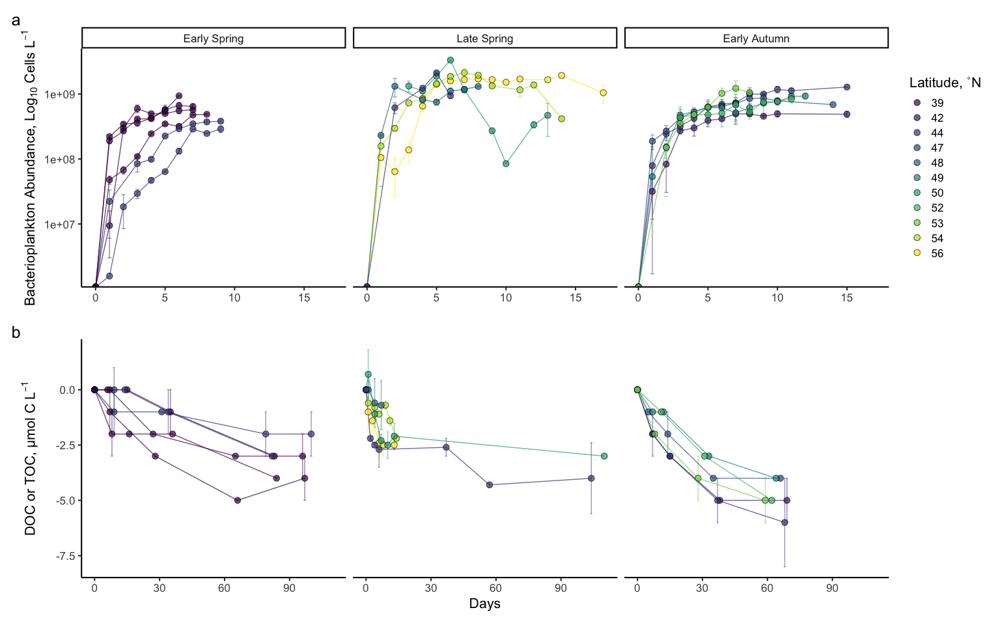
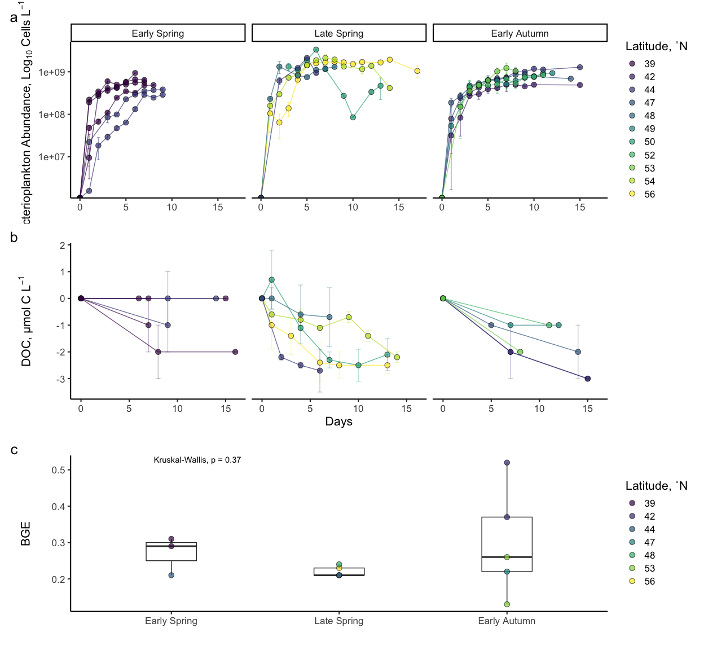
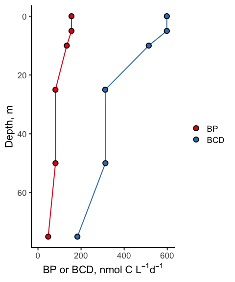

BCD and DOC Bioavailability
================
Nicholas Baetge
5/26/2020

# Intro

This document shows plots and tables of the merged field-experiment
NAAMES DOC data.

``` r
library(tidyverse) 
library(patchwork)
library(zoo)
#stat tests
library(lmtest)
library(lmodel2)
library(rstatix)
library(ggpubr)
library(blandr)
```

# Import Data

``` r
export <- readRDS("~/GITHUB/naames_bioav_ms/Input/master/processed_export_for_bioavMS.6.7.20.rds") %>% 
  select(Season, Cruise, degree_bin, Station, Max_MLD, int_delta_DOC_100, NCP_mol_100, doc_ncp_100) %>% 
  distinct() %>% 
  mutate(Season = ifelse(Season == "Late Autumn", "Early Winter", Season))

export_bioav <- readRDS("~/GITHUB/naames_bioav_ms/Output/processed_DOC_bioavailability.rds") 

doc_og <- read_rds("~/GITHUB/naames_bioav_ms/Input/master/DOC_Input") %>% 
  filter(Cruise == "AT34", Treatment == "Control", Depth == 10) %>% 
  drop_na(doc) %>% 
  left_join(., export_bioav %>% select(Season, Cruise, Station, Bottle, stationary.harvest)) %>% 
  select(Season, Cruise, Station, Bottle, stationary.harvest, Hours, doc) %>% 
  mutate(Days = Hours/24) %>% 
  filter(Station == 4) %>% 
  group_by(Season, Cruise, Station, Days, stationary.harvest) %>% 
  summarise_at(vars(doc), list(mean = mean, sd = sd)) %>%
  ungroup() %>% 
  mutate(increase = 56.2 - 53.4,
         per_increase = increase / 53.4 * 100) 
```

    ## Joining, by = c("Season", "Cruise", "Station", "Bottle")

``` r
bge <- read_rds("~/GITHUB/naames_bioav_ms/Output/processed_bge.rds") %>% 
  mutate(doc_star = ifelse(Cruise != "AT34" & Hours < stationary.harvest, round(interp_ptoc - i.poc,1), round(interp_ptoc - s.poc,1)),
         combined_doc = ifelse(Cruise == "AT34", interp_doc, doc_star),
          sd_combined_doc = ifelse(Cruise == "AT34", sd_doc, sd_ptoc)) %>% 
  group_by(Cruise, Station, Treatment, Bottle) %>% 
  mutate(remin.end = last(Days),
         stationary.harvest = stationary.harvest/24) %>%
  ungroup() %>% 
  group_by(Cruise, Station, Treatment, Hours) %>% 
  mutate(trt_combined_doc = ifelse(!is.na(sd_combined_doc), round(mean(combined_doc, na.rm = T), 1), NA),
         sd_trt_combined_doc = ifelse(!is.na(sd_combined_doc), round(sd(combined_doc, na.rm = T), 1), NA),
         
         trt_doc_toc = ifelse(Cruise == "AT34", round(mean(interp_doc, na.rm = T), 1), round(mean(interp_ptoc, na.rm = T))),
         sd_trt_doc_toc = ifelse(Cruise == "AT34", round(sd(interp_doc, na.rm = T), 1), round(sd(interp_ptoc, na.rm = T)))
         ) %>% 
  ungroup() %>% 
  group_by(Season, Station, Treatment) %>% 
  mutate(norm_doc =  round(trt_combined_doc - first(trt_combined_doc), 1),
         sd_norm_doc = ifelse(Hours != 0,  sd_trt_combined_doc, NA),
         norm_doc_toc =  round(trt_doc_toc - first(trt_doc_toc), 1),
         sd_norm_doc_toc = ifelse(Hours != 0,  sd_trt_doc_toc, NA),
         
         norm_cells = station_cells - first(station_cells),
         sd_norm_cells = ifelse(Hours != 0, sd_station_cells, NA)) %>% 
  ungroup() %>% 
  select(Season:stationary.harvest, remin.end, Hours:sd_station_cells, norm_cells, sd_norm_cells, everything()) %>% 
  left_join(., export_bioav %>% select(Season, Cruise, Station, degree_bin) %>% distinct()) %>% 
  mutate(degree_bin = ifelse(is.na(degree_bin), 39, degree_bin)) %>% 
  select(Season:Station, degree_bin, everything()) %>% 
  mutate(Season = ifelse(Season == "Late Autumn", "Early Winter", Season))
```

    ## Joining, by = c("Season", "Cruise", "Station")

``` r
bge_summary <- read_rds("~/GITHUB/naames_bioav_ms/Output/bge_summary.rds") %>% 
  left_join(., read_rds("~/GITHUB/naames_bioav_ms/Output/bge_cruise_means.rds") %>% select(Season, Cruise, bge_mean) %>% rename(cruise_bge = bge_mean)) %>% 
  left_join(., read_rds("~/GITHUB/naames_bioav_ms/Output/bge_station_means.rds") %>% select(Season, Cruise, Station, bge_mean) %>% rename(station_bge = bge_mean)) %>% 
  left_join(., export_bioav %>% select(Season, Cruise, Station, degree_bin) %>% distinct()) %>% 
  mutate(degree_bin = ifelse(is.na(degree_bin), 39, degree_bin)) %>% 
  select(Season:Station, degree_bin, everything()) %>% 
  mutate(Season = ifelse(Season == "Late Autumn", "Early Winter", Season)) 
```

    ## Joining, by = c("Season", "Cruise")

    ## Joining, by = c("Season", "Cruise", "Station")
    ## Joining, by = c("Season", "Cruise", "Station")

``` r
bcd <- read_rds("~/GITHUB/naames_bioav_ms/Output/processed_BCD_4_2021.rds") %>% 
  mutate(Season = ifelse(Season == "Late Autumn", "Early Winter", Season))

lat44 <- read_rds("~/GITHUB/naames_bioav_ms/Output/processed_lat44_remins.rds") %>% 
  drop_na(sd_combined_doc) %>% 
  mutate(station_line = ifelse(Cruise == "AT39" & Station == 4, "ab", "a")) %>% 
  mutate(Season = ifelse(Season == "Late Autumn", "Early Winter", Season))
```

Units for imported data frames are currently:

  - BP, µmol C m<sup>-3</sup> d<sup>-1</sup>
  - BCD, µmol C m<sup>-3</sup> d<sup>-1</sup>
  - BA, cells m<sup>-3</sup>
  - NPP, µmol C m<sup>-3</sup> d<sup>-1</sup>
  - ∆DOC and NCP (from export MS, integrated to Ez), mol C
    m<sup>-2</sup>

NPP, NCP and BCD are converted to: mmol C m<sup>-3</sup> d<sup>-1</sup>

# Bottle v. Vial Incubation Comparisons

We will run the Bland-Altman method (aka Tukey mean-difference) for
assessing agreement between two methods (in this case, vial and bottle
measurements/doc star and filtered doc). The Bland-Altman plot is a
scatter plot in which the difference between the paired measurements
(A-B) is plotted against their mean value \[(A+B)/2\]. The graph
provides two main pieces of information, namely the average of all the
differences, which is also provided by the t test and which is often
called the bias, and the 95% limits of agreement.

We’ll also do a lmodel2 regression.

### DOC filtered v . DOC\*

``` r
vessel_comparisons <- bge %>% 
  select(Season, Cruise, Station, degree_bin, Bottle, Hours, Days,  cells, p_cells, ptoc,  toc, doc, pdoc, doc_star) 

doc_doc.star <- vessel_comparisons %>% 
  drop_na(doc) %>% 
  drop_na(doc_star)

doc_doc.star.reg <- lmodel2(doc_star ~ doc, data = doc_doc.star, nperm = 99) #filtered DOC (from bottles) v DOC star
```

    ## RMA was not requested: it will not be computed.

``` r
doc_doc.star.blandr <- blandr.statistics(doc_doc.star$doc, doc_doc.star$doc_star, sig.level = 0.95)

doc_doc.star.blandr$bias
```

    ## [1] 2.128571

``` r
doc_doc.star.blandr$upperLOA
```

    ## [1] 6.747419

``` r
doc_doc.star.blandr$lowerLOA
```

    ## [1] -2.490276

``` r
doc_doc.star.reg.plot + doc_doc.star.blandr.plot +
  plot_annotation(tag_levels = "a") &
  plot_layout(guides = "collect") +
  theme(plot.tag = element_text(size = 14))
```

<!-- -->

### PDOC v DOC bottle

``` r
vessel_doc <- vessel_comparisons %>% 
  drop_na(pdoc)

vessel_doc.reg <- lmodel2(pdoc ~ doc, data = vessel_comparisons, nperm = 99) #vial v bottle DOC (both filtered)
```

    ## RMA was not requested: it will not be computed.

``` r
vessel_doc.blandr <- blandr.statistics(vessel_comparisons$doc, vessel_comparisons$pdoc, sig.level = 0.95)

vessel_doc.blandr$bias
```

    ## [1] 0.3833333

``` r
vessel_doc.blandr$upperLOA
```

    ## [1] 2.578183

``` r
vessel_doc.blandr$lowerLOA
```

    ## [1] -1.811517

``` r
vl_btl_doc_blandr <- vessel_doc %>% 
  mutate(diff = doc - pdoc,
         mean = (doc + pdoc) / 2) %>% 
  ggplot(., aes(x = mean, y = diff, group = Bottle)) +
  geom_hline(yintercept = 0, size = 1, linetype = 1) +
    geom_hline(yintercept = vessel_doc.blandr$bias, size = 1, linetype = 2) +
  geom_hline(yintercept = vessel_doc.blandr$upperLOA, size = 1, linetype = 3) +
  geom_hline(yintercept = vessel_doc.blandr$lowerLOA, size = 1, linetype = 3) +
  geom_point(aes(fill = Station), color = "black", shape = 21, size = 4, alpha = 0.7 ) +
  scale_fill_brewer(palette = "Dark2") +
  labs(y = expression(paste("Difference: Bottle DOC - Vial DOC, µmol C L"^-1)), x = expression(paste("Mean: (Bottle DOC + Vial DOC) / 2, µmol C L"^-1))) +
  theme_classic2(base_size = 16) +
  theme(legend.title = element_blank()) +
  guides(fill = F)
```

``` r
vl_btl_doc <- vessel_doc %>% 
  ggplot(aes(x = doc, y = pdoc, group = Bottle)) + 
  geom_abline(aes(intercept = 0, slope = 1)) +
  geom_abline(intercept = vessel_doc.reg$regression.results[3,2],
              slope = vessel_doc.reg$regression.results[3,3],colour = "black", linetype = 2, size = 1) +
  geom_point(aes(fill = Station), color = "black", shape = 21, size = 4, alpha = 0.7 ) +
  scale_fill_brewer(palette = "Dark2") +
  labs(x = expression(paste("Bottle DOC, µmol C L"^-1)), y = expression(paste("Vial DOC, µmol C L"^-1)), fill = "Early Spring Station") +
  theme_classic2(base_size = 16) +
  theme(legend.title = element_blank()) +
   annotate( geom = "text", label = expression(atop("y = 1.02x - 1.44", paste("r"^2,"= 0.96, ", italic("p "), "<< 0.01"))), x = 80, y = 51, size = 3) +
  xlim(50, 85) +
  ylim(50, 85) +
  guides(fill = F)
```

### Bottle v. Vial Cell Abundance

``` r
vessel_cells.reg <- lmodel2(p_cells ~ cells, data = vessel_comparisons, nperm = 99) #vial v bottle DOC (both filtered)
```

    ## RMA was not requested: it will not be computed.

``` r
vessel_cells.blandr <- blandr.statistics(vessel_comparisons$cells, vessel_comparisons$p_cells, sig.level = 0.95)

vessel_cells.blandr$bias
```

    ## [1] 2417934

``` r
vessel_cells.blandr$upperLOA
```

    ## [1] 342965561

``` r
vessel_cells.blandr$lowerLOA
```

    ## [1] -338129693

``` r
vl_btl_cell_blandr <- vessel_comparisons %>% 
  drop_na(p_cells) %>% 
  mutate(diff = cells - p_cells,
         mean = (cells + p_cells) / 2) %>% 
  ggplot(., aes(x = mean, y = diff, group = Bottle)) +
  geom_hline(yintercept = 0, size = 1, linetype = 1) +
    geom_hline(yintercept = vessel_cells.blandr$bias, size = 1, linetype = 2) +
  geom_hline(yintercept = vessel_cells.blandr$upperLOA, size = 1, linetype = 3) +
  geom_hline(yintercept = vessel_cells.blandr$lowerLOA, size = 1, linetype = 3) +
  geom_point(aes(fill = Station), color = "black", shape = 21, size = 4, alpha = 0.7 ) +
  scale_fill_brewer(palette = "Dark2") +
  labs(y = expression(paste("Difference: Bottle Cells - Vial Cells, L"^-1)), x = expression(paste("Mean: (Bottle Cells + Vial Cells) / 2, L"^-1))) +
  theme_classic2(base_size = 16) 
```

``` r
vl_btl_cell <- vessel_comparisons %>% 
  drop_na(p_cells) %>% 
  ggplot(aes(x = cells, y = p_cells)) + 
  geom_abline(aes(intercept = 0, slope = 1)) +
  geom_abline(intercept = vessel_cells.reg$regression.results[3,2],
              slope = vessel_cells.reg$regression.results[3,3],colour = "black", linetype = 2, size = 1) +
 geom_point(aes(fill = Station), color = "black", shape = 21, size = 4, alpha = 0.7 ) +
  labs(x = expression(paste("Bottle Cells L"^-1)), y = expression(paste("Vial Cells L"^-1)), fill = "NAAMES 4 Station") +
  guides(fill = F) +
  theme_classic2(base_size = 16) +
  scale_fill_brewer(palette = "Dark2") +
  theme(legend.title = element_blank()) +
  annotate( geom = "text", label = expression(atop("y = 1.07x - 8.72 * 10"^7, paste("r"^2,"= 0.96, ", italic("p "), "<< 0.01"))), x = 2.6E9, y = 5.0E8, size = 3) +
  #theme(plot.caption = element_text(face = "")) +
  ylim(4.5*10^8, 3.0*10^9) +
  xlim(4.5*10^8, 3.0*10^9)
```

``` r
vl_btl_cell + vl_btl_cell_blandr + vl_btl_doc + vl_btl_doc_blandr +
  plot_annotation(tag_levels = "a") &
  plot_layout(guides = "collect") +
  theme(plot.tag = element_text(size = 14))
```

<!-- -->

# N2 Post-Cruise contamination

``` r
unique(doc_og$increase)
```

    ## [1] 2.8

``` r
unique(doc_og$per_increase)
```

    ## [1] 5.243446

<!-- -->

## Map

``` r
library(akima)
```

    ## Warning: package 'akima' was built under R version 4.0.2

``` r
library(mapdata)
```

    ## Warning: package 'mapdata' was built under R version 4.0.2

    ## Loading required package: maps

    ## Warning: package 'maps' was built under R version 4.0.2

    ## 
    ## Attaching package: 'maps'

    ## The following object is masked from 'package:purrr':
    ## 
    ##     map

``` r
library(maps)
library(rerddap)
```

    ## Warning: package 'rerddap' was built under R version 4.0.2

    ## Registered S3 method overwritten by 'hoardr':
    ##   method           from
    ##   print.cache_info httr

## Chl climatology

[tutorial](https://rmendels.github.io/pices2017.nb.html)
[tutorial2](https://rpubs.com/eqmh/sat-data-plotter-mapper)

``` r
chlaInfo <- info("erdMH1chla8day")
CHLA <- griddap(chlaInfo, latitude = c(35., 65.), longitude = c(-60, -30), time = c('2016-05-01','2016-05-31'), fields = 'chlorophyll')
```

    ## info() output passed to x; setting base url to: https://upwell.pfeg.noaa.gov/erddap/

``` r
library(readxl)
```

    ## Warning: package 'readxl' was built under R version 4.0.2

``` r
stations <- read_xlsx("~/GITHUB/naames_bioav_ms/Input/stations.xlsx") %>% 
  select(Cruise, Station, Latitude, Longitude) %>% 
  mutate(Season = ifelse(Cruise == "AT32", "Early Winter", NA),
         Season = ifelse(Cruise == "AT34", "Late Spring", Season),
         Season = ifelse(Cruise == "AT38", "Early Autumn", Season),
         Season = ifelse(Cruise == "AT39", "Early Spring", Season))
```

``` r
mycolor <- colors$salinity
w <- map_data("worldHires", ylim = c(35., 65.), xlim = c(-60, -30))

map <- ggplot() + 
  geom_polygon(data = w, aes(x = long, y = lat, group = group), fill = "grey80") +
  geom_raster(data = CHLA$data, aes(x = lon, y = lat, fill = log(chlorophyll)), interpolate = FALSE, alpha = 0.55) +
  scale_fill_gradientn(colours = mycolor, na.value = NA) +
  theme_bw() + 
  labs(x = "Latitude, ˚N", y = "Longitude, ˚W", fill = expression(paste("log(Chl ", italic("a"), ")")), color = "") +
  coord_fixed(1.3, xlim = c(-60, -30),  ylim = c(35., 65.)) +
  geom_point(data = stations, aes(x = Longitude, y = Latitude, color = factor(Season, levels = levels)), shape = 21, fill = "white", size = 2, alpha = 0.9, stroke = 2) +
  scale_color_manual(values = custom.colors) 
```

``` r
figure1 <- map 

ggsave("f1.jpg", figure1, device = "jpg",  width = 8, height = 8, path = "~/Desktop/Dissertation/MS_Bioavailability/Submission 2/figures/")
```

# Curves

## Cells

``` r
ba_curves <- bge %>% 
  filter(Treatment == "Control") %>% 
  drop_na(norm_cells) %>% 
  select(Season, Station, degree_bin, Days, norm_cells, sd_norm_cells) %>% 
  distinct() %>% 
  # filter(!Cruise == "AT34" | !Station == 3) %>% #did not calc bge or cell resp due to data coming from post stationary
  ggplot(aes(x = Days, y = norm_cells, group = interaction(Season, Station))) +
  geom_errorbar(aes(ymin = norm_cells - sd_norm_cells, ymax = norm_cells + sd_norm_cells, color = factor(degree_bin)), width = 0.3, alpha = 0.5) +
  geom_line(aes(color = factor(degree_bin)), alpha = 0.7) +
  geom_point(aes(fill = factor(degree_bin)), size = 3, shape = 21, alpha = 0.7) +
  scale_color_viridis_d(option = "viridis") +
  scale_fill_viridis_d(option = "viridis") +
 labs(x = expression(""), y = expression(paste("Bacterioplankton Abundance, Cells L"^-1)), fill = "Latitude, ˚N") +
  theme_classic2(base_size = 16) +
  guides(color = F, linetype = F) + facet_grid(~factor(Season, levels = levels))
```

``` r
ba_curves2 <- bge %>% 
  filter(Treatment == "Control") %>% 
  drop_na(norm_cells) %>% 
  select(Season, Station, degree_bin, Days, norm_cells, sd_norm_cells) %>% 
  distinct() %>% 
  # filter(!Cruise == "AT34" | !Station == 3) %>% #did not calc bge or cell resp due to data coming from post stationary
  ggplot(aes(x = Days, y = norm_cells, group = interaction(Season, Station))) +
  geom_errorbar(aes(ymin = norm_cells - sd_norm_cells, ymax = norm_cells + sd_norm_cells, color = factor(degree_bin)), width = 0.3, alpha = 0.5) +
  geom_line(aes(color = factor(degree_bin)), alpha = 0.7) +
  geom_point(aes(fill = factor(degree_bin)), size = 3, shape = 21, alpha = 0.7) +
  scale_y_log10() +
  scale_color_viridis_d(option = "viridis") +
  scale_fill_viridis_d(option = "viridis") +
 labs(x = expression(""), y = expression(paste("Bacterioplankton Abundance, Log"[10]," Cells L"^-1)), fill = "Latitude, ˚N") +
  theme_classic2(base_size = 16) +
  guides(color = F, linetype = F) + facet_grid(~factor(Season, levels = levels))
```

## DOC

``` r
doc_curves <-  bge %>% 
  filter(Treatment == "Control") %>% 
  drop_na(sd_combined_doc) %>% 
  select(Season, Station, degree_bin, Days, norm_doc_toc, sd_norm_doc_toc) %>% 
  distinct() %>% 
  # filter(!Cruise == "AT34" | !S,tation == 3) %>% #did not calc bge or cell resp due to data coming from post stationary
  ggplot(aes(x = Days, y = norm_doc_toc, group = interaction(Season, Station))) +
  geom_errorbar(aes(ymin = norm_doc_toc - sd_norm_doc_toc, ymax = norm_doc_toc + sd_norm_doc_toc, color = factor(degree_bin)), width = 1, alpha = 0.5) +
  geom_line(aes(color = factor(degree_bin)), alpha = 0.7) +
  geom_point(aes(fill = factor(degree_bin)), size = 3, shape = 21, alpha = 0.7) +
  scale_color_viridis_d(option = "viridis") +
  scale_fill_viridis_d(option = "viridis") +
 # labs(x = expression("Days"), y = expression(paste("DOC"^"(*)",", µmol C L"^-1)), fill = "") +
  labs(x = expression("Days"), y = expression(paste("DOC or TOC, µmol C L"^-1)), fill = "") +
  theme_classic2(base_size = 16) +
  theme(strip.background.x = element_blank(),
        strip.text.x = element_blank()) +
  guides(color = F, fill = F) +
  facet_grid(~factor(Season, levels = levels))
```

``` r
doc_curves2 <-  bge %>% 
  filter(Treatment == "Control", Days <= 20) %>% 
  drop_na(sd_combined_doc) %>% 
  select(Season, Station, degree_bin, Days, norm_doc_toc, sd_norm_doc_toc) %>% 
  distinct() %>% 
  # filter(!Cruise == "AT34" | !S,tation == 3) %>% #did not calc bge or cell resp due to data coming from post stationary
  ggplot(aes(x = Days, y = norm_doc_toc, group = interaction(Season, Station))) +
  geom_errorbar(aes(ymin = norm_doc_toc - sd_norm_doc_toc, ymax = norm_doc_toc + sd_norm_doc_toc, color = factor(degree_bin)), width = 0.5, alpha = 0.3) +
  geom_line(aes(color = factor(degree_bin)), alpha = 0.7) +
  geom_point(aes(fill = factor(degree_bin)), size = 3, shape = 21, alpha = 0.7) +
  scale_color_viridis_d(option = "viridis") +
  scale_fill_viridis_d(option = "viridis") +
 labs(x = expression("Days"), y = expression(paste("DOC, µmol C L"^-1)), fill = "") +
  theme_classic2(base_size = 16) +
  theme(strip.background.x = element_blank(),
        strip.text.x = element_blank()) +
  guides(color = F, fill = F) +
  facet_grid(~factor(Season, levels = levels))
```

``` r
ba_curves2 / doc_curves + 
   plot_annotation(tag_levels = "a") &
  plot_layout(guides = "collect") +
  theme(plot.tag = element_text(size = 14))
```

<!-- -->

``` r
figure3 <- ba_curves / doc_curves + 
   plot_annotation(tag_levels = "a") &
  plot_layout(guides = "collect") +
  theme(plot.tag = element_text(size = 14))

ggsave("f3.jpg", figure3, device = "jpg",  width = 16, height = 8, path = "~/Desktop/Dissertation/MS_Bioavailability/Submission 2/figures/")
```

``` r
# figure1a <-  ba_curves / doc_curves2 + 
#    plot_annotation(tag_levels = "a") &
#   plot_layout(guides = "collect") +
#   theme(plot.tag = element_text(size = 14))
```

# Delta Stats

stats for ∆POC and ∆DOC

``` r
delta_stats <- bge_summary %>% 
  select(Cruise, degree_bin,  del.poc, del.doc, del.doc.star) %>% 
  mutate(del.doc = ifelse(is.na(del.doc), del.doc.star, del.doc)) %>% 
  select(-del.doc.star)

longterm_delta_stats <- export_bioav %>% 
  select(Cruise, degree_bin, longterm.del.doc) %>% 
  drop_na(longterm.del.doc) %>% 
  mutate(season = ifelse(Cruise == "AT38", "Autumn", "Spring"))
```

``` r
# delta_stats %>% 
  # kruskal_test(del.poc ~ Cruise)

compare_means(del.poc ~ Cruise, delta_stats, method = "kruskal.test")
```

    ## # A tibble: 1 x 6
    ##   .y.         p p.adj p.format p.signif method        
    ##   <chr>   <dbl> <dbl> <chr>    <chr>    <chr>         
    ## 1 del.poc 0.443  0.44 0.44     ns       Kruskal-Wallis

``` r
# delta_stats %>%
#   kruskal_test(del.doc ~ Cruise)

compare_means(del.doc ~ Cruise, delta_stats, method = "kruskal.test")
```

    ## # A tibble: 1 x 6
    ##   .y.         p p.adj p.format p.signif method        
    ##   <chr>   <dbl> <dbl> <chr>    <chr>    <chr>         
    ## 1 del.doc 0.132  0.13 0.13     ns       Kruskal-Wallis

``` r
delta_stats %>%
  group_by(Cruise) %>% 
  kruskal_test(del.doc ~ degree_bin)
```

    ## # A tibble: 3 x 7
    ##   Cruise .y.         n statistic    df     p method        
    ## * <chr>  <chr>   <int>     <dbl> <int> <dbl> <chr>         
    ## 1 AT34   del.doc    10      1.5      3 0.682 Kruskal-Wallis
    ## 2 AT38   del.doc    12      3.32     2 0.191 Kruskal-Wallis
    ## 3 AT39   del.doc    12      1.5      1 0.221 Kruskal-Wallis

``` r
compare_means(longterm.del.doc ~ Cruise, longterm_delta_stats, method = "kruskal.test")
```

    ## # A tibble: 1 x 6
    ##   .y.                    p   p.adj p.format p.signif method        
    ##   <chr>              <dbl>   <dbl> <chr>    <chr>    <chr>         
    ## 1 longterm.del.doc 0.00240 0.00240 0.0024   **       Kruskal-Wallis

``` r
compare_means(longterm.del.doc ~ Cruise, longterm_delta_stats)
```

    ## # A tibble: 3 x 8
    ##   .y.              group1 group2       p  p.adj p.format p.signif method  
    ##   <chr>            <chr>  <chr>    <dbl>  <dbl> <chr>    <chr>    <chr>   
    ## 1 longterm.del.doc AT34   AT38   0.00179 0.0054 0.0018   **       Wilcoxon
    ## 2 longterm.del.doc AT34   AT39   0.305   0.3    0.3046   ns       Wilcoxon
    ## 3 longterm.del.doc AT38   AT39   0.00752 0.015  0.0075   **       Wilcoxon

``` r
longterm_delta_stats %>% 
  group_by(Cruise) %>% 
  kruskal_test(longterm.del.doc ~ degree_bin)
```

    ## # A tibble: 3 x 7
    ##   Cruise .y.                  n statistic    df      p method        
    ## * <chr>  <chr>            <int>     <dbl> <int>  <dbl> <chr>         
    ## 1 AT34   longterm.del.doc     7      5.14     4 0.273  Kruskal-Wallis
    ## 2 AT38   longterm.del.doc    12      4.31     5 0.506  Kruskal-Wallis
    ## 3 AT39   longterm.del.doc    10      2.94     1 0.0864 Kruskal-Wallis

``` r
longterm_delta_stats %>% 
  group_by(season) %>% 
  summarize_at(vars(longterm.del.doc), list(mean = mean, sd = sd), na.rm = T)  %>% 
  mutate(foldchange = first(mean)/last(mean))
```

    ## # A tibble: 2 x 4
    ##   season  mean    sd foldchange
    ## * <chr>  <dbl> <dbl>      <dbl>
    ## 1 Autumn  4.84 1.03        1.43
    ## 2 Spring  3.39 0.854       1.43

``` r
longterm_delta_stats %>% 
  summarize_at(vars(longterm.del.doc), list(mean = mean, sd = sd), na.rm = T) %>% 
  mutate(cv = sd/mean)
```

    ## # A tibble: 1 x 3
    ##    mean    sd    cv
    ##   <dbl> <dbl> <dbl>
    ## 1  3.99  1.17 0.292

# BGE

``` r
bge_box <- bge_summary %>% 
  drop_na(bge) %>% 
  ggplot(aes(x = factor(Season, levels = levels), y = bge)) +
  geom_boxplot(width = 0.3) +
  geom_point(aes(fill = factor(degree_bin)), shape = 21, size = 3, alpha = 0.7) +
  scale_color_viridis_d(option = "viridis") +
  scale_fill_viridis_d(option = "viridis") +
  theme_classic2(base_size = 16) +
  # scale_fill_brewer(palette = "Dark2") +
  labs(x = "", y = "BGE", fill = "Latitude, ˚N") + 
  stat_compare_means()  
  
  bge_box
```

<!-- -->

``` r
compare_means(bge ~ degree_bin, bge_summary, method = "kruskal.test")
```

    ## # A tibble: 1 x 6
    ##   .y.       p p.adj p.format p.signif method        
    ##   <chr> <dbl> <dbl> <chr>    <chr>    <chr>         
    ## 1 bge   0.155  0.15 0.15     ns       Kruskal-Wallis

``` r
ba_curves2 / doc_curves2 + bge_box +
   plot_annotation(tag_levels = "a") &
  plot_layout(guides = "collect") +
  theme(plot.tag = element_text(size = 20))
```

<!-- -->

# Experiments at 44˚N

<!-- -->

<!-- -->

<!-- -->

# Bioavailability & BGE Tables

``` r
bge.table.data <- bge_summary %>% 
  group_by(Cruise, Season, Station, degree_bin) %>% 
  summarize_at(vars(del.cells:station_bge), list(mean = mean, sd = sd), na.rm = T)  %>% 
  arrange(factor(Season, levels = levels), degree_bin)

bge.table.data2 <- bge_summary %>% 
  group_by(Cruise, Season) %>% 
  summarize_at(vars(del.cells:station_bge), list(mean = mean, sd = sd), na.rm = T)  %>% 
  arrange(factor(Season, levels = levels))

bioav.table.data <- export_bioav %>% 
  select(Cruise:Station, degree_bin, end.remin, stationary.harvest, redis_DOC_vol, initial.doc:longterm.ddoc) %>% 
  mutate(shortterm.del.doc = ifelse(shortterm.del.doc < 2, NA, shortterm.del.doc),
         shortterm.bioav.doc = ifelse(is.na(shortterm.del.doc), NA, shortterm.bioav.doc),
         shortterm.ddoc = ifelse(is.na(shortterm.del.doc), NA, shortterm.ddoc),
         
         longterm.del.doc = ifelse(end.remin < 10, NA, longterm.del.doc),
          longterm.bioav.doc = ifelse(is.na( longterm.del.doc), NA,  longterm.bioav.doc),
          longterm.ddoc = ifelse(is.na( longterm.del.doc), NA,longterm.ddoc),
         
         
         persis.doc = ifelse(persis.doc < 2, NA, persis.doc),
         
         percent_persis.doc = ifelse(is.na(persis.doc), NA, percent_persis.doc)) %>% 
  arrange(factor(Season, levels = levels), degree_bin) %>% 
  ungroup() 

station_bioav <- bioav.table.data %>% 
 group_by(Cruise, Season, Station, degree_bin) %>% 
  summarize_at(vars(redis_DOC_vol:longterm.ddoc), list(mean = mean, sd = sd), na.rm = T)  %>% 
  arrange(factor(Season, levels = levels), degree_bin) %>% 
  ungroup()

cruise_bioav <- bioav.table.data %>% 
 group_by(Cruise, Season) %>% 
  summarize_at(vars(redis_DOC_vol:longterm.ddoc), list(mean = mean, sd = sd), na.rm = T)  %>% 
  arrange(factor(Season, levels = levels)) %>% 
  ungroup() 

time <- export_bioav %>% 
  select(Season, Cruise, degree_bin, Station, Bottle, stationary.harvest, end.remin) %>% 
  arrange(factor(Season, levels = levels), degree_bin) %>% 
  ungroup()


 #N2S3 bge not calc omitted because poc change and cell change from data well beyond stationary (in death phase)
boc_doc <- bge %>% 
  filter(Treatment == "Control") %>% 
  select(Cruise, Season, Station, degree_bin, Bottle, stationary.harvest, remin.end, Days, bge,  doc.star_i, doc.star_s,  i.poc, s.poc, combined_doc, sd_ptoc, sd_doc, doc  ) %>% 
  filter(Days == 0 | Days == stationary.harvest) %>%
  drop_na(stationary.harvest) %>% 
  mutate(doc_i = ifelse(Cruise == "AT34" & Days == 0, combined_doc, NA),
         doc_s = ifelse(Cruise == "AT34" & Days == stationary.harvest, combined_doc, NA)) %>% 
  group_by(Cruise, Station, Bottle) %>% 
  fill(doc_i:doc_s, .direction = "downup") %>% 
  ungroup() %>% 
  mutate(doc_i = ifelse(!Cruise == "AT34", doc.star_i, doc_i),
         doc_s = ifelse(!Cruise == "AT34", doc.star_s, doc_s )) %>% 
  #select(-combined_doc) %>% 
  mutate(phase = ifelse(Days == 0, "t0", "stationary")) %>% 
  group_by(Cruise, Station, phase) %>% 
  mutate(i.boc = mean(i.poc),
         sd_i.boc = sd(i.poc),
         
         s.boc = mean(s.poc),
         sd_s.boc = sd(s.poc),
         
         i.doc = mean(doc_i),
         sd_i.doc = sd(doc_i),
         
          s.doc = mean(doc_s),
         sd_s.doc = sd(doc_s),
         ) %>%
    ungroup() %>% 
  arrange(factor(Season, levels = levels), degree_bin) %>% 
  ungroup() %>% 
  select(Cruise:Bottle, i.boc:sd_s.doc, everything())
  # mutate(s.boc = ifelse(Cruise == "AT34" & Station == 3, NA, s.boc))#N2S3 omitted because poc change and cell change from data well beyond stationary (in death phase)
#n3s3, doc star is resolveable, but measured doc was not so bge was not calculated for this station
#n4s4 ∆doc reflects single experiment. same with n2s4


boc_doc2 <- bge %>% 
  filter(Treatment == "Control") %>% 
  select(Cruise, Season, Station, degree_bin, Bottle, Days, interp_ptoc, sd_ptoc, interp_doc, sd_doc  ) %>% 
  group_by(Cruise, Station, Bottle) %>% 
  mutate(last_ptoc = last(na.omit(interp_ptoc)),
         last_doc = last(na.omit(interp_doc))) %>% 
   mutate(longterm.del.doc = ifelse(Cruise != "AT34", first(interp_ptoc) - last(na.omit(interp_ptoc)), first(interp_doc) - last(na.omit(interp_doc))),
         longterm.del.doc = ifelse(longterm.del.doc < 2, NA, longterm.del.doc)) %>% 
  mutate(last = ifelse(Cruise == "AT34", last_doc, last_ptoc)) %>% 
  group_by(Cruise, Station) %>% 
  mutate(mean = mean(last),
         sd = sd(last)) %>% 
  arrange(factor(Season, levels = levels), degree_bin) 
```

# Box plots: NPP, BP, BA


# Bar plots: BCD and BCD:NPP

Convert BCD and NPP to mmol C m<sup>-3</sup> d<sup>-1</sup>

``` r
bcd.data <- bcd %>% 
  select(Season, Cruise:degree_bin, Station, ave_mld, sd_mld, int.temp, int.chl, int.ba, int.bcd, int.bcd_global, int.bp, int.NPP, bp.npp, bcd.npp, bcd.npp_global) %>% 
  distinct() %>% 
  mutate_at(vars(int.bcd, int.bcd_global, int.bp, int.NPP), funs(./10^3)) %>% 
  mutate_at(vars(bp.npp, bcd.npp, bcd.npp_global), funs(./10^2)) %>% 
  mutate(degree_bin = as.character(degree_bin)) 

bcd.summary <- bcd.data %>% 
  group_by(Season, Cruise, Station, degree_bin, ave_mld, sd_mld) %>% 
  summarise_at(vars(int.temp, int.chl, int.ba, int.bcd_global, int.bp, int.NPP, bp.npp, bcd.npp_global), list(mean = mean, sd = sd)) %>% 
  arrange(factor(Season, levels = levels), degree_bin) %>% 
  select(Season:sd_mld, contains(c("int.temp", "int.chl", "int.ba",  "int.NPP", "int.bp", "bp.npp", "int.bcd", "bcd.npp"))) 
  
bcd.cruise.summary <- bcd.data %>% 
  group_by(Season, Cruise) %>% 
  summarise_at(vars(int.temp, int.chl, int.ba, int.bcd_global, int.bp, int.NPP, bp.npp, bcd.npp_global), list(cruise_mean = mean, cruise_sd = sd, cruise_max = max, cruise_min = min)) %>% 
  arrange(factor(Season, levels = levels)) %>% 
  select(Season, contains(c("int.temp", "int.chl", "int.ba", "int.NPP", "int.bp", "bp.npp", "int.bcd", "bcd.npp")))

bcd.overall.summary <- bcd.data %>% 
  summarise_at(vars(int.temp, int.chl, int.ba, int.bcd_global, int.bp, int.NPP, bp.npp, bcd.npp_global), list(overall_mean = mean, overall_sd = sd, max = max, min = min))

bcd.npp.summary <- bcd.summary %>% 
  select(Season, Cruise,  degree_bin, int.NPP_mean, int.bcd_global_mean) %>% 
  rename(NPP = int.NPP_mean,
         BCD = int.bcd_global_mean) %>% 
  pivot_longer(c(NPP, BCD), names_to = "rate", values_to = "ave") %>% 
  left_join(., bcd.summary %>% 
  select(Season, Cruise, degree_bin,  int.NPP_sd, int.bcd_global_sd) %>% 
    rename(NPP = int.NPP_sd,
         BCD = int.bcd_global_sd) %>% 
  pivot_longer(c(NPP, BCD), names_to = "rate", values_to = "sd"))
```

    ## Adding missing grouping variables: `Station`, `ave_mld`
    ## Adding missing grouping variables: `Station`, `ave_mld`

    ## Joining, by = c("Station", "ave_mld", "Season", "Cruise", "degree_bin", "rate")

``` r
bcd.npp_summary_table <- left_join(bcd.summary, bcd.cruise.summary) %>% 
  mutate_at(vars(contains(c("int.NPP", "int.bp", "int.bcd"))), round, 3) %>% 
  mutate_at(vars(contains(c("bp.npp", "bcd.npp"))), round, 2) 
```

    ## Joining, by = "Season"

``` r
# export_bar <- export %>% 
#   mutate(degree_bin = as.character(degree_bin)) %>% 
#   group_by(Season, Cruise, degree_bin) %>% 
#   summarise_at(vars(int_delta_DOC_100, doc_ncp_100, NCP_mol_100), list(mean = mean, sd = sd)) %>% 
#   arrange(factor(Season, levels = levels), degree_bin)

export_bar <- export_bioav %>%
  mutate(degree_bin = as.character(degree_bin)) %>%
  group_by(Season, Cruise, degree_bin) %>%
  summarise_at(vars(accm.doc), list(mean = mean, sd = sd), na.rm = T) %>%
  arrange(factor(Season, levels = levels), degree_bin)
```

``` r
accm.doc_table <- export_bioav %>% 
  select(Cruise, Season, accm.doc) %>% 
  drop_na(accm.doc) %>% 
  group_by(Cruise, Season) %>% 
  summarise_at(vars(accm.doc), list(mean = mean, sd = sd))

accm.doc_table
```

    ## # A tibble: 3 x 4
    ## # Groups:   Cruise [3]
    ##   Cruise Season        mean    sd
    ##   <chr>  <chr>        <dbl> <dbl>
    ## 1 AT34   Late Spring   6.13  2.83
    ## 2 AT38   Early Autumn 13.1   3.34
    ## 3 AT39   Early Spring  2.8   1.37

<!-- -->

``` r
figure7 <- doc_sa.bar / bcd.bar / bcd.npp.bar / ratio.bar  +
  plot_annotation(tag_levels = "a") &
  theme(plot.tag = element_text(size = 14))

ggsave("f7.jpg", figure7, device = "jpg",  width = 12, height = 10, path = "~/Desktop/Dissertation/MS_Bioavailability/Submission 2/figures/")
```

    ## Warning: Removed 3 rows containing missing values (geom_bar).

<!-- -->

# Regressions: Property-Property

``` r
summary(bcd.data$int.NPP)
```

    ##    Min. 1st Qu.  Median    Mean 3rd Qu.    Max. 
    ##  0.1142  0.2328  0.6400  0.7681  0.9524  3.3406

## BCD v NPP

    ## RMA was not requested: it will not be computed.

``` r
reg_test <- lm(int.NPP ~ int.temp, data = bcd.data) ; summary(reg_test)
```

    ## 
    ## Call:
    ## lm(formula = int.NPP ~ int.temp, data = bcd.data)
    ## 
    ## Residuals:
    ##     Min      1Q  Median      3Q     Max 
    ## -0.8567 -0.4122 -0.2037  0.2999  2.4329 
    ## 
    ## Coefficients:
    ##             Estimate Std. Error t value Pr(>|t|)    
    ## (Intercept)  1.25422    0.32237   3.891 0.000476 ***
    ## int.temp    -0.03979    0.02454  -1.622 0.114694    
    ## ---
    ## Signif. codes:  0 '***' 0.001 '**' 0.01 '*' 0.05 '.' 0.1 ' ' 1
    ## 
    ## Residual standard error: 0.6913 on 32 degrees of freedom
    ## Multiple R-squared:  0.07594,    Adjusted R-squared:  0.04706 
    ## F-statistic:  2.63 on 1 and 32 DF,  p-value: 0.1147

## Plots

<!-- -->

``` r
ggsave("f8.jpg", reg1.plot, device = "jpg",  width = 8, height = 6, path = "~/Desktop/Dissertation/MS_Bioavailability/Submission 2/figures/")
```

    ## Warning in is.na(x): is.na() applied to non-(list or vector) of type
    ## 'expression'

``` r
compare_means(bcd.npp_global_mean ~ Cruise, bcd.summary, method = "kruskal.test")
```

    ## Adding missing grouping variables: `Season`, `Station`, `degree_bin`, `ave_mld`

    ## # A tibble: 1 x 6
    ##   .y.                       p  p.adj p.format p.signif method        
    ##   <chr>                 <dbl>  <dbl> <chr>    <chr>    <chr>         
    ## 1 bcd.npp_global_mean 0.00411 0.0041 0.0041   **       Kruskal-Wallis

``` r
compare_means(bcd.npp_global_mean ~ Season, bcd.summary)
```

    ## Adding missing grouping variables: `Cruise`, `Station`, `degree_bin`, `ave_mld`

    ## # A tibble: 6 x 8
    ##   .y.             group1      group2           p p.adj p.format p.signif method 
    ##   <chr>           <chr>       <chr>        <dbl> <dbl> <chr>    <chr>    <chr>  
    ## 1 bcd.npp_global… Early Spri… Late Spri… 0.762   0.76  0.7619   ns       Wilcox…
    ## 2 bcd.npp_global… Early Spri… Early Aut… 0.0667  0.2   0.0667   ns       Wilcox…
    ## 3 bcd.npp_global… Early Spri… Early Win… 0.00952 0.048 0.0095   **       Wilcox…
    ## 4 bcd.npp_global… Late Spring Early Aut… 0.132   0.26  0.1320   ns       Wilcox…
    ## 5 bcd.npp_global… Late Spring Early Win… 0.00216 0.013 0.0022   **       Wilcox…
    ## 6 bcd.npp_global… Early Autu… Early Win… 0.0411  0.16  0.0411   *        Wilcox…

## bp/bcd profile

<!-- -->

<!-- -->

# Plots for powerpoint

``` r
library(officer)
```

    ## Warning: package 'officer' was built under R version 4.0.2

    ## 
    ## Attaching package: 'officer'

    ## The following object is masked from 'package:readxl':
    ## 
    ##     read_xlsx

``` r
p1a <- ba_curves + labs(y = expression(paste("Cells L"^-1))) +  theme_classic2(16)
p1b <- doc_curves2 + theme_classic2(16) + theme(strip.background = element_blank(), strip.text.x = element_blank())
p1 <- p1a / p1b +
  plot_layout(guides = "collect") 
##
p2 <- bge_box + theme_classic2(18)
##
p3a <- bcd.bar2 + theme_classic2(16) 
p3b <- bcd.npp.bar + theme_classic2(16) + theme(strip.background = element_blank(), strip.text = element_blank()) + theme(legend.position = "right", legend.title = element_blank()) 
p3c <- ratio.bar + theme_classic2(16) + theme(strip.background = element_blank(), strip.text = element_blank()) 
p3 <- p3a / p3b / p3c


# initialize PowerPoint slide
officer::read_pptx() %>%
  # add slide ----
  officer::add_slide() %>%
  # specify object and location of object 
  officer::ph_with(p1, ph_location(width = 9, height = 5)) %>%
  
  officer::add_slide() %>%
  officer::ph_with(p2, ph_location(width = 9, height = 4)) %>%
  
  officer::add_slide() %>%
  officer::ph_with(p3, ph_location(width = 10, height = 8)) %>%
  
  # export slide 
  base::print(
    target = "~/Desktop/Dissertation/MS_Bioavailability/Presentations/biov_pres_figs.pptx"
    )
```

# Reviews

## 1.2 µm filtrate

``` r
library(readxl)
library(googledrive)
library(googlesheets4)
```

    ## 
    ## Attaching package: 'googlesheets4'

    ## The following objects are masked from 'package:googledrive':
    ## 
    ##     request_generate, request_make

``` r
headers <- read_sheet("https://docs.google.com/spreadsheets/d/1zw-W1k__BeuJg1oQpQQ_XT7zWLiY3dfL-dTaQ0pzN5Q/edit#gid=1446474071", sheet = "Bottle File Headers", skip = 0)
```

    ## Using an auto-discovered, cached token.
    ## To suppress this message, modify your code or options to clearly consent to the use of a cached token.
    ## See gargle's "Non-interactive auth" vignette for more details:
    ## https://gargle.r-lib.org/articles/non-interactive-auth.html

    ## The googlesheets4 package is using a cached token for nicholasbaetge@gmail.com.

    ## Auto-refreshing stale OAuth token.

    ## Reading from "NAAMES_Working_Data"

    ## Range "'Bottle File Headers'"

``` r
cols <- headers %>% 
  pull(col_type) %>% 
  str_c(., collapse = "")

google.df <-  read_sheet("https://docs.google.com/spreadsheets/d/1zw-W1k__BeuJg1oQpQQ_XT7zWLiY3dfL-dTaQ0pzN5Q/edit#gid=1446474071", sheet = "Bottle File", skip = 1, col_types = cols)
```

    ## Reading from "NAAMES_Working_Data"

    ## Range "'Bottle File'!2:5000000"

    ## Warning in .Primitive("as.double")(x, ...): NAs introduced by coercion
    
    ## Warning in .Primitive("as.double")(x, ...): NAs introduced by coercion
    
    ## Warning in .Primitive("as.double")(x, ...): NAs introduced by coercion
    
    ## Warning in .Primitive("as.double")(x, ...): NAs introduced by coercion
    
    ## Warning in .Primitive("as.double")(x, ...): NAs introduced by coercion
    
    ## Warning in .Primitive("as.double")(x, ...): NAs introduced by coercion
    
    ## Warning in .Primitive("as.double")(x, ...): NAs introduced by coercion
    
    ## Warning in .Primitive("as.double")(x, ...): NAs introduced by coercion
    
    ## Warning in .Primitive("as.double")(x, ...): NAs introduced by coercion
    
    ## Warning in .Primitive("as.double")(x, ...): NAs introduced by coercion
    
    ## Warning in .Primitive("as.double")(x, ...): NAs introduced by coercion
    
    ## Warning in .Primitive("as.double")(x, ...): NAs introduced by coercion
    
    ## Warning in .Primitive("as.double")(x, ...): NAs introduced by coercion
    
    ## Warning in .Primitive("as.double")(x, ...): NAs introduced by coercion
    
    ## Warning in .Primitive("as.double")(x, ...): NAs introduced by coercion
    
    ## Warning in .Primitive("as.double")(x, ...): NAs introduced by coercion
    
    ## Warning in .Primitive("as.double")(x, ...): NAs introduced by coercion
    
    ## Warning in .Primitive("as.double")(x, ...): NAs introduced by coercion
    
    ## Warning in .Primitive("as.double")(x, ...): NAs introduced by coercion
    
    ## Warning in .Primitive("as.double")(x, ...): NAs introduced by coercion
    
    ## Warning in .Primitive("as.double")(x, ...): NAs introduced by coercion
    
    ## Warning in .Primitive("as.double")(x, ...): NAs introduced by coercion
    
    ## Warning in .Primitive("as.double")(x, ...): NAs introduced by coercion
    
    ## Warning in .Primitive("as.double")(x, ...): NAs introduced by coercion
    
    ## Warning in .Primitive("as.double")(x, ...): NAs introduced by coercion
    
    ## Warning in .Primitive("as.double")(x, ...): NAs introduced by coercion
    
    ## Warning in .Primitive("as.double")(x, ...): NAs introduced by coercion
    
    ## Warning in .Primitive("as.double")(x, ...): NAs introduced by coercion
    
    ## Warning in .Primitive("as.double")(x, ...): NAs introduced by coercion
    
    ## Warning in .Primitive("as.double")(x, ...): NAs introduced by coercion
    
    ## Warning in .Primitive("as.double")(x, ...): NAs introduced by coercion
    
    ## Warning in .Primitive("as.double")(x, ...): NAs introduced by coercion
    
    ## Warning in .Primitive("as.double")(x, ...): NAs introduced by coercion

``` r
google.df1 <- google.df %>% 
  select(Cruise, Station, Date, SCN, Target_Z, BactAbund) %>% 
  filter(between(Target_Z, 1, 10)) %>%
  drop_na(BactAbund) %>% 
  filter(!Cruise == "AT32", SCN %in% c(3, 7, 12)) %>% 
  filter(!Cruise == "AT34" | !Station == 4 | !SCN %in% c(3, 7)) %>% 
  filter(!Cruise == "AT38" | !Station == 6 | !SCN %in% c(3, 12))  %>% 
  drop_na(BactAbund) %>% 
  select(-Date, -SCN) %>% 
  rename(Depth = Target_Z) %>% 
  mutate(Cruise = ifelse(Cruise == "AT39-6", "AT39", Cruise)) %>% 
  mutate(Depth = ifelse(Depth == 1, 5, Depth))


n4_filtrates <- readxl::read_xlsx("~/GITHUB/naames_bioav_ms/Input/master/NAAMES_4_Filter Retention_Bacterial_Abundance.xlsx", sheet = "Sheet1") %>% 
  mutate(cells = cells/10^8) 

ba <- read_csv("~/GITHUB/naames_bioav_ms/Input/master/N2-4_BactA_Remin_Master.csv") %>% 
  # filter(Hours == 0, Bottle %in% c("W", "1.2"), Depth != 200) 
filter(Hours == 0, Bottle %in% c("Niskin"), Depth != 200) %>% #niskin are actually 1.2 µm filtrate
  mutate(Depth = ifelse(Cruise == "AT34" & Station == 4, 5, Depth)) %>% 
  select(Cruise, Station, Depth, cellsperL) %>% 
  rename(cells = cellsperL) %>% 
  mutate(cells = cells/10^8,
         cells = ifelse(Cruise == "AT39", NA, cells)) %>% 
  full_join(., n4_filtrates) %>% 
  drop_na(cells)
```

    ## Parsed with column specification:
    ## cols(
    ##   Cruise = col_character(),
    ##   Station = col_character(),
    ##   Depth = col_double(),
    ##   Bottle = col_character(),
    ##   Timepoint = col_double(),
    ##   Treatment = col_character(),
    ##   Treatment_Btl = col_character(),
    ##   Hours = col_double(),
    ##   cellsperL = col_double(),
    ##   sd_cellsperL = col_double(),
    ##   p_cellsperL = col_double(),
    ##   p_sdcellsperL = col_double()
    ## )

    ## Joining, by = c("Cruise", "Station", "Depth", "cells")

``` r
initial.cond <- bge %>% 
  filter(Hours == 0) %>% 
  select(Cruise, Station, cells) %>% 
  distinct() %>% 
  group_by(Cruise, Station) %>% 
  mutate(ave_initial = mean(cells)) %>% 
  ungroup() %>% 
  select(Cruise, Station, ave_initial) %>% 
  distinct() %>% 
  mutate(ave_initial = ave_initial/10^8)


filtrate <- left_join(ba, google.df1) %>% 
  drop_na(BactAbund) %>% 
  mutate(ret = cells/BactAbund)  %>% 
  left_join(., initial.cond) %>% 
  rename(in_situ = BactAbund,
         inoc = cells,
         init = ave_initial) %>% 
  mutate(dil = init/inoc) %>% 
  mutate_at(vars(in_situ, inoc, init), funs(.*10^8)) %>%
  mutate_at(vars(in_situ, inoc, init), funs(./10^9))  
```

    ## Joining, by = c("Cruise", "Station", "Depth")

    ## Joining, by = c("Cruise", "Station")

``` r
filtrate %>% 
  filter(ret > 0.5) %>%
  summarise_at(vars(ret), list(mean = mean, sd = sd)) 
```

    ## # A tibble: 1 x 2
    ##    mean    sd
    ##   <dbl> <dbl>
    ## 1 0.784 0.161

``` r
filtrate %>% 
  summarise_at(vars(dil), list(mean = mean, sd = sd)) 
```

    ## # A tibble: 1 x 2
    ##    mean     sd
    ##   <dbl>  <dbl>
    ## 1 0.272 0.0546

## BA at end of exp

``` r
ba_end <- read_csv("~/GITHUB/naames_bioav_ms/Input/master/N2-4_BactA_Remin_Master.csv") %>% 
  filter(Cruise == "AT39", Treatment == "Control", Bottle %in% c("A", "B")) %>% 
  mutate(days = Hours/24,
         cells = cellsperL,
         cells = ifelse(Hours > 200, p_cellsperL, cells),
         
         sd_cells = sd_cellsperL,
         sd_cells = ifelse(Hours > 200, p_sdcellsperL, sd_cells)) %>% 
  select(Cruise:Bottle, days, cells, sd_cells) %>% 
  drop_na(cells)
```

    ## Parsed with column specification:
    ## cols(
    ##   Cruise = col_character(),
    ##   Station = col_character(),
    ##   Depth = col_double(),
    ##   Bottle = col_character(),
    ##   Timepoint = col_double(),
    ##   Treatment = col_character(),
    ##   Treatment_Btl = col_character(),
    ##   Hours = col_double(),
    ##   cellsperL = col_double(),
    ##   sd_cellsperL = col_double(),
    ##   p_cellsperL = col_double(),
    ##   p_sdcellsperL = col_double()
    ## )

``` r
ba_long <- ba_end %>% 
  ggplot(aes(x = days, y = cells, group = interaction(Station, Bottle))) +
  geom_errorbar(aes(ymin = cells - sd_cells, ymax = cells + sd_cells, color = factor(Station)), width = 0.3, alpha = 0.5) +
  geom_line(aes(color = factor(Station)), alpha = 0.7) +
  geom_point(aes(fill = factor(Station)), size = 3, shape = 21, alpha = 0.7) +
  scale_color_viridis_d(option = "viridis") +
  scale_fill_viridis_d(option = "viridis") +
 labs(x = expression(""), y = expression(paste("Bacterioplankton Abundance, Cells L"^-1)), fill = "Station") +
  theme_classic2(base_size = 16) +
  guides(color = F, linetype = F) ; ba_long
```

<!-- -->
