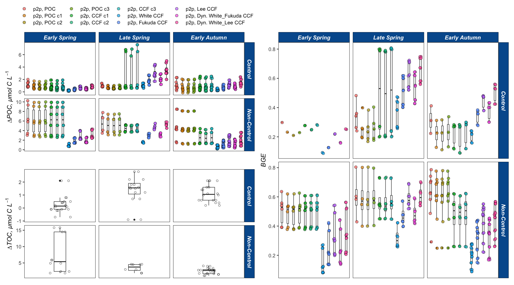
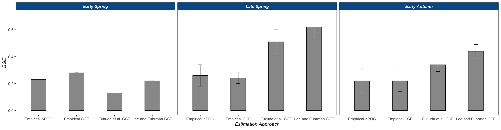

BGE
================
Nicholas Baetge
5/20/2020

# Intro

This document shows how processed **individual bottle** data from NAAMES
remineralization bioassays were combined, QC’d, and analyzed. Here, we
calculate derived variables, including BGE.

``` r
library(tidyverse) 
library(rmarkdown)
library(knitr)
library(readxl)
library(data.table) 
library(scales)
library(zoo)
library(oce)
library(patchwork)
#rmarkdown tables
library(stargazer)
library(pander)
library(growthcurver)
#stat tests
library(lmtest)
library(lmodel2)
library(rstatix)
library(ggpubr)
```

# Merge Processed Data

``` r
ba <- readRDS("~/naames_bioav_ms/Output/processed_bacterial_abundance.rds") %>% 
  mutate(key = paste(Cruise, Station, Depth, Treatment, Bottle, Timepoint, sep = "."),
         Depth = as.numeric(Depth)) %>% 
  filter(!Treatment %in% c("GF75", "Niskin", "TFF-Ret", "Volume", "Parallel"))

oc <- readRDS("~/naames_bioav_ms/Output/processed_doc.rds") %>% 
  select(-Days) %>% 
  filter(!Treatment == "Parallel")

bc <- readRDS("~/naames_bioav_ms/Output/processed_bacterial_carbon.rds") %>% 
  select(-c(contains(".ug"), contains("gf75.cells"))) 


merge <- full_join(ba, oc) %>% 
  left_join(., bc) %>% 
  arrange(Cruise, Station, Depth, Treatment, Bottle, Hours) %>%
  mutate(Days = round(Hours/24, 2)) %>% 
  group_by(Cruise, Station, Depth, Treatment, Bottle) %>%
  select(Season:Depth, facet_depth,  Treatment, facet_treatment, Bottle, facet_bottle, Timepoint, Hours, stationary, s.timepoint, Days, cells:sd_p_cells, doc, sd_doc, ptoc, sd_ptoc, doc_from_t0, ptoc_from_t0, gf75.flag, i.poc.cf1:i.ccf.c3, s.poc.cf1:s.ccf.c3, ccf.white:ccf.lee) %>% 
  fill(stationary, facet_treatment, facet_depth, facet_bottle, .direction = "downup") %>% 
  ungroup() %>% 
  drop_na(Hours) 
```

# Tidy and Wrangle

## Condense DOC Data

Because DOC and TOC samples are essentially the same in this dataset, we
will treat them as such. We’ll use the DOC samples from AT34 and the
parallel TOC samples from AT38 and AT39.

``` r
tidy_merge <- merge %>% 
  mutate(ptoc = ifelse(Cruise == "AT34", doc, ptoc),
         sd_ptoc = ifelse(Cruise == "AT34", sd_doc, sd_ptoc),
         ptoc_from_t0 = ifelse(Cruise == "AT34", doc_from_t0, ptoc_from_t0)) %>% 
  select(-c(p_cells, sd_p_cells, doc, sd_doc, doc_from_t0)) %>% 
  rename(doc = ptoc,
         sd_doc = sd_ptoc,
         doc_from_t0 = ptoc_from_t0) %>% 
  group_by(Cruise, Station, Depth, Treatment, Bottle) %>% 
  mutate(s.timepoint = ifelse(s.timepoint == Timepoint, Hours, NA)) %>% 
  fill(s.timepoint, .direction = "downup") %>% 
  rename(s.gf75 = s.timepoint) %>% 
  select(-Timepoint) %>% 
  # merge duplicate stationary timepoints
  group_by(Cruise, Station, Depth, Treatment, Bottle, Hours) %>%
  fill(cells:doc_from_t0, i.poc.cf1:ccf.lee, .direction = "downup") %>% 
  distinct() %>% 
  ungroup() %>% 
  group_by(Cruise, Station, Depth, Treatment, Bottle) 
```

## Add 7 and 30 Day Timepoints

If experiments do not already have these timepoints, they will be added
and then interpolated. These timepoints will be markers for short-term
and long-term DOC bioavailability.

``` r
tidy_merge_keys <- tidy_merge %>% 
  group_keys() %>%
  mutate(key = paste(Cruise, ", S", Station, ", Z =", Depth, ",", Treatment, ",", Bottle))
tidy_merge_header <- tidy_merge_keys$key

tidy_merge_list <- tidy_merge %>%
  group_split()
names(tidy_merge_list) <- tidy_merge_header

two_newrow.func <- function(morty){
   morty[nrow(morty) + 1,] <- NA
   morty$Days[is.na(morty$Days)] <- 7
  rick <- morty %>% 
    fill(., Season:facet_bottle, stationary:s.gf75, .direction = c("updown")) 
  
   rick[nrow(rick) + 1,] <- NA
  rick$Days[is.na(rick$Days)] <- 30
  summer <- rick %>% 
    fill(., Season:facet_bottle, stationary:s.gf75, .direction = c("updown")) 
}

add_tidy_merge <- lapply(tidy_merge_list, two_newrow.func) %>% 
  plyr::ldply(., as.data.frame) %>% 
  select(-.id) %>% 
  arrange(Cruise, Station, Depth, Treatment, Bottle, Days) %>% 
  group_by(Cruise, Station, Depth, Treatment, Bottle, Days) %>%
  fill(Hours, gf75.flag, cells:doc_from_t0, i.poc.cf1:ccf.lee, .direction = "downup") %>% 
  distinct() %>% 
  ungroup() %>% 
  mutate(Hours = ifelse(Days == 30, 720, Hours ),
         Hours = ifelse(Days == 7, 168, Hours )) %>% 
  group_by(Cruise, Station, Depth, Treatment, Bottle)  

add_tidy_merge_keys <- add_tidy_merge %>% 
  group_keys() %>%
  mutate(key = paste(Cruise, ", S", Station, ", Z =", Depth, ",", Treatment, ",", Bottle))
add_tidy_merge_header <- add_tidy_merge_keys$key

add_tidy_merge_list <- add_tidy_merge %>%
  group_split()
names(add_tidy_merge_list) <- add_tidy_merge_header
```

## Interpolations

``` r
interp.func <- function(x) {
  y <- zoo(x, order.by = x$Hours)
  interp_cells <- round(as.numeric(na.approx(y$cells, na.rm = F)))
  interp_doc <- round(as.numeric(na.approx(y$doc, na.rm = F)), 1)
  z <- cbind(y, interp_cells,  interp_doc)
  as_tibble(z)
}

interpolated <- lapply(add_tidy_merge_list, interp.func) %>% 
  plyr::ldply(., as.data.frame) %>% 
  select(-.id) %>% 
  mutate_at(vars(Depth, Hours:doc_from_t0, i.poc.cf1:interp_doc), as.numeric) %>% 
  select(Season:doc_from_t0, interp_cells, interp_doc, everything())
```

# Calculate Derived Variables

We need to readjust our initial bacterial carbon numbers before
calculating other parameters. Since the initial condition was 1.2-µm
filtrate, the carbon content of that filtrate would be higher than the
30:70 incubation mix at the beginning of the experiment. As a result
we’ll correct the initial carbon number to account for this:
POC<sub>initial</sub> = 0.3(POC~1.2 µm filtrate~)

We’ll then calculate and define:

  - Division rates (**r**) between each timepoint (Monod 1949). We
    assume all cells are viable.
  - Duration of lag, log, stationary phases based on calculated division
    rates and timing of stationary determined via GrowthCurver
      - lag phase ends when r \> 0.01 (Yates and Smotzer 2007)
      - we’ve already filtered out the death phases so the stationary
        phase runs from the GrowthCurver model determined timepoint
        until cell counts cease
      - we do not determine growth phases where there is no observable
        growth
  - Carrying Capacity (**k**), mean of cell abundance during stationary
  - Exponential growth rate day<sup>-1</sup>
  - Cell carbon in µmol C L<sup>-1</sup>, using different CCFS
  - Bacterial growth efficiencies (BGE) using multiple approaches, only
    where ∆DOC is resolvable:
      - point-to-point (**BGE\_p**), ∆BC and ∆DOC from T0 to stationary
      - phase-to-phase (**BGE\_ph**), ∆BC and ∆DOC using means of lag
        phase and stationary phase values

<!-- end list -->

``` r
calcs <- interpolated %>%
  mutate_at(vars( i.poc.cf1:i.pon.c3.um), funs(.*0.3)) %>% 
  group_by(Cruise, Station, Depth, Treatment, Bottle) %>% 
  
  #####division rates#### 
  mutate(r = round((log(interp_cells) - lag(log(interp_cells)))/(Hours - lag(Hours)), 2),
         r = ifelse(Hours == 0, 0, r)) %>% 
  
  ######cell growth phases####
  mutate(cell_div = ifelse(Hours >= stationary & !is.na(interp_cells), "stationary", NA),
         cell_div = ifelse(Hours > stationary & is.na(cell_div), "out of bounds", cell_div),
         cell_div = ifelse(Hours < stationary & r > 0.01, "exponential", cell_div)) %>% 
  fill(cell_div, .direction = "down") %>% 
  mutate(cell_div = ifelse(Hours < stationary & r == 0 & is.na(cell_div), "lag", cell_div)) %>% 
  fill(cell_div, .direction = "down") %>% 
  mutate(growth = ifelse(cell_div == "stationary" | cell_div == "exponential", cell_div, NA)) %>%
  fill(growth, .direction = "downup") %>% 
  mutate(growth = ifelse(growth == "stationary" | growth == "exponential", T, F),
         growth = ifelse(is.na(growth), F, growth),
         cell_div = ifelse(growth == F, "no growth", cell_div)) %>% 
  fill(growth, .direction = "downup") %>% 
  fill(interp_cells, .direction = "down") %>% 
  mutate(interp_cells = ifelse(Days > 24, NA, interp_cells)) %>% 
  
  ###### carrying capacity ######
  mutate(k = ifelse(cell_div == "stationary", interp_cells, NA),
         k = ifelse(!is.na(k), mean(k, na.rm = T), NA)) %>% 
  
  #####exponential growth rate#####
  mutate(end_lag_t = ifelse(cell_div == "lag", Hours, NA),
         end_lag_t = ifelse(!is.na(end_lag_t), max(end_lag_t, na.rm = T), NA),
         end_lag_cells = ifelse(Hours == end_lag_t, interp_cells, NA),
         beg_stat_cells = ifelse(Hours == stationary, interp_cells, NA)) %>% 
  fill(k:beg_stat_cells, .direction = "downup") %>% 
  mutate(mew = ifelse(!is.na(end_lag_cells), ((log(beg_stat_cells) - log(end_lag_cells))/(stationary - end_lag_t)) * 24, NA )) %>% 
 
  ######cell carbon based on CCFs, points####
  mutate(i.cells = ifelse(Hours == 0, cells, NA)) %>% 
  fill(i.cells, .direction = "updown") %>% 
  mutate(delta_cells = interp_cells - i.cells,
         s.delta_cells = ifelse(Hours == stationary & stationary != 0 & growth == T, delta_cells, NA)) %>% 
  fill(s.delta_cells, .direction = "updown") %>% 
  mutate(norm_cells = ifelse(!is.na(s.delta_cells), round(delta_cells/s.delta_cells,2), NA)) %>% 
  rename(weight = norm_cells) %>% 
  mutate(dyn.ccf.white_fukuda = round(ccf.white + (weight * (ccf.fukuda - ccf.white)),1),
         dyn.ccf.white_lee = round(ccf.white + (weight * (ccf.lee - ccf.white)),1),
         i.bc.ccf.c1 =  ifelse(cell_div %in% c("lag", "exponential", "stationary"), round((interp_cells * i.ccf.c1) / (12*10^9), 1), NA), 
         i.bc.ccf.c2 =  ifelse(cell_div %in% c("lag", "exponential", "stationary"), round((interp_cells * i.ccf.c2) / (12*10^9), 1), NA), 
         i.bc.ccf.c3 =  ifelse(cell_div %in% c("lag", "exponential", "stationary"), round((interp_cells * i.ccf.c3) / (12*10^9), 1), NA), 
         s.bc.ccf.c1 =  ifelse(cell_div %in% c("lag", "exponential", "stationary"), round((interp_cells * s.ccf.c1) / (12*10^9), 1), NA), 
         s.bc.ccf.c2 =  ifelse(cell_div %in% c("lag", "exponential", "stationary"), round((interp_cells * s.ccf.c2) / (12*10^9), 1), NA), 
         s.bc.ccf.c3 =  ifelse(cell_div %in% c("lag", "exponential", "stationary"), round((interp_cells * s.ccf.c3) / (12*10^9), 1), NA), 
         bc.ccf.white =  ifelse(cell_div %in% c("lag", "exponential", "stationary"), round((interp_cells * ccf.white) / (12*10^9), 1), NA), 
         bc.ccf.fukuda =  ifelse(cell_div %in% c("lag", "exponential", "stationary"), round((interp_cells * ccf.fukuda) / (12*10^9), 1), NA), 
         bc.ccf.lee =  ifelse(cell_div %in% c("lag", "exponential", "stationary"), round((interp_cells * ccf.lee) / (12*10^9), 1), NA), 
         bc.dyn.ccf.white_fukuda =  ifelse(cell_div %in% c("lag", "exponential", "stationary"), round((interp_cells * dyn.ccf.white_fukuda) / (12*10^9), 1), NA), 
         bc.dyn.ccf.white_lee =  ifelse(cell_div %in% c("lag", "exponential", "stationary"), round((interp_cells * dyn.ccf.white_lee) / (12*10^9), 1), NA)) %>% 
  ungroup() %>% 
  
  ######cell carbon based on CCFs, phase averages####
  group_by(Cruise, Station, Depth, Treatment, Bottle, cell_div) %>% 
  mutate(ph.i.bc.ccf.c1 = ifelse(!cell_div %in% c("no growth", "out of bounds"), round(mean(i.bc.ccf.c1, na.rm = T), 1), NA),
         ph.i.bc.ccf.c2 = ifelse(!cell_div %in% c("no growth", "out of bounds"), round(mean(i.bc.ccf.c2, na.rm = T), 1), NA),
         ph.i.bc.ccf.c3 = ifelse(!cell_div %in% c("no growth", "out of bounds"), round(mean(i.bc.ccf.c3, na.rm = T), 1), NA),
         ph.s.bc.ccf.c1 = ifelse(!cell_div %in% c("no growth", "out of bounds"), round(mean(s.bc.ccf.c1, na.rm = T), 1), NA),
         ph.s.bc.ccf.c2 = ifelse(!cell_div %in% c("no growth", "out of bounds"), round(mean(s.bc.ccf.c2, na.rm = T), 1), NA),
         ph.s.bc.ccf.c3 = ifelse(!cell_div %in% c("no growth", "out of bounds"), round(mean(s.bc.ccf.c3, na.rm = T), 1), NA),
         ph.bc.ccf.white = ifelse(!cell_div %in% c("no growth", "out of bounds"), round(mean(bc.ccf.white, na.rm = T), 1), NA),
         ph.bc.ccf.fukuda = ifelse(!cell_div %in% c("no growth", "out of bounds"), round(mean( bc.ccf.fukuda, na.rm = T), 1), NA),
         ph.bc.ccf.lee = ifelse(!cell_div %in% c("no growth", "out of bounds"), round(mean(bc.ccf.lee, na.rm = T), 1), NA),
         ph.bc.dyn.ccf.white_fukuda =  ifelse(!cell_div %in% c("no growth", "out of bounds"), round(mean(bc.dyn.ccf.white_fukuda, na.rm = T), 1), NA),
         ph.bc.dyn.ccf.white_lee = ifelse(!cell_div %in% c("no growth", "out of bounds"), round(mean(bc.dyn.ccf.white_lee, na.rm = T), 1), NA),
         
  ######DOC, phase averages####
         ph.doc = ifelse(!cell_div %in% c("no growth", "out of bounds"), round(mean(interp_doc, na.rm = T), 1), NA)
         ) %>% 
  ungroup() %>% 
  
  ######delta cell carbon, points####
  group_by(Cruise, Station, Depth, Treatment, Bottle) %>% 
  fill(ph.i.bc.ccf.c1:ph.doc, .direction = "down") %>%
  mutate(del.bc.poc = s.poc.um - i.poc.um,
         del.bc.poc.c1 = s.poc.c1.um - i.poc.c1.um,
         del.bc.poc.c2 = s.poc.c2.um - i.poc.c2.um,
         del.bc.poc.c3 = s.poc.c3.um - i.poc.c3.um,
         del.bc.p.ccf.c1 = ifelse(Hours == stationary, s.bc.ccf.c1, NA) - first(i.bc.ccf.c1),
         del.bc.p.ccf.c2 = ifelse(Hours == stationary, s.bc.ccf.c2, NA) - first(i.bc.ccf.c2),
         del.bc.p.ccf.c3 = ifelse(Hours == stationary, s.bc.ccf.c3, NA) - first(i.bc.ccf.c3),
         del.bc.p.ccf.white = ifelse(Hours == stationary, bc.ccf.white, NA) - first(bc.ccf.white),
         del.bc.p.ccf.fukuda = ifelse(Hours == stationary, bc.ccf.fukuda, NA) - first(bc.ccf.fukuda),
         del.bc.p.ccf.lee = ifelse(Hours == stationary, bc.ccf.lee, NA) - first(bc.ccf.lee),
         del.bc.p.dyn.ccf.white_fukuda = ifelse(Hours == stationary, bc.dyn.ccf.white_fukuda, NA) - first(bc.dyn.ccf.white_fukuda),
         del.bc.p.dyn.ccf.white_lee = ifelse(Hours == stationary, bc.dyn.ccf.white_lee, NA) - first(bc.dyn.ccf.white_lee),
         
  ######delta cell carbon, phase averages####       
         del.bc.ph.ccf.c1 = ifelse(Hours == stationary, ph.s.bc.ccf.c1, NA) - first(ph.i.bc.ccf.c1),
         del.bc.ph.ccf.c2 = ifelse(Hours == stationary, ph.s.bc.ccf.c2, NA) - first(ph.i.bc.ccf.c2),
         del.bc.ph.ccf.c3 = ifelse(Hours == stationary, ph.s.bc.ccf.c3, NA) - first(ph.i.bc.ccf.c3),
         del.bc.ph.ccf.white = ifelse(Hours == stationary, ph.bc.ccf.white, NA) - first(ph.bc.ccf.white),
         del.bc.ph.ccf.fukuda = ifelse(Hours == stationary, ph.bc.ccf.fukuda, NA) - first(ph.bc.ccf.fukuda),
         del.bc.ph.ccf.lee = ifelse(Hours == stationary, ph.bc.ccf.lee, NA) - first(ph.bc.ccf.lee),
         del.bc.ph.dyn.ccf.white_fukuda = ifelse(Hours == stationary, ph.bc.dyn.ccf.white_fukuda, NA) - first(ph.bc.dyn.ccf.white_fukuda),
         del.bc.ph.dyn.ccf.white_lee = ifelse(Hours == stationary, ph.bc.dyn.ccf.white_lee, NA) - first(ph.bc.dyn.ccf.white_lee),
  
  ######delta DOC####  
         del.ph.doc = first(ph.doc) - last(ph.doc),
         del.doc = first(doc) - ifelse(Hours == stationary, interp_doc, NA),
         ) %>% 
  fill(del.bc.p.ccf.c1:del.doc, .direction = "downup") %>% 
  mutate(del.ph.doc.flag = ifelse(del.ph.doc >= 1.5, "Acceptable", "NR"),
         del.doc.flag = ifelse(del.doc >= 1.5, "Acceptable", "NR"),
         
  ######BGE, points####  
         bge.bc.poc = ifelse(del.doc.flag != "NR", del.bc.poc/(del.doc + del.bc.poc), NA),
         bge.bc.poc.c1 = ifelse(del.doc.flag != "NR", del.bc.poc.c1/(del.doc + del.bc.poc.c1), NA),
         bge.bc.poc.c2 = ifelse(del.doc.flag != "NR", del.bc.poc.c2/(del.doc + del.bc.poc.c2), NA),
         bge.bc.poc.c3 = ifelse(del.doc.flag != "NR", del.bc.poc.c3/(del.doc + del.bc.poc.c3), NA),
         bge.p.bc.ccf.c1 = ifelse(del.doc.flag != "NR", del.bc.p.ccf.c1/(del.doc + del.bc.p.ccf.c1), NA),
         bge.p.bc.ccf.c2 = ifelse(del.doc.flag != "NR", del.bc.p.ccf.c2/(del.doc + del.bc.p.ccf.c2), NA),
         bge.p.bc.ccf.c3 = ifelse(del.doc.flag != "NR", del.bc.p.ccf.c3/(del.doc + del.bc.p.ccf.c3), NA),
         bge.p.bc.ccf.white = ifelse(del.doc.flag != "NR", del.bc.p.ccf.white/(del.doc + del.bc.p.ccf.white), NA),
         bge.p.bc.ccf.fukuda = ifelse(del.doc.flag != "NR", del.bc.p.ccf.fukuda/(del.doc +  del.bc.p.ccf.fukuda), NA),
         bge.p.bc.ccf.lee = ifelse(del.doc.flag != "NR", del.bc.p.ccf.lee/(del.doc + del.bc.p.ccf.lee), NA),
         bge.p.bc.dyn.ccf.white_fukuda = ifelse(del.doc.flag != "NR", del.bc.p.dyn.ccf.white_fukuda/(del.doc + del.bc.p.dyn.ccf.white_fukuda), NA),
         bge.p.bc.dyn.ccf.white_lee = ifelse(del.doc.flag != "NR", del.bc.p.dyn.ccf.white_lee/(del.doc + del.bc.p.dyn.ccf.white_lee), NA),
  
  ######BGE, phase averages####  
         bge.ph.bc.ccf.c1 = ifelse(del.ph.doc.flag != "NR", del.bc.ph.ccf.c1/(del.ph.doc + del.bc.ph.ccf.c1), NA),
         bge.ph.bc.ccf.c2 = ifelse(del.ph.doc.flag != "NR", del.bc.ph.ccf.c2/(del.ph.doc + del.bc.ph.ccf.c2), NA),
         bge.ph.bc.ccf.c3 = ifelse(del.ph.doc.flag != "NR", del.bc.ph.ccf.c3/(del.ph.doc + del.bc.ph.ccf.c3), NA),
         bge.ph.bc.ccf.white = ifelse(del.ph.doc.flag != "NR", del.bc.ph.ccf.white/(del.ph.doc + del.bc.ph.ccf.white), NA),
         bge.ph.bc.ccf.fukuda = ifelse(del.ph.doc.flag != "NR", del.bc.ph.ccf.fukuda/(del.ph.doc + del.bc.ph.ccf.fukuda), NA),
         bge.ph.bc.ccf.lee = ifelse(del.ph.doc.flag != "NR", del.bc.ph.ccf.lee/(del.ph.doc + del.bc.ph.ccf.lee), NA),
         bge.ph.bc.dyn.ccf.white_fukuda = ifelse(del.ph.doc.flag != "NR", del.bc.ph.dyn.ccf.white_fukuda/(del.ph.doc + del.bc.ph.dyn.ccf.white_fukuda), NA),
         bge.ph.bc.dyn.ccf.white_lee = ifelse(del.ph.doc.flag != "NR", del.bc.ph.dyn.ccf.white_lee/(del.ph.doc + del.bc.ph.dyn.ccf.white_lee), NA)
         ) %>% 
  ###########
  ungroup() %>% 
  mutate_at(vars(bge.bc.poc:bge.ph.bc.dyn.ccf.white_lee), round, 2) %>% 
 
  #add metadata
  left_join(., readRDS("~/naames_export_ms/Output/processed_export_for_bioavMS.5.14.20.rds") %>% 
              mutate(Cruise = gsub("AT39-6", "AT39", Cruise)) %>%
              mutate_at(vars(Station), as.character) %>% 
              select(Cruise:Subregion) %>% 
              distinct()
  )
```

    ## Warning: funs() is soft deprecated as of dplyr 0.8.0
    ## Please use a list of either functions or lambdas: 
    ## 
    ##   # Simple named list: 
    ##   list(mean = mean, median = median)
    ## 
    ##   # Auto named with `tibble::lst()`: 
    ##   tibble::lst(mean, median)
    ## 
    ##   # Using lambdas
    ##   list(~ mean(., trim = .2), ~ median(., na.rm = TRUE))
    ## This warning is displayed once per session.

``` r
##CCFs per season

season.ccfs <- calcs %>% 
  filter(Depth == 10, Treatment == "Control", Hours == 0, !Station == "U") %>% 
  select(Cruise, Season, Subregion, Station,  i.ccf.c1, s.ccf.c1 ) %>% 
  distinct() %>% 
  mutate(global_initial_ccf = mean(i.ccf.c1, na.rm = T),
         global_stationary_ccf = mean(s.ccf.c1, na.rm = T)) %>% 
  group_by(Season) %>% 
  mutate(ave_initial_ccf = mean(i.ccf.c1, na.rm = T),
         ave_stationary_ccf = mean(s.ccf.c1, na.rm = T)) %>% 
  ungroup() %>% 
  select(Season, global_initial_ccf:ave_stationary_ccf) %>% 
  distinct()

calcs2 <- left_join(calcs, season.ccfs)
```

# Summary Data, Table, and Plots

``` r
bge_summary <- calcs2 %>% 
  select(Season:Station, ave_lat:Subregion, Depth:facet_bottle, stationary:s.gf75, gf75.flag, del.doc, del.doc.flag, del.ph.doc, del.ph.doc.flag, del.bc.poc:del.bc.ph.dyn.ccf.white_lee, bge.bc.poc:bge.ph.bc.dyn.ccf.white_lee, i.cn:i.cn.c3, s.cn:s.cn.c3) %>% 
  distinct() %>% 
  mutate(type = ifelse(Treatment == "Control", "Control", "Non-Control"),
         degree_bin = ifelse(Station %in% c("S2RD", "S2RF"), 39, degree_bin),
         Subregion = ifelse(Station %in% c("S2RD", "S2RF"), "GS/Sargasso", Subregion)) %>% 
  select(Season:Treatment, type, everything()) %>% 
  arrange(Cruise, Station, Depth, Treatment, Bottle) %>% 
  #remove outliers
  filter(!Cruise == "AT38" | !Station == 1 | !Depth == 10 | !Treatment == "Control",
         !Cruise == "AT39" | !Station == 1 | !Depth == 10 | !Treatment == "Control") %>% 
   filter(!Station == "U", Depth == 10)
```



Generally, good agreement between BGEs estimated using empirical ∆POC
and empirical CCFs.

But, there can be wide disagreement. This disagreement is rooted in the
∆POC.

When ∆BC \> than ∆POC, carbon per cell is overestimated (cell abundance
on the filter is likely underestimated). This would lead to BGEs
calculated using CCFs being high and unreliable.

Based on these criteria, there are two experiments in the late spring
(station 3) where BGEs calculated using empirical CCFs should not be
included. These will be removed from further analyses.

``` r
bge_summary.table <- bge_summary %>% 
  mutate(bge.p.bc.ccf.c1 = ifelse(Cruise == "AT34" & Station == 3 & Depth == 10, NA, bge.p.bc.ccf.c1),
         bge.p.bc.ccf.c2 = ifelse(Cruise == "AT34" & Station == 3 & Depth == 10, NA, bge.p.bc.ccf.c2),
         bge.p.bc.ccf.c3 = ifelse(Cruise == "AT34" & Station == 3 & Depth == 10, NA, bge.p.bc.ccf.c3)) %>%  
  select(Season:Bottle, contains("bge")) %>% 
  group_by(Season, type) %>% 
  gather(appr, bge, contains("bge")) %>% 
  drop_na(bge) %>% 
  group_by(Cruise, type, appr) %>% 
  mutate(ave_bge = mean(bge),
         sd_bge = sd(bge),
         min_bge = min(bge),
         max_bge = max(bge),
         med_bge = median(bge)) %>% 
  ungroup() %>% 
  select(Season, type,  appr, ave_bge:med_bge) %>% 
  distinct() %>% 
  filter(type == "Control") %>% 
  arrange(Season) %>% 
  mutate_at(vars(ave_bge:med_bge), round, 2) 

bge_summary.table 
```

    ## # A tibble: 52 x 8
    ##    Season       type    appr              ave_bge sd_bge min_bge max_bge med_bge
    ##    <chr>        <chr>   <chr>               <dbl>  <dbl>   <dbl>   <dbl>   <dbl>
    ##  1 Early Autumn Control bge.bc.poc           0.31   0.1     0.22    0.41    0.31
    ##  2 Early Autumn Control bge.bc.poc.c1        0.22   0.09    0.13    0.31    0.23
    ##  3 Early Autumn Control bge.bc.poc.c2        0.22   0.11    0.11    0.32    0.23
    ##  4 Early Autumn Control bge.bc.poc.c3        0.23   0.11    0.13    0.34    0.23
    ##  5 Early Autumn Control bge.p.bc.ccf.c1      0.22   0.08    0.12    0.28    0.27
    ##  6 Early Autumn Control bge.p.bc.ccf.c2      0.21   0.1     0.09    0.28    0.27
    ##  7 Early Autumn Control bge.p.bc.ccf.c3      0.23   0.09    0.12    0.3     0.28
    ##  8 Early Autumn Control bge.p.bc.ccf.whi…    0.21   0.04    0.16    0.24    0.22
    ##  9 Early Autumn Control bge.p.bc.ccf.fuk…    0.34   0.05    0.28    0.38    0.36
    ## 10 Early Autumn Control bge.p.bc.ccf.lee     0.44   0.05    0.38    0.48    0.47
    ## # … with 42 more rows

``` r
ave_bges <- bge_summary.table %>% 
  filter(appr %in% c("bge.bc.poc.c1", "bge.p.bc.ccf.c1",  "bge.p.bc.ccf.lee", "bge.p.bc.ccf.fukuda")) %>% 
  mutate(group = ifelse(appr %in% c("bge.bc.poc.c1", "bge.p.bc.ccf.c1"), "Empirical", "Fukuda et al. CCF"),
         group = ifelse(appr == "bge.p.bc.ccf.lee", "Lee and Fuhrman CCF", group ),
         group2 = ifelse(appr == "bge.bc.poc.c1", "Empirical ∆POC", group),
         group2 = ifelse(appr == "bge.p.bc.ccf.c1", "Empirical CCF", group2)) %>%
  select(Season, group2, ave_bge, sd_bge, group) %>% 
  rename(appr = group2) %>% 
  group_by(Season, group) %>% 
  mutate(group_bge = round(mean(ave_bge),2),
         sd_group_bge = round(sd(ave_bge),2)) %>%
  ungroup() %>% 
  group_by(group) %>% 
  mutate(global_bge = round(mean(ave_bge), 2),
         sd_global_bge = round(sd(ave_bge),2)) %>% 
  ungroup()

ave_bges
```

    ## # A tibble: 12 x 9
    ##    Season appr  ave_bge sd_bge group group_bge sd_group_bge global_bge
    ##    <chr>  <chr>   <dbl>  <dbl> <chr>     <dbl>        <dbl>      <dbl>
    ##  1 Early… Empi…    0.22   0.09 Empi…      0.22         0          0.24
    ##  2 Early… Empi…    0.22   0.08 Empi…      0.22         0          0.24
    ##  3 Early… Fuku…    0.34   0.05 Fuku…      0.34        NA          0.33
    ##  4 Early… Lee …    0.44   0.05 Lee …      0.44        NA          0.43
    ##  5 Early… Empi…    0.23  NA    Empi…      0.26         0.04       0.24
    ##  6 Early… Empi…    0.28   0    Empi…      0.26         0.04       0.24
    ##  7 Early… Fuku…    0.13   0    Fuku…      0.13        NA          0.33
    ##  8 Early… Lee …    0.22   0    Lee …      0.22        NA          0.43
    ##  9 Late … Empi…    0.26   0.08 Empi…      0.25         0.01       0.24
    ## 10 Late … Empi…    0.24   0.04 Empi…      0.25         0.01       0.24
    ## 11 Late … Fuku…    0.51   0.09 Fuku…      0.51        NA          0.33
    ## 12 Late … Lee …    0.62   0.09 Lee …      0.62        NA          0.43
    ## # … with 1 more variable: sd_global_bge <dbl>



# Save Data

``` r
calcs2 %>% 
  mutate(bge.p.bc.ccf.c1 = ifelse(Cruise == "AT34" & Station == 3 & Depth == 10, NA, bge.p.bc.ccf.c1),
         bge.p.bc.ccf.c2 = ifelse(Cruise == "AT34" & Station == 3 & Depth == 10, NA, bge.p.bc.ccf.c2),
         bge.p.bc.ccf.c3 = ifelse(Cruise == "AT34" & Station == 3 & Depth == 10, NA, bge.p.bc.ccf.c3),
         bge.ph.bc.ccf.c1 = ifelse(Cruise == "AT34" & Station == 3 & Depth == 10, NA, bge.ph.bc.ccf.c1),
         bge.ph.bc.ccf.c2 = ifelse(Cruise == "AT34" & Station == 3 & Depth == 10, NA, bge.ph.bc.ccf.c2),
         bge.ph.bc.ccf.c3 = ifelse(Cruise == "AT34" & Station == 3 & Depth == 10, NA, bge.ph.bc.ccf.c3)) %>%  
  left_join(., ave_bges %>% filter(group == "Empirical") %>% select(Season, group_bge, global_bge) %>% distinct() %>% rename(season_bge = group_bge)) %>% 
  saveRDS(., "~/naames_bioav_ms/Output/processed_bge.rds")
```
