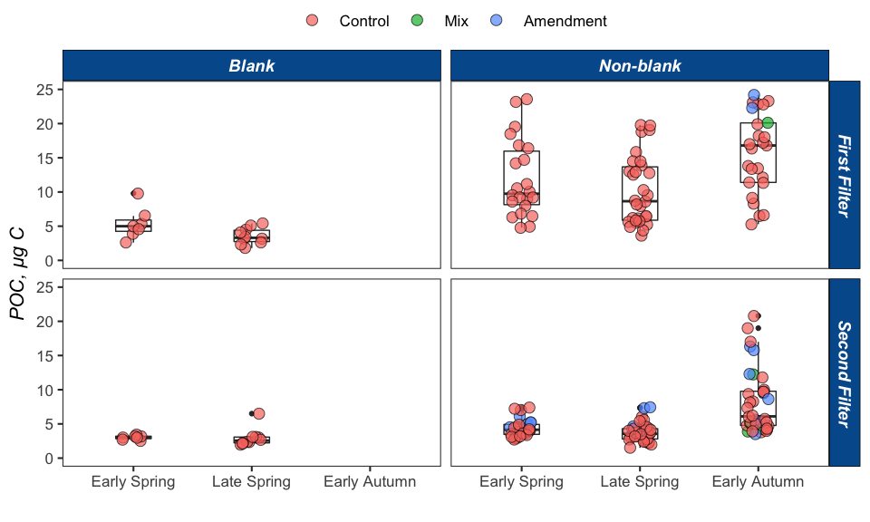
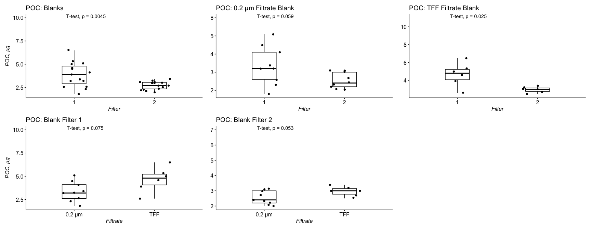
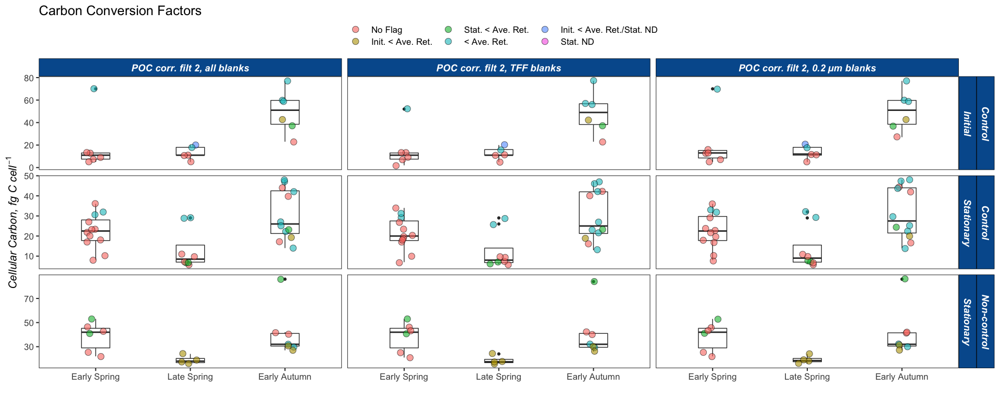
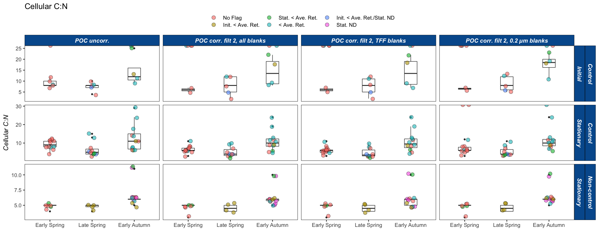
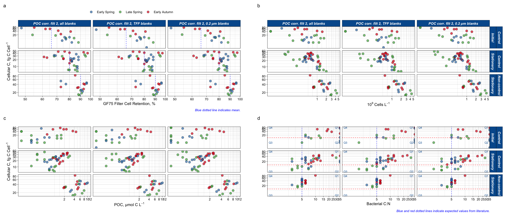
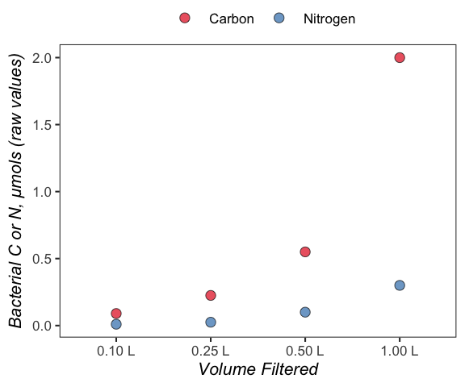

Bacterial Carbon
================
Nicholas Baetge
5/19/2020

# Intro

This document shows how **individual bottle** bacterial carbon data from
NAAMES remineralization bioassays were processed, QC’d, and analyzed.

``` r
library(tidyverse) 
library(rmarkdown)
library(knitr)
library(readxl)
library(data.table) 
library(scales)
library(zoo)
library(oce)
library(patchwork)
#rmarkdown tables
library(stargazer)
library(pander)
library(growthcurver)
#stat tests
library(lmtest)
library(lmodel2)
library(rstatix)
library(ggpubr)
```

POC from DOC remineralization bioassays was estimated by filtering cells
onto double-stacked GF75 filters (0.3 µm pore size) and then running
each filter on an elemental analyzer at Bigelow (Maine). This document
shows how bacterial carbon estimates were calculated from those
measurements.

Upon importing the dataset, we’ll add two categorical variables that
indicate what type of filtrate was used as the “blank” water. On NAAMES
2, 0.2 µm-filtered water was used and on NAAMES 4, TFF-filtered water
was used. Unfortunately, blanks were not taken on NAAMES
3.

``` r
bigelow <- read_csv("~/naames_bioav_ms/Input/N2-4_BactC_Processing.csv") %>% 
  select(-c(Treatment_Btl:Days)) %>% 
  rename(Filter = Rep) %>% 
  mutate(BlnkFiltrate = ifelse(Cruise == "AT34", "0.2 µm", "TFF"),
         BlnkFiltrate = ifelse(Cruise == "AT38", NA, BlnkFiltrate),
         facetlabel = paste(Depth, " m"),
         Season = Cruise,
         Season = gsub("AT34", "Late Spring", Season),
         Season = gsub("AT38", "Early Autumn", Season),
         Season = gsub("AT39", "Early Spring", Season),
         Treatment = ifelse(is.na(Treatment), "Niskin", Treatment),
         Treatment = ifelse(Bottle %in% c("SA13", "SB13", "DA13", "DB13"), "TW13", Treatment),
         Bottle = gsub("SA", "A", Bottle),
         Bottle = gsub("SB", "B", Bottle),
         Bottle = gsub("DA", "C", Bottle),
         Bottle = gsub("DB", "D", Bottle), 
         Timepoint = ifelse(Treatment == "Niskin", 0, Timepoint)
         ) %>% 
  mutate_at(vars(BactN_µg, BactC_µg), round, 1)

bigelow$Season <- factor(bigelow$Season, levels = levels)
```

Here, we plot all of the bacterial POC data from all of the experiments
across all of the cruises, including blanks. We’ve cut off the max value
to 25 µg C, but note there are samples with much greater
values.


There is a large spread in the data points for the second filter of the
non-blank samples on the early autumn cruise, with higher values
suggesting more material slipped through the first filter onto the
second filter.

# Determine Blank Correction

``` r
blank.data <- bigelow %>% 
  filter(Bottle == "Blank") %>% 
  mutate(BactC_µM = round(BactC_µg/12,2),
         BactN_µM = round(BactN_µg/14,2),
         BactC_N = ifelse(BactN_µM > 0, round(BactC_µM/BactN_µM,1), NA)) %>% 
  #filter out outliers
  filter(!Cruise == "AT34" | !Filter == 2 | !Depth == 10 | !Station == 1,
         !Cruise == "AT39" | !Filter == 1  | !Depth == 200 | !Station == 2)
```

The 0.2 µm filter 2 value of 6.46 and the TFF filter 1 value of 9.8
appears to be outliers relative to all the other filters (across cruises
and filtrate types), indicating possible contamination or the
compromised integrity of the first filter. These samples (filter 1 & 2)
are going to be removed from the analysis.

## Filter t-tests

``` r
t.test.data <- bigelow %>% 
  filter(!Bottle %in% c("100mls", "250mls", "500mls")) %>%
  filter(!Season == "Late Spring" | !Station == 1 | !Depth == 10 | !Bottle == "Blank") %>%
  filter(!Season == "Early Spring" |  !Depth == 200 | !Bottle == "Blank") %>%
  mutate(Treatment = ifelse(Bottle == "Blank", "Blank", Treatment),
         Treatment = ifelse(Treatment == "Blank" & BlnkFiltrate == "TFF", "TFF", Treatment),
         Treatment = ifelse(Treatment == "Blank" & BlnkFiltrate == "0.2 µm", "0.2 µm", Treatment),
         Treatment = gsub("Niskin", "1.2 µm", Treatment),
         Type = ifelse(Bottle == "Blank", "Blank", "Non-blank")) %>% 
  select(Season, Treatment, Type, facetlabel, Filter, BactC_µg)  %>% 
  rename(Filtrate = Treatment,
         Depth = facetlabel)
```



There is a significant difference between the first (top) and second
(bottom) filters of the blanks, suggesting that there was some material
in the blank water that was caught on the first filter, subsequently
increasing its carbon value. This difference appears to be driven mostly
by the TFF filtrate. Given that there is not a significant diffence
between the carbon retained filter 2 of the blanks, the mean of those
values may provide a reasonable correction factor.

## Summary Stats

We’ll report non-blank corrected POC estimates as well as
blank-corrected POC estimates. Because we will be calculating delta
bacterial carbon to then estimate BGE, a blank correction may not be
necessary. However, if we were to blank correct, we’ll use universal
correction factors based on the data/plots above. The detection limit
for Bigelow’s Costech ECS 4010 elemental analysis is 0.1 µg C.

We’ll make 3 universal correction factors:

  - poc.cf1 = the mean of filter 2 for all blanks
  - poc.cf2 = the mean of filter 2 of only TFF filtrate blanks
  - poc.cf3 = the mean of filter 2 of only 0.2 µm filtrate blanks

Each of these will be subtracted from each sample filter to estimate
bacterial carbon in µg. Values below the detection limits for N (\<0.1)
are converted to 0. The addition of the corrected value from filter 1
and from filter 2 of each sample will provide the bacterial carbon
estimate for that sample.

Bacterial carbon estimates will then be converted to µmol
C<sup>-1</sup>. The same will be done for PON.

``` r
corrfactor <- blank.data %>% 
  filter(Filter == 2) %>% 
  select(Season, BlnkFiltrate, BactC_µg, BactN_µg) %>% 
  mutate(global_c_ug = mean(BactC_µg, na.rm = T),
         global_n_ug = mean(BactN_µg, na.rm = T),) %>% 
  group_by(BlnkFiltrate) %>% 
  mutate(filtrate_c_ug = mean(BactC_µg, na.rm = T),
         filtrate_n_ug = mean(BactN_µg, na.rm = T)) %>% 
  ungroup() %>% 
  select(-BactC_µg, -BactN_µg) %>% 
  distinct() %>% 
  mutate_at(vars(global_c_ug:filtrate_n_ug), round, 1) %>% 
  pivot_longer(cols = c(global_c_ug, filtrate_c_ug), names_to = "type", values_to = "poc_cf") %>% 
  mutate(type = ifelse(BlnkFiltrate == "0.2 µm" & type == "filtrate_c_ug", "poc.cf3", type),
         type = ifelse(BlnkFiltrate == "TFF" & type == "filtrate_c_ug", "poc.cf2", type),
         type = ifelse(type == "global_c_ug", "poc.cf1", type)) %>% 
   pivot_longer(cols = c(global_n_ug, filtrate_n_ug), names_to = "n_type", values_to = "pon_cf") %>% 
   mutate(n_type = ifelse(BlnkFiltrate == "0.2 µm" & n_type == "filtrate_n_ug", "pon.cf3", n_type),
         n_type = ifelse(BlnkFiltrate == "TFF" & n_type == "filtrate_n_ug", "pon.cf2", n_type),
         n_type = ifelse(n_type == "global_n_ug", "pon.cf1", n_type)) %>% 
  select(type:pon_cf) %>% 
  distinct() %>% 
  pivot_wider(names_from = type, values_from = poc_cf) %>% 
  pivot_wider(names_from = n_type, values_from = pon_cf) %>% 
  fill(poc.cf1:pon.cf2, .direction = "downup") %>% 
  distinct() %>% 
  select(poc.cf1, poc.cf2, poc.cf3, pon.cf1, pon.cf2, pon.cf3)

corrfactor
```

    ## # A tibble: 1 x 6
    ##   poc.cf1 poc.cf2 poc.cf3 pon.cf1 pon.cf2 pon.cf3
    ##     <dbl>   <dbl>   <dbl>   <dbl>   <dbl>   <dbl>
    ## 1     2.7       3     2.5     0.2     0.2     0.3

# Perform Corrections

The carbon correction factors are subtracted from the POC values of the
samples:

  - poc.c1.ug = POC (µg) - poc.cf1
  - poc.c2.ug = POC (µg) - poc.cf2
  - poc.c3.ug = POC (µg) - poc.cf3

which are then converted to µmol C L<sup>-1</sup>:

  - poc.c1.um
  - poc.c2.um
  - poc.c3.um

We will do the same for nitrogen:

  - pon.cx.ug = PON (µg) - pon.cf1, 2, or 3

and convert the calculated values to µmol N L <sup>-1</sup>:

  - pon.cx.um

We’ll also calculate C:N ratios:

  - cn = poc.um/pon.um
  - cn.c1 = poc.c1.um/pon.um
  - cn.c2 = poc.c2.um/pon.um
  - cn.c3 = poc.c3.um/pon.m

<!-- end list -->

``` r
bactcarbon <- bigelow %>%
  filter(!Bottle == "Blank") %>%
  mutate(Treatment = ifelse(Bottle %in% c("1L", "100mls", "250mls", "500mls"), "Volume", Treatment)) %>% 
  rename(pon.ug = BactN_µg,
         poc.ug = BactC_µg) %>% 
  cbind(., corrfactor) %>% 
  mutate(poc.c1.ug = poc.ug - poc.cf1,
         poc.c2.ug = poc.ug - poc.cf2,
         poc.c3.ug = poc.ug - poc.cf3,
         pon.c1.ug = pon.ug - pon.cf1,
         pon.c2.ug = pon.ug - pon.cf2,
         pon.c3.ug = pon.ug - pon.cf3,
         poc.c1.ug = ifelse(poc.c1.ug < 0, 0, poc.c1.ug),
         poc.c2.ug = ifelse(poc.c2.ug < 0, 0, poc.c2.ug),
         poc.c3.ug = ifelse(poc.c3.ug < 0, 0, poc.c3.ug),
         pon.c1.ug = ifelse(pon.c1.ug < 0, 0, pon.c1.ug),
         pon.c2.ug = ifelse(pon.c2.ug < 0, 0, pon.c2.ug),
         pon.c3.ug = ifelse(pon.c3.ug < 0, 0, pon.c3.ug)) %>%
  group_by(Cruise, Station, Depth, Bottle, Timepoint) %>%
  mutate(poc.ug = round((sum(poc.ug)),1),
         pon.ug = round((sum(pon.ug)),1),
         poc.c1.ug = round((sum(poc.c1.ug)),1),
         poc.c2.ug = round((sum(poc.c2.ug)),1),
         poc.c3.ug = round((sum(poc.c3.ug)),1),
         pon.c1.ug = round((sum(pon.c1.ug)),1),
         pon.c2.ug = round((sum(pon.c2.ug)),1),
         pon.c3.ug = round((sum(pon.c3.ug)),1)) %>% 
  ungroup() %>% 
  mutate(poc.um = round(poc.ug/12, 1),
         poc.c1.um = round(poc.c1.ug/12, 1),
         poc.c2.um = round(poc.c2.ug/12, 1),
         poc.c3.um = round(poc.c3.ug/12, 1),
         pon.um = round(pon.ug/14, 1),
         pon.c1.um = round(pon.c2.ug/14, 1),
         pon.c2.um = round(pon.c2.ug/14, 1),
         pon.c3.um = round(pon.c3.ug/14, 1),
         cn = round(poc.um/pon.um),
         cn.c1 = round(poc.c1.um/pon.c1.um),
         cn.c2 = round(poc.c2.um/pon.c2.um),
         cn.c3 = round(poc.c3.um/pon.c3.um)) %>% 
  select(Season, Cruise, Station, Depth, facetlabel, Treatment, Bottle, Timepoint, poc.ug, pon.ug, poc.cf1, poc.cf2, poc.cf3, pon.cf1, pon.cf2, pon.cf3, poc.c1.ug:cn.c3 ) %>% 
  distinct() %>% 
  arrange(Season, Cruise, Station, Depth, Treatment, Bottle, Timepoint) 
```

# Calculate Carbon Per Cell

Here we calculate fg C or fg N cell<sup>-1</sup> by:

  - Estimating the cell abundance captured on the 0.3 µm GF75 filters
    (whole water - filtrate, cells L<sup>-1</sup>)
  - Dividing the GF75 POC or PON value (µmol C or N L<sup>-1</sup>) by
    the cell abundance on the GF75 filter, then applying the subsequent
    conversions

The GF75 POC data are tidied before calculations are made (e.g renaming
bottle identifiers so they are congruent with datasets to be merged
with, duplicating values for initial timepoints where one POC value was
taken for replicate bottles). For ease, initial POC and cell abundance
data are handled separately from data collected at stationary
timepoints.

## Calculate Filter Cell Abundance and Retention

``` r
#initial cell abundance
i.gf75 <- readRDS("~/naames_bioav_ms/Output/tidy_bacterial_abundance.rds") %>% 
  select(Season:cells) %>% 
  filter(Timepoint == 0, Bottle %in% c("GF75", "Niskin")) %>% 
  group_by(Cruise, Station, Depth) %>% 
  mutate(filtrate.cells = ifelse(Bottle == "GF75", cells, NA)) %>% 
  fill(filtrate.cells, .direction = "downup") %>% 
  filter(Bottle == "Niskin") %>% 
  mutate(i.gf75.cells = cells - filtrate.cells,
         i.gf75.ret = round((cells - filtrate.cells)/cells, 2)) %>% 
  ungroup() %>% 
  select(Season:Depth, i.gf75.cells, i.gf75.ret)

#stationary cell abundance
s.gf75 <- readRDS("~/naames_bioav_ms/Output/tidy_bacterial_abundance.rds") %>% 
  select(Season:cells) %>% 
  filter(!Timepoint == 0) %>% 
  arrange(Cruise, Station, Depth, Bottle, Timepoint) %>% 
  group_by(Cruise, Station,  Depth, Bottle) %>%
  mutate(gf75.timepoint = ifelse(Treatment == "GF75", Timepoint, NA)) %>% 
  fill(gf75.timepoint, .direction = "updown") %>% 
  filter(Timepoint == gf75.timepoint) %>% 
  mutate(filtrate.cells = ifelse(Treatment == "GF75", cells, NA)) %>% 
  fill(filtrate.cells, .direction = "updown") %>%  
  filter(!Treatment == "GF75") %>% 
  mutate(s.gf75.cells = cells - filtrate.cells,
         s.gf75.ret = round((cells - filtrate.cells)/cells, 2)) %>% 
  ungroup() %>% 
  select(Season:Bottle, Treatment, Timepoint, s.gf75.cells, s.gf75.ret) 
```

## Combine Cell Abundance and POC Data, Calculate CCF

We’ll calculate 6 CCFs (fg C cell<sup>-1</sup>) from the POC data:

  - i.ccf.c1 = poc.c1.um/cells on filter \* 12 \* 10<sup>9</sup>
    (initial)
  - s.ccf.c1 = poc.c1.um/cells on filter \* 12 \* 10<sup>9</sup>
    (stationary)
  - i.ccf.c2 = poc.c2.um/cells on filter \* 12 \* 10<sup>9</sup>
    (initial)
  - s.ccf.c2 = poc.c2.um/cells on filter \* 12 \* 10<sup>9</sup>
    (stationary)
  - i.ccf.c3 = poc.c3.um/cells on filter \* 12 \* 10<sup>9</sup>
    (initial)
  - s.ccf.c3 = poc.c3.um/cells on filter \* 12 \* 10<sup>9</sup>
    (stationary)

We’ll also add 3 other CCFs from the literature:

  - ccf.white = 6.5 (SAR11), White et al 2019
      - also close to 6.3 of Carlson et al 1996 and 7 of Zubkov 2000
  - ccf.fukuda = 12.3 (average oceanic Pacific), Fukuda et al 1998
      - also close to 10 generally used by many papers Wear et al 2020,
        Christian and Karl 1994, Caron et al 1995, James et al 2017
  - ccf.lee = 20 (Long Island Sound), Lee and Fuhrman 1987
      - generally used as reported by Gunderson et al 2002

<!-- end list -->

``` r
#initial timepoints
i.fg_cell <-  bactcarbon %>% 
  filter(!Treatment == "Volume", Timepoint == 0) %>% 
  select_at(vars(poc.ug:cn.c3), .funs = funs(paste0("i.", .))) %>% 
  bind_cols(bactcarbon %>% filter(!Treatment == "Volume", Timepoint == 0) %>% select(Season:facetlabel), .) %>% 
  mutate(Station = gsub("2RD", "S2RD", Station),
         Station = gsub("2RF", "S2RF", Station)) %>% 
  left_join(., i.gf75) %>% 
  mutate(i.ccf.c1 = round(i.poc.c1.um/i.gf75.cells * 12 * 10^9),
         i.ccf.c2 = round(i.poc.c2.um/i.gf75.cells * 12 * 10^9),
         i.ccf.c3 = round(i.poc.c3.um/i.gf75.cells * 12 * 10^9)) 

#stationary timepoints
s.fg_cell <- bactcarbon %>% 
  filter(!Treatment == "Volume", !Timepoint == 0) %>% 
  select_at(vars(poc.ug:cn.c3), .funs = funs(paste0("s.", .))) %>% 
  bind_cols(bactcarbon %>% filter(!Treatment == "Volume", !Timepoint == 0) %>% select(Season:facetlabel, Treatment, Bottle, Timepoint), .) %>% 
  mutate(Station = gsub("2RD", "S2RD", Station),
         Station = gsub("2RF", "S2RF", Station),
         Treatment = gsub("TW15", "TW20", Treatment),
         Bottle = ifelse(Cruise == "AT34" & Station == 2 & Depth == 10 & Treatment == "TW12" & Bottle == "A12", gsub("A12", "C", Bottle), Bottle),
         Bottle = ifelse(Cruise == "AT34" & Station == 2 & Depth == 10 & Treatment == "TW12" & Bottle == "B12", gsub("B12", "D", Bottle), Bottle),
         Bottle = ifelse(Cruise == "AT34" & Station == 2 & Depth == 10 & Treatment == "TW13" & Bottle == "A13", gsub("A13", "E", Bottle), Bottle),
         Bottle = ifelse(Cruise == "AT34" & Station == 2 & Depth == 10 & Treatment == "TW13" & Bottle == "B13", gsub("B13", "F", Bottle), Bottle),
         Bottle = ifelse(Cruise == "AT34" & Station == 2 & Depth == 200 & Treatment == "Control" & Bottle == "C", gsub("C", "G", Bottle), Bottle),
         Bottle = ifelse(Cruise == "AT34" & Station == 2 & Depth == 200 & Treatment == "Control" & Bottle == "D", gsub("D", "H", Bottle), Bottle),
         Bottle = ifelse(Cruise == "AT34" & Station == 2 & Depth == 200 & Treatment == "TW12" & Bottle == "C12", gsub("C12", "I", Bottle), Bottle),
         Bottle = ifelse(Cruise == "AT34" & Station == 2 & Depth == 200 & Treatment == "TW12" & Bottle == "D12", gsub("D12", "J", Bottle), Bottle),
         Bottle = ifelse(Cruise == "AT34" & Station == 2 & Depth == 200 & Treatment == "TW13" & Bottle == "C13", gsub("C13", "K", Bottle), Bottle),
         Bottle = ifelse(Cruise == "AT34" & Station == 2 & Depth == 200 & Treatment == "TW13" & Bottle == "D13", gsub("D13", "L", Bottle), Bottle)) %>% 
  add_row(Season = "Early Autumn", Cruise = "AT38", Station = "1", Depth = 10, Treatment = "SynExd", Bottle = "I") %>% 
    add_row(Season = "Early Autumn", Cruise = "AT38", Station = "1", Depth = 10, Treatment = "SynLys", Bottle = "N") %>% 
  add_row(Season = "Early Autumn", Cruise = "AT38", Station = "1", Depth = 10, Treatment = "TWExd", Bottle = "K") %>% 
  add_row(Season = "Early Autumn", Cruise = "AT38", Station = "1", Depth = 200, Treatment = "SynLys", Bottle = "P") %>% 
  arrange(Cruise, Station, Depth, Treatment, Bottle) %>% 
  group_by(Cruise, Station, Depth, Treatment) %>% 
  fill(s.poc.ug:s.cn.c3, .direction = "updown") %>% 
  mutate(Bottle = gsub("JI", "J", Bottle),
         Bottle = gsub("MN", "M", Bottle),
         Bottle = gsub("LK", "L", Bottle),
         Bottle = gsub("OP", "O", Bottle)) %>% 
  left_join(., s.gf75) %>% 
  mutate(s.ccf.c1 = round(s.poc.c1.um/s.gf75.cells * 12 * 10^9),
         s.ccf.c2 = round(s.poc.c2.um/s.gf75.cells * 12 * 10^9),
         s.ccf.c3 = round(s.poc.c3.um/s.gf75.cells * 12 * 10^9)) %>% 
  ungroup() %>% 
  rename(s.timepoint = Timepoint)

fg_cell <- left_join(s.fg_cell, i.fg_cell)  %>% 
   group_by(Cruise, Station, Depth, Treatment) %>% 
  fill(c(s.timepoint,i.poc.ug:i.ccf.c3), .direction = "updown") %>% 
  mutate(ccf.white = 6.5,
         ccf.fukuda = 12.3,
         ccf.lee = 20) %>% 
  ungroup()

fg_cell$Season <- factor(fg_cell$Season, levels = levels)
```

## Flag Retention of GF75 Filters


    ## # A tibble: 6 x 3
    ## # Groups:   group [6]
    ##   group                  ave    sd
    ##   <chr>                <dbl> <dbl>
    ## 1 Initial_10m           0.72  0.11
    ## 2 Initial_200m          0.51  0.31
    ## 3 Stat_Control_10m      0.81  0.09
    ## 4 Stat_Noncontrol_10m   0.88  0.07
    ## 5 Stat_Control_200m     0.76  0.16
    ## 6 Stat_Noncontrol_200m  0.95  0.02

This figure shows that while GF75 filter retention is fairly consistent
across the samples taken during the stationary phase of cell growth,
they are pretty variable for the samples taken at the initial condition.
Those samples with filter retentions below the average for a group could
reflect faulty procedure (i.e. ripped filters) and may be associated
with questionable measurements. We’ll flag these data.

``` r
fg_cell.qc <- fg_cell %>% 
  mutate(type = ifelse(Treatment == "Control", "Control", "Non-control"),
         i.gf75.flag = ifelse(Depth == 10 & i.gf75.ret < 0.72, "< Ave. Ret.", NA),
         i.gf75.flag = ifelse(Depth == 200 & i.gf75.ret < 0.51, "< Ave. Ret.", i.gf75.flag ),
         i.gf75.flag = ifelse(is.na(i.gf75.ret), "ND", i.gf75.flag),
         i.gf75.flag = ifelse(is.na(i.gf75.flag), "No Flag", i.gf75.flag),
         s.gf75.flag = ifelse(Depth == 10 & type == "Control" & s.gf75.ret < 0.81, "< Ave. Ret.", NA),
         s.gf75.flag = ifelse(Depth == 10 & type == "Non-control" & s.gf75.ret < 0.88, "< Ave. Ret.",  s.gf75.flag ),
         s.gf75.flag = ifelse(Depth == 200 & type == "Control" & s.gf75.ret < 0.76, "< Ave. Ret.",  s.gf75.flag ),
         s.gf75.flag = ifelse(Depth == 200 & type == "Non-control" & s.gf75.ret < 0.95, "< Ave. Ret.",  s.gf75.flag ),
         s.gf75.flag = ifelse(is.na(s.gf75.ret), "ND", s.gf75.flag),
         s.gf75.flag = ifelse(is.na(s.gf75.flag), "No Flag", s.gf75.flag),
         gf75.flag = ifelse(i.gf75.flag == "No Flag" & s.gf75.flag == "No Flag", "No Flag", NA),
         gf75.flag = ifelse(i.gf75.flag == "< Ave. Ret." & s.gf75.flag == "No Flag", "Init. < Ave. Ret.", gf75.flag),
         gf75.flag = ifelse(s.gf75.flag == "< Ave. Ret." & i.gf75.flag == "No Flag", "Stat. < Ave. Ret.", gf75.flag),
         gf75.flag = ifelse(i.gf75.flag == "< Ave. Ret." & s.gf75.flag == "ND", "Init. < Ave. Ret./Stat. ND", gf75.flag),
         gf75.flag = ifelse(i.gf75.flag == "< Ave. Ret." & s.gf75.flag == "< Ave. Ret.", "< Ave. Ret.", gf75.flag),
         gf75.flag = ifelse(i.gf75.flag == "No Flag" & s.gf75.flag == "ND", "Stat. ND", gf75.flag),
         gf75.flag = ifelse(s.gf75.flag == "No Flag" & i.gf75.flag == "ND", "Init. ND", gf75.flag),
         gf75.flag = ifelse(s.gf75.flag == "ND" & i.gf75.flag == "ND", "ND", gf75.flag)) %>% 
  select(Season:Bottle, type, i.gf75.ret, s.gf75.ret, i.gf75.flag, s.gf75.flag, gf75.flag, contains("i."), contains("s."), contains("ccf"))
```

# CCFs

    ## # A tibble: 18 x 4
    ## # Groups:   Cruise [3]
    ##    Cruise correction ave_ccf    sd
    ##    <chr>  <chr>        <dbl> <dbl>
    ##  1 AT34   i.ccf.c1        13     6
    ##  2 AT34   i.ccf.c2        13     5
    ##  3 AT34   i.ccf.c3        13     6
    ##  4 AT34   s.ccf.c1        13    12
    ##  5 AT34   s.ccf.c2        12    11
    ##  6 AT34   s.ccf.c3        14    12
    ##  7 AT38   i.ccf.c1        50    18
    ##  8 AT38   i.ccf.c2        49    18
    ##  9 AT38   i.ccf.c3        50    17
    ## 10 AT38   s.ccf.c1        31    13
    ## 11 AT38   s.ccf.c2        30    12
    ## 12 AT38   s.ccf.c3        31    13
    ## 13 AT39   i.ccf.c1        20    24
    ## 14 AT39   i.ccf.c2        16    17
    ## 15 AT39   i.ccf.c3        21    23
    ## 16 AT39   s.ccf.c1        22     8
    ## 17 AT39   s.ccf.c2        21     8
    ## 18 AT39   s.ccf.c3        23     9



The points are colored by the QC flag associated with the POC samples.
”Questionable” measures indicate below average (of all samples, not
grouped) cell retention on the POC filters. “ND” indicates no data.

# C:N Ratios

    ## # A tibble: 24 x 4
    ## # Groups:   Cruise [3]
    ##    Cruise correction ave_cn    sd
    ##    <chr>  <chr>       <dbl> <dbl>
    ##  1 AT34   i.cn          7.4   2.1
    ##  2 AT34   i.cn.c1       7.8   4.1
    ##  3 AT34   i.cn.c2       7.6   3.9
    ##  4 AT34   i.cn.c3       8.8   3.4
    ##  5 AT34   s.cn          6.6   4.1
    ##  6 AT34   s.cn.c1       5.1   2.7
    ##  7 AT34   s.cn.c2       4.7   2.7
    ##  8 AT34   s.cn.c3       5.4   2.7
    ##  9 AT38   i.cn         14.5   6.7
    ## 10 AT38   i.cn.c1      14.2   6.3
    ## # … with 14 more rows



The points on the line intersecting the max of the y-axis represent
“Inf” values, where PON values are 0.

We would expect the carbon content of oceanic surface bacterioplankton
to be around 5 (Faggerbakke et al 1996, Fukuda et al, 1998, Gundersen et
al 2002, Zimmerman et al 2014, White et al 2019). Excluding infinity
values where PON was undetectable, C:N ratios for the spring are
comparable to expectations, with slight improvement using corrected
values.

The C:N ratios of the early autumn samples are clear outliers, outside
even the maximum reported by Gundersen et al 2002 (9.1). These high
values might point to issues with the POC data. What might be causing
the high C:N ratios observed in the early autumn? Below average cell
retentions don’t appear to be skewing results in at least the initial
condition or during the spring. It could, in some cases, be skewing
early autumn
measurements.

# Identify Outliers: Property-Property Plots




Generally, samples with below average cell retentions have higher cell C
content, but this seems to be less of an effect at stationary.

For the initial condition, it is clear that there are two outliers in
the spring data. The initial early spring outlier sample (station 1) has
a reasonable C:N ratio (2-3), a low POC value, and a relatively high
carbon per cell estimate (35-53 fg C cell<sup>-1</sup>). This points to
an issue in the cell count data, where cell abundance is likely
underestimated. The late spring outlier is characterized by a C:N ratio
and a cell carbon content that does not deviate from the rest of the
late spring data, so it may not be a true outlier.

The early autumn sample (station 1) with a cell carbon content of 77 fg
C cell<sup>-1</sup> and a filter cell retention of 55% has low POC
infinity C:N ratio. All of these metrics would suggest this sample to be
a true outlier where filter cell abundance was likely underestimated due
to ripped filters. The other two early autumn samples with slightly
below average cell retentions do have high cell carbon contents (56-57
fg C cell-1), but also have lower C:N ratios (9, 11) than the remaining
early autumn samples (13, 25, infinity), making them hard to distinguish
as outliers.

The cell carbon content and C:N ratios of all early autumn samples are
higher than what is expected for oceanic bacterioplankton. It is
possible that POC is overestimated or cell abundances are underestimated
for these samples (or both). Low cell retentions for these samples would
suggest that cell abundances could have been underestimated. Generally,
the relationship between cell carbon content and C:N appear to be
reasonable at stationary, with less separation between the seasons. This
would suggest that the POC data taken during the early autumn are not
necessarily all compromised. The divergence of these samples from the
other seasons could point to other factors, such as the larger influence
of detrital matieral.

We will remove the CCF for the two outlier samples (intial condition,
AT39 S1 and AT38 S1) from remaining analyses.

## Save Data

``` r
fg_cell.qc %>% 
  mutate(i.ccf.c1 = ifelse(Cruise == "AT39" & Station == 1 & Depth == 10, NA, i.ccf.c1),
         i.ccf.c2 = ifelse(Cruise == "AT39" & Station == 1 & Depth == 10, NA, i.ccf.c2),
         i.ccf.c3 = ifelse(Cruise == "AT39" & Station == 1 & Depth == 10, NA, i.ccf.c3),
         i.ccf.c1 = ifelse(Cruise == "AT38" & Station == 1 & Depth == 10, NA, i.ccf.c1),
         i.ccf.c2 = ifelse(Cruise == "AT38" & Station == 1 & Depth == 10, NA, i.ccf.c2),
         i.ccf.c3 = ifelse(Cruise == "AT38" & Station == 1 & Depth == 10, NA, i.ccf.c3)) %>% 
  saveRDS(., "~/naames_bioav_ms/Output/processed_bacterial_carbon.rds")
```

# Side Experiment: Sampling Volume Effect on Bacterial Carbon



This test needs to be done again \#flattenthecurve
