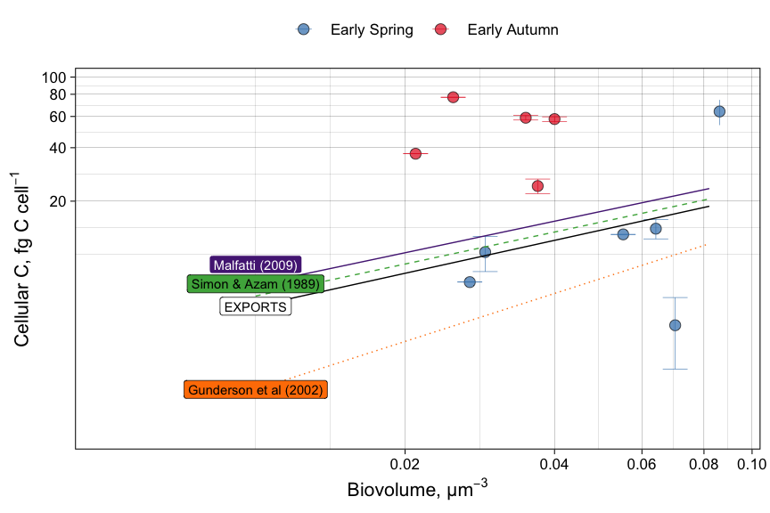

Biovolume
================
Nicholas Baetge
5/20/2020

This document shows how **individual bottle** bacterial biovolume data
from NAAMES remineralization bioassays were processed, QC’d, and
analyzed. To date, there are limited biovolume data (2-4 timepoints for
a single bottle for each station on the early spring and early autumn
cruises). The data are somewhat suspect as bacterial abundance estimates
from image analysis are non-systematically different from previous
manual counts.

``` r
library(tidyverse) 
library(rmarkdown)
library(knitr)
library(readxl)
library(data.table) 
library(scales)
library(zoo)
library(oce)
library(patchwork)
#rmarkdown tables
library(stargazer)
library(pander)
library(growthcurver)
#stat tests
library(lmtest)
library(lmodel2)
library(rstatix)
library(ggpubr)
```

Cell biovolume was determined from 10 images captured with a digital
camera (Retiga Exi-QImaging, Surrey, BC, Canada). Images were processed
using ImageJ software according to established image analyses protocols
(Baldwin and Bankston 1988; Sieracki et al. 1989, Ducklow et al., 1995).

``` r
biovol <- read_csv("~/naames_bioav_ms/Input/Biovolume_Summary.csv") %>% 
  select(Cruise:Timepoint, Biovol_Mean_All) %>% 
  rename(biovol = Biovol_Mean_All) %>% 
  mutate_at(vars(biovol), round, 3) %>% 
  mutate(phase = ifelse(Timepoint == 0, "initial", "later"),
         Station = gsub("2RD", "S2RD", Station),
         Station = gsub("2RF", "S2RF", Station)) %>% 
  group_by(Cruise, phase) %>% 
  mutate(mean_biovol = round(mean(biovol, na.rm = T),3),
         sd_biovol = round(sd(biovol, na.rm = T),3)) %>% 
  add_tally() %>% 
  rename(n_biovol = n) %>% 
  ungroup() 

biovol_table <- biovol %>% select(-c(Station:biovol)) %>% distinct()
```

| Cruise | phase   | mean\_biovol | sd\_biovol | n\_biovol |
| :----- | :------ | -----------: | ---------: | --------: |
| AT38   | initial |        0.032 |      0.008 |         5 |
| AT38   | later   |        0.040 |      0.027 |        14 |
| AT39   | initial |        0.055 |      0.023 |         6 |
| AT39   | later   |        0.054 |      0.021 |        12 |

Mean Biovolume AT38, AT39; ‘later’ represents any timepoint after 0

It would be good to see if there is a log-linear relationship between
the cell carbon calculated from the GF75 POC data (fg C L<sup>-1</sup>)
and the estimated biovolumes (µm<sup>3</sup>). Unfortunately we don’t
yet have concurrent measurements of GF75 POC data and biovolume at
“stationary” so that will have to wait. We do have concurrent
measurements at initial though, so we can plot those.

``` r
biovol_merge <- biovol %>% 
  filter(Timepoint == 0) %>% 
  select(Cruise:Bottle, biovol) %>% 
  rename(i.biovol = biovol) %>% 
  left_join(readRDS("~/naames_bioav_ms/Output/processed_bacterial_carbon.rds") %>% 
              select(Season:type, i.ccf.c1:i.ccf.c3) %>% 
              pivot_longer(cols = c(i.ccf.c1:i.ccf.c3), names_to = "correction", values_to = "ccf") %>% 
              group_by(Season, Station, Depth, Treatment, Bottle) %>% 
              mutate_at(vars(ccf), mean, na.rm = T) %>% 
              select(-correction) %>% 
              distinct(), .) %>% 
  left_join(., readRDS("~/naames_bioav_ms/Output/processed_bacterial_carbon.rds") %>% 
              select(Season:type, i.ccf.c1:i.ccf.c3) %>% 
              pivot_longer(cols = c(i.ccf.c1:i.ccf.c3), names_to = "correction", values_to = "sd_ccf") %>% 
              group_by(Season, Station, Depth, Treatment, Bottle) %>% 
              mutate_at(vars(sd_ccf), sd, na.rm = T) %>% 
              select(-correction) %>% 
              distinct()) 
  

biovol_x <-  seq(from = 0.01, to = 0.1, length.out = 11)
exports_y <-  87.4*(biovol_x^0.616)
simon_azam_y <-  92.0*(biovol_x^0.5985) #1989
gunderson_y <-  108.8*(biovol_x^0.898) #2002
malfatti_y <-  103.02*(biovol_x^0.59) #2002

lit_df <- data_frame(biovol_x, exports_y, simon_azam_y, gunderson_y, malfatti_y) 

ccf_biovol_plot.data <- biovol_merge  %>% 
  drop_na(i.biovol)  %>% 
  bind_cols(., lit_df) %>% 
  select(Season:Bottle, ccf, sd_ccf, i.biovol:malfatti_y)
```



For the samples in which we have concurrent biovolume and cellular C
measurements, we see that their relationship to one another is pretty
widespread relative to published literature relationships. Using
biovolumes for this dataset may not be the route to take. Error bars
represent the standard deviations from the means of cell carbon
estimated with different blank corrections.
