DOC\_NAAMES\_Remin\_Bioassays
================
Nicholas Baetge
5/19/2020

# Intro

This document shows how **individual bottle** DOC data from NAAMES
remineralization bioassays were processed, QC’d, and analyzed.

``` r
library(tidyverse) 
library(rmarkdown)
library(knitr)
library(readxl)
library(data.table) 
library(scales)
library(zoo)
library(oce)
library(patchwork)
#rmarkdown tables
library(stargazer)
library(pander)
library(growthcurver)
#stat tests
library(lmtest)
library(lmodel2)
library(rstatix)
library(ggpubr)
```

# Import and Tidy Data

We will need to tidy the data in the same way the bacterial abundance
dataframe was tidied before merging the datasets. We’ll then omit data
low quality data i.e. poor replication or possible contamination. We
observed contamination in many of the NAAMES 2 experiments after
incubations were transferred to
WHOI.

``` r
oc.df <- read_csv("~/naames_bioav_ms/Input/N2-4_DOC_Remin_Master.csv") %>%
  mutate(Season = Cruise,
         Season = gsub("AT34", "Late Spring", Season),
         Season = gsub("AT38", "Early Autumn", Season),
         Season = gsub("AT39", "Early Spring", Season),
         Treatment = ifelse(Bottle == "Niskin", "Niskin", Treatment),
         Treatment = ifelse(Bottle == "GF75", "GF75", Treatment),
         Treatment = gsub("TW15", "TW20", Treatment),
         Treatment = ifelse(is.na(Treatment), Bottle, Treatment),
         Treatment = ifelse(Treatment %in% c("Surface", "Deep"), "Parallel", Treatment),
         Treatment = ifelse(Treatment %in% c("100mls", "250mls", "500mls", "1L"), "Volume", Treatment),
         Treatment_Btl = ifelse(Bottle == "Niskin", "Niskin", Treatment_Btl),
         Treatment_Btl = ifelse(Bottle == "GF75" & is.na(Treatment_Btl), "GF75", Treatment_Btl),
         Treatment_Btl = gsub("TW15", "TW20", Treatment_Btl),
         Treatment_Btl = gsub("TW12-A", "TW12-C", Treatment_Btl),
         Treatment_Btl = gsub("TW12-B", "TW12-D", Treatment_Btl),
         Treatment_Btl = gsub("TW13-A", "TW12-E", Treatment_Btl),
         Treatment_Btl = gsub("TW13-B", "TW12-F", Treatment_Btl),
         Treatment_Btl = ifelse(is.na(Treatment_Btl), Bottle, Treatment_Btl),
         Bottle = gsub("SA", "A", Bottle),
         Bottle = gsub("SB", "B", Bottle),
         Bottle = gsub("DA", "C", Bottle),
         Bottle = gsub("DB", "D", Bottle),
         Bottle = ifelse(Bottle == "GF75", Treatment_Btl, Bottle),
         Bottle = gsub("Control-", "", Bottle),
         Bottle = gsub("TW12-", "", Bottle),
         Bottle = gsub("TW13-", "", Bottle),
         Bottle = gsub("MixDS-", "", Bottle),
         Bottle = gsub("MixSD-", "", Bottle),
         Bottle = gsub("SynExd-", "", Bottle),
         Bottle = gsub("TWExd-", "", Bottle),
         Bottle = gsub("SynLys-", "", Bottle),
         Bottle = gsub("TW5-", "", Bottle),
         Bottle = gsub("TW10-", "", Bottle),
         Bottle = gsub("TW20-", "", Bottle),
         Bottle = gsub("12", "", Bottle),
         Bottle = gsub("13", "", Bottle),
         Bottle = ifelse(Cruise == "AT34" & Station == 2 & Depth == 10 & Treatment == "TW12" & Bottle == "A", gsub("A", "C", Bottle), Bottle),
         Bottle = ifelse(Cruise == "AT34" & Station == 2 & Depth == 10 & Treatment == "TW12" & Bottle == "B", gsub("B", "D", Bottle), Bottle),
         Bottle = ifelse(Cruise == "AT34" & Station == 2 & Depth == 10 & Treatment == "TW13" & Bottle == "A", gsub("A", "E", Bottle), Bottle),
         Bottle = ifelse(Cruise == "AT34" & Station == 2 & Depth == 10 & Treatment == "TW13" & Bottle == "B", gsub("B", "F", Bottle), Bottle),
         Bottle = ifelse(Cruise == "AT34" & Station == 2 & Depth == 200 & Treatment == "Control" & Bottle == "C", gsub("C", "G", Bottle), Bottle),
         Bottle = ifelse(Cruise == "AT34" & Station == 2 & Depth == 200 & Treatment == "Control" & Bottle == "D", gsub("D", "H", Bottle), Bottle),
         Bottle = ifelse(Cruise == "AT34" & Station == 2 & Depth == 200 & Treatment == "TW12" & Bottle == "C", gsub("C", "I", Bottle),Bottle),
         Bottle = ifelse(Cruise == "AT34" & Station == 2 & Depth == 200 & Treatment == "TW12" & Bottle == "D", gsub("D", "J", Bottle), Bottle),
         Bottle = ifelse(Cruise == "AT34" & Station == 2 & Depth == 200 & Treatment == "TW13" & Bottle == "C", gsub("C", "K", Bottle), Bottle),
         Bottle = ifelse(Cruise == "AT34" & Station == 2 & Depth == 200 & Treatment == "TW13" & Bottle == "D", gsub("D", "L", Bottle), Bottle),
         Depth = gsub(5, 10, Depth),
         Depth = as.numeric(Depth),
         key = paste(Cruise, Station, Depth, Treatment, Bottle, Timepoint, sep = "."),
         PTOC_ave = ifelse(Treatment == "Parallel", TOC_ave, PTOC_ave),
         PTOC_sd = ifelse(Treatment == "Parallel", TOC_sd, PTOC_sd)) %>% 
  rename(doc = DOC_ave,
         sd_doc = DOC_sd,
         toc = TOC_ave, 
         sd_toc = TOC_sd, 
         ptoc = PTOC_ave, 
         sd_ptoc = PTOC_sd, 
         pdoc = PDOC_ave, 
         sd_pdoc = PDOC_sd) %>%
  filter(!Treatment %in% c("Niskin", "GF75", "TFF-Ret", "Volume")) %>% 
  select(-Treatment_Btl) %>% 
  select(Season, everything()) %>% 
  arrange(Cruise, Station, Depth, Treatment, Bottle, Hours)  %>% 
  filter(!is.na(Hours))
```

Because a different suite of organic carbon samples were taken on each
cruise, we’ll separate the cruise datasets, drop NA values, quality
filter them, and then recombine the datasets. To quality filter, we’ll
calculate rolling ∆DOC values i.e. the diffence between the one
observation and the one before it. We’ll omit the data where ∆DOC
indicates contamination due to transport etc. after the 21 d shipboard
occupation (increase greater than our detection limit, 1.5 µmol C
L<sup>-1</sup>).

``` r
n2_oc <- oc.df %>% 
  filter(Cruise == "AT34") %>% 
  drop_na(doc) %>%
  group_by(Station, Depth, Treatment, Bottle) %>%
  mutate(doc_from_last = lag(doc) - doc) %>% 
  filter(!doc_from_last <= -1.5 | is.na(doc_from_last) | !Hours > 504)  %>% 
  mutate(doc_from_last = lag(doc) - doc) %>% 
  filter(!doc_from_last <= -1.5 | is.na(doc_from_last) | !Hours > 504) %>% 
  mutate(doc_from_last = lag(doc) - doc) %>% 
  filter(!doc_from_last <= -1.5 | is.na(doc_from_last) | !Hours > 504) %>% 
  mutate(doc_from_last = lag(doc) - doc,
         doc_from_t0 = first(doc) - doc) %>% 
  filter(!Station == 4 | !Hours == 192) %>% 
  ungroup()

n3_4_oc <- oc.df %>% 
  filter(!Cruise == "AT34") %>% 
  drop_na(ptoc) %>% 
  group_by(Cruise, Station, Depth, Treatment, Bottle) %>% 
  mutate(ptoc_from_last = lag(ptoc) - ptoc) %>% 
  filter(!ptoc_from_last <= -1.5 | is.na(ptoc_from_last) | !Hours > 504) %>% 
  mutate(ptoc_from_last = lag(ptoc) - ptoc,
         ptoc_from_t0 = first(ptoc) - ptoc,
         doc_from_t0 = first(doc) - doc,
         toc_from_t0 = first(toc) - toc, 
         pdoc_from_t0 = first(pdoc) - pdoc) %>%
  ungroup()

oc_p <- bind_rows(n2_oc, n3_4_oc) %>% 
  mutate(Days = round(Hours/24, 2),
         facet_depth = paste(Depth, "m"), 
         facet_treatment = Treatment, 
         facet_treatment = gsub("MixSD", "Surface Comm., Deep DOM", facet_treatment),
         facet_treatment = gsub("MixDS", "Deep Comm., Surface DOM", facet_treatment),
          facet_treatment = gsub("SynExd", "Synechococcus Exudate", facet_treatment),
         facet_treatment = gsub("SynLys", "Synechococcus Lysate", facet_treatment),
          facet_treatment = gsub("TWExd", "T. Weissflogii Exudate", facet_treatment),
         facet_treatment = gsub("TW5", "+5 µmol C/L Exudate", facet_treatment),
          facet_treatment = gsub("TW10", "+10 µmol C/L Exudate", facet_treatment),
          facet_treatment = gsub("TW20", "+20 µmol C/L Exudate", facet_treatment),
           facet_treatment = gsub("TW12", "T. Weissflogii 12C Exudate", facet_treatment),
          facet_treatment = gsub("TW13", "T. Weissflogii 13C Exudate", facet_treatment),
         facet_bottle = Bottle,
         facet_bottle = gsub("W", "Whole Seawater", facet_bottle),
          facet_bottle = gsub("1.2", "1.2 µm Filtrate", facet_bottle), 
          facet_bottle = gsub("NV", "1.2 µm Filtrate: TFF Filtrate (3:7)", facet_bottle)) 

oc_p$Treatment <- factor(oc_p$Treatment, levels = levels)
oc_p$facet_treatment <- factor(oc_p$facet_treatment, levels = levels)
oc_p$facet_bottle <- factor(oc_p$facet_bottle, levels = levels)
```

# Save Data

``` r
#saveRDS(oc_p, "~/naames_bioav_ms/Output/processed_doc.rds")
```

# Plot Curves

## NAAMES 2

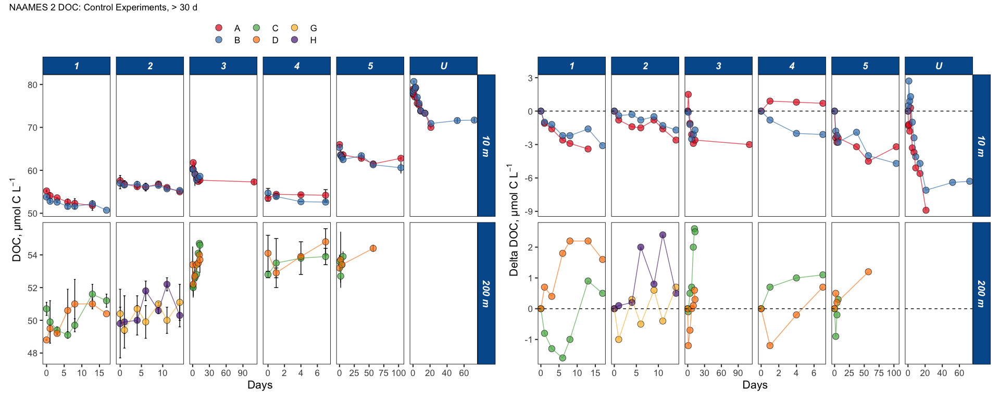

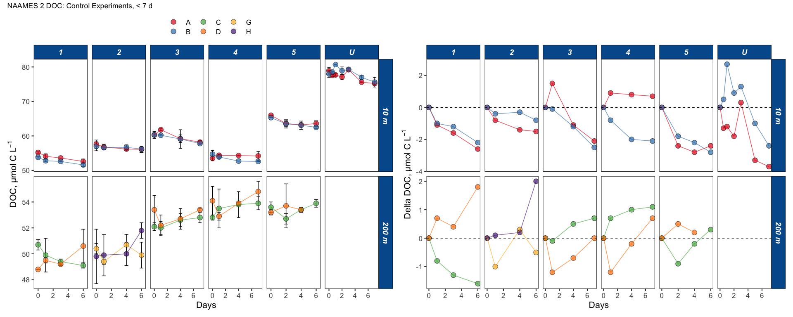

There looks to be some poor replication between the experiments
conducted at station 4 and U:

  - S4 bottle A measurements look suspect. additionally, the increase
    between day 6 and 7 for both bottles are suspect
  - SU bottle B measurements at 24 h is suspect relative to the downward
    trend in both bottles

These points will affect BGE calculations and my need to be omitted. The
BGE from S4 Bottle A may be unreliable.

BGEs cannot be calculated for the 200 m control experiments given that
not DOC drawdown was
observed.

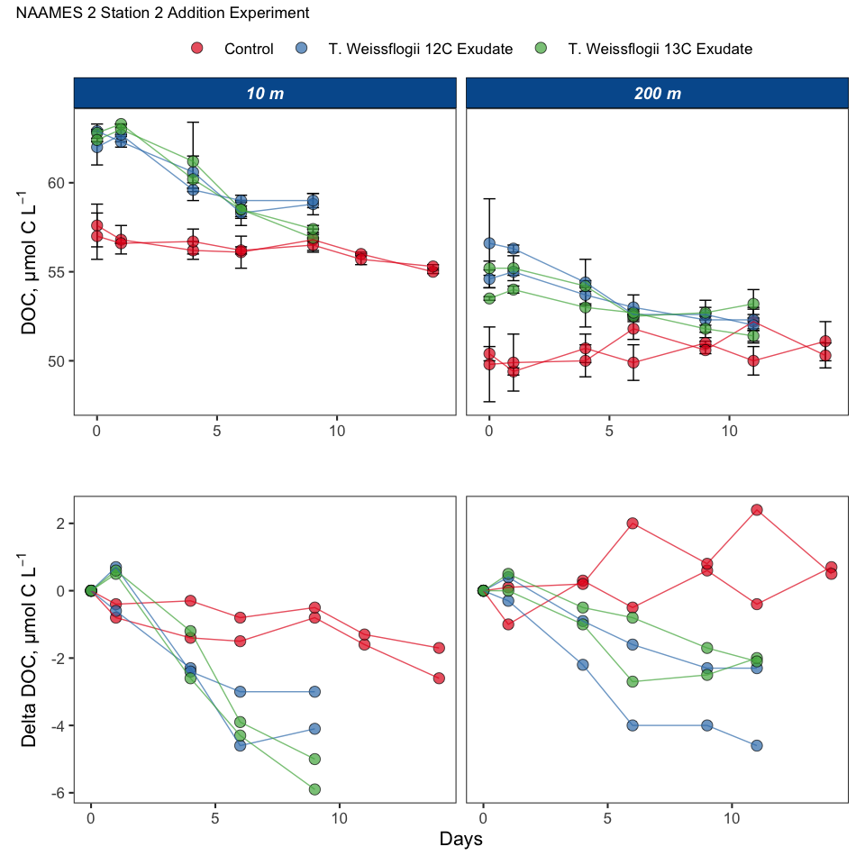

## NAAMES 3


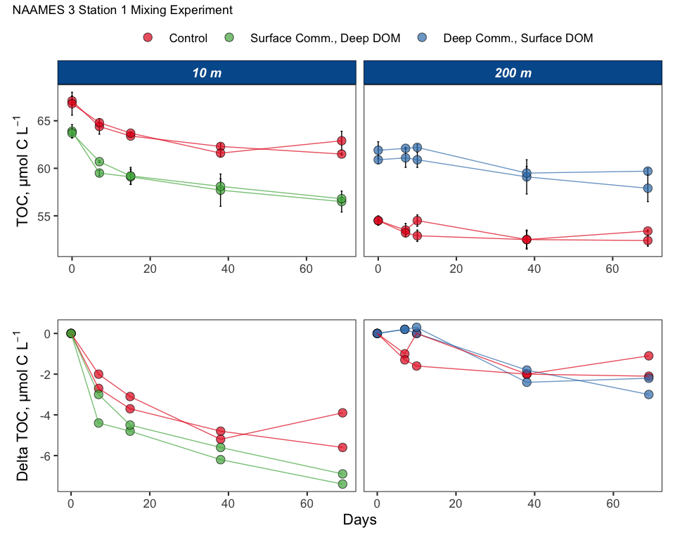

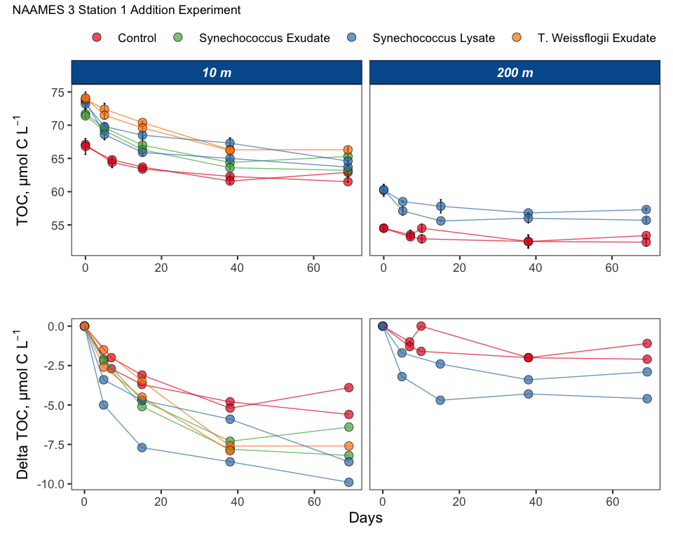

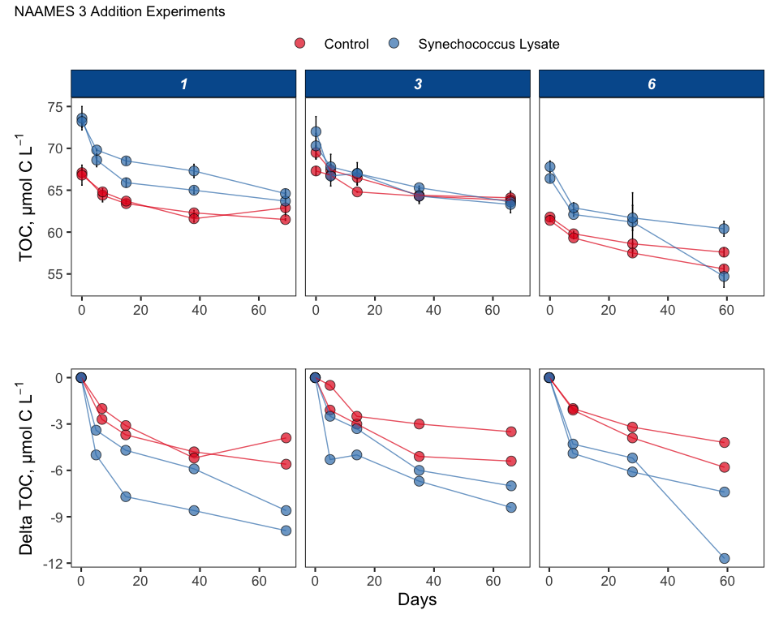

## NAAMES 4

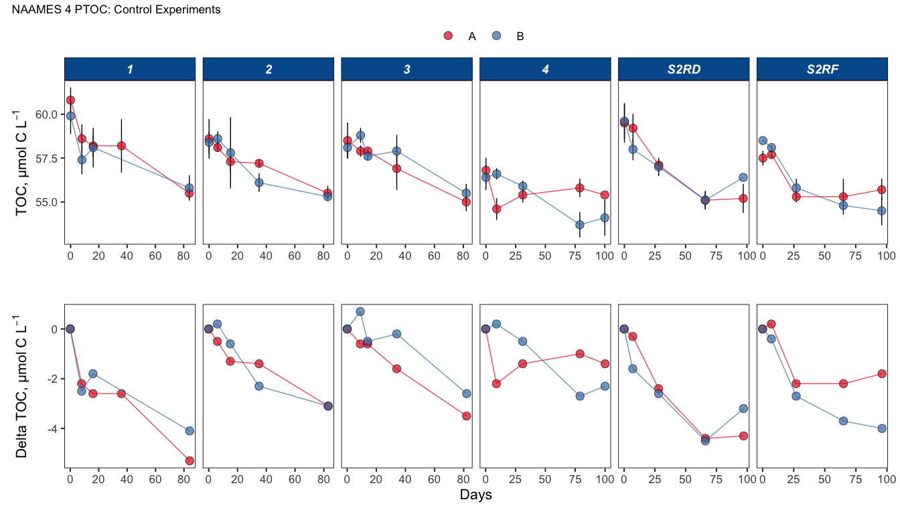

The replication between experiments at Station 4 is
poor.

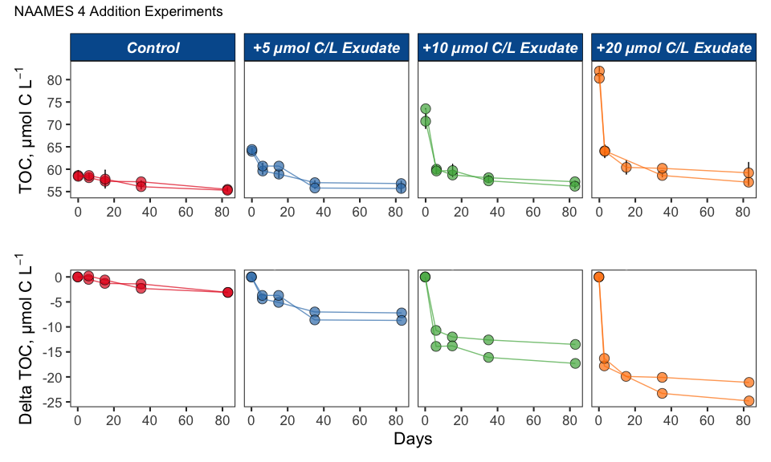

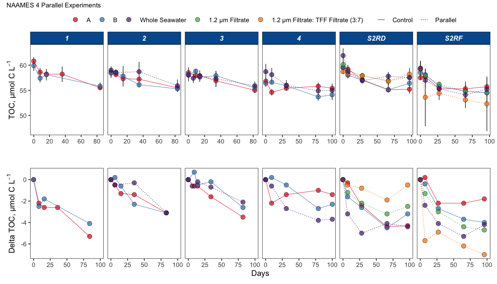

# Bottle v. Vial Incubation Comparisons

## PTOC v. PDOC

``` r
ptoc_pdoc.data <- oc_p %>% 
  filter(Cruise == "AT39", !Treatment == "Parallel") 
ptoc_pdoc.reg <- lmodel2(pdoc ~ ptoc, data = ptoc_pdoc.data , nperm = 99)
ptoc_pdoc.reg 
```

    ## 
    ## Model II regression
    ## 
    ## Call: lmodel2(formula = pdoc ~ ptoc, data = ptoc_pdoc.data, nperm = 99)
    ## 
    ## n = 71   r = 0.9732196   r-square = 0.9471563 
    ## Parametric P-values:   2-tailed = 8.622836e-46    1-tailed = 4.311418e-46 
    ## Angle between the two OLS regression lines = 1.554332 degrees
    ## 
    ## Permutation tests of OLS, MA, RMA slopes: 1-tailed, tail corresponding to sign
    ## A permutation test of r is equivalent to a permutation test of the OLS slope
    ## P-perm for SMA = NA because the SMA slope cannot be tested
    ## 
    ## Regression results
    ##   Method Intercept     Slope Angle (degrees) P-perm (1-tailed)
    ## 1    OLS  3.337716 0.9424277        43.30229              0.01
    ## 2     MA  1.863641 0.9675048        44.05379              0.01
    ## 3    SMA  1.813323 0.9683609        44.07912                NA
    ## 
    ## Confidence intervals
    ##   Method 2.5%-Intercept 97.5%-Intercept 2.5%-Slope 97.5%-Slope
    ## 1    OLS      0.1837596        6.491672  0.8889664   0.9958891
    ## 2     MA     -1.4548804        5.004919  0.9140651   1.0239599
    ## 3    SMA     -1.4159087        4.869193  0.9163741   1.0232969
    ## 
    ## Eigenvalues: 48.72439 0.6605831 
    ## 
    ## H statistic used for computing C.I. of MA: 0.0008036195

``` r
delta_ptoc_pdoc.reg <- lmodel2(pdoc_from_t0 ~ ptoc_from_t0, data = ptoc_pdoc.data , nperm = 99)
delta_ptoc_pdoc.reg
```

    ## 
    ## Model II regression
    ## 
    ## Call: lmodel2(formula = pdoc_from_t0 ~ ptoc_from_t0, data =
    ## ptoc_pdoc.data, nperm = 99)
    ## 
    ## n = 71   r = 0.9711193   r-square = 0.9430727 
    ## Parametric P-values:   2-tailed = 1.126827e-44    1-tailed = 5.634135e-45 
    ## Angle between the two OLS regression lines = 1.678043 degrees
    ## 
    ## Permutation tests of OLS, MA, RMA slopes: 1-tailed, tail corresponding to sign
    ## A permutation test of r is equivalent to a permutation test of the OLS slope
    ## P-perm for SMA = NA because the SMA slope cannot be tested
    ## 
    ## Regression results
    ##   Method   Intercept     Slope Angle (degrees) P-perm (1-tailed)
    ## 1    OLS  0.09589786 0.9411488        43.26345              0.01
    ## 2     MA -0.02473289 0.9682354        44.07541              0.01
    ## 3    SMA -0.02875343 0.9691382        44.10209                NA
    ## 
    ## Confidence intervals
    ##   Method 2.5%-Intercept 97.5%-Intercept 2.5%-Slope 97.5%-Slope
    ## 1    OLS     -0.3359442       0.5277399  0.8856156    0.996682
    ## 2     MA     -0.2867641       0.2227450  0.9126664    1.027072
    ## 3    SMA     -0.2831516       0.2114846  0.9151948    1.026261
    ## 
    ## Eigenvalues: 78.77687 1.153065 
    ## 
    ## H statistic used for computing C.I. of MA: 0.0008695124

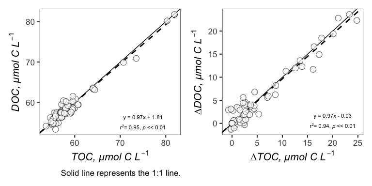

## Bottle TOC v. Vial TOC

Because the same samples are measured for TOC and PTOC for T0, these
data are omitted from the regression analysis.

``` r
toc_ptoc.data <- oc_p %>% 
  filter(!Cruise == "AT34", !Timepoint == 0, !Treatment == "Parallel") 
toc_ptoc.reg <- lmodel2(ptoc ~ toc, data = toc_ptoc.data, nperm = 99)
toc_ptoc.reg
```

    ## 
    ## Model II regression
    ## 
    ## Call: lmodel2(formula = ptoc ~ toc, data = toc_ptoc.data, nperm = 99)
    ## 
    ## n = 72   r = 0.9607479   r-square = 0.9230365 
    ## Parametric P-values:   2-tailed = 1.034424e-40    1-tailed = 5.172118e-41 
    ## Angle between the two OLS regression lines = 2.287741 degrees
    ## 
    ## Permutation tests of OLS, MA, RMA slopes: 1-tailed, tail corresponding to sign
    ## A permutation test of r is equivalent to a permutation test of the OLS slope
    ## P-perm for SMA = NA because the SMA slope cannot be tested
    ## 
    ## Regression results
    ##   Method Intercept     Slope Angle (degrees) P-perm (1-tailed)
    ## 1    OLS  4.590834 0.8938486        41.79189              0.01
    ## 2     MA  2.378699 0.9276331        42.85002              0.01
    ## 3    SMA  2.199658 0.9303675        42.93411                NA
    ## 
    ## Confidence intervals
    ##   Method 2.5%-Intercept 97.5%-Intercept 2.5%-Slope 97.5%-Slope
    ## 1    OLS      0.5468351        8.634833  0.8323213   0.9553760
    ## 2     MA     -1.9423592        6.432959  0.8657150   0.9936259
    ## 3    SMA     -1.9620843        6.095265  0.8708724   0.9939271
    ## 
    ## Eigenvalues: 60.6155 1.206903 
    ## 
    ## H statistic used for computing C.I. of MA: 0.001177878

``` r
delta_toc_ptoc.reg <- lmodel2(ptoc_from_t0 ~ toc_from_t0, data = toc_ptoc.data, nperm = 99)
delta_toc_ptoc.reg
```

    ## 
    ## Model II regression
    ## 
    ## Call: lmodel2(formula = ptoc_from_t0 ~ toc_from_t0, data =
    ## toc_ptoc.data, nperm = 99)
    ## 
    ## n = 72   r = 0.9158719   r-square = 0.8388214 
    ## Parametric P-values:   2-tailed = 1.864721e-29    1-tailed = 9.323607e-30 
    ## Angle between the two OLS regression lines = 4.975145 degrees
    ## 
    ## Permutation tests of OLS, MA, RMA slopes: 1-tailed, tail corresponding to sign
    ## A permutation test of r is equivalent to a permutation test of the OLS slope
    ## P-perm for SMA = NA because the SMA slope cannot be tested
    ## 
    ## Regression results
    ##   Method Intercept     Slope Angle (degrees) P-perm (1-tailed)
    ## 1    OLS  2.529435 0.7907834        38.33636              0.01
    ## 2     MA  2.490784 0.8519461        40.42921              0.01
    ## 3    SMA  2.483532 0.8634214        40.80803                NA
    ## 
    ## Confidence intervals
    ##   Method 2.5%-Intercept 97.5%-Intercept 2.5%-Slope 97.5%-Slope
    ## 1    OLS       2.201944        2.856927  0.7081515   0.8734153
    ## 2     MA       2.431858        2.544742  0.7665617   0.9451910
    ## 3    SMA       2.428820        2.533258  0.7847345   0.9499984
    ## 
    ## Eigenvalues: 25.98195 1.114466 
    ## 
    ## H statistic used for computing C.I. of MA: 0.002660834

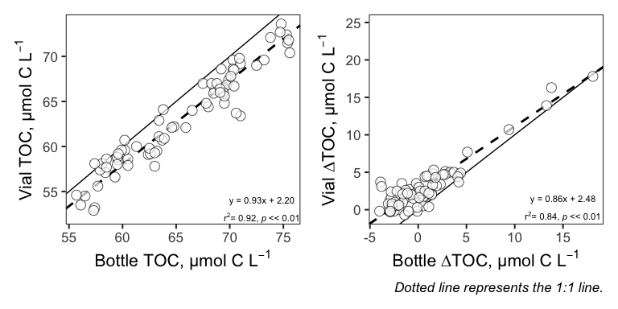
